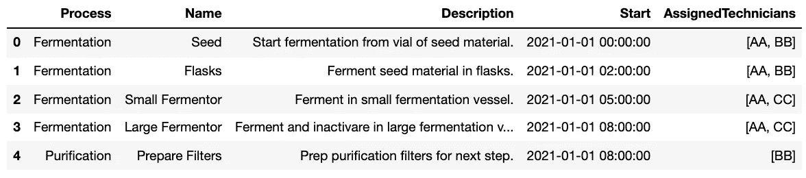

# Python 中生产计划系统的应用模型

> 原文：<https://towardsdatascience.com/applied-models-of-production-planning-systems-in-python-942a2c91e6ad?source=collection_archive---------6----------------------->

## 在 Python 中开发了生产计划系统之后，可以扩展我们的系统，以包括人员配备和材料模型，从而将这些计划作为详细的工作计划和订单报告来实施。


作者在谷歌地球上拍摄的制造工厂照片

在我们的上一篇文章[Python 中制造系统的生产计划和资源管理](/production-planning-and-resource-management-of-manufacturing-systems-in-python-5458e9c04183)中，我们介绍了如何获取一系列具有已知持续时间、依赖性和所需资源的制药任务，并加载一个矩阵以最小化计划中的停机时间。从这个矩阵中，我们可以生成资源利用统计数据，以及用于跟踪进度的交互式甘特图。

虽然我们项目的最后一次迭代生成了一个功能齐全的时间表，但真正的制造计划需要分配、跟踪和报告额外的信息和资源。在本文中，我们将介绍上一个项目的一些扩展，这些扩展允许我们的生产计划具有额外的覆盖范围和高级分析。

我们将讨论的主题包括:

*   调度过程中的任务优先级
*   操作员的任务培训要求
*   操作员培训跟踪、装载、利用和成本核算
*   增值任务分析
*   逐班报告和说明
*   消耗材料报告和计划

如果你还没有阅读前一篇文章，请点击[这里](/production-planning-and-resource-management-of-manufacturing-systems-in-python-5458e9c04183)来看看目前为止都报道了些什么！

我们调度模型的所有任务数据都来自一个 JSON 文件。下面的文件描述了我们的任务数据，修改后包括附加数据以帮助后期调度，以及一些附加任务。

```
{
  "Items": [
    {
      "ID":1,
      "Name":"Seed",
      "Description":"Start fermentation from vial of seed material.",
      "Process":"Fermentation",
      "ResourcesRequired":
      {
        "Operator":2,
        "SafetyCabinet":1
      },
      "Dependencies":[0],
      "Duration":2,
      "TrainingRequirements":["1A"],
      "ValueAdding":1,
      "Priority":1,
      "Materials":
      {
        "SeedVial":4
      }
    },
    {
      "ID":2,
      "Name":"Flasks",
      "Description":"Ferment seed material in flasks.",
      "Process":"Fermentation",
      "ResourcesRequired":
      {
        "Operator":2,
        "SafetyCabinet":1
      },
      "Dependencies":[1],
      "Duration":3,
      "TrainingRequirements":["1A"],
      "ValueAdding":1,
      "Priority":1,
      "Materials":
      {
        "Flasks":4,
        "Agar":2
      }
    },
    {
      "ID":3,
      "Name":"Small Fermentor",
      "Description":"Ferment in small fermentation vessel.",
      "Process":"Fermentation",
      "ResourcesRequired":
      {
        "Operator":2,
        "SmallFermentor":1
      },
      "Dependencies":[2],
      "Duration":3,
      "TrainingRequirements":["1B"],
      "ValueAdding":1,
      "Priority":1,
      "Materials":
      {
        "GrowthMedium":10
      }
    },
    {
      "ID":4,
      "Name":"Large Fermentor",
      "Description":"Ferment and inactivare in large fermentation vessel.",
      "Process":"Fermentation",
      "ResourcesRequired":
      {
        "Operator":2,
        "LargeFermentor":1
      },
      "Dependencies":[3],
      "Duration":4,
      "TrainingRequirements":["1B"],
      "ValueAdding":1,
      "Priority":1,
      "Materials":
      {
        "GrowthMedium":50
      }
    },
    {
      "ID":5,
      "Name":"Prepare Filters",
      "Description":"Prep purification filters for next step.",
      "Process":"Purification",
      "ResourcesRequired":
      {
        "Operator":1,
        "PurificationTank":1
      },
      "Dependencies":[3],
      "Duration":1,
      "TrainingRequirements":["2A"],
      "ValueAdding":0,
      "Priority":1,
      "Materials":
      {
        "Ethanol":20,
        "Filters":2
      }
    },
    {
      "ID":6,
      "Name":"Purification Filters",
      "Description":"Start purification in first purification assembly.",
      "Process":"Purification",
      "ResourcesRequired":
      {
        "Operator":3,
        "PurificationTank":1
      },
      "Dependencies":[4,5],
      "Duration":4,
      "TrainingRequirements":["2A"],
      "ValueAdding":1,
      "Priority":1,
      "Materials":
      {
      }
    },
    {
      "ID":7,
      "Name":"Centrifuge",
      "Description":"Separate material in centrifuges.",
      "Process":"Purification",
      "ResourcesRequired":
      {
        "Operator":2,
        "Centrifuge":2
      },
      "Dependencies":[6],
      "Duration":4,
      "TrainingRequirements":["2B"],
      "ValueAdding":1,
      "Priority":1,
      "Materials":
      {
        "Bowls":2,
        "Inserts":2
      }
    },
    {
      "ID":8,
      "Name":"Sterile Filter",
      "Description":"Start sterilization of material.",
      "Process":"Sterile Boundary",
      "ResourcesRequired":
      {
        "Operator":3,
        "SterileAssembly":1
      },
      "Dependencies":[7],
      "Duration":2,
      "TrainingRequirements":["2C"],
      "ValueAdding":1,
      "Priority":1,
      "Materials":
      {
        "SterileFilters":4,
        "SterileTubing":4
      }
    },
    {
      "ID":9,
      "Name":"Adjuvants",
      "Description":"Add adjuvants to bulk material.",
      "Process":"Sterile Boundary",
      "ResourcesRequired":
      {
        "Operator":2,
        "SterileAssembly":1
      },
      "Dependencies":[8],
      "Duration":2,
      "TrainingRequirements":["3A"],
      "ValueAdding":1,
      "Priority":1,
      "Materials":
      {
        "Aluminum":10
      }
    },
    {
      "ID":10,
      "Name":"Prepare Vials",
      "Description":"Sterilize bulk vials.",
      "Process":"Sterile Boundary",
      "ResourcesRequired":
      {
        "Operator":2,
        "VialFiller":1
      },
      "Dependencies":[8],
      "Duration":1,
      "TrainingRequirements":["3B"],
      "ValueAdding":0,
      "Priority":1,
      "Materials":
      {
        "Vials":1000
      }
    },
    {
      "ID":11,
      "Name":"Fill",
      "Description":"Fill vials with bulk material.",
      "Process":"Sterile Boundary",
      "ResourcesRequired":
      {
        "Operator":2,
        "VialFiller":1
      },
      "Dependencies":[9,10],
      "Duration":3,
      "TrainingRequirements":["3B"],
      "ValueAdding":1,
      "Priority":1,
      "Materials":
      {
        "Caps":1000
      }
    },
    {
      "ID":12,
      "Name":"Clean Vial Filler",
      "Description":"Clean vial filling machine.",
      "Process":"Sterile Boundary",
      "ResourcesRequired":
      {
        "Operator":2,
        "VialFiller":1
      },
      "Dependencies":[11],
      "Duration":2,
      "TrainingRequirements":["4A"],
      "ValueAdding":0,
      "Priority":2,
      "Materials":
      {
        "CleaningAgent":5
      }
    },
    {
      "ID":13,
      "Name":"Decontaminate",
      "Description":"Decontaminate fermentation suite.",
      "Process":"Fermentation",
      "ResourcesRequired":
      {
        "Operator":1,
        "SafetyCabinet":1,
        "SmallFermentor":1,
        "LargeFermentor":1
      },
      "Dependencies":[4],
      "Duration":2,
      "TrainingRequirements":["4A"],
      "ValueAdding":0,
      "Priority":2,
      "Materials":
      {
        "CleaningAgent":5
      }
    },
    {
      "ID":14,
      "Name":"Autoclave Waste",
      "Description":"Autoclave fermentation materials post-decontamination.",
      "Process":"Fermentation",
      "ResourcesRequired":
      {
        "Operator":1,
        "Autoclave":1
      },
      "Dependencies":[13],
      "Duration":1,
      "TrainingRequirements":["4A"],
      "ValueAdding":0,
      "Priority":2,
      "Materials":
      {
      }
    }
  ],
  "ResourceCapacities":{
      "Operator":3,
      "SafetyCabinet":1,
      "SmallFermentor":1,
      "LargeFermentor":1,
      "PurificationTank":1,
      "Centrifuge":3,
      "SterileAssembly":1,
      "VialFiller":1,
      "Autoclave":1
  },
  "Operators":[
    {
      "Name":"AA",
      "Employment":"01/01/2000",
      "Shift":1,
      "Training":["1A","1B","2A","2B","2C","3A","3B","4A"],
      "Pay":25.5
    },
    {
      "Name":"BB",
      "Employment":"01/01/2001",
      "Shift":1,
      "Training":["1A","2A","2B","2C","3A","3B","4A"],
      "Pay":25.5
    },
    {
      "Name":"CC",
      "Employment":"01/01/2002",
      "Shift":1,
      "Training":["1A","1B","2A","2B","2C","3A","3B","4A"],
      "Pay":25.5
    },
    {
      "Name":"DD",
      "Employment":"01/01/2000",
      "Shift":2,
      "Training":["1A","1B","2A","2B","2C","3A","3B","4A"],
      "Pay":28.5
    },
    {
      "Name":"EE",
      "Employment":"01/01/2001",
      "Shift":2,
      "Training":["1A","1B","2A","2B","2C","3A","3B","4A"],
      "Pay":28.5
    },
    {
      "Name":"FF",
      "Employment":"01/01/2002",
      "Shift":2,
      "Training":["1A","1B","2A","2B","2C","3A","3B","4A"],
      "Pay":28.5
    }
  ]
}
```

请注意，我们批处理的每个任务都包括:

*   ID —整数值
*   名称-字符串简短描述
*   描述—字符串详细描述
*   流程-字符串(步骤的三个类别之一)
*   所需资源—所需资源和整数计数的字典
*   依赖项-依赖的 ID 整数列表
*   持续时间—所需小时数的整数(不必是整数)
*   培训要求—培训字符串标识符列表
*   增值—一个整数，1 或 0，用于标识任务是否增值(1)或不增值(0)
*   优先级—标识任务优先级的调度顺序的整数，其中较低的数字应在具有相同相关性的较高数字之前被调度
*   物料——任务操作期间消耗的物料和数量的字典

在调度期间，我们的资源能力保持不变，但现在我们也有我们团队中六个操作员的数据，三个在第一班，三个在第二班。请注意，我们认为一个班次是 12 个小时的跨度，从午夜到中午或从中午到午夜。还要注意的是，与同行相比，我们的一些技术人员缺少培训任务，由于轮班差异，第二班的工资更高。

我们再次使用下面的包，并如下读取我们的 JSON 数据。

```
import pandas as pd
import datetime
import numpy as np
import plotly.figure_factory as ff
import json
import random
import plotly.express as pxwith open('tasks.json') as json_file:
    data = json.load(json_file)
```

然后，我们可以将数据加载到相应的数据框表中。

```
Tasks = pd.DataFrame.from_dict(data['Items'])
CapacitiesDict = data['ResourceCapacities']
Operators = pd.DataFrame.from_dict(data['Operators'])
```


任务和操作员的相应数据框

此时，我们可以实现我们的第一个目标——实现任务优先级。

```
Tasks['dependancyPriority']=0
for i in range(len(Tasks['Dependencies'])):
    Tasks['dependancyPriority'][i]=Tasks['Dependencies'][i][0]
Tasks = Tasks.sort_values(by=['dependancyPriority','Priority']).drop('dependancyPriority',axis=1)
```

上面的代码片段是一个启发，用于确保优先级更高的任务优先于次要任务。这在优先考虑增值流程步骤而不是清洁和检查任务时非常有用，因为我们可能不希望其中一个步骤阻碍我们的流程，可以在以后有可用资源时完成它。此外，现在对这个数据帧进行排序，比在我们后面的算法中添加进一步的检查要快得多。请注意，下面的任务 12 现在在日程中的位置更高，但次于任务 5。


优先排序的任务

实际安排任务的任务从我们的第一个项目开始就没有改变。下面的代码与上一篇文章中的[相同。](/production-planning-and-resource-management-of-manufacturing-systems-in-python-5458e9c04183)

```
start_date = datetime.datetime(2021, 1, 1,0,0,0)
number_of_days = 2intervals = []
for minute in range(number_of_days*96):
    interval = (start_date + datetime.timedelta(minutes = 15*minute)).isoformat()
    intervals.append(interval)headings = list(CapacitiesDict.keys())
loading = pd.DataFrame(columns = headings)
loading['index']=intervals
loading = loading.fillna(0)loadingMax = pd.DataFrame(columns = headings)
loadingMax['index']=intervals
for item in headings:
    loadingMax[item] = CapacitiesDict[item]jobsToAdd = Tasks.copy()
jobsToAdd['TimeAddedToSchedule']=jobsToAdd['Duration']*60
jobsToAdd['Start'] = start_date
jobsToAdd['End'] = start_datefor i in range(len(loading.index)): # Go through loading schedule time by time
    print(str(round(i/len(loading.index)*100,2))+'%')
    for j in range(len(jobsToAdd.index)): # Go through list of jobs, job by job
        if jobsToAdd['TimeAddedToSchedule'][j]>0: # Continue if job needs to be scheduled still
            available = True
            for resource in list(jobsToAdd['ResourcesRequired'][j].keys()): # Continue if all required resources are available
                if loading[resource][i] + jobsToAdd['ResourcesRequired'][j][resource] > loadingMax[resource][i]:
                    available=False
            if available:
                dependenciesSatisfied = True
                if jobsToAdd['Dependencies'][j][0] == 0: #Skip checking dependencies if there are none
                    pass
                else:
                    for dependency in jobsToAdd['Dependencies'][j]: # Check if a task's dependencies have been fully scheduled
                        if jobsToAdd.loc[jobsToAdd['ID'] == dependency]['TimeAddedToSchedule'].item() > 0:
                            dependenciesSatisfied = False # Check if fully scheduled
                        if jobsToAdd.loc[jobsToAdd['ID'] == dependency]['End'].item() == datetime.datetime.strptime(loading['index'][i],'%Y-%m-%dT%H:%M:%S')+ datetime.timedelta(minutes = 15):
                            dependenciesSatisfied = False # Check that dependent end time isnt after the start of this time
                if dependenciesSatisfied:
                    if jobsToAdd['TimeAddedToSchedule'][j]==jobsToAdd['Duration'][j]*60: # Set the start time
                        jobsToAdd['Start'][j]=datetime.datetime.strptime(loading['index'][i],'%Y-%m-%dT%H:%M:%S')
                    for resource in list(jobsToAdd['ResourcesRequired'][j].keys()): # Allocate Resources
                        loading[resource][i] = loading[resource][i] + jobsToAdd['ResourcesRequired'][j][resource]
                    jobsToAdd['TimeAddedToSchedule'][j] = jobsToAdd['TimeAddedToSchedule'][j]-15 # Reduce needed time
                    if jobsToAdd['TimeAddedToSchedule'][j] == 0: # Set the end time
                        jobsToAdd['End'][j]=datetime.datetime.strptime(loading['index'][i],'%Y-%m-%dT%H:%M:%S')+ datetime.timedelta(minutes = 15)
```

然而，现在我们也想加载我们的操作符。我们的技术人员有特定的培训要求，对于他们来说，作为一个接受过培训的人被安排执行某项任务，培训要求必须是他们名册的一个子集。这意味着，如果任务 1 要求完成培训任务“1A ”,那么要将操作员 AA 分配到他们的花名册上，就必须包括“1A”。从 Python 技术的角度来看，我们不能将列表作为集合进行比较，而是必须将它们转换成不可变的对象，比如元组。下面的代码将我们的需求和花名册初始化为元组，并为我们的操作员初始化一个加载矩阵，以便将它们分配给任务。就像我们的设备资源负载能力分析一样，一次只能给每个技术人员分配一项任务。我们还将在 jobsToAdd 表中添加一个新列，以跟踪哪些操作员被分配了哪些任务。

```
Tasks['TrainingRequirementsTuple'] = tuple(Tasks['TrainingRequirements'])Operators['TrainingTuple'] = tuple(Operators['Training'])operatorAssignments = pd.DataFrame(columns = list(Operators['Name']))
operatorAssignments['index']=intervals
operatorAssignments = operatorAssignments.fillna(0)
```


空载操作员利用率矩阵

```
jobsToAdd['AssignedTechnicians'] = ""
for i in range(len(jobsToAdd['ID'])):
    jobsToAdd['AssignedTechnicians'][i] = []for j in range(len(jobsToAdd.index)): 
    # Go through list of jobs, job by job
    print(str(round(j/len(jobsToAdd.index)*100,2))+'%')
    for i in range(len(operatorAssignments.index)): 
        # Go through operator assignment schedule time by time
        if datetime.datetime.strptime(operatorAssignments['index'][i],'%Y-%m-%dT%H:%M:%S') >= jobsToAdd['Start'][j] and datetime.datetime.strptime(operatorAssignments['index'][i],'%Y-%m-%dT%H:%M:%S') < jobsToAdd['End'][j]: 
            # If loading time is inbetween start and end
            if datetime.datetime.strptime(operatorAssignments['index'][i],'%Y-%m-%dT%H:%M:%S').time() < datetime.time(12):
                # If on first shift
                Operators['temp']=0
                for k in range(len(Operators['TrainingTuple'])):    
                    Operators['temp'][k] = set(jobsToAdd['TrainingRequirements'][j]).issubset(Operators['TrainingTuple'][k])
                candidates = Operators[Operators.Shift == 1]
                candidates = candidates[Operators.temp == True]
                # Get list of trained operators for tasks on shift
                count = jobsToAdd['ResourcesRequired'][j]['Operator']
                for candidate in candidates['Name']:
                    if count > 0:
                        # Only consider assigning if needed
                        if operatorAssignments[candidate][i] == 0:
                            #Only assign if not already assigned
                            operatorAssignments[candidate][i] = jobsToAdd['ID'][j]
                            count -= 1

                            if datetime.datetime.strptime(operatorAssignments['index'][i],'%Y-%m-%dT%H:%M:%S') == jobsToAdd['Start'][j] or datetime.datetime.strptime(operatorAssignments['index'][i],'%Y-%m-%dT%H:%M:%S').time() == datetime.time(0):
                                # document the assignment in the jobsToAdd dataframe 
                                jobsToAdd['AssignedTechnicians'][j].append(candidate)
            else:
                Operators['temp']=0
                for k in range(len(Operators['TrainingTuple'])):    
                    Operators['temp'][k] = set(jobsToAdd['TrainingRequirements'][j]).issubset(Operators['TrainingTuple'][k])
                candidates = Operators[Operators.Shift == 2]
                candidates = candidates[Operators.temp == True]
                count = jobsToAdd['ResourcesRequired'][j]['Operator']
                for candidate in candidates['Name']:
                    if count > 0:
                        if operatorAssignments[candidate][i] == 0:
                            operatorAssignments[candidate][i] = jobsToAdd['ID'][j]
                            count -= 1

                            if datetime.datetime.strptime(operatorAssignments['index'][i],'%Y-%m-%dT%H:%M:%S') == jobsToAdd['Start'][j] or datetime.datetime.strptime(operatorAssignments['index'][i],'%Y-%m-%dT%H:%M:%S').time() == datetime.time(12):
                                 jobsToAdd['AssignedTechnicians'][j].append(candidate) 
```

现在，我们所有的操作员都被指派不超过利用率，并确保在设定的时间间隔内将一项任务分配给任何给定的技术人员。让我们也将我们的负载矩阵缩写为处理的最后时间间隔。这对于作业矩阵来说比操作符要容易得多，因为我们关注的重点是不要对作业使用操作符，而是对操作符矩阵使用任何操作符。请注意，loading 跟踪分配了多少操作员，而 operator assignments 跟踪分配给操作员的任务的 ID。分配的缩写过程通过检查行的总和来搜索空行。

```
loading = loading[loading.Operator != 0]operatorAssignments['temp'] = ''
nointerval = operatorAssignments.drop('index',axis=1)
nointerval['sum'] = nointerval.sum(axis=1)
for i in range(len(operatorAssignments['index'])):
    if nointerval['sum'][i] > 0:
        operatorAssignments['temp'][i] = True
    else:
        operatorAssignments['temp'][i] = False
operatorAssignments = operatorAssignments[operatorAssignments['temp']==True]
operatorAssignments = operatorAssignments.drop('temp',axis=1)
operatorAssignments
```


我们简化的加载矩阵

在我们的 JSON 文件中，我们看到操作员 BB 缺少培训任务“1B”。在下面，我们可以检查他们是否没有被分配相关任务，操作员 CC 是否已经取代了他们的位置。


jobsToAdd 添加分配了技术人员的数据框

现在已经加载了所有的任务，我们可以再次生成甘特图。

```
report = jobsToAdd.drop(['TrainingRequirementsTuple','TimeAddedToSchedule'],axis=1)x = report[['Name','Start','End','Process']].copy()
x = x.rename(columns={'Name':'Task','Process':'Resource','End':'Finish'})df = []
for r in range(len(x.index)):
    df.append(dict(Task=x['Task'][r],Start=x['Start'][r],Finish=x['Finish'][r],Resource=x['Resource'][r]))r = lambda: random.randint(0,255)
colors = ['#%02X%02X%02X' % (r(),r(),r())]for i in range(len(x.Resource.unique().tolist())):              
    colors.append('#%02X%02X%02X' % (r(),r(),r()))fig = ff.create_gantt(df, colors=colors, index_col='Resource', show_colorbar=True, group_tasks=True)
fig.show()
```


优先级较低的任务安排在以后的甘特图

接下来，让我们检查一下我们的资源利用率。

```
desc = loading.describe()
descT = desc.transpose()
descT['averageUtilization'] = descT['mean']/descT['max']
desc = descT.transpose()
```


利用率数据帧

我们的报告数据框架现在包含了非常有用的信息:

*   身份证明
*   名字
*   描述
*   过程
*   所需资源
*   属国
*   持续时间
*   培训要求
*   增值
*   优先
*   材料
*   开始
*   结束
*   指派的技术人员

现在让我们开始分析我们的刷新报告。我们可以开始寻找我们的直接人工成本，并指定任务的班次。

```
report['LaborCost'] = 0.0
report['TotalLaborCost'] = 0.0
totalCost=0.0
for i in range(len(report['ID'])):
    cost = 0.0
    for operator in report['AssignedTechnicians'][i]:
        pay = Operators.loc[Operators['Name'] == operator]['Pay'].item()
        cost += report['Duration'][i] * pay
    report['LaborCost'][i] = cost
    totalCost += cost
    report['TotalLaborCost'][i] = totalCostreport['Shift'] = 0
for i in range(len(report['ID'])):
    if report['Start'][i].time() < datetime.time(12):
        report['Shift'][i] = 1
    else:
        report['Shift'][i] = 2
```

虽然这种方法不适用于在班次之间拆分的任务，但这是计算与每项任务相关的直接人工费用的快速方法。


每项任务的直接人工费用

让我们直观地表示这些成本数据。我们可以看到发酵是我们过程中最昂贵的阶段。

```
#Fermentation is slightly more expensive in terms of labor than purification and the sterile boundary
fig = px.pie(report, values='LaborCost', names='Process')
fig.update_layout(title_text='Labor Costs of Batch by Process')
fig.update_traces(textinfo='percent+value')
fig.show()
```


按流程阶段列出的批次直接人工成本

我们还可以评估我们的劳动增值了多少。

```
#80% of process duration is spent on value adding time
fig = px.pie(report, values='Duration', names='ValueAdding')
fig.update_layout(title_text='Value Added Manufacturing Time in Batch')
fig.update_traces(textinfo='percent+value')
fig.show()
```


批量增值制造时间

我们的消耗材料需求可以来自各种来源，包括 ERP 系统，如 SAP 和物料清单(BOM)。我们还可以使用我们的报告来生成我们自己的 BOM、车间需求清单或高级采购的预定订单。

对于发酵，让我们看看在给定的批次中我们将使用什么材料。

```
fermentationMaterials = report[report['Process']=='Fermentation']['Materials']
print('Fermenation Material Requirements:')
for i in range(len(fermentationMaterials.values)):
    for key in fermentationMaterials.values[i].keys():
        print(key+" - "+str(fermentationMaterials.values[i][key]))out:
Fermenation Material Requirements:
SeedVial - 4
Flasks - 4
Agar - 2
GrowthMedium - 10
GrowthMedium - 50
CleaningAgent - 5
```

让我们把同类商品组合起来，给我们的库存经理一个简明的订单。生长培养基应该显示 60，而不是 10 和 50。

```
fermMaterialsTotals = {}
for i in range(len(fermentationMaterials.values)):
    for key in fermentationMaterials.values[i].keys():
        if key in fermMaterialsTotals:
            fermMaterialsTotals[key] += fermentationMaterials.values[i][key]
        else:
            fermMaterialsTotals[key] = fermentationMaterials.values[i][key]print('Fermenation Material Requirements Totals:')
for key in fermMaterialsTotals:
    print(key+" - "+str(fermMaterialsTotals[key]))out:
Fermenation Material Requirements Totals:
SeedVial - 4
Flasks - 4
Agar - 2
GrowthMedium - 60
CleaningAgent - 5
```

那就好多了；现在我们的库存经理知道订购 60 单位的发酵培养基。

我们如何将我们的计划作为一个简明的计划与车间分享？我们的技术人员通常主要需要关注我们对这种转变的期望。让我们通过检索报告中仅适用于技术人员和第一天第一次轮班的部分来生成一个轮班记录表。

```
def date(element):
    return element.date()shiftNotes = report.copy()
firstDay = datetime.date(2021, 1, 1)
shiftNotes = shiftNotes[shiftNotes['Start'].apply(date) == firstDay]
shiftNotes = shiftNotes[shiftNotes['Shift'] == 1]
shiftNotes = shiftNotes[['Process','Name','Description','Start','AssignedTechnicians']]
shiftNotes
```



2021–01–01 第一班的换档说明

如果某个特定的技术人员正在寻找他们这一周的工作报告，以计划他们的个人时间表和财务状况，该怎么办？

我们可以使用过滤器为特定的技术人员 AA 创建一个单独的细分，如下所示。

```
AASchedule = pd.DataFrame(columns = ['Process','Name','Description','Start','End','Duration','Pay'])
for i in range(len(report['AssignedTechnicians'])):
    for technician in report['AssignedTechnicians'][i]:
        if technician == 'AA':
            added = {
                        'Process': report['Process'][i], 
                        'Name': report['Name'][i], 
                        'Description': report['Description'][i],
                        'Start': report['Start'][i],
                        'End': report['End'][i],
                        'Duration': report['Duration'][i],
                        'Pay': report['Duration'][i] * Operators.loc[Operators['Name'] == 'AA']['Pay'].item()
                    }
            AASchedule = AASchedule.append(added, ignore_index = True)
```


操作员 AA 整个星期的工作分解

我们也可以报告他们的总收入。

```
AASchedule['Pay'].sum()out:
459.0
```

我们现在已经证明，我们可以使用 Python 跟踪平均批处理运行的几乎所有属性。我们跟踪了设备的资源分配、培训要求和操作员利用率。还有许多其他方法可以让我们区分工作的优先次序，进一步优化我们的时间表。假设我们的技术团队都是新的？我们可以优先安排一个人员充足的日程表，而不是尽快结束。我们还可以安排最大限度地减少劳动力成本，因为第二次轮班工作会产生更昂贵的轮班差异。所有这些都可以在一个更健壮的脚本中实现。然而，即便如此，这种模式也能切实改善我们在制药和其他任何行业中安排生产的方式。

请继续关注 Dash 和 Plotly 主持的交互式报告中的进一步分析和高级可视化！

请让我知道您的想法，并随时通过 LinkedIn 联系我，向我提供反馈，提出问题，或者看看我们如何将这些工具和思维方式引入您的组织！点击[这里](https://medium.com/@willkeefe)查看我的其他一些关于数据分析和生产计划的文章！