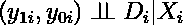
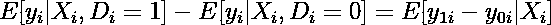

# 匹配法在因果分析中的应用

> 原文：<https://towardsdatascience.com/apply-matching-method-in-causal-analysis-19e032144e93?source=collection_archive---------27----------------------->

## 用 Python 写了一个真实的例子

扬·瓦莱卡在 [Unsplash](https://unsplash.com/@sharon_sy_wei/likes?utm_source=unsplash&utm_medium=referral&utm_content=creditCopyText) 上拍摄的照片

# 动机

随机实验是检验因果关系的金标准。然而，由于各种各样的实际原因，我们常常不能进行实验，而必须依靠观察数据。匹配是一种用于近似实验结果以从观察数据中恢复因果效应的方法。

> 当使用观察数据估计因果效应时，通过获得具有相似协变量分布的治疗组和对照组，尽可能接近地重复随机实验是可取的。
> 
> —英国斯图尔特，2010 年。"因果推理的匹配方法:回顾与展望."*统计。Sci。*

# 条件独立性假设

假设我们有两个潜在的结果和一个治疗变量 *Dᵢ* :

我们把治疗效果写成:

随机实验解决了选择问题，因为随机分配消除了选择偏差。关键的假设是 *Dᵢ* 独立于潜在的结果( *y₁ᵢ，y₀ᵢ* ):

如果你需要一个潜在结果模型的回顾，你可以阅读下面链接的我以前的文章:

<https://medium.com/geekculture/an-introduction-of-randomized-experiment-aka-a-b-testing-and-potential-outcome-model-f2c93f73d426>  

**中情局称，根据一组观察到的特征 X *ᵢ* ，选择偏差被消除:**

考虑到 CIA，以协变量 X *ᵢ为条件，*治疗组和对照组的结果变量的比较有一个因果解释:

在另一种格式中:

应用 CIA 的一个例子是田纳西之星实验，在这个实验中，学生被分配到不同的班级。

CIA 的另一个经验应用是匹配估计:在治疗组和对照组之间比较具有相同协变量(以协变量为条件)的单位。以某种方式计算并平均这些差异。

# 例子

为了演示匹配是如何工作的，我使用了 Arceneaux，Kevin，Alan S. Gerber 和 Donald P. Green (2010)的论文“使用大规模选民动员实验比较实验和匹配方法”的复制材料中的数据和方法。ISPS 数据档案。您可以通过该链接下载数据。dta 或者。csv 格式和 Stata 代码。

在本文中，我按照附录中阐述的精确匹配过程，用 Python 再现了表 6 中的 OLS 和精确匹配结果。

## 数据

Arceneaux、Kevin、Alan S. Gerber 和 Donald P. Green (2010)使用的数据来自一项大规模现场实验，在 2002 年中期选举之前，将个人随机分配到爱荷华州和密歇根州的治疗组和对照组。

处理方法是:动员投票(GOTV)电话(数据中的变量“联系”)。治疗组接到了电话，而对照组没有。结果变量是 2002 年的投票率。匹配分析中使用的协变量包括:*、【年龄】、【人员】、【新记录】、【竞争对手】、【投票 00】、【投票 98】、【县】、【st_sen】、【st_hse】、【女性】、【州】、*，这些变量包括年龄、家庭规模、新登记选民、竞争阶层、2000 年投票、1998 年投票、县、州参议院选区、州众议院选区、性别和州。

## 匹配分析

分析的目的是估计 2002 年 GOTV 投票电话对投票率的因果关系。我们假设实验数据是观察性的，并将治疗组的个体与对照组的个体进行比较。匹配程序识别未处理的个体，与每个具有相同特征的处理过的个体相匹配。根据 CIA，希望在协变量匹配后，组间的任何剩余差异可以归因于治疗的效果。

我进行了精确的匹配程序，其中每个治疗受试者与协变量上的一个或多个未治疗受试者匹配，并丢弃未找到匹配的治疗观察。

如本文附录所述，为了计算受治疗者的平均治疗效果，使用 Abadie 和 Imbens (2004 年)提出的方法计算了与每个治疗观察相匹配的对照组观察的权重。我总结了治疗观察结果和比较观察加权结果之间的差异，然后对治疗组的许多观察结果进行平均。我还根据 Abadie 和 Imbens (2004)提出的算法计算了标准误差。

此外，按照论文中的表 6，我运行了 OLS 回归

精确匹配产生 2.8 个百分点的估计治疗效果。这意味着竞选电话每 36 个电话就增加一个选民。OLS 结果的处理效果是接触变量的系数，等于 2.7，标准误差为 0.3。

以下是我用 Python 编写的用于匹配分析的完整代码(摘自 Arceneaux、Kevin、Alan S. Gerber 和 Donald P. Green (2010)使用的 Stata 代码) :