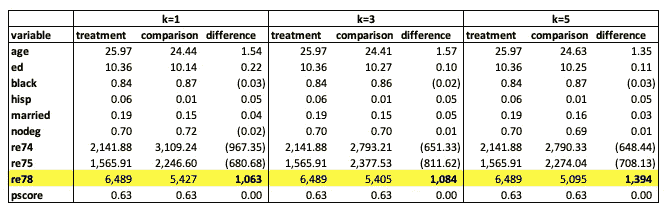
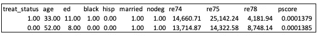

# 倾向得分方法在因果推理中的应用——第二部分:K 近邻匹配

> 原文：<https://towardsdatascience.com/apply-propensity-score-method-in-causal-inference-part-2-k-nearest-neighbor-matching-c0cd2cdb0f74?source=collection_archive---------15----------------------->

## 用 Python 写了一个真实的例子

照片由[威利安·贾斯登·德·瓦斯康塞洛斯](https://unsplash.com/@willianjusten?utm_source=unsplash&utm_medium=referral&utm_content=creditCopyText)在 [Unsplash](https://unsplash.com/collections/2wH1Mm-Y10A/reflection?utm_source=unsplash&utm_medium=referral&utm_content=creditCopyText)

在我的上一篇文章中，我介绍了如何使用 logistic 回归模型估计倾向得分，并逐步进行分层匹配。综上所述，**在实践中，倾向评分法通常分两步完成。首先，我们估计倾向得分。第二，我们通过使用一种匹配方法来估计治疗的效果。**

</apply-propensity-score-methods-in-causal-inference-part-1-stratification-afce2e85730c>  

在本文中，我假设我们已经使用相同的数据并按照我上一篇文章中列出的程序(链接如上)获得了治疗组和对照组的估计倾向得分。

在我深入最近邻匹配之前，下面是倾向评分估计的 Python 代码。最后，我保存了带有估计分数的数据集，以便稍后进行匹配:

## k 近邻匹配

最近邻匹配是分层的替代方法，用于匹配处理单元和比较单元。它获取每个处理过的单元，并搜索具有最接近 p 值的比较单元。匹配后，我们计算每个治疗组和对照组之间的结果差异，并对多个治疗组的这些差异进行平均。

有不同类型的最近邻匹配。在本文中，我考虑 k 从 1 到 5 的范围内的 k 最近邻匹配。我使用了实现 k-最近邻算法的`[**sklearn.neighbors**](https://scikit-learn.org/stable/modules/classes.html#module-sklearn.neighbors)`模块。在 k 个对照单位与每个治疗单位匹配后，我计算所有变量平均值的加权差异，以 1)估计治疗效果(结果变量 ***re78*** )，以及 2)比较治疗组和对照组之间的协变量平衡。k=1，3，5 的结果总结在下表 1 中。

表 1:不同 Ks 的 KNN 倾向评分匹配结果

假设我们已经获得了实验基准效应= $1，676，分层匹配的治疗效应= $1，632(在上面链接的前一篇文章中)，当我们将它们与实验效应进行比较时，KNN 匹配似乎产生了比分层更小且更差的效应。可能的解释包括:1)即使 knn 匹配保证所有处理过的单元都找到匹配。然而，这些匹配中的一些可能相当差，因为对于一些处理过的单元，匹配的比较单元(最近邻)可能具有非常不同的 p 分数，同样 2)即使分数匹配得很好，匹配的处理单元和比较单元在我的模型中似乎并不总是很好的匹配。例如，下面是来自 k=1 NM 匹配的一个例子，其显示了处理和比较单元具有几乎相等的 p-分数，但是在其他特征上非常不同。我的观点是，倾向得分模型还不够好，如果可能的话，我应该包含更多的特征。

以下是我用于 k 近邻匹配的 Python 代码: