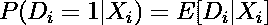
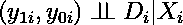
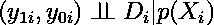
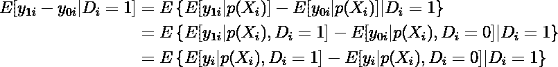
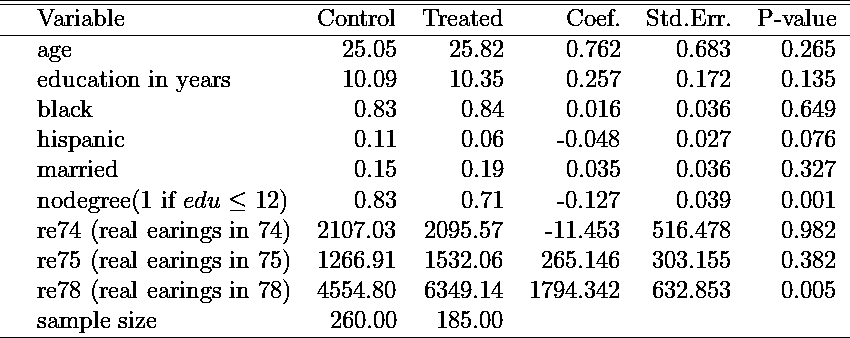
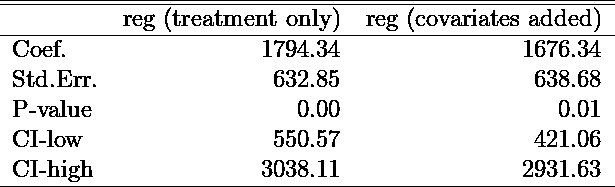
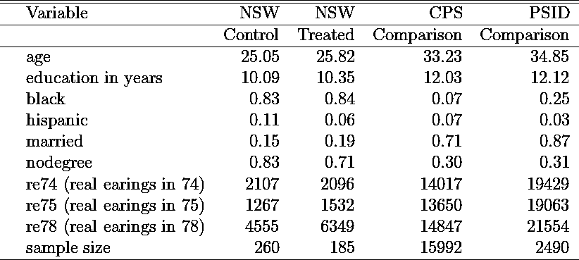
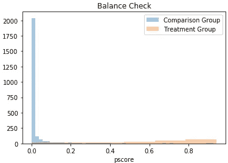
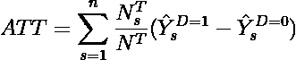
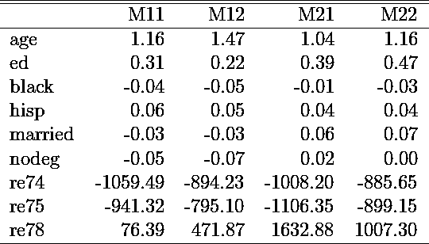

# 倾向得分方法在因果推理中的应用——第一部分:分层

> 原文：<https://towardsdatascience.com/apply-propensity-score-methods-in-causal-inference-part-1-stratification-afce2e85730c?source=collection_archive---------16----------------------->

## 用 Python 一步步实现了一个例子


蒂姆·斯蒂夫在 [Unsplash](https://unsplash.com/?utm_source=unsplash&utm_medium=referral&utm_content=creditCopyText) 上的照片

本文介绍并实现了 Dehejia 和 Wahba (1999)“非实验性研究中的因果效应:重新评估培训计划的评估”，*美国统计协会杂志*，第 94 卷，№448(1999 年 12 月)，第 1053–1062 页。我将简要回顾一下这些理论，然后一步一步地介绍我是如何实现分层匹配的。文章末尾提供了完整的 Python 代码。

# 直觉

倾向得分方法的直觉是:我们尝试以 X *ᵢ.估计的倾向得分为条件，而不是以协变量 X *ᵢ* 的完整向量为条件，这在有许多治疗前变量且治疗组和对照组非常不同时会变得困难*

如果您需要回顾协变量匹配，我之前的文章介绍了条件独立假设(CIA)下的协变量精确匹配:

</apply-matching-method-in-causal-analysis-19e032144e93>  

# 倾向得分定理

将倾向得分 p(X *ᵢ】定义为*



我们有如下:假设中央情报局认为



那么这个成立:



**倾向得分匹配与协变量匹配的工作方式相同，只是我们根据得分而不是直接根据协变量进行匹配。**由倾向得分定理可知:



# 应用

**在实践中，估算通常分两步完成。首先，我们估计倾向得分。第二，我们通过使用一种匹配方法来估计治疗的效果。**

Dehejia 和 Wahba (1999 年)使用的数据来自国家支持的工作(NSW)项目，该项目旨在为长期存在“就业问题”的人提供过渡性补贴工作经验方案。合格的申请人被随机分配接受培训(治疗组)或不接受培训(对照组)。评估的目的是估计培训对收入的影响。

以下步骤中所示的分析组织如下:**首先，由于该项目是作为 RCT 进行的，因此原始数据(NSW)是实验数据，用于估计作为基准的处理效果。接下来，我们使用额外的政府调查数据(CPS 和 PSID)来模拟观察数据。然后，我们估计和应用倾向得分和分层方法来估计提供培训对收入的影响使用观察数据。**

## 1.实验基准

如果随机化处理得当，我们预计对照组和治疗组之间的预处理特征应该没有系统性差异。否则，我们可能会怀疑它们在未观察到的特征上也有所不同，这可能会导致对治疗的因果效应的有偏见的估计。

因此，检查两组之间的预处理变量是否平衡总是一个好主意。为了测试治疗前变量的协变量平衡(re78 是实现的结果变量，所有其他变量在分配到治疗组或对照组之前是预先确定的)，我运行了 8 个单独的简单线性回归，并将结果报告在表 1 中。它表明对照组和治疗组的样本平均值没有差异。



表 1:使用实验数据测试对照组和治疗组之间的协变量平衡

此外，我使用实验数据来估计平均治疗效果(ate ),作为提供在职培训对培训后收入(re87)的因果影响。**控制协变量后，我得到了 1676 美元的效果。我会以此为基准牢记在心。**



表 2:使用实验数据估计的 ATE(平均治疗效果)

## 2.观测资料

Dehejia 和 Wahba (1999)使用两个调查数据样本(CPS 和 PSID 调查)作为与新南威尔士州治疗组的对照组，以构建观察数据库(CPS 代表当前人口调查，PSID 代表收入动态的小组研究)。

同样，我比较了新南威尔士州的样本均值(实验数据)和增加的比较样本(CPS 和 PSID)。在表 3 中，很明显，新南威尔士州治疗组与 CPS/PSID 组在人口统计学特征以及治疗前收入(re74 和 re75)方面有很大不同。新南威尔士州的治疗组更年轻，受教育程度更低，更有可能是非白人，并且在项目开始前收入更低。直接比较新南威尔士州治疗组和对照组是没有意义的。



表 3:新南威尔士州(实验)和对比样本的样本均值比较

## 3.倾向得分估计

*从这一步开始，我用 PSID 作为对照组，用新南威尔士州处理的构建观察数据库。*

我使用逻辑回归模型来估计倾向得分。具体来说，我研究了两个规格回归两组不同的协变量(在第二组中，我添加了年龄和教育年限的平方):

```
X1 = [‘age’, ‘ed’, ‘black’, ‘hisp’, ‘married’, ‘nodeg’, ‘re74’,’re75']X2 = [‘age’, ‘ed’, ‘black’, ‘hisp’, ‘married’, ‘nodeg’, ‘re74’,’re75',’age2',’ed2']
```

接下来，我使用交叉验证来调整参数 C，这是正则化的强度。C 值越高，意味着正则化程度越低。

```
best = 0.0
for strength in [0.00001,0.0001,0.001,0.01,0.1, 1, 10, 100, 1000, 10000, 100000, 1000000] :
 model = LogisticRegression(C=strength, max_iter=10000)
 curScore = cross_val_score(model,df_combine[X1], df_combine[T],scoring=’f1').mean()
 if curScore > best :
 best = curScore
 print(strength)
 print (curScore)
```

接下来，我运行具有最佳 C 值的逻辑回归模型，并将估计的倾向得分添加回观察集。下面，我绘制了比较组和治疗组的估计 p 值。不足为奇的是，这两个群体之间没有太多的重叠。治疗组(n=185)的平均 p 值为 0.62，而对照组(n=2490)的平均 p 值为 0.03。事实上，正如 Dehejia 和 Wahba (1999)所指出的，倾向得分法的优势之一是它戏剧性地强调了一个事实，即大多数比较单位与处理单位非常不同。



## 4.整理

治疗组和对照组之间的巨大差异自然导致了修整和匹配的步骤，在我的 Python 代码中，这些步骤是在同一个函数*分层 _ 函数*中完成的。微调的目的是找到共同的支持，使治疗组或对照组的 p 值都不会超出支持范围。调整后，我们从 PSID 对照组中剔除了大约 1300 个超出共同支持范围的观察结果，其中大部分的估计倾向得分低于治疗单位的最小估计倾向得分。调整的原因是为了防止当我们进入分层/匹配阶段时，我们最终得到处理过的单元而没有匹配的控制单元，反之亦然。

## 5.分层匹配

分层的基本思想是根据估计的倾向分数来定义层，然后将治疗和比较单位分组到每个层中。在每一层中，我们取治疗组和对照组之间的结果的平均值的差异，然后我们通过每一层中治疗单位的数量来计算跨层的加权平均值。治疗组和对照组的最终加权平均差异(ATT)计算如下:



在我的代码中，这是在函数*的分层 _ 函数中完成的。*我还测试了两种定义阶层的方法:

```
blocks1 = np.array_split(df_ps.query(“treat==1”)[“pscore”].sort_values(), nostrata)blocks2 = np.linspace(0,1,11)
```

假设我们需要 10 层。第一种方式将处理单元的估计倾向分数分成 10 个相同大小的块，然后将比较单元与每个块范围内的估计倾向分数进行匹配。第二种方法简单地把 1 分成 10 个等间距的区间。

记得在第三步倾向得分估计中，我测试了两个逻辑回归模型。将两个逻辑回归模型与两个 strata 定义相结合，我在输出端有四个模型，我将其命名为:M11 (reg1，strata1)、M12(reg1，strata2)、M21(reg2，strata1)和 M22(reg2，strata2)。结果如表 4 所示:



表 4:不同模型选项的加权平均差异

在这四个选项中，最终模型的选择应基于每个阶层内的协变量在处理单元和比较单元之间的平衡程度。所以我觉得 **Model21** 最好。 **Model21 估计效果= 1632 美元(含标准差。误差=1，514)，这非常接近我们的实验基准效果= 1，676 美元。**

**最后，正如我所承诺的，下面是我的第 1 步到第 5 步的完整 Python 代码，它也输出了汇总表 1-4:**

*我从 NYU 的* [*网站*](https://users.nber.org/~rdehejia/nswdata.html) 下载了所有数据