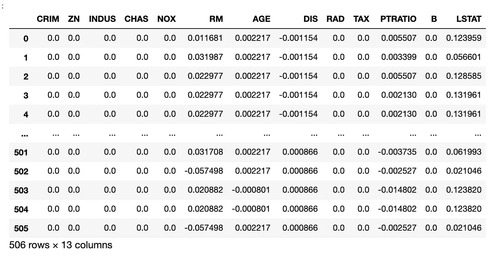
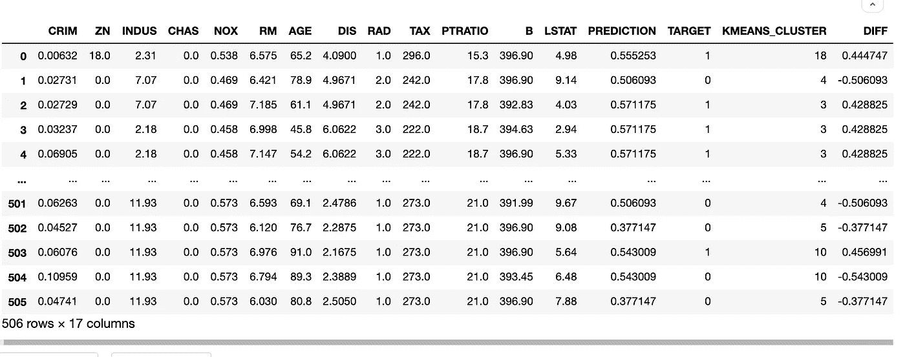
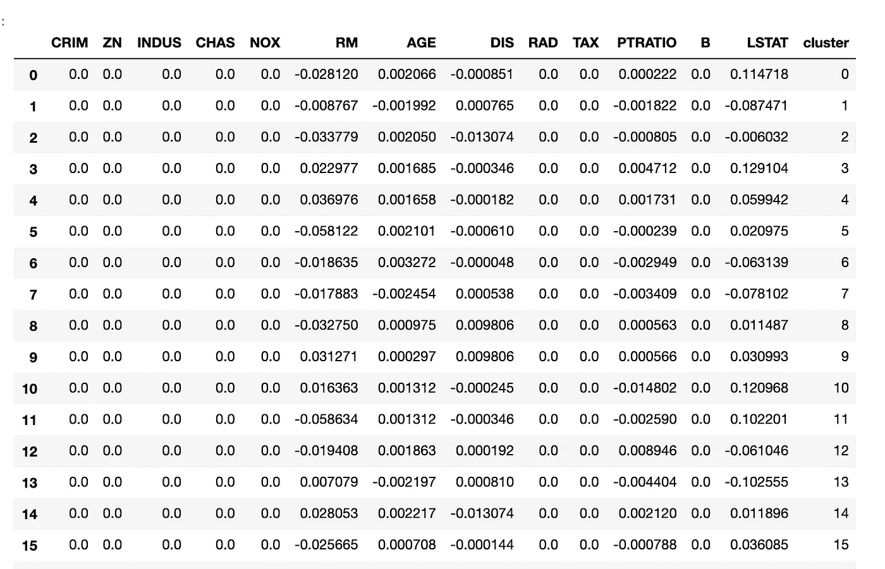

# 将聚类算法应用于特征贡献

> 原文：<https://towardsdatascience.com/applying-a-clustering-algorithm-to-feature-contribution-3c649ab0ca17?source=collection_archive---------13----------------------->

## 以整体的方式培养可解释性

kjpargeter 制作的背景照片—[www.freepik.com](http://www.freepik.com)([https://www.freepik.com/photos/background](https://www.freepik.com/photos/background'))

# 介绍

如果你已经深入研究了 xgboost 和 lightgbm 等集成算法的机器学习可解释性，你可能听说过预测贡献，甚至可能使用过 SHAP 包，它允许我们更好地理解训练过的模型。本文假设您以前使用过 Shapley values，因为它没有提供该主题的详细解释。

如果您以前没有使用过预测贡献，我们就假设这些值总结了每个特定特征如何对每个特定观察值的预测做出贡献。为了理解这些值，我们可以将它们全部相加(每次观察)，加上偏差(期望值)，并应用 logit 函数，从而将它们转换为实际预测概率。因此，如果您正在预测某个事件的发生(二元分类，其中 1 表示事件已发生)，则来自某个要素的正贡献意味着它在向模型发出信号，以预测该特定观察事件发生的概率较高。如果你感兴趣，我邀请你阅读更多关于这个主题的内容，从 Christoph Molnar 的这个有趣的 GitHub 页面开始:

 [## 5.9 Shapley 值|可解释的机器学习

### 预测可以通过假设实例的每个特征值是游戏中的“玩家”来解释，其中…

christophm.github.io](https://christophm.github.io/interpretable-ml-book/shapley.html) 

# 挑战

虽然通过使用预测贡献，我们可以看到(平均而言)特定特征如何影响总体的预测，但我们需要记住，特征不是单独起作用的。特别是当我们使用像 xgboost 和 lightgbm 这样的集合算法时，某个特征对观测值预测的贡献很大程度上取决于其他特征对同一观测值的贡献。因此，一次绘制多个特性的贡献通常很有帮助(以便确定它们之间的交互趋势)。在本文中，我想更进一步，提出对预测贡献数据使用 KMeans 等聚类算法，目的是提供一种更全面的方法来解释树集成机器学习算法决策。

# 预期

将预测贡献数据提供给 KMean 聚类分析算法将产生一组已识别的组，这些组描述了组内相似性，即所有功能如何协同工作，以向模型发出信号，表明它应该如何预测该组中的观察值。请务必记住，这些聚类不会直接与特征值相关联，而是与这些特征值的贡献相关联。因为 KMeans 是一种无监督的学习算法(它不是预测事件的发生，而是主要识别数据中的趋势)，不同的组或聚类将具有不同的完成目标的观察百分比。一个有用的练习是查看目标值和预测值之间的每组平均差异。从这个角度来看预测有助于识别模型更难预测的观察值。

# 练习:

让我们应用上面讨论的所有内容。

首先:我们将检索我们的数据，转换它，并创建一个基本模型来使用。

完成此操作后，我们应该有一个大致如下所示的表:

我们将把这个数据集输入 KMeans 算法，以便在我们的预测贡献中识别趋势或聚类。

## 使用预测贡献的优势

1.  **标度:**所有预测贡献都是相同的标度，我们不需要在将数据提供给 KMeans 之前对其进行预处理或转换。
2.  **空值:**当一个特性值可能为空时，一个特性贡献值不会为空。因此，我们可以安全地使用 KMeans，而不必丢弃观察值或输入空数据。

让我们开始我们练习的第二步:

我们得到的数据集应该是这样的:

为了开始理解我们的数据集，我认为查看每个聚类中心的信息是公平的。

按照前面的代码，我们将得到一个类似于下面的表:

很明显，定义每个聚类的特征实际上是 RM、AGE、PTRATIO 和 LSTAT。但是，我们要记住，这里值聚类的中心是基于特性贡献的，而不是基于特性值的。让我们用 groupby 创建一个不同的表，它将允许我们查看每个集群的特征值以及每个集群中完成目标的观察值的百分比(以及它们对目标的预测)。

如果我们根据每个分类对训练数据进行分组，我们可以根据模型的目标值和预测值之间的现有差异来查看模型更容易预测哪些分类。很明显，聚类 18 包含了我们的模型最难预测的人群。

# 结论

在确定模型可解释性的整体趋势时，我们可以研究聚类算法以获得洞察力。聚类算法将帮助我们创建观察组，这些观察组在它们的特征值如何影响它们的预测方面彼此相似。通过查看每组的目标和预测，我们可以开始更好地了解模型发现哪些类型的观察值更容易或更难预测。感谢您的阅读。我希望这篇文章在某种程度上对你有所启发。

 [## Ana Preciado -数据科学家- Banco General | LinkedIn

### 联系人:anamargaritapreciado@gmail.com |+(507)61305543。自从我做了电子商务的本科研究后，我…

www.linkedin.com](https://www.linkedin.com/in/anapreciado/)