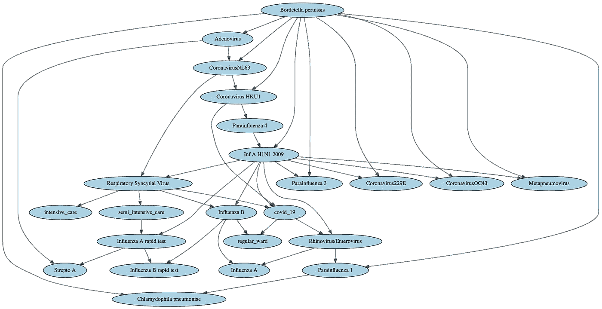
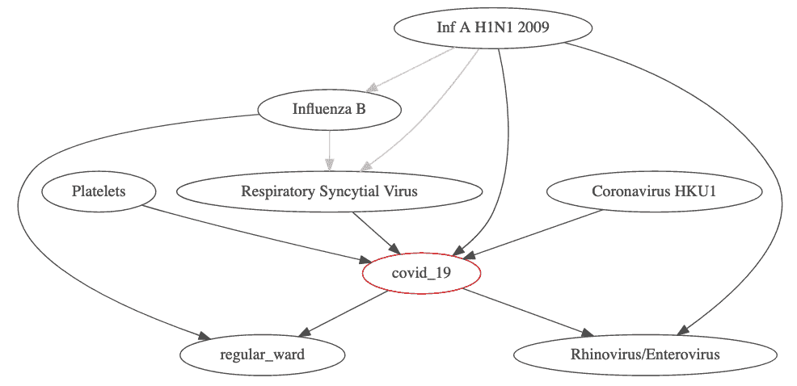
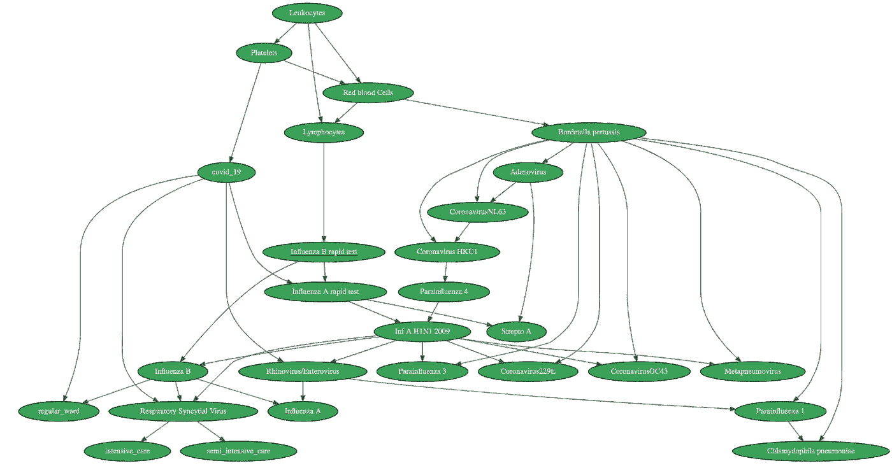
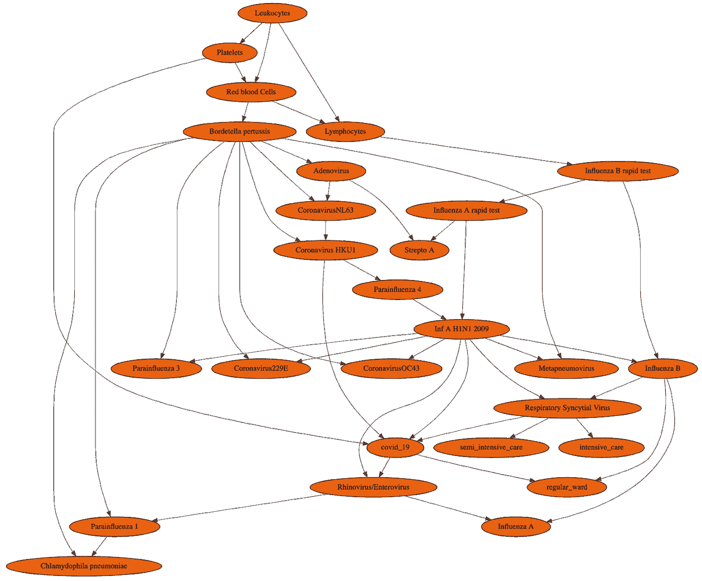
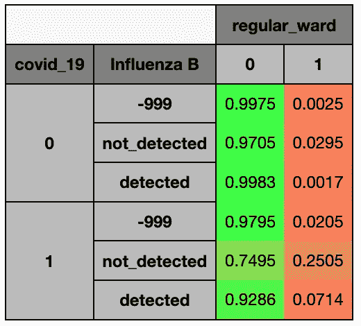
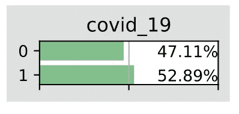
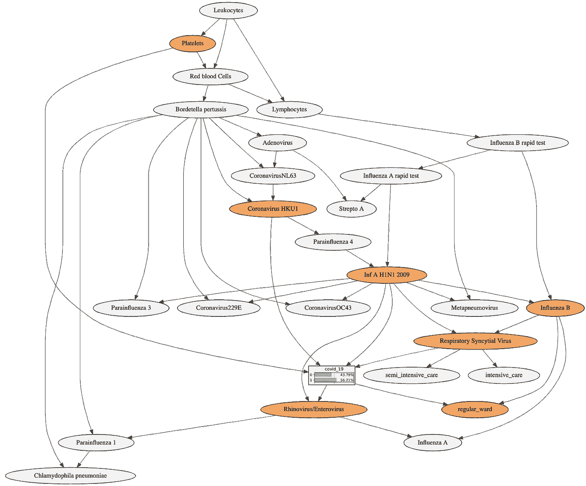
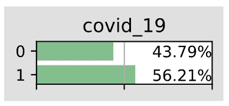

# 贝叶斯网络在新冠肺炎诊断中的应用

> 原文：<https://towardsdatascience.com/applying-bayesian-networks-to-covid-19-diagnosis-73b06c3418d8?source=collection_archive---------20----------------------->

## [实践教程](https://towardsdatascience.com/tagged/hands-on-tutorials)

## 高度复杂情况下的概率决策

由[马塞洛·里尔](https://unsplash.com/@marceloleal80?utm_source=unsplash&utm_medium=referral&utm_content=creditCopyText)在 [Unsplash](https://unsplash.com/s/photos/doctor?utm_source=unsplash&utm_medium=referral&utm_content=creditCopyText) 上拍摄的照片

# 动机

新冠肺炎·疫情使我们社会中长期以来认为理所当然的部分承受了压力，这已经不是什么新闻了。医疗保健服务可能是最明显的例子之一。我们的医疗保健专业人员面对一种他们知之甚少的病毒，不得不经常在信息稀缺和资源有限的情况下做出决策。在这种背景下，数据和人工智能社区已经介入，通过利用他们最擅长的东西来为抗击新冠肺炎做出贡献:处理数据以做出明智的决策。这已经转化为[呼吁代码](https://developer.ibm.com/callforcode/)、 [Kaggle 挑战](https://www.kaggle.com/roche-data-science-coalition/uncover/tasks)，甚至非营利企业[联盟](https://emergentalliance.org/)。

受到这种集体努力的启发，在这些文章中，我们展示了贝叶斯网络如何有助于决策者使用概率方法从复杂的信息中获得意义。特别是，在简要介绍了贝叶斯网络的概念之后，我们展示了如何将这一概念应用于来自新冠肺炎的 Kaggle challenge [*诊断及其临床谱*](https://www.kaggle.com/einsteindata4u/covid19) *的真实世界数据集。*该数据集包含来自患者的匿名医疗数据，这些患者在巴西圣保罗的 Israelita Albert Einstein 医院接受了新冠肺炎病毒检测，该医院是该挑战的赞助商。

用组织者自己的话来说，挑战的动机是*在一个不堪重负的卫生系统的背景下，进行新型冠状病毒检测的测试可能会受到限制，测试每个病例将是不切实际的，即使只测试目标亚群，测试结果也可能会延迟。*贝叶斯网络提供的结构化知识非常适合这种情况。正如我们在这篇博客中所展示的，有了贝叶斯网络，复杂的决策变得更加容易。

# 贝叶斯网络简介

贝叶斯网络(BN)是一种在人工智能社区中处理不确定性的成熟技术，以至于一些人认为它们是现代人工智能的顶点。正如 Stuart Russell 教授所说的，“BN 对于人工智能和人工智能的重要性不亚于布尔电路对于计算机科学的重要性。”虽然人们可能会争论这句话的范围，但很明显，bn 在人工智能社区中相当受欢迎。但是，BNs 到底是什么？

BN 是一类概率图形模型，以其在不确定性下的推理能力而闻名。它们可以被视为概率专家系统:领域(业务)知识被建模为有向无环图(DAG)。DAG 链接或弧表示域中节点/变量之间的概率依赖性。这些依赖不一定是因果关系，但可以表示一种形式的相关性或依赖性。更正式地说，BN 是一组随机变量的联合概率分布(JPD)。它由 DAG 表示，其中节点用随机变量标识，弧线表示它们之间的概率相关性。

BNs 已经在不同行业成功实施。它们的许多应用包括风险评估(癌症、水、核安全…)、工业过程模拟、机器健康监控(故障诊断、缺陷、故障等)..)和预测性维护。

更一般地，BNs 可以用作诊断、预测(也称为预后)或对观察结果进行可能解释的工具。在诊断应用程序中，我们可以根据图表(通常是 BN 中弧线的相反方向)从结果到原因进行推理。例如，在我们的数据集中，关于血细胞计数的观察可以用来更新专家关于需要入住 ICU 的信念。一旦我们有了 BN，我们也可以在不确定的情况下开始推理，或者换句话说，通过概率推理做出*假设*类型的问题。这包括计算后验概率，例如 P(新冠肺炎=阳性|血小板= 3)。

回到最初的动机，让我们考虑下面的思想实验。在当前疫情期间，在医院的重症监护室(ICU)。医疗保健专业人员需要了解一个人在不久的将来是否需要重症监护，以便在压力大的时候更好地分配资源。入住 ICU 可能是因为新冠肺炎，也可能不是。一些生物指标目前与患新冠肺炎的较高概率相关，并且可以通过标准测试相对容易地识别(例如参见 Lippi 和 Plebani [2020]的这篇[论文](https://www.researchgate.net/publication/339627510_Laboratory_abnormalities_in_patients_with_COVID-2019_infection))。同样，其他不一定与新冠肺炎相关的指标也可能与增加入住 ICU 可能性的其他疾病相关。这种情况可以使用 BN 进行建模，其 DAG 结构如下图所示(该图仅用于说明):

作者提供的说明性 DAG 图像

给定 DAG 中的父节点，BN 将条件概率表(CPT)关联到每个节点。在我们的示例中，顶层的节点*百日咳博德特氏菌*没有任何父节点；*腺病毒*的父节点为*百日咳博德特氏菌*，其子节点为*冠状病毒 NL63* 和*链球菌 A*；反过来，链球菌 A 不会有任何孩子。在这种形式中，我们认为变量是离散的。每个变量的值实际上是该变量可能采取的模态(状态)，例如对于 *covid_19* 为 0 或 1。

更重要的是，国阵将𝑃的 JPD **分解为 CPT 的产品。对于上面描述的网络，我们的 JPD 是:**

*P(百日咳杆菌、腺病毒、冠状病毒 NL63、冠状病毒 HKU1、…、副流感 1、肺炎嗜衣原体)= P(百日咳杆菌)* x *P(腺病毒|百日咳杆菌)* x *P(冠状病毒 NL63 |腺病毒、百日咳杆菌)* x *P(冠状病毒 HKU1 |冠状病毒 NL63、百日咳杆菌)* x … x

可以通过两种不同的方式获得这些 CPT:我们可以通过从历史数据集中学习一个结构来使用频率主义方法，或者我们可以从我们的领域知识中得出 CPT。通常，最有效的方法是两者的结合。这是 BN 的一个特别有用的特性:在实践中，我们首先想看看数据要说什么，所以我们将使用频繁主义方法从中学习一个结构。这几乎总能给我们的数据带来新的见解，甚至挑战我们之前的假设。一旦我们有了自己的网络，如果我们知道某些链接必须存在，或者有些链接是不可能的，我们就可以应用我们的领域知识来确认或拒绝我们通过频率主义方法计算的结果。例如，在医疗保健领域，我们可能想要强加一种结构，使得住院是疾病的*后果*，而不是*原因*。

BN 的另一个重要特征是我们在进行概率推理时从它们那里获得的记忆增益。这在处理大数据集时非常方便。在我们 111 列宽的数据集的情况下，我们需要存储 6347497291776 个条目来存储 JPD，它是 JPD 中所有模态大小的乘积。使用 BN，我们可以对其进行压缩编码，就像我们在上面的因式分解中看到的那样，这意味着我们现在只需要存储 817 个条目。这是一个 99.998712879%的内存增益！

图形结构还编码了非常有趣的信息，这些信息可用于获得关于数据的见解:给定 DAG 中的父节点，每个节点都有条件地独立于其非后代。基于这种条件独立性，我们还可以证明，给定一个节点的马尔可夫毯，即 X 的父节点、X 的子节点以及这些子节点的父节点的并集，该节点是条件独立于所有节点的。换句话说，要更新我们对一个变量的信念，我们只需要知道它的马尔可夫毯。

例如，在我们的示例数据集中，为了更新我们关于患者新冠肺炎检测呈阳性的概率的知识，我们将只需要关于变量*甲型 H1N1 2009、乙型流感、血小板、冠状病毒 HKU1、呼吸道合胞病毒、常规病房、*和*鼻病毒/肠道病毒的信息。*

covid_19 变量的马尔可夫毯——作者的图像

BN 也有一些警告。他们的力量依赖于他们对复杂系统中概率相互作用的建模，而人类的推理能力很弱。BN 在数学上是合理的，并且在理论上有一个处理不确定性的规范方法。然而，尽管它们可以用作分类器，但它们通常不是用于分类任务的特别强大的工具。这是因为我们在处理状态(即离散变量)时丢失了信息。有正在进行的研究，以找到更有效的离散连续变量的方法，以在 BN 中使用它们，但该领域相对较新，超出了本博客的范围。

# 应用于真实世界的数据集

BN 的结构和参数(CPT)都可以从数据集中学习。在我们的案例中，以色列医院的数据集由 5644 个观察值组成，每个观察值对应于一个接受新冠肺炎检测的患者。除了测试结果，我们还得到了有关此人是否入住医院普通病房、半重症监护病房或重症监护病房的信息，以及各种其他健康测试的结果。请注意，在这个应用程序中，我们将把数据集视为一组具有概率交互的随机变量。

数据集的结构反映了医院的现实:没有两个病人是相同的，因此医生通常需要在入院时为每个病人开出不同类型的测试。因此，我们的数据集包含大量缺失值——在某些列中，缺失值高达总数的 99%。在数据科学领域，有几种众所周知的技术可以处理缺失值，同时保留尽可能多的信息。除了经典的均值/中值/众数插补技术之外，在使用 BNs 时，可以使用聚类和 PCA 算法来填补这些缺失值。由于我们博客的目的主要是教育，我们希望尽可能保持简单明了，我们简单地删除了 95%以上缺失值的所有列。在剩余的变量中，离散变量将用值-999 填充，而连续变量将用中间值填充。这是由 BNs 的分类性质决定的:用-999 填充离散变量有效地创建了另一个状态，而其他的则保持不变。假设我们所有的连续变量的均值和标准差都为零，用中值填充它们可以确保我们在离散它们时仍然能够捕捉到实际值的变化。

正如我们之前说过的，我们的 BN 更好地处理离散变量，所以我们需要离散化我们的连续变量。出于我们分析的目的，我们根据属于百分位存储桶的情况，将数据划分到存储桶中。我们取四个不对称有界桶。假设我们的缺失量很大，并且我们用中间值填充了值，我们最感兴趣的是分布的极端值的变化。因此，我们的第一个桶以百分点 0 和 5 为界，而我们的最后一个桶以百分点 95 和 100 为界。介于两者之间的部分按 50%分割，形成了我们的两个中间桶。

现在…我们已经准备好估算我们的第一个 BN 了！作为最初的尝试，如果我们试图仅从没有任何业务或领域知识的数据中学习结构，我们会得到以下结构:

没有业务领域限制的学习型 DAG 图片由作者提供

从领域知识的角度来看，学习到的结构可能包含一些没有意义的关系。BN 框架是灵活的，允许领域专家介入以在学习过程中引入人类知识。此外，从预测的角度考虑，我们可能希望从一些预测变量到我们的目标变量实施某些弧线。施加一些进一步的约束后，我们会得到一个略有不同的 BN，如下图所示:

包含业务域约束后的 DAG 图片由作者提供

一旦我们用我们的领域知识微调了 BN 的结构，我们就可以开始查询它关于学习过的 CPT。让我们来看看常规病房入院指标的 CPT。对于这种特殊的结构(不一定是最佳的)，CPT 仅由新冠肺炎和 B 型流感诊断决定。就解释而言，我们可以说，新冠肺炎和 B 型流感检测均为阴性的患者只有 2.95%的概率需要入住医院的普通病房。

作者的规则变量图像的 CPT

请记住，我们的 BN 允许我们询问*假设*情景。例如，我们可以问*如果一个病人呈现出指标 A 和 B 的水平，那么她新冠肺炎检测呈阳性的概率有多大？*这个问题的答案可以在变量 *covid_19* 的后验中找到。让我们评估一名患者的后验概率，该患者已检测到乙型流感病毒，但未检测到冠状病毒 HKU1，并且她处于血小板变量的第一桶。患者患有新冠肺炎的概率高达 52.89%:

患有乙型流感但没有冠状病毒 HKU1 的患者感染新冠肺炎的后验概率——作者图片

值得注意的是，概率引擎只使用马尔可夫链中的节点来获得这样的信息。为了验证这一点，让我们再次使用变量 *covid_19 的马尔可夫毯。*如上所示，相应的马尔科夫毯由变量*甲型 H1N1 2009、乙型流感、血小板、冠状病毒 HKU1、呼吸道合胞病毒、常规病房、*和*鼻病毒/肠道病毒组成。*对于这些变量中每一个的任何一组值，我们可以得到变量 *covid_19 的后验概率。*在此特定示例中，我们为 Marvok blanket 提供了以下随机值 *{ '血小板': ' 3 '，' Inf A H1N1 2009 ':'未检测到'，'流感 B ':'已检测到'，'呼吸道合胞病毒':'已检测到'，'冠状病毒 HKU1 ':'已检测到'，'鼻病毒/肠道病毒':'未检测到'，'常规病房':0}* ，这产生了下图中的后验概率:

给定马尔可夫毯图像的 covid_19 变量的后验概率

马尔可夫链中这些值的组合意味着患者新冠肺炎检测呈阳性的概率为 56.21%。现在，让我们添加一些对马尔可夫链之外的节点的观察，看看变化。例如，让我们添加*偏肺病毒*和*甲型流感快速检测*:

新冠肺炎给定参数在其马尔可夫毯之外的后验概率——作者的图像

…这对我们新冠肺炎的后验概率没有影响。请注意 BNs 的这一特性的强大之处:在一个大型且潜在复杂的网络环境中，我们只需要知道一个较小的节点子集，就可以对感兴趣的变量的*假设*场景进行建模。

# 主要外卖

在这篇博客中，我们介绍了贝叶斯网络，并强调了它们在紧急情况下与决策的相关性，以及在当前疫情环境中的具体应用。

作为图形表示，这些专家建模工具非常直观，简化了复杂系统的分析。它们的价值主要在于它们为复杂数据集揭示的网络结构和概率联系。这使得它们对于面临巨大不确定性的决策者非常有益，因为这已经在许多行业得到了证明，并且我们已经用我们的示例数据集进行了演示。

这个分析的代码可以在我们的 Github repo 中找到。

我们使用 pyAgrum 库进行分析。访问它的[网站](https://agrum.gitlab.io/)来学习更多关于用 Python 编程贝叶斯网络的知识。

**作者:**

*   Hamza Agli 是国际数据科学和人工智能领域的领导者，拥有人工智能和决策方面的博士学位。
*   **Á·阿尔瓦罗·科拉莱斯·卡诺**是一名数据科学家。Á·阿尔瓦罗拥有经济学背景，擅长广泛的计量经济学技术，包括因果推断、离散选择模型、时间序列和持续时间分析。