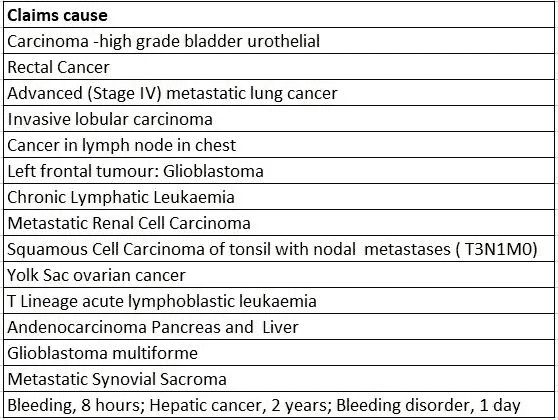
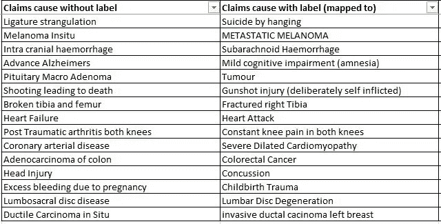
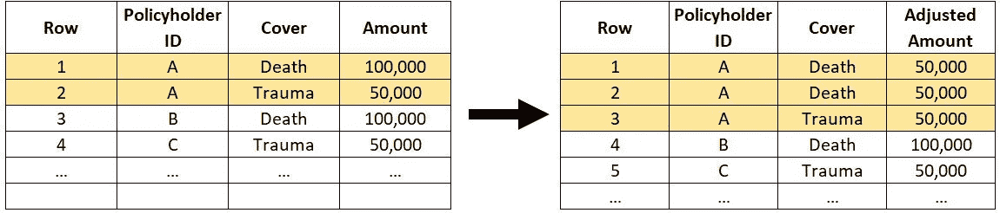
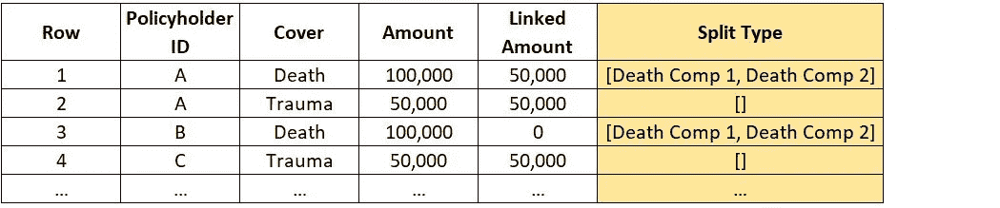
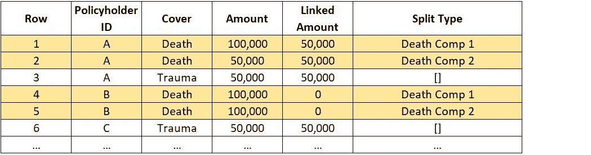
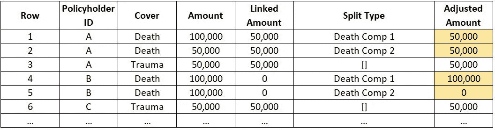

# 将数据科学应用于寿险行业:合格精算师的观点

> 原文：<https://towardsdatascience.com/applying-data-science-in-the-life-insurance-industry-a-perspective-from-a-qualified-actuary-698c197e1826?source=collection_archive---------5----------------------->

## [行业笔记](https://towardsdatascience.com/tagged/notes-from-industry)

## 数据科学如何改变寿险精算师的传统格局(用几个用例解释)


[安德鲁·尼尔](https://unsplash.com/@andrewtneel?utm_source=medium&utm_medium=referral)在 [Unsplash](https://unsplash.com?utm_source=medium&utm_medium=referral) 上拍照

# 作者的背景资料

我是一名合格的精算师，在澳大利亚的人寿保险业有 10 年的从业经验。对于那些可能不熟悉精算师日常工作的人来说，从较高的层面来看，精算师的角色包括:设定死亡率和发病率产品的保险费率，计算人寿保险公司的索赔义务和相关资本要求，为人寿保险公司的股东校准经济价值，以及了解实际经验(如索赔和中止)与预期经验的偏差。

大约 3 年前，在偶然看到 AlphaGo 上的[纪录片](https://www.youtube.com/watch?v=WXuK6gekU1Y)后，我踏上了自学数据科学/机器学习技术的旅程。我发现如何训练机器学习抽象概念特别令人着迷，在这种情况下，人类在围棋比赛中采取行动的直觉。

有了一定的统计学教育背景，我很快学会了一些数据科学技术，并将它们应用到我的工作中。我将在本文后面用两个用例来解释这些技术如何帮助改进精算分析。

我认为数据科学技术是传统精算技术的良好补充，传统精算技术大多基于统计数据，并且足够幸运，不必从一个完全不相关的领域跳到数据科学的潮流中。

# 寿险行业数据科学的现状

## 数据工具

在我的日常工作中(我可以代表澳大利亚大多数人寿保险精算师发言)，Excel 一直是分析数据的主要工具，而 VBA 宏用于自动化一些基于 Excel 的 ETL 工作。

从编程的角度来看，大多数寿险精算师在大学期间都会接触到 R。

Excel 有它的优点和缺点，我将在后面详细讨论。

## 数据科学在寿险公司中的渗透

据我采访的一家咨询公司称，数据科学在澳大利亚的大多数寿险公司都处于起步阶段。“机器学习”和“数据科学”是高管们听说过的时髦词汇，但他们可能会发现很难将它们联系起来。举个例子，有一次，我听过高管们评论机器学习，好像它和相当遥远的人工通用智能一样。

对我来说，数据科学技术在寿险行业渗透率低的原因有两个:

*   与一般保险公司(如汽车保险公司)相比，人寿保险公司收集的数据历来较少。这是因为大多数人至少拥有一辆汽车，而不一定有人寿保险。此外，与人寿保险相比，汽车保险更容易索赔。这无形中使得依赖大量训练数据(如神经网络)的机器学习模型不那么有吸引力。
*   人寿保险公司的高管还没有看到数据科学技术如何为组织增加价值的实际用例。鉴于这是一个相对较新的发展，该组织中很少有人有能力建立并同时推广一个商业案例，以确保买入和投资。举个例子，产品团队中很少有人会意识到，我们可以应用一点网络搜集来收集竞争对手产品特性的更新，而不是通过访问每个竞争对手的网站来手动收集这些信息。

本文旨在展示数据科学技术如何为人寿保险公司增加价值，尤其是精算工作流，并根据我自己的经验提供了两(2)个用例。我有更多的用例，希望在以后的文章中分享。

# 数据科学技术如何帮助精算师——用例

## 用例 1 —自由文本索赔原因的自然语言处理

大多数人寿保险公司会记录投保人提出索赔的原因。记录的索赔原因包括:

*   髋骨脱臼、骨折
*   转移性黑色素瘤
*   心脏停搏

索赔原因有时以自由文本的形式记录。这些是非结构化数据，对希望在索赔原因层面分析索赔的精算师来说是一个挑战。

上述三个索赔原因的例子分别与髋骨骨折、皮肤癌和心脏病发作具有相同的含义。然而，通过简单地让计算机在没有人类理解的情况下阅读文本，这些权利主张都将被视为独特的权利主张。

例如，计算机可能会在下面的“索赔原因”栏中识别 15 个独特的级别，而实际上精算师应该只关心一个独特的级别(肿瘤或癌症)。



表 1.1(按作者分列的表格)

在使用我将在下面描述的 NLP 技术之前，我已经在 Excel 中进行了过滤，例如，包含类似于“癌症”或“肿瘤”的词串的声明，并将它们手动分类到肿瘤类别。你可以想象这是多么的手工和费力，有时需要我一个接一个地查找诸如“胆管癌”、“精原细胞瘤”等医学术语。

此用例中的任务是**使用一些自然语言处理(“NLP”)自动**将索赔原因分类到预定义的类别中。汇总索赔原因的一些类别可能是事故/伤害、肿瘤、肌肉骨骼、循环系统疾病、呼吸系统疾病、精神障碍等等。这可以通过以下五(5)个步骤实现。

***第一步***

定义汇总索赔原因的类别后，手动将自由文本索赔原因标记到这些类别中。这是为了给 NLP 模型提供一些训练数据，但我保证这将是这项任务中最后一个费力的步骤！

实际上，在大约 6，000 件索赔的数据集中，对 366 件索赔进行了标记。就我个人而言，这并没有增加太多的努力，因为我之前已经这样做了。

***第二步***

对于现在带有标签的(366)索赔，请对索赔原因执行文本清理，例如删除特殊字符、删除双空格和小写字母。很容易将这个步骤扩展到包括其他选择的清理步骤，例如纠正拼写错误。

下面提供了一些用于文本清理的示例 Python 代码:

```
import re #remove special charactertext_remove_special_character = []for texts in raw_claims_cause:text_remove_special_character.append((re.sub(r'[^\w\s]', '', str(texts).strip())))#remove double white spacetext_remove_white_space = []for texts in raw_claims_cause:text_remove_white_space.append(" ".join(texts.split()))#lower-casingtext_lowercase = []for texts in raw_claims_cause:text_lowercase.append(texts.lower())
```

***第三步***

为索赔原因的清除文本创建单词嵌入。根据下面的 Python 代码示例，我选择了一种形式的 BERT vector 化。

```
from sentence_transformers import SentenceTransformer bert_input_claims_with_label = text_claims_register['text_claims_causes_cleaned'].tolist()model_claims_with_label = 
SentenceTransformer('paraphrase-mpnet-base-v2')embeddings_claims_with_label = model_claims_with_label.encode(bert_input_claims_with_label)print('Shape of vector outputs:', embeddings_claims_with_label.shape)
```

来自变压器的双向编码器表示(“BERT”)模型是谷歌在 2018 年开发并发布的 NLP 模型。这是一个使用维基百科和图书语料库上的文本段落进行预训练的模型(只是为了确保训练数据在语法上是正确的)。

本质上，每个自由文本的索赔原因都被 BERT“翻译”成计算机可以理解的语言，由长度为 768 的向量表示。

这个步骤的输出实际上是每个自由文本声明的向量，原因是带有标签，长度也是 768。

整体单词嵌入的形状如预期:

```
Shape of vector outputs: (366, 768)
```

***第四步***

对于没有标签的索赔原因，重复步骤 1-3。该步骤的输出是没有标签的每个自由文本索赔原因的有效向量(即，我们想要标记的索赔原因)，长度也是 768。如果你有 *n* 个没有标签的索赔原因，你应该期望单词 embedding 的形状是维数(n，768)。

***第五步***

将不带标签的索赔原因的矢量输出与带标签的索赔原因的矢量输出进行比较。基于余弦相似度返回最接近匹配的索赔原因标签。

简而言之，由于训练数据由 366 个索赔组成，对于我们想要自动标记的每个索赔原因(即，对于下面样本代码中 similarity_df 数据帧中的每一行)，存在 366 列，它们从数字上对特定索赔原因与训练数据中的每个索赔的相似程度进行评分，并且使用 pandas *idxmax* 方法返回给出最高分数的索赔的位置。

```
from sklearn.metrics.pairwise import cosine_similarity embedding_array_claims_with_label = np.array(embeddings_claims_with_label)embedding_array_claims_without_label = np.array(embeddings_claims_without_label)similarity = 
cosine_similarity(embedding_array_claims_without_label, embedding_array_claims_with_label)similarity_df = pd.DataFrame(similarity) #return position of closest match, with which the label can be looked upsimilarity_index = similarity_df.idxmax(axis = 1)
```

下面是一些声明的最终输出片段，它们肯定通过了“眼睛测试”。



表 1.2(按作者分列的表格)

***对精算师的启示***

如果索赔原因能够在这一级别进行映射和汇总，那么精算分析将会有许多影响。一些例子包括:

*   按索赔原因调查趋势(例如，新冠肺炎疫情期间精神障碍或相关索赔等主观索赔的趋势)
*   根据索赔原因将公司索赔经验与行业经验(由澳大利亚政府机构发布)进行比较
*   通过职业、性别等评定因素了解最常见的索赔原因。
*   按专业将待评估的索赔分类给合适的索赔评估员(例如，某些索赔评估员可能比其他人更擅长精神障碍索赔)

单独地，使用类似的方法，这个用例可以外推到职业类。例如，将“水管工，3 年工作经验”等职业描述映射到蓝领类别，将“律师，学位资格”映射到专业/白领类别，这样可以进一步提供精算分析。

***总结—用例 1***

总之，这个用例为精算师提供了一种将自由文本索赔原因数据自动分类到预定义类别中以供进一步分析的方法。最终，在伯特的帮助下，计算机能够理解人类语言。在这种情况下，计算机能够理解和比较医疗术语或索赔事件的描述，这有时可能会很混乱。

在 Excel 中手动筛选的替代方法不实用，尤其是对于大量索赔。

## 用例 2 —大规模数据的复杂转换

如前所述，Excel 是大多数寿险精算师的主要 ETL 工具。虽然 Excel 为用户提供了转换数据的透明度，但它在精算应用方面有许多严重的缺点:

*   Excel 有行和列的限制。更常见的情况是，即使在达到这个限制之前，考虑到对计算资源的要求，在电子表格中导航会很慢很困难。
*   Excel 不是一个可扩展的工具，因为通常很难有效地将一个工作簿中的数据与另一个工作簿中的数据连接起来，更不用说执行计算了，尤其是当数据集很大时。

这个用例所基于的任务用 Excel(实际上)是无法完成的，但是用 PySpark 通过一点数据帧操作就可以轻松完成。

为了用一个简单的例子来描述这个任务，假设一个人寿保险投保人购买了一份具有两(2)个保险的保单，一个是针对死亡事件的保险(“死亡保险”)，另一个是针对预先定义的医疗状况事件的保险(“创伤保险”)。

这两种保险与不同的赔付金额相关联，通常死亡保险比创伤保险的赔付金额更多。此外，在澳大利亚的大多数情况下，支付创伤保险会减少最初购买死亡保险的金额。例如，假设投保人购买了赔付金额为 10 万美元的死亡保险和赔付金额为 5 万美元的创伤保险。如果投保人在外伤保险中索赔并获得 50，000 美元的赔付，死亡保险将降至 50，000 美元(即 100，000-50，000 美元)。

读者不需要理解技术细节，但这种在澳大利亚很常见的产品结构，为死亡保险提供了不同的死亡率假设。简而言之，如下图 2.1 所示，死亡保险的蓝色和绿色部分需要采用不同的精算假设进行建模。本质上，这需要将死亡保险“拆分”成两个部分，我们将对这两个部分的索赔成本进行不同的建模。


图表 2.1(按作者分列的图表)

实际上，这需要识别具有死亡保险和“关联的”创伤保险的投保人，并且在特定投保人的数据的该“框架”中，为死亡保险添加额外的行，并且基于创伤保险的赔付额来计算两行死亡保险的赔付额。您应该很快就会发现，用 Excel 很难做到这一点，部分原因是这种转换不是一对一的。下表 2.2 以表格形式说明了所需的转换:



图表 2.2(按作者分列的图表)

此时 **PySpark** 及其内置的 **SQL 函数**变得非常强大，有了它，所需的转换可以在以下四(4)个步骤中实现:

***第一步***

创建一个新列“链接金额”，该列返回投保人 ID 级别的创伤保险赔付金额，如下图 2.3 所示。


图表 2.3(按作者分列的图表)

这可以通过在 Policyholder ID 字段上创建一个窗口或“框架”来实现(在下面的示例代码中，我将它与 Policyholder_ID 互换使用):

```
from pyspark.sql import functions as F
from pyspark.sql import Window as Wdef compute_Linked_Amount(Policyholder_ID: List[str]) -> Column:window = W.partitionBy(*Policyholder_ID) \.rangeBetween(W.unboundedPreceding, W.unboundedFollowing) \.orderBy("Policyholder_ID")return F.when(F.col("Cover") == "Death", F.lit(0.0)).otherwise(F.col("Amount")).over(window)
```

***第二步***

创建另一个新列“拆分类型”，仅使用死亡封面行的**数组**数据类型指定，将这些行的值设置为【死亡补偿 1，死亡补偿 2】(即具有相同字符串的 2 乘 1 数组)，如下图所示:



图表 2.4(按作者分列的图表)

***第三步***

将这些行中的每一行“分解”成两个相同的行，除了新列的值分别为死亡补偿 1 和死亡补偿 2。如下图所示。使用 PySpark 中的 [explode_outer](https://spark.apache.org/docs/latest/api/python/reference/api/pyspark.sql.functions.explode_outer.html) SQL 函数可以实现“explode”操作。



图表 2.5(作者图表)

***第四步***

创建最终支出金额列，用以下 WHEN OTHERWISE 语句表示。

```
from pyspark.sql import functions as FF.when(col("Split Type") == "Death Comp 1", \
F.col("Amount") - F.col("Linked Amount") \
.otherwise(F.col("Linked Amount")
```



图表 2.6(按作者分列的图表)

您应该能够看到，在删除了“最终金额”列中值为 0 的行之后，根据图表 2.2，转换就完成了。

**总结—使用案例 2**

总的来说，这个用例代表了一个转换，如果同一个投保人也有一个创伤保险，则需要将数据帧中对应于死亡保险的行分割成单独的行。使用 Excel 中的操作不容易做到这一点。

在使用案例中已经证明，使用 PySpark 可以轻松实现这种转换，PySpark 为用户提供了以下功能:

*   能够在数据子集上创建窗口(例如，使用投保人 ID 字段为每个投保人)并提取该级别的信息。在本例中，这确定了投保人是否同时拥有死亡和创伤保险，如果投保人拥有，则根据用例的*步骤 1* 在死亡保险的行中填充创伤保险的赔付金额。
*   能够在数组数据类型的数据帧中插入列，这使得像拆分这样的操作可以使用内置的 SQL 函数，如“explode_outer”。
*   与 Excel 相比，转换效率更高，因为 PySpark 以其在大型数据集/数据帧中的运算速度而闻名。这是至关重要的，因为我们推断用例涵盖除死亡和创伤以外的类型，以及人寿保险公司内用于商业用途的所有投保人。

# 结论

对于 2021 年的寿险精算师来说，数据科学、机器学习可能仍然是一个遥远的词，但它们比人们想象的更近。就个人(和商业)而言，打破准入门槛需要一点努力，这最终是值得的。

最后，我希望你觉得这篇文章是一篇好文章，如果你有，请分享。