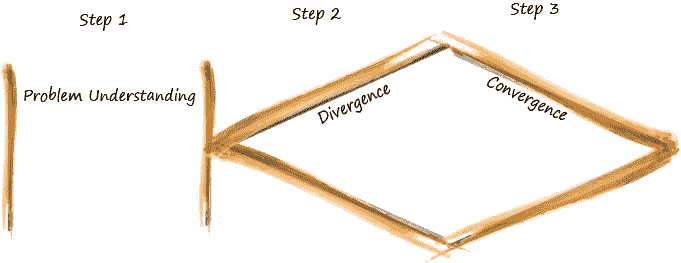
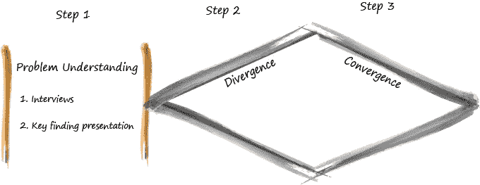
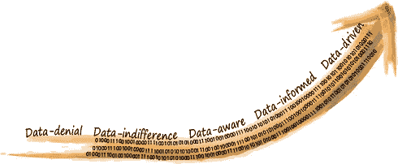
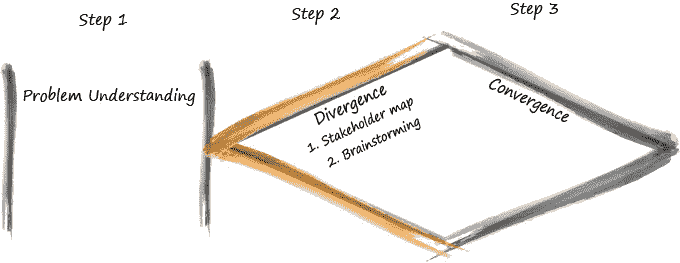
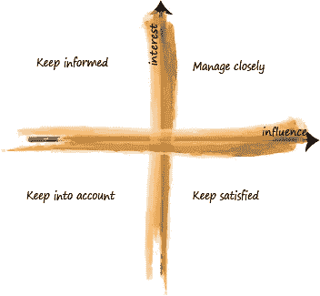
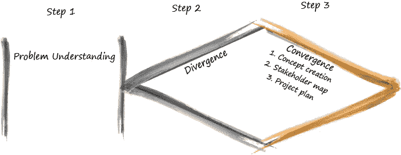
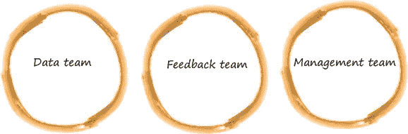

# 将设计和敏捷思维应用到您的数据科学项目中—第 1 部分

> 原文：<https://towardsdatascience.com/applying-design-and-agile-thinking-to-your-data-science-project-part-1-ef945c558181?source=collection_archive---------22----------------------->

## 了解如何将设计思维应用于任何数据科学案例

罗斯·斯奈登在 [Unsplash](https://unsplash.com/s/photos/puzzle?utm_source=unsplash&utm_medium=referral&utm_content=creditCopyText) 上的照片

把世界想象成一个由数百万块碎片组成的巨大拼图。拼图仍未完成，一些碎片已经放置，但仍有空间放置新的碎片。我们想让我们的解决方案成为这个巨大拼图中的一块拼图，但是我们不知道怎么做。**设计和敏捷思维**帮助我们将我们的解决方案整合成一个拼图，放入这个巨大的拼图中。

创建一个数据产品可能是混乱和困难的。我的建议是，当一开始看起来似乎没有解决方案时，不要轻易放弃，而是要继续尝试构建这些部分！

遵循**设计和敏捷思维**作为您旅途中的向导，可以使您的解决方案的设计、实现和到达变得更加容易。

你可能听说过**设计和敏捷思维**方法，因为它们在许多组织中被广泛使用。本文简要介绍了这两种方法，并解释了如何在一个**数据科学案例**中应用**设计思想**。

*如果你对如何在一个数据科学案例中应用敏捷思维更感兴趣，请查看本文的* [*第二部分*](https://medium.com/@elenastamatelou/applying-design-and-agile-thinking-to-your-data-science-project-part-2-d11ce96275f6) *，否则，继续阅读！*

# 设计还是敏捷思维？

## 差异#1

如果你对实际问题和切实可行的解决方案不清楚，那么你可以使用**设计思维**方法的步骤来帮助你度过难关。

如果你处在一个问题已经明确的情况下，并且你需要管理你的方式直到你按时达成解决方案，那么你可以遵循**敏捷思维**方法。

## 差异#2

**设计思维**用于重新定义问题，理解用户，尝试新颖的概念，并交付解决方案的最优和创新设计。

**敏捷思维**是一种项目管理方法，将解决方案的设计(设计思维过程的结果)转化为实际的解决方案。

## 类似

两者有相似之处，例如:

*   **以人为中心**，优先考虑最终用户和利益相关者的需求，
*   **迭代**，由多个循环组成，并在每次迭代中根据提供的反馈进行改进。
*   **聚焦选项**，列举探索的可能性

这两种方法的结合可以确保高质量地解决组织内部的实际问题。

# 设计思维:没有数据的数据科学

在大多数情况下，大量的数据是可用的，如果我们立即开始查看数据，我们可能会在试图理解数据列和字段时迷失，并忘记最初的问题。因此，我们应该后退一步，脱离细节，尝试创建一个组织的流程及其瓶颈的整体概述。

在此阶段，我们期望的**结果**是**识别问题并设计解决方案**。因为我们想要带来一个数据驱动的解决方案，所以设计应该包括数据需求的初始草案和数据产品的第一个概念。在这个阶段，我们还应该定义最终产品的用户，并让他们参与设计过程。

设计思维方法包括三个步骤:**问题理解，发散，收敛**，如下图所示。

设计思维，埃琳娜·斯塔马特卢素描

# 第一步:理解问题

这一阶段主要是为了更深入地了解组织内部的现状。

设计思维:第一步，Elena Stamatelou 的草图

## A.面谈

安排与组织中不同人员的面谈，有助于我们深入了解他们的流程、沟通方式和愿景。从数据科学家的角度来看，预期的关键成果是发现组织的**数据成熟度级别**，这显示了数据科学在其组织中的当前角色。为了达到这种理解水平，我们为受访者列出了一系列问题。

## 个人问题

1.  你的背景是什么？
2.  你在公司的角色是什么？你在哪个部门工作？
3.  你对数据科学了解多少？

## 团队问题

1.  你是团队的一员还是管理团队？
2.  与你密切合作的同事的角色是什么？
3.  你的团队的职能是什么？
4.  从规模和层级来看，团队的结构如何？
5.  您在团队内部以及与其他部门沟通的频率如何？

## 商业问题

1.  你的组织最具挑战性的问题是什么？
2.  你的团队最具挑战性的问题是什么？

## 数据科学问题

1.  您的组织中有数据科学相关项目的例子吗？如果是，这些项目是关于什么的？
2.  您的组织中有数据科学家吗？如果是，能否举例说明它们的影响？
3.  对于数据科学如何应对贵组织内部的挑战，您有什么想法或建议吗？

## 数据管道问题

1.  您目前是否收集或拥有任何数据？
2.  您是否执行涉及数据处理或分析的任务？
3.  数据是如何存储和提取的？
4.  数据的大小是多少？

## 技术

1.  您使用哪种类型的控制面板进行数据可视化/分析？
2.  您使用哪种数据库系统来存储数据？
3.  你使用云技术吗？
4.  对于数据分析/建模，你有什么偏好的编程语言吗？

## 视觉问题

1.  您认为您的组织在未来十年内会朝着更加数据驱动的方向发展吗？
2.  员工适应新技术的难易程度如何，比如一个新的软件或数据产品？

## B.主要调查结果演示

演示应该包括对访谈结果的总结，并总结组织面临的主要挑战。

为了增加数据科学视角，定义组织的**数据成熟度级别**对于将数据使用推进到下一个级别至关重要。成熟度各不相同，从不使用任何数据的公司到信任数据并根据数据洞察力做出决策的公司。

下图显示了迈向数据驱动型组织的旅程。

数据成熟度级别，由 Elena Stamatelou 绘制

1.  **数据拒绝:**主动拒绝数据使用
2.  **数据冷漠:**对数据的使用缺乏兴趣
3.  **数据感知:**数据收集和历史数据的可视化，用于了解过去的事件(描述性分析)
4.  **数据通知:**基于历史数据的模型，用于未来事件预测(预测分析)
5.  **数据驱动:**基于预测的决策建议(说明性分析)

在了解了关键挑战和组织的数据成熟度后，演示文稿还应包括一些示例，说明数据科学如何帮助组织应对一些挑战并转变为更加数据驱动的组织。

# 第二步:发散

如果一切皆有可能呢？我们应该带着这个问题度过这个阶段，并探索每一种可能性。该阶段由两部分组成；利益相关者地图初稿和集思广益会议。

设计思维:第二步，Elena Stamatelou 的草图

## A.利益相关方地图(初稿)

在问题理解阶段之后，我们对项目中涉及的各方有了很好的了解。为了组织不同利益相关者的视图以及他们的参与和影响，我们需要创建一个利益相关者地图的初稿，如下所示。

利益相关者地图，Elena Stamatelou 绘制

区分不同类型的利益相关者的两个主要变量是**他们的兴趣和他们在我们项目中的影响水平**，这两个变量的所有组合都是可能的。

目前，我们不需要绘制所有利益相关者的详细地图，但一个初稿就足以继续设计思维方法的下一步。

## B.头脑风暴

完成利益相关者图后，我们从图的不同部分选择最具代表性的利益相关者，这样我们就有了具有不同影响和兴趣水平的利益相关者的合适组合。然后，我们邀请这些利益相关者参加我们的集思广益会议。

在头脑风暴期间，我们与不同的利益相关者创建两到三个小组。我们将会议分为两部分:挑战思维和解决方案思维。

在**挑战创意**部分，我们询问参与者他们面临的两大挑战，将他们分组，让他们投票选出最重要的挑战。然后，对于投票最多的挑战，我们要求他们确定受其影响的利益相关者，并将他们分组。

之后，我们选择三个投票最多的挑战及其最受影响的利益相关方，并开始解决方案的**构思**部分。随后，我们要求参与者为密切相关的利益相关者设想理想的情况，并找出阻碍组织达到这一理想情况的瓶颈。然后，我们让他们就管理这些瓶颈的方法进行头脑风暴，并根据相似性对他们进行分组。

# 第三步:融合

在分散和探索了各种挑战及其可能的解决方案之后，没有添加任何限制，是时候收敛了。这里的目的是定义一个具体的用例，并向涉众提出一个数据驱动的设计概念。

设计思维:第三步，Elena Stamatelou 的草图

## A.概念创造:

我们在这里的首要任务是总结集思广益会议期间产生的所有挑战和解决方案，并重点关注那些似乎对组织影响最大、负担更重的挑战和解决方案。对于每一个项目，我们都致力于定义数据需求的初稿、数据产品的概念和高级数据驱动的数据管道。

对于**数据需求**的初稿，我们考虑数据可用性、可能的数据收集和数据隐私问题。在那之后，我们开始制作**最终数据产品**的第一份草图，包含了最初的数据需求。考虑到数据需求和最终产品，我们设计了一个**数据管道**的概述，其中包括从数据收集到最终产品部署及其交付给利益相关方的整个流程。

在头脑风暴期间，我们对定义的关键挑战的解决方案有了一个良好的初步设计，然后安排与主要利益相关者的会议。我们利用这些会议的时间来讨论这些设计，并汇聚到一个解决用例的设计，这个用例对他们来说似乎更有趣，也更现实。

## B.利益相关者地图细化

在定义了解决方案的第一个设计和一个具体的用例之后，是时候回顾利益相关者地图的第一个草案了，它是在头脑风暴会议之前创建的。

这一步的主要目的是细化不同的涉众群体并创建三个团队；**数据、反馈和管理** **团队**。这些团队对于产品开发的共同创造过程以及实现与他们的有效协作是必不可少的。

团队，草图由 Elena Stamatelou 绘制

**数据团队**将包括与数据密切相关的利益相关者，如数据或业务分析师。该团队将帮助收集数据和保护数据隐私。**反馈团队**将由最终用户组成，他们将对原型和最终产品进行实验并提供反馈。在**管理团队**中，将包括层级较高的利益相关者。这个团队将作为指导委员会，对项目方向的决策有很高的影响。

## C.工程计划

实施设计前的最后一步是制定项目管理计划。这是设计思维和敏捷思维方法之间的过渡步骤。

有必要**回顾**在设计思考过程中创建的所有信息，包括数据需求、解决方案的设计以及不同的利益相关者群体。基于这个评审，我们创建一个敏捷计划，在它的执行之后将交付数据产品。

# 包扎

使用**设计思维**作为指导，使合适解决方案的形成变得更加容易。在设计之后，实施就来了，敏捷思维可以在这个过程中做我们的向导。

*阅读本文的* [*第二部分*](https://medium.com/@elenastamatelou/applying-design-and-agile-thinking-to-your-data-science-project-part-2-d11ce96275f6) *，了解如何在您的数据科学案例中应用敏捷思维。*