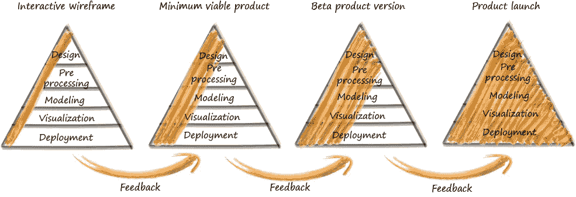
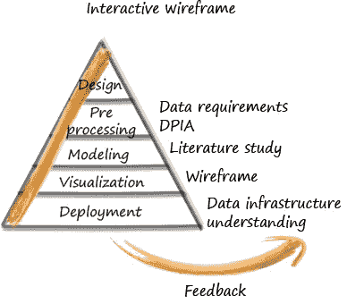
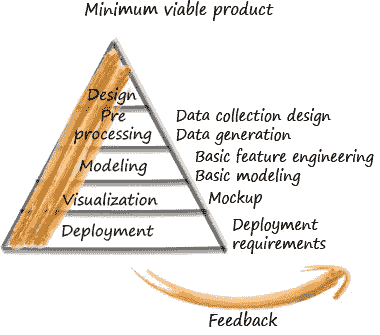
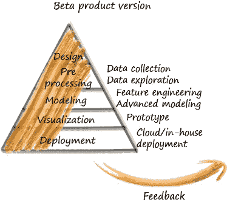
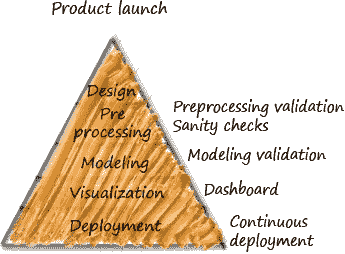

# 将设计和敏捷思维应用到您的数据科学项目中—第 2 部分

> 原文：<https://towardsdatascience.com/applying-design-and-agile-thinking-to-your-data-science-project-part-2-d11ce96275f6?source=collection_archive---------35----------------------->

## 了解如何将敏捷思维应用于任何数据科学案例

汉斯-彼得·高斯特在 [Unsplash](https://unsplash.com/s/photos/jigsaw-puzzle?utm_source=unsplash&utm_medium=referral&utm_content=creditCopyText) 上拍摄的照片

把数据驱动的解决方案想象成一块拼图。这一块需要有一个合适的形状和颜色，以适应一个更大的拼图。我们的世界就是这个拼图，还没有完成。我们想做一个合适的拼图块，然后放入拼图中，使其更加完整。换句话说，我们想给这个世界带来一个合适的解决方案。设计和带来合适的解决方案可能很复杂。**设计思维**做出解决方案的形状，而**敏捷思维**确保其实施，取得设计思维的成果。

*这是文章的第 2 部分，重点是如何将敏捷思维应用到数据科学项目中。如果您对将设计思维应用于数据科学案例或了解两种方法的异同更感兴趣，请阅读本文的第 1 部分* *，否则，请继续阅读！*

# 敏捷思维:数据科学与数据

鉴于解决方案的设计是设计思维的结果，敏捷思维方法促进了设计的实现过程，并确保了最终数据产品的及时交付。虽然在设计思维阶段，数据的使用不是必须的，但是在敏捷思维阶段，数据的使用是必须的，但不一定从一开始就需要。此时，我们期望的**结果**是在一个时间框架内发布数据产品。

敏捷思维是一种迭代方法，由多个阶段组成。每个阶段都将逐步建立在前一个阶段的基础上，以产品发布为最终目标。我们从我们产品的一个非常基本的轮廓开始，那就是**交互式线框**(第一阶段)**，**我们不断地添加功能，每次都是最新版本。从基本的第一个版本开始，我们迅速发布了一个**最小可行产品**(第 2 阶段)，然后是 **beta 产品版本**(第 3 阶段)。最后，我们在**产品发布**(阶段 4)期间交付我们的最终数据产品。

每个阶段由相同的五个组成部分组成；**设计、预处理、建模、可视化和部署**。各阶段及其基本组件在下图中显示为金字塔。每个阶段都考虑相同的方面，但是每次都在它们的基础上进行改进，使它们更加完整。

敏捷思维的生命周期，Elena Stamatelou 的草图

在每个阶段的开始，都有一些空间来重新定义我们的解决方案方法，考虑从上一阶段学到的知识。这提供了结合变化的灵活性的可能性，以及对我们最初方向的执着，这是设计思维方法的结果。在每个阶段的末尾，需要与数据产品的最终用户(反馈团队)一起计划**反馈**会议。该反馈提供了关于他们的需求和他们对产品当前版本的满意程度的知识。因此，这有助于定义需要在下一阶段应用的必要修改。

# 阶段 1:交互式线框

这个阶段包括项目启动，还没有数据。主要的可交付成果是**产品大纲**和**交互线框**，这将是一个非常基本的用户界面，将使用户对我们的方向有第一印象。

敏捷思维:交互式线框(第一阶段)，Elena Stamatelou 的草图

## 设计

我们使用设计思维方法的结果来定义解决方案的**初始架构、任务以及该阶段的方向。我们还创建了用户故事的初始草图，我们将在这个阶段使用它作为指南。**

## 预处理

**数据要求:**由于没有数据，这里的主要目的是定义数据要求。我们考虑两个相反的方向。一方面，通过想象没有关于数据可用性的限制，我们定义必要的数据来解决挑战。从另一方面来说，通过考虑现有的数据及其限制，我们想到了实现最终项目目标的方法。然后，我们得到一个包含所有必需数据的列表。

**数据保护影响评估(DPIA)** :在获取数据之前，我们需要准备并与组织签署协议，以确保数据保护。我们致力于 DPIA 流程，以识别并最大限度地降低可能的数据保护风险。

## 建模

**文献研究:**在开始任何建模方法之前，我们需要做一个文献回顾。我们的目标是创建一个包含所有可能的建模方法的列表，从最佳实践到最先进的技术

## 形象化

线框:牢记用户故事中描述的用户视角和需求，我们创建可视化的格式和一般结构。我们还制作了一些高层次的草图，并将它们组合成一个交互式线框，该线框将用于该阶段结束时的反馈会议。

## 部署

**数据基础设施了解:**我们收集有关组织基础设施的信息，如数据存储或 BI 工具。我们的目标是找出我们将使用哪些工具来部署我们的数据产品。使用员工熟悉的工具比尝试引入新工具更具成本效益，也更容易。

## 反馈

在这个阶段的最后，我们组织一个反馈会议，在这个会议中，我们向用户展示交互式线框，让他们使用它，并向他们提问以获得他们的反馈。

# 阶段 2:最低可行产品

在这里，我们的目标是为利益相关者和最终用户提供解决方案的基础，这将是**最小可行产品**。从我们的角度来说，我们希望收集最大数量的反馈和学习，这样我们就可以确保我们最终的工作原型能够满足用户和利益相关者的期望和需求。

敏捷思维:最小可行产品(第二阶段)，Elena Stamatelou 的草图

## 设计

我们使用前一阶段收集的反馈来提炼用户故事，重塑我们的设计，并规划当前阶段。我们**通过添加更多细节来更新初始架构**。

## 预处理

**数据收集设计**:有了数据需求列表，我们就设计了获取数据的方法。如果数据已经存在于他们的系统中，那么请求和接收数据是很容易的。如果数据尚不存在，我们应该定义一个数据收集流程。

**数据生成**:由于数据收集需要一些时间，为了节省时间，我们根据数据需求生成合成数据**、**。在这个阶段，我们使用生成的数据。

## 建模

**基本特征工程:**在拥有真实数据之前，我们使用合成生成的数据来创建我们认为最有影响力的基本特征。我们还清楚地定义了目标变量。

**基本建模:**使用基本特征，我们应用简单模型来预测我们的目标变量。

## 形象化

**模型:**使用前一阶段的线框作为起点，我们基于更新的用户故事添加数据可视化。我们的重点是制作一个用户友好的交互式模型，让用户感受到我们的方向，并为我们提供建设性的反馈。

## 部署

**部署要求:**根据对组织基础设施的了解，我们指定部署要求，并检查可行性和所涉及的成本。

**本地部署:**在这个阶段，我们在本地服务器上运行模型，

## 反馈

在这个阶段结束之前，我们会安排一次与用户的会议，通过向他们展示我们的最小可行产品，与他们分享我们的概念和预测的数据可视化。

# 阶段 3:测试产品版本

这个阶段的重点是交付一个 **beta 产品版本**，其中包括真实的模型预测，并在一个用户友好的交互式仪表盘中显示出来。在这个阶段的最后，用户和涉众将测试产品以识别 bug 和其他缺陷，以便进入产品交付阶段。

敏捷思维:Beta 产品版本(第 3 阶段)，Elena Stamatelou 的草图

## 设计

在开始该阶段之前，我们重新考虑所有的知识，并通过将数据存储的细节添加到模型部署中来更新架构。这个阶段离实际产品更近了一步，因为我们将使用真实数据。

## 预处理

**数据收集:**根据数据收集设计和数据需求，我们从组织中收集数据。

**数据探索:**收到真实数据后，我们检查完整性(缺失值)和及时性(最新数据)以确保数据质量，以便我们可以进一步使用它进行建模。为了更好地理解数据的意外行为，我们寻找异常值(异常)，这些异常值是错误的或非常重要的值，显示了数据的奇怪行为。

## 建模

**特征工程:**为了继续使用相同或相似的建模方法，我们检查所提供的数据在多大程度上可以替代合成数据。然后，我们将合成数据的特征与真实数据的特征进行匹配，并且如果我们认为来自真实数据的更多特征会改进预测结果，则添加这些特征。

**高级建模:**有了真实数据的特征，我们首先应用前一阶段的简单模型，以确保真实数据的特征可以替代合成的特征。如果简单的模型不再适用，我们会用更合适或更复杂的模型来代替它。在这里，我们还可以尝试不同的建模方法或超参数调整，并比较不同模型或同一模型变体的性能。

## 形象化

**原型:**从上一阶段的交互式模型过渡到原型，需要进一步改进数据可视化和仪表板的前端开发。这里的重点是制作一个可以为最终用户服务的功能性和交互性的仪表板。

## 部署

**云/内部部署:**根据前一阶段定义的部署需求，我们应该将解决方案从本地运行转移到我们的设备上，在组织的云或内部服务器上运行。在这一部分中，我们部署预测模型，而不是定型模型。如果一切顺利，在下一阶段，我们还将部署培训模型。

## 反馈

这个阶段产生了一个类似于实际产品的 Beta 产品版本，因为我们同时在前端(仪表板)和后端开发(部署)上工作。在这一点上，我们给出了在产品发布之前从用户那里获得反馈的最后机会。

# 第 4 阶段:产品发布

在这个阶段，我们应用最后的改进。当不需要改进时，我们通过使持续验证成为可能来部署训练和预测模型，然后推出数据产品。我们的目标是向涉众和用户交付一个功能性的、可靠的和可用的产品。

敏捷思维:产品发布(第 4 阶段)，Elena Stamatelou 的草图

## 设计

在这个最后的设计周期中，我们从最后的反馈会议中收集反馈，并在发布之前将最后的改进添加到产品架构中。

## 预处理

**预处理验证:**我们从组织中收集新数据，并将其与用于测试产品版本的数据进行比较，以检测差异。

**健全性检查:**基于对新数据预处理验证的观察，我们创建健全性检查，以确保输入数据具有合适的和期望的格式。

## 建模

**建模验证:**使用新数据，我们验证 beta 产品版本，并在需要时应用最后的更改。

## 形象化

**仪表板:**根据前一阶段的原型，我们构建了一个更稳定的仪表板，在其中我们应用了最后的改进。

## 部署

**持续部署:**如果测试产品版本的预测模型在云或内部基础设施中顺利运行，我们可以更进一步部署我们的模型。首先，我们还部署了我们的训练模型，以便在代码更新或新数据的情况下重新运行。我们的目标是为我们的预测模型实现持续集成(CI)、持续交付(CD)和持续培训(CT)。这意味着，对于任何新的数据或代码更新，模型都会被重新训练并提供更新的预测。

# 包扎

终于，我们的产品可以上市了！

随着不断的集成、开发和训练，我们的预测模型会随着新的输入而改进。提供这种灵活性使我们的数据产品能够适应变化。通过将它暴露给新的和更多的数据来改进数据产品的预测。

敏捷思维通过将来自设计思维的设计概念作为输入，创建了创建数据产品的指导方针。

*如果你对如何在数据科学案例中应用设计思维感兴趣，请阅读本文的* [*第一部分*](https://medium.com/@elenastamatelou/applying-design-and-agile-thinking-to-your-data-science-project-part-1-9ac1db771c7c) *。*