# 将机器学习应用于核反应堆动力学

> 原文：<https://towardsdatascience.com/applying-machine-learning-and-exploratory-data-analysis-to-nuclear-reactor-kinetics-d1dae16fb081?source=collection_archive---------26----------------------->

## 使用 Python 进行核物理、反应堆操作和预测建模的初级读本


**图一。2 兆瓦特特里加反应堆满功率。来源:我(沃克·佩恩)**

根据[核管理委员会](https://www.nrc.gov/reading-rm/doc-collections/datasets/index.html)的数据，美国有 31 个核研究反应堆。我碰巧有操作其中一个的许可证，在这篇文章中，我将演示我如何应用机器学习和通用数据分析技术来预测脉冲功率水平并提高我们实验的可重复性。

# 背景

一个[裂变核反应堆](https://en.wikipedia.org/wiki/Nuclear_reactor#:~:text=A%20nuclear%20reactor%2C%20formerly%20known,and%20in%20nuclear%20marine%20propulsion.)利用裂变原子的能量工作。当铀-235 吸收一个中子时，它有机会裂变和分裂，释放裂变产物、中子和动能。这种能量加热冷却介质，冷却介质通常通过管道输送到热交换器，然后输送到蒸汽涡轮机，从而产生电能。我的设施是 TRIGA 反应堆的所在地，它不产生任何电力——它纯粹用于研究和实验。

> 有趣的事实:一公斤的铀-235 比一公斤的煤多 300 万倍的能量。哦，裂变反应不会产生碳排放。(我一点也不偏心。)

与商用反应堆相比， [TRIGA](https://en.wikipedia.org/wiki/TRIGA) 反应堆在许多方面都是独一无二的，其中之一就是其执行“脉冲”的能力。燃料的高度负反应性系数意味着随着温度的升高，反应性——从而裂变链式反应的速率——降低。这意味着反应堆在功率水平方面是自我限制的，并且由于燃料的设计，在没有操作者输入的情况下，在脉冲之后会物理地自我关闭。(所以他们才会让我这样的人来操作！)

脉冲通过气动方式(使用压缩空气)从反应堆堆芯中弹出一根控制棒来工作，这导致功率水平迅速增加。以下情况发生在*几毫秒*的时间跨度内:

*   控制棒垂直向上射出堆芯。
*   功率水平从大约 50 W 增加到高达 2000 MW。
*   在这种高功率水平下，燃料的即时负反馈效应为堆芯提供了负反应性，从而使堆芯自动关闭。

在这一点上，控制棒可能仍在离开堆芯的途中，但随后会由于重力而回落。你最终得到一个功率响应函数 *P(t)* ，看起来有点像下面的**图 2** 功率随着控制棒被弹出而增加，然后随着负反应性的增加而迅速减少。

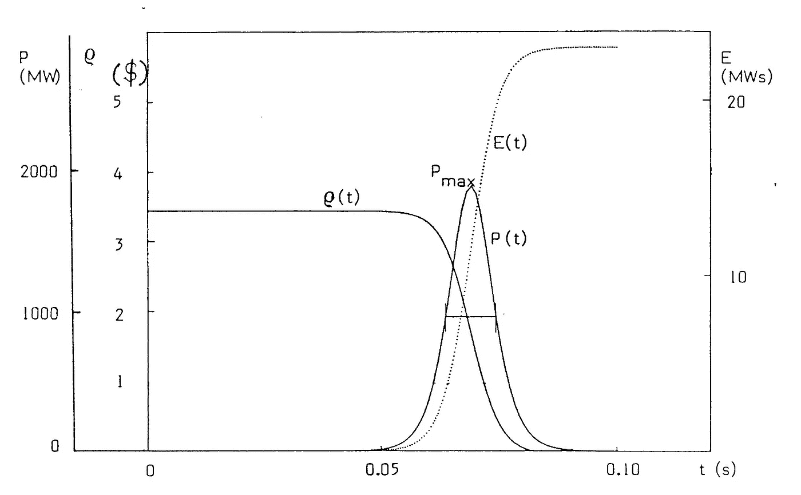

**图二。**脉冲期间反应堆功率、反应性和能量随时间的变化。来源:m .拉夫尼卡

虽然脉冲有许多研究应用，但它特别适合在非常小的规模上模拟核爆炸发出的*辐射*。具体来说，我们正在观察中子和伽马射线如何在原子水平上与电子相互作用。假设你正在设计一个新的电子元件，用来控制核武器系统的某个部分。你有多大把握你的电子设备会在附近的核爆炸中幸存下来？集成电路放在放射性弹头旁边储存 10 年会受到什么损害？这种损坏将如何影响组件的功能？或者，如果你正在设计一个用于新型战斗机的 CPU 芯片呢？当暴露在一定量的辐射下时，由你的 CPU 启动的飞行控制系统会失效吗？你可以看到这些问题是多么的重要。结合这一事实，即真正的核爆炸是一个考验，并有一系列问题(更不用说被全面禁止核试验条约禁止)，你很快就会同意反应堆脉冲是一项关键能力。

> 注意:值得说明的是，这个脉冲只产生辐射。在这种类型的实验中，**没有东西被爆炸**。我们只是将一个样本暴露在一个高度受控的环境中，这个环境是为完成这样的任务而设计的。

操作员可以根据控制棒的反应性“价值”选择脉冲达到的最大功率水平。对于许多核反应堆来说，这种价值是以*美元*为单位来衡量的，由于解释我们为什么使用这种看似怪异的单位超出了本文的范围，如果你愿意，你可以在这里[阅读所有相关内容](https://en.wikipedia.org/wiki/Dollar_(reactivity)#:~:text=A%20dollar%20is%20a%20unit,means%20a%20steady%20reaction%20rate.)。

根据即将进行的实验，可能需要特定的脉冲功率水平。控制棒在堆芯中的位置决定了任何给定时间的功率水平。我从自己在这个反应堆的工作中编译的数据集由这些值和一些其他值组成，如下所述:

*   **日期**。脉冲发生的特定日期时间格式的日期。
*   **估计反应性**。*估计的*脉冲的反应性插入量，单位为美元。这个估计是通过查阅某个控制棒的[积分值](https://ansn.iaea.org/Common/documents/Training/TRIGA%20Reactors%20(Safety%20and%20Technology)/chapter2/physics122.htm)找到的。例子:一个实验者将要求一个价值 2.00 美元的脉冲。操作员将根据所述控制棒的总积分值找到放置控制棒的位置。
*   **杆位置**。堆芯中有四根控制棒—瞬态、垫片 1、垫片 2 和调节棒。在我的数据集中，标记为“跨，S1，S2，注册”，这些值与控制棒在堆芯中的物理位置有关。范围从 0 到 960，其中 0 完全插入内核，960 完全移除。
*   **峰值功率**。单位为 MW。
*   **总能量。**以毫瓦秒计量。
*   **峰值温度**。以摄氏度测量，这是仪表化燃料元件(IFE)达到的峰值温度。一些燃料棒内部嵌有热电偶，用来监测堆芯的温度。
*   计算出的反应性。这是“真实的”反应性值，通常与估计的反应性有一定的差异。它是由反应堆控制台自动计算的。

在这篇文章的其余部分，我将分析数据集，看看我能收集到什么见解。此外，我将应用线性回归机器学习模型，根据*估算的反应性* 和*棒位置*，预测*计算的反应性* 。这个预测模型将帮助我们更准确地使用脉冲功率(在一定程度上——稍后会有更多的想法)，并提高我们实验的有效性和准确性。**我的最终目标是使我们的脉冲在特定样品的辐射暴露量方面更加准确和可重复。**

# **探索性数据分析(EDA)**

我提前清理了数据，所以我就不告诉你细节了。在大多数情况下，清理过程包括从数据集中移除不正确或不完整的条目。我必须识别和清理大量的手工输入错误(打字错误)，以及一些丢失的数据点，我要么完全删除，要么用平均值替换。

一旦我有了干净的数据，我要做的第一件事就是导入相关的库并加载我的数据框架:

```
import pandas as pd
import seaborn as sns
import matplotlib.pyplot as plt
import numpy as npfrom sklearn.model_selection import train_test_split
from sklearn.linear_model import LinearRegression
from sklearn import metrics
from sklearn.metrics import r2_scoredf = pd.read_excel('Pulse_Data_2021_NO_NULL.xlsx', )
```

之后，我总是喜欢使用三个主要函数来学习我的数据的一般特征— *。头()*，*。info()* 和*。描述()。*

*。head()* 只显示了数据帧的前几行，我们可以看到数据的一般结构:

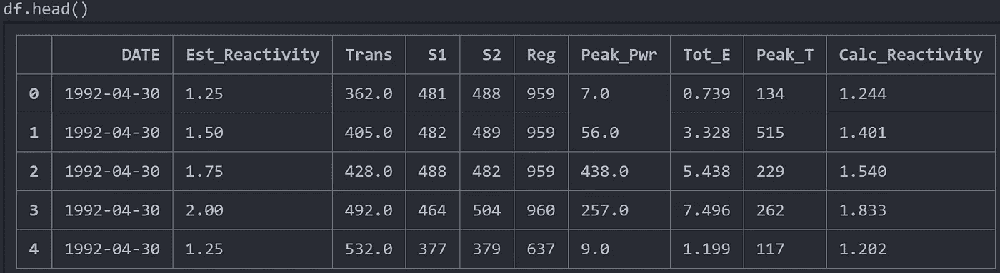

**图 3** 。df.head()输出

*。info()* 输出数据帧中的条目数、列名、每列中的空条目数以及每列的数据类型:

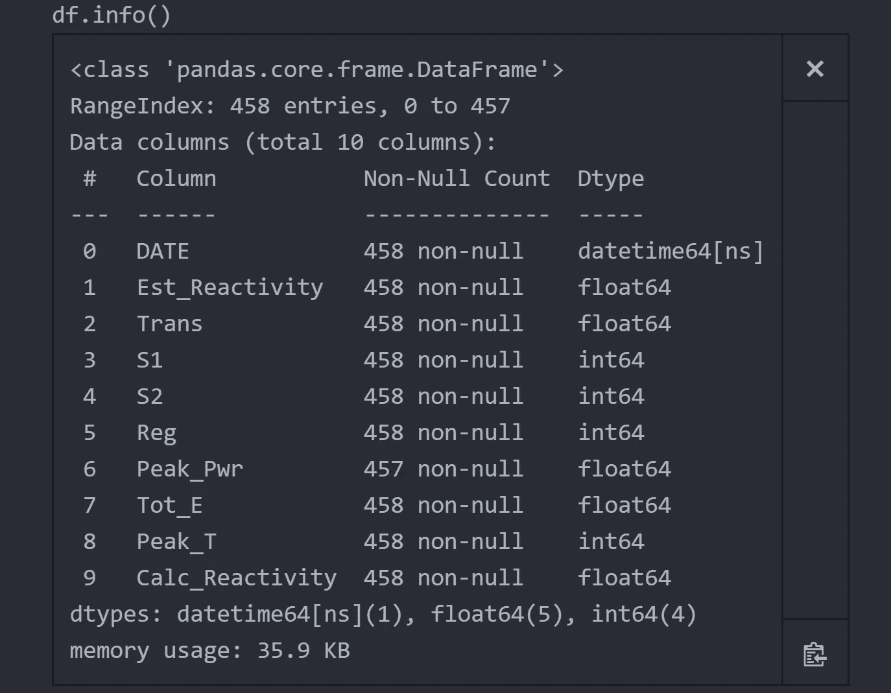

**图 4** 。df.info()输出

还有*。describe()* 提供数据本身的一些汇总分析—均值、标准差、四分位数等。每列的。为了可读性，我喜欢把它调换一下:

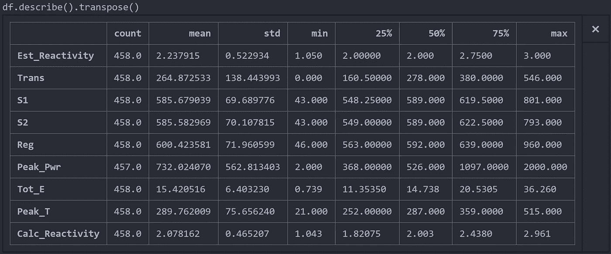

**图 5** 。df.describe()输出

我的 EDA 的下一步是开始绘制任何可能有意义的东西。例如，我认为观察计算的反应性和峰值功率之间的关系会很有趣，所以我做了一个简单的散点图:


**图 6** 。计算反应性与峰值功率的散点图。

这两个变量之间存在明显的指数关系，这与驱动该操作的反应器动力学原理一致。该图也很有用，因为它可以识别潜在的异常点——要么是反应器的怪异行为，要么更有可能是不正确的输入。从这个图表中，我发现了其他需要清理或删除的粗手指条目。

关联热图是另一种可应用于大多数数值数据集的有用工具。**下面的图 7** 描述了哪些列彼此密切相关，值的范围从-1 到 1。

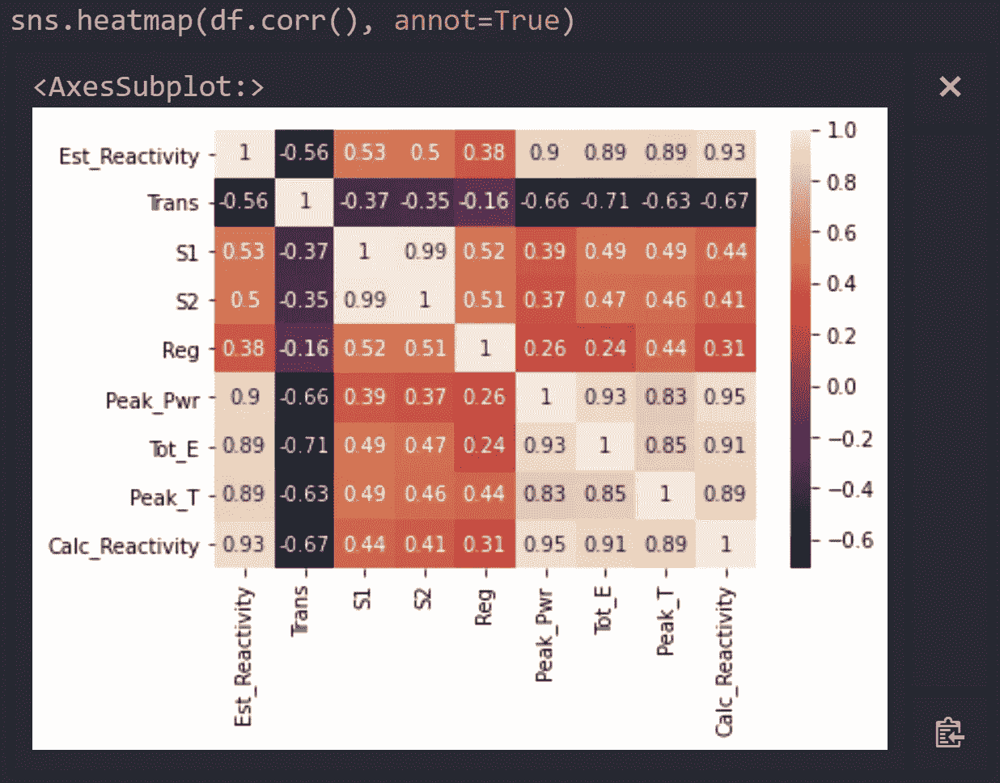

**图七。**关联热图。

要解释此热图，请寻找高值(接近 1)。1 的对角线是热图布局的人工产物，它告诉我每个特性都与自身直接相关。有道理。S1 和 S2 的相关性为 0.99，这也是有道理的，因为这两个控制棒在脉动时几乎总是处于完全相同的垂直位置。我最感兴趣的特性是计算反应性，它与峰值温度、总能量和峰值功率高度相关。这似乎也是合乎逻辑的，因为随着反应性的增加，我预计这些特性也会增加。

由于我试图提高估计反应性值的预测准确性，我的下一步是比较它的分布与计算的反应性。为了做到这一点，我叠加了两个直方图，并做了一些格式化，使它看起来很好:

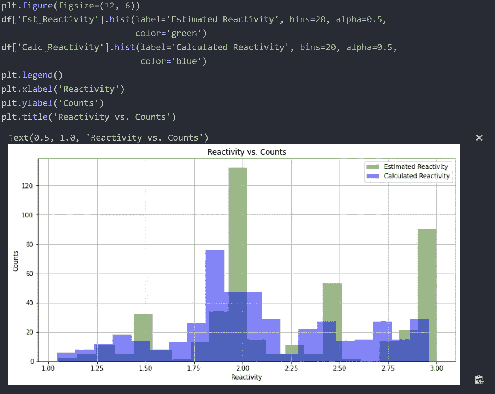

**图 8** 。反应性直方图。

当决定我们想要多大的脉冲时，我们通常使用离散的脉冲反应性值。**图 8** 清楚地反映了这一点，显示$1.50、$2.00、$2.50 和$3.00 是常见的估计值。人们可能会认为，计算出的反应性值在每个估计反应性值周围呈某种正态分布，如蓝色图表所示(尽管不严格)。

再次查看**图 8，**似乎估算的反应性略高于计算的反应性。这意味着，一般来说，如果你请求一个 2.00 美元的脉冲，你实际上得到的值会比这个值少一点。我可以通过简单地减去两列数据并求平均值来量化这一点:

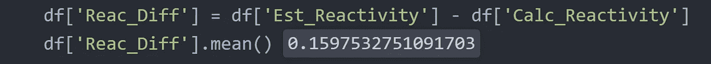

**图九。反应性值的平均差异。**

这表明，平均而言,“真实”计算的反应性比估计的反应性低 0.16 美元。

最后，我生成了一个图表，作为反应堆利用率随时间变化的有趣代理。该反应堆于 1992 年首次启动(又名“进入临界”)，从那时起每年的脉冲数图表提供了一些深入的兔子洞:

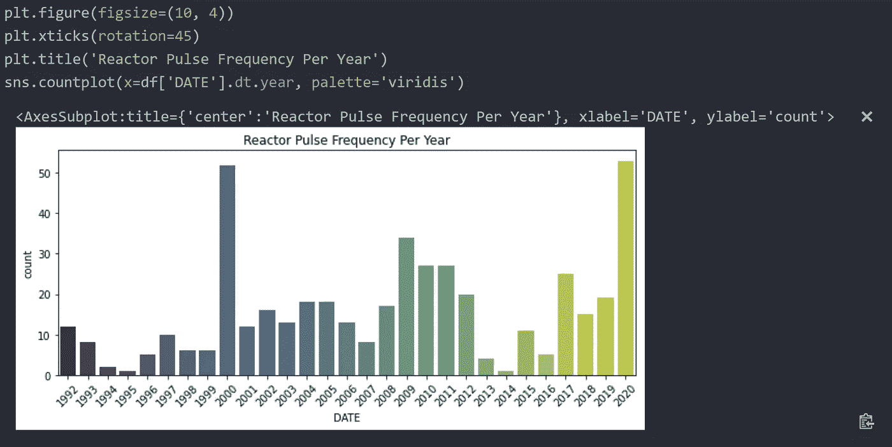

**图 10。**反应堆脉冲频率每年一次。

图 10 中可能出现的问题包括:

*   为什么 1994-1996 年和 2013-2014 年的脉搏如此之少？
*   是否有管理上的变化影响了在该工厂进行的实验类型？
*   是否有任何新的国家或大学研究发展需要额外的脉冲？
*   在 2000 年和 2020-20201 年(现在)发生了什么需要如此多脉冲的实验，为什么在这期间没有这样的实验？

令人惊讶的是，从一些小图表中可以获得如此多的洞察力。

# **预测建模**

预测*计算反应性*的任务适合(双关语)线性回归模型。这被认为是有监督的机器学习模型，因为数据已经被标记(提供 x 和 y 值来训练模型)。它在技术上是一个多元回归模型(其定义包含线性回归)，因为**使用多个独立变量( *Est_Reactivity，Trans，S1，S2，Reg* )来预测因变量( *Calc_Reactivity* )的结果。**

> 注:这个线性回归模型假设因变量和自变量之间的关系是**线性的。**估计反应性与计算反应性明显呈线性相关，但我们的其他独立变量(反式、S1、S2、注册)却并非如此。独立变量之间也存在明显的多重共线性，因为杆的位置(S1、S2、Reg)高度相关。由于这些原因，线性回归模型可能不是最佳选择。需要进一步探索独立变量才能确定，但多项式回归或岭回归可能是一个不错的选择。底线是理解模型的假设和限制以及它们在不同技术中的变化是很重要的。

我首先将数据分为训练集和测试集，以确保对模型进行公正的评估。然后，我实例化模型并拟合数据:

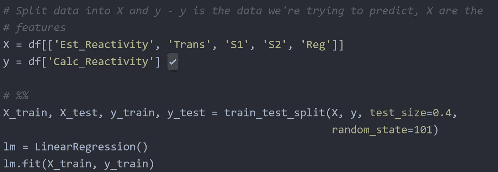

**图 11。**演示训练测试分割和模型拟合的代码。

一旦模型被拟合，我就使用测试数据将模型输出与期望值进行比较。完全直线表示完美的模型:

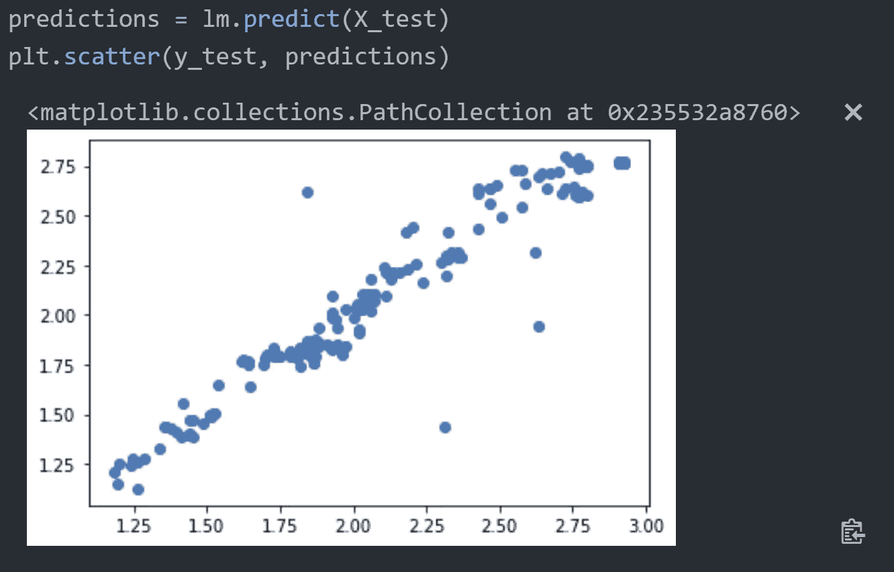

**图 12。**展示模型输出与真实数据的散点图。

除了一些显著的异常值，该模型在准确预测方面做得很好。根据模型的用例，可能值得进一步调查数据，以确定这些异常值来自哪里，以及如何减轻它们以提高模型的准确性。在我的情况下，这个模型就足够了。我甚至可以通过计算模型的 R 平方值来量化“拟合优度”:

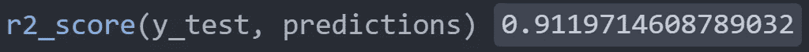

**图 13。** R 平方值为 0.91。

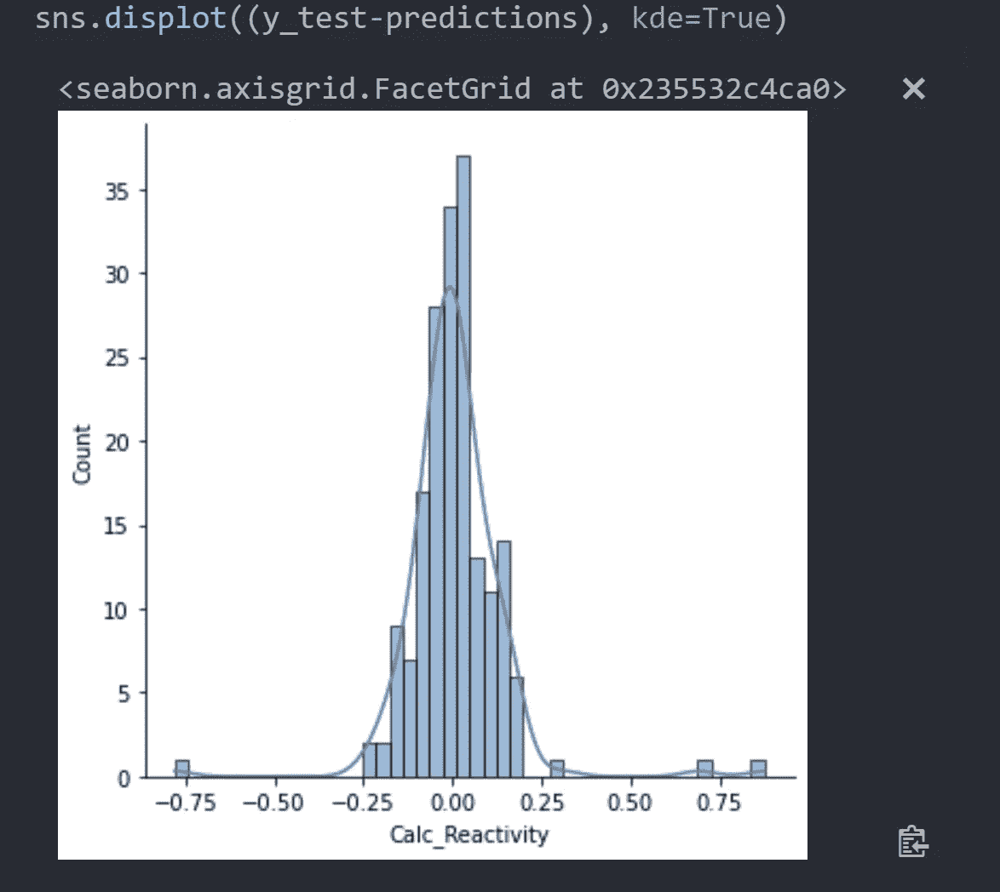

**图 14。**残差图。

r 平方是自变量中可预测的因变量方差的比例。以百分比表示，任何给定脉冲的估计反应性的 91%的变化可以用我们的输入值来解释。要点是，这是一个非常适合我们目的的模型。也就是说，我还可以再做一次检查来了解这个模型。**图 14** 左边是残差直方图，或任何给定数据点和最佳拟合回归线之间的距离。该图表明，随机误差在零附近呈正态分布，这很好。如果不是这样，那么我们的模型和/或数据集可能有问题。同样也有值得注意的异常值，但当用我们令人印象深刻的 R 平方分数来支持时，没什么可担心的。


**图 15。**慢动作记录的脉冲(最初为 240fps)。来源:我(沃克·佩恩)

# 结论(和局限性)

有了这个模型，我现在可以根据控制棒位置和棒价值等反应堆参数准确预测脉冲反应性值。**可重复性对于所有类型的实验都很重要，这个模型将有助于收紧我们的脉冲值，并确保每个受辐射的组件都有相似的辐射暴露。**

> 注意:该模型确实有一些限制，这些限制对于那些具有反应器动力学和操作知识的人来说可能是显而易见的。也就是说，模型不知道以前的操作和极其重要的[裂变产物毒物的积累。随着反应堆的运行，氙-135 随着时间的推移而产生(并被烧掉),并显著影响中子吸收和反应堆行为。](https://www.nuclear-power.net/nuclear-power/reactor-physics/reactor-operation/fuel-burnup/neutron-poisons-reactor-poisoning/#:~:text=Fission%20products%20are%20of%20concern,are%20known%20as%20neutron%20poisons.)
> 
> 编辑:在脉冲前用全新的数据测试模型后，预测的反应性与反应堆控制台计算的“真实”反应性相差不到 3%。成功！

如果你喜欢这篇文章，请随意看看我的其他文章，并在评论中告诉我你的想法。感谢阅读！