# 应用机器学习评估佛罗里达气候驱动的房地产风险(上)

> 原文：<https://towardsdatascience.com/applying-machine-learning-to-assess-floridas-climate-driven-real-estate-risk-part1-60e9a8913b85?source=collection_archive---------39----------------------->

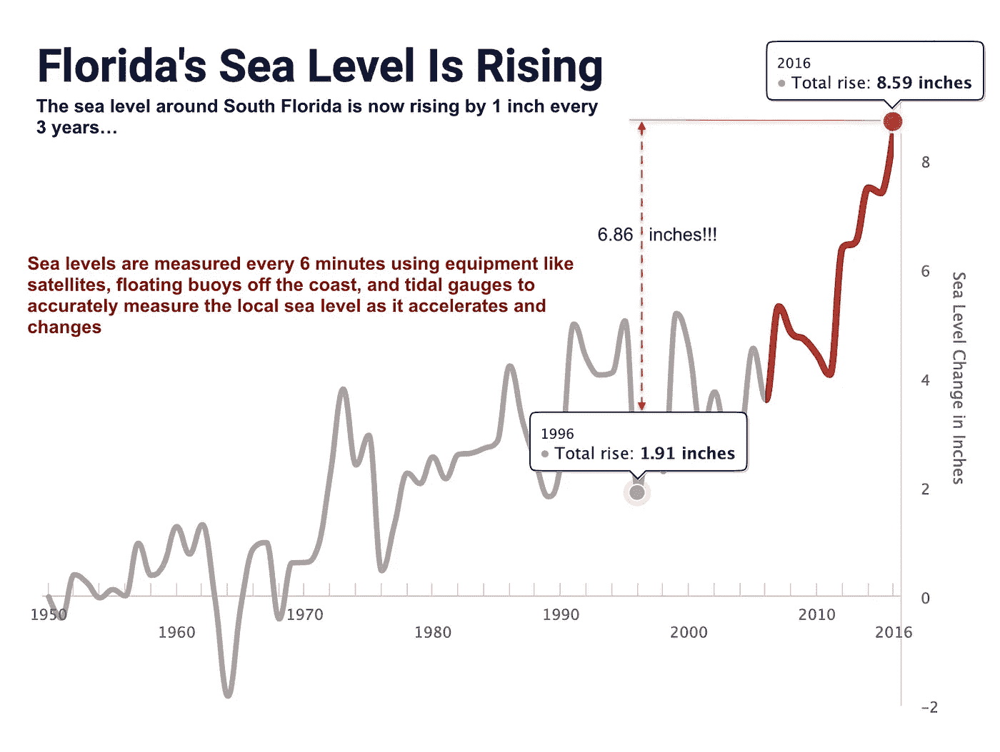

图片由作者创作，灵感来源:[https://sealevelrise.org/states/florida/](https://sealevelrise.org/states/florida/):[自 1950 年以来，佛罗里达群岛周围的海平面已经上升了 8 英寸。它的上升速度在过去的十年里加快了，现在每三年上升一英寸。科学家们知道这一点，因为海平面每 6 分钟测量一次，使用卫星、沿海浮动浮标和验潮仪等设备来精确测量当地海平面的加速和变化](https://sealevelrise.org/states/florida/)

佛罗里达州短暂的气候变化沙皇，首席恢复官 Julia Nesheiwat，为该州设定了一个明确的优先事项:**保护房地产市场。**


图片来源: [JNW21 885，CC BY-SA 4.0](https://en.wikipedia.org/wiki/Julia_Nesheiwat)[https://creativecommons.org/licenses/by-sa/4.0](https://creativecommons.org/licenses/by-sa/4.0)通过维基共享

Nesheiwat 2020 年 1 月的[未发表的]报告 T11 载有旨在保持佛罗里达州最重要的产业房地产的提案。

她的计划提出了更严格的建筑法规，但也提出了更具争议的措施，如向购房者披露洪水风险，提供国家资助的房屋收购，并要求对城市和县进行脆弱性研究。

> “佛罗里达州的沿海社区和地区没有时间可以浪费，需要一个最高级别的合作伙伴来帮助管理和应对迫在眉睫的威胁，”Nesheiwat 写道。

麦肯锡的一项案例研究呼应了 Nesheiwat 对该州大部分地区的可怕预测，包括佛罗里达群岛，但也包括亚特兰蒂斯北部的许多沿海地区。


佛罗里达州维罗海滩的住宅。水下海堤和码头，以及海水浸泡的草坪已经变得司空见惯

> “在近三个月的时间里，斯蒂尔赖特角(Florida Keys neighborhood)215 个家庭的居民被迫仔细计划他们的出游，并找到临时的变通办法来处理难闻的死水——这不是因为下雨，而是因为海平面上升——这使他们的红树林街道看起来更像运河。”— [《纽约时报》](https://www.nytimes.com/2019/11/24/us/florida-keys-flooding-king-tide.html)

麦肯锡报告的作者说，他们估计潮汐洪水频率的预计增加可能导致暴露的房地产在 2030 年贬值 100-300 亿美元，到 2050 年贬值 300-800 亿美元。他们说，到 2050 年，受影响房屋的平均影响预计将增加 15-35%，高于今天的 5%。

> “这是一个保守的估计”，[麦肯锡全球研究所高级研究员，案例研究的合著者 Mekala Krishnan 说。](https://wusfnews.wusf.usf.edu/environment/2020-05-04/sea-rise-wont-sink-all-of-floridas-real-estate-market-experts-say-just-parts-of-it)

根据像麦肯锡这样的报告，普遍的看法似乎是，买家会慢慢地意识到易受洪水影响的房产是糟糕的投资 ***，*** ，而不是一下子放弃受灾严重的地区，如果飓风在与飓风季节重叠的秋季大潮季节袭击，这很容易发生。

"佛罗里达的抵押贷款和市场会继续运转吗？"— [克里希南说 ***是***](https://wusfnews.wusf.usf.edu/environment/2020-05-04/sea-rise-wont-sink-all-of-floridas-real-estate-market-experts-say-just-parts-of-it) ，前提是该邦 ***确实做了***Nesheiwat 的气候报告中建议的那种事情。

> “如果我们这样做了，我认为风险是可以控制的，”她说。但这并不意味着该州的每一个口袋都会成功。

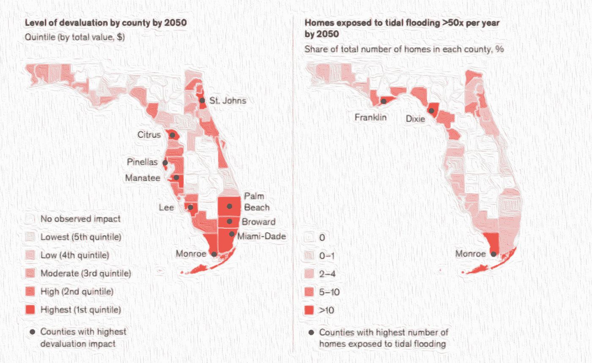

图片由作者创作，灵感来源:[https://sealevelrise.org/states/florida/](https://sealevelrise.org/states/florida/)

# 数据集和机器学习方法

有许多优秀的媒体文章概述了如何将 ML 应用于房地产估价，因此为了提供原创内容，本文的剩余部分将探索一种新的方法，使用一个前所未见的房地产数据集。这样做的目的是确认或否认南佛罗里达房地产价格已经受到海平面上升(SLR)驱动的气候风险的打击。

> “我们的结果表明，佛罗里达州沿海房地产出现了脱节:从 2013 年到 2018 年，受海平面上升(SLR)影响最大的社区的房屋销量相对于受 SLR 影响较小的地区下降了 16%至 20%，尽管它们的销售价格同步增长。然而，在 2018—2020 年间，这些风险市场的相对价格最终比峰值下降了约 5%。贷款人的行为无法调和这些模式，因为我们表明，全现金和抵押贷款融资的购买都出现了类似的收缩，几乎没有证据表明贷款拒绝或证券化有所增加。”—[国家经济研究局](https://www.nber.org)最近[发表报告](https://www.nber.org/papers/w27930)

我们想要预测的目标是“**给定物业的物业价值变化率与附近类似物业的变化率的差异**”。理论上，对于具有高度差异的属性，我们应该发现这种差异的很大一部分可以用洪水风险来解释。

为了计算目标值，我们将使用以下等式:

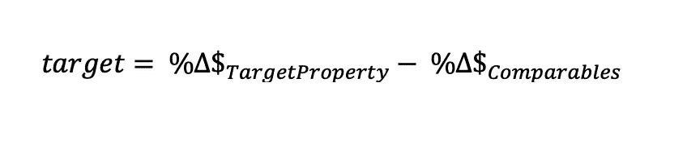

简而言之，我们希望预测每项资产与其相邻资产(可比资产)之间的价格变化率差异。

上述等式实际上可以用以下等式实现:

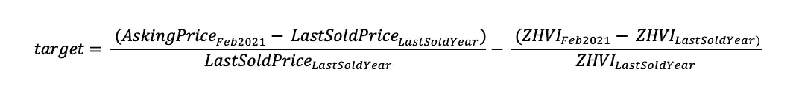

在数据集中，大约 66%的物业具有较低的洪水风险(在[洪水因子](https://floodfactor.com)评分表上小于 5 分)，大约。33%有很高的洪水风险。

我们将通过构建一个 ML 模型，然后对其应用各种模型解释工具(如要素重要性和 SHAP ),来测试高洪水风险分数是财产价值变化率差异的强预测因素这一假设。

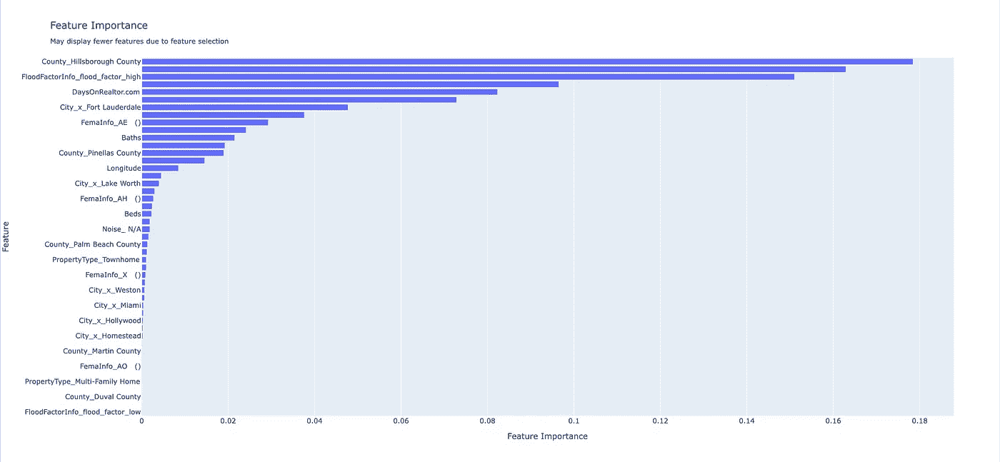

使用 [EvalML AutoML 库](https://evalml.alteryx.com/en/stable/index.html)，突出训练有素的 XGBOOST 管道的重要性。作者图片

## 本博客使用的所有代码和数据都可以在 github 上[获得，这里](https://github.com/mikewcasale/colorframe-blogs)****。****

## **收集数据**

**除了标准的房地产功能，如卧室，浴室，面积等。，数据还包括:**

*   **每个酒店 3 张图片(也包含在 Github repo 中)**
*   **2 份公布的洪水风险评级，一份来自联邦应急管理局，一份来自第一街的洪水评分**
*   **截至 2021 年 2 月(上周)的第三周，每处房产均在 realtor.com 挂牌出售，并公布了要价**
*   **每处房产都附有最匹配的 Zillow 房屋价值指数 ZHVI(根据邮政编码+卧室数量进行汇总和合并)，从而得出附近房屋的月度时间序列指数价格，可追溯到 1996 年**
*   **此外，许多其他公共数据集，如相关地区的人口普查数据，都被附加到每个属性中**

**该数据集包括 1600 多处南佛罗里达房地产的记录，每处都有 650 多列，还包括洪水风险信息、人口统计信息、列表图像、列表描述、房地产上市时间、销售历史以及许多其他相关信息。**

**要素的推断数据类型**

## **加载属性数据**

**在建立模型之前，我们需要清理原始数据。因为清理所有东西很费时间，所以我们在这里做一个“快速通过”,但是为了获得更多的训练数据，还会有额外的数据需要清理。请随时这样做，并提供一个链接！**

```
import pandas as pd
import evalml
from evalml.preprocessing import load_dataproperty_data = pd.read_csv('../data/raw/property.csv').reset_index() 
```

## **加载人口统计数据**

**[geo codeio](https://www.geocod.io)提供了一些数据集，我们可以轻松地将其添加到我们的酒店数据中，以供其他研究和使用:**

*   **`The US Census Bureau`**
*   **`Local city, county, and state datasets from OpenAddresses`**
*   **`OpenStreetMap`**
*   **`GeoNames`**
*   **`CanVecPlus by Natural Resources Canada`**
*   **`StatCan`**
*   **`Legislator information from the UnitedStates project on GitHub`**

```
demographics_data = pd.read_csv('../data/raw/demographics.csv', low_memory=False).reset_index()
```

## **合并数据**

**数据已经过预排序和重新索引，因此我们可以简单地根据索引 id 进行合并。**

```
merged = pd.merge(property_data, demographics_data, on='index')
```

**注意单词`sqft`包含在列`Area`中，因此我们将识别所有包含`sqft`的行，忽略不包含的行。注意:不包含`sqft`的行将需要在单独的工作流中进行清理。就目前而言，我们将只关注清理大部分数据，稍后我们可以回来清理那些掉队的数据。**

```
word = 'sqft'
new_df = merged[merged["Area"].str.contains(word) == True]
```

**其他立柱需要类似的清洁，例如`Beds`、`FloodInfo`和`YearBuilt`。**

```
word = 'bed'
new_df = new_df[new_df["Beds"].str.contains(word) == True]word = 'Year Built'
new_df = new_df[new_df["YearBuilt"].str.contains(word) == True]word = 'Flood Factor'
new_df = new_df[new_df["FloodInfo"].str.contains(word) == True]
```

**`Style`栏完全是一团乱麻，因为许多/大部分列表都不包含这些信息。现在，我们将简单地放弃它，以节省解析混乱的时间。**

```
new_df = new_df.drop('Style',axis=1)
```

## **使用[特征工具](https://featuretools.alteryx.com/en/stable/index.html)加速数据清理。**

**[Featuretools](https://featuretools.alteryx.com/en/stable/index.html) 库有一些很棒的数据清理工具，我们将使用它们来节省时间。具体来说:**

*   **`remove_low_information_features`:仅保留至少有两个唯一值且不全为空的特征**
*   **`remove_highly_null_features`:从特征矩阵中删除高于空值阈值的列。**
*   **`remove_single_value_features`:删除特征矩阵中所有值都相同的列..**
*   **`remove_highly_correlated_features`:删除特征矩阵中与另一列高度相关的列。**

```
from featuretools.selection import remove_low_information_features, remove_highly_null_features, remove_single_value_features, remove_highly_correlated_featuresdf = new_df.copy()"""Select features that have at least 2 unique values and that are not all null"""df_t = remove_low_information_features(df)"""Removes columns from a feature matrix that have higher than a set threshold"""df_t = remove_highly_null_features(df_t)"""Removes columns in feature matrix where all the values are the same."""df_t = remove_single_value_features(df_t)"""Removes columns in feature matrix that are highly correlated with another column."""df_t = remove_highly_correlated_features(df_t)
```

## **清理洪水风险数据**

**`Flood Risk Data`是这项研究的一个突出特点，所以我们想稍微清理一下格式。**

```
df_t[['FemaInfo','FloodFactorInfo']] = df_t.FloodInfo.str.split(' • ', expand=True) 
df_t['FloodFactorInfo'] = df_t['FloodFactorInfo'].astype(str).str.replace('/10 New','').str.replace('Flood Factor ','')
df_t['FemaInfo'] = df_t['FemaInfo'].astype(str).str.replace('FEMA Zone ','').str.replace('(est.)','')
```

# **清理数字特征**

**我们不能重新格式化像`Area`和`Baths`和`Year Built`和`Days on Realtor.com`这样的东西，只要它们包含文本字符，所以我们需要删除它们以便正确地格式化数据集来训练我们的模型。**

```
df_t['Beds'] = df_t['Beds'].str.replace('bed','')
df_t['Baths'] = df_t['Baths'].str.replace('bath','')
df_t['Noise'] = df_t['Noise'].str.replace('Noise:','')
df_t['PropertyType'] = df_t['PropertyType'].str.replace('Property Type','')
df_t['DaysOnRealtor'] = df_t['DaysOnRealtor'].str.replace('Days on Realtor.com','').str.replace('Days','')
df_t['Area'] = df_t['Area'].str.replace('sqft','').str.replace(',','')
df_t['Price'] = df_t['Price'].str.replace('$','').str.replace(',','').str.replace(',','')
df_t['PricePerSQFT'] = df_t['PricePerSQFT'].astype(str).str.replace(',','')
df_t['YearBuilt'] = df_t['YearBuilt'].astype(str).str.replace('Year Built','')
```

## **拆分`LastSoldAmt`和`LastSoldYear`功能**

**这些列一起包含在抓取的数据中，因此我们需要相应地将它们分开，以便正确地将它们格式化为模型特征。**

```
df_t[['LastSoldAmt','LastSoldYear']] = df_t.LastSold.str.split(' in ', expand=True) 
```

## **清理`LastSoldAmt`**

**`LastSoldAmt`数据使用文本字符来表示千和百万，然而，为了我们的目的，我们需要用它们的数字亲属来替换它们。**

```
df_t['LastSoldAmt'] = df_t['LastSoldAmt'].astype(str).str.replace('k','000')
df_t['LastSoldAmt'] = df_t['LastSoldAmt'].astype(str).str.replace('M','000000').str.replace('.','').str.replace('Last Sold','').str.replace('$','').str.replace('000000','0000')
```

## **删除不必要的列并保存预处理数据**

```
df_t = df_t.drop('LastSold',axis=1)
df_t = df_t.drop('index',axis=1)
df_t = df_t.reset_index()
drop_cols = [col for col in df_t.columns if 'url' in col.lower() or ' id' in col.lower()]
X_t = df_t
X_t = X_t.drop(drop_cols,axis=1)
t_datapath = '../data/processed/preprocessed.csv'
X_t.to_csv(t_datapath,index=False)
```

## **下载属性图像供以后使用**

**数据集中的每个属性都有 3 个包含图片列表的 URL。虽然这些图像并不直接相关，但我们将在以后的博客文章中使用它们。现在，我们将简单地下载它们。**

```
import requestsdef download_images(indx):
    file_name = str(indx)+'.png'
    urldata = df_t[df_t['index']==indx]
    url1 = df_t['Image_URL'].values[0]
    url2 = df_t['Image_URL1'].values[0]
    url3 = df_t['Image_URL2'].values[0]
    urls = [url1,url2,url3]
    ct=0
    for url in urls:
        response = requests.get(url)
        with open('../data/images/_'+str(ct)+'_'+file_name, "wb") as file:
            file.write(response.content)
            file.close()
        ct+=1

df_t['index'].apply(download_images)
```

## **合并 Zillow 数据**

## **ZHVI 用户指南**

**Zillow 最常引用的指标之一是 ZHVI，Zillow 房屋价值指数。它告诉我们在给定的地理区域(大城市，城市，邮政编码等)典型的房屋价值。)，现在和将来，针对特定的资产类型和规模。关于 ZHVI 的一般信息，请参考[这个方法指南](https://www.zillow.com/research/zhvi-user-guide/)和这个轻松的视频。**

**我们将合并所创建的键，该键连接了区域邮政编码和`zipbeds`中的房产卧室数量:**

```
zillow1beds = pd.read_csv('../data/raw/zillow1bed.csv')
zillow1beds['zipbeds'] = zillow1beds['RegionName'].astype(str)+'_'+str(1)zillow2beds = pd.read_csv('../data/raw/zillow2bed.csv')
zillow2beds['zipbeds'] = zillow2beds['RegionName'].astype(str)+'_'+str(2)zillow3beds = pd.read_csv('../data/raw/zillow3bed.csv')
zillow3beds['zipbeds'] = zillow3beds['RegionName'].astype(str)+'_'+str(3)zillow4beds = pd.read_csv('../data/raw/zillow4bed.csv')
zillow4beds['zipbeds'] = zillow4beds['RegionName'].astype(str)+'_'+str(4)zillow5beds = pd.read_csv('../data/raw/zillow5bed.csv')
zillow5beds['zipbeds'] = zillow5beds['RegionName'].astype(str)+'_'+str(5)zillowdata = pd.concat([zillow1beds, zillow2beds, zillow3beds, zillow4beds, zillow5beds])# load preprocessed data
t_datapath = '../data/processed/preprocessed.csv'target = 'Price'#set to None for production / actual use, set lower for testing
n_rows=None#set the index
index='index'X, y = load_data(t_datapath, index=index, target=target, n_rows=n_rows)y = y.reset_index().drop('index',axis=1).reset_index()[target]
X_t = X.reset_index().drop('index',axis=1).reset_index()
X_t[target]=ydf_t['LastSoldDate'] = '1/31/' + df_t['LastSoldYear'].astype(str).str[2:4]
df_t['zipbeds'] = df_t['Zip'].astype(str).str.replace('zip_','')+'_'+df_t['Beds'].astype(str)
zipbeds = list(set(df_t['zipbeds'].values))
zillowdata['zipbeds'] = zillowdata['zipbeds'].astype(str)
df_t['zipbeds'] = df_t['zipbeds'].astype(str)Number of Features
Categorical                  60
Numeric                     640Number of training examples: 1071
Targets
325000     1.49%
450000     1.21%
350000     1.21%
339000     0.93%
349900     0.84%
           ...  
245000     0.09%
5750000    0.09%
74995      0.09%
2379000    0.09%
256000     0.09%
Name: Price, Length: 567, dtype: object Columns (5,9,23,700) have mixed types.Specify dtype option on import or set low_memory=False.df_t = pd.merge(df_t, zillowdata, on='zipbeds')
```

## **计算每个属性的变化率及其`comparables`**

**在房地产中，`comparable`是附近具有相似特征的房产，例如相同数量的卧室。在我们的案例中，对于我们在`zipbeds`合并的每一处房产，我们希望训练一个模型来预测价格变化率与附近可比价格变化率之间的差异。为此，我们将找到目标资产的`LastSoldDate`列，并查找从该日期到现在相应的 ZHVI 变化率。**

```
X_t = df_t.copy()time_series_cols = [col for col in X_t.columns if '/' in col and 'Percentage' not in col and 'Value' not in col and 'Margin of error' not in col and 'Metro' not in col and col != '1/31/21']l = []
for ct in range(len(X_t)):
    try:
        indx = X_t['index'].values[ct]
        last_sold_date = X_t['LastSoldDate'].values[ct]
        zillow_price = X_t[last_sold_date].values[ct]
        X_ts = X_t[X_t['index']==indx]
        X_ts['zillow_price'] = zillow_price
        X_ts['zillow_price_change'] = X_ts['1/31/21'].astype(float) - X_ts['zillow_price'].astype(float)
        X_ts['zillow_price_change_rate'] = X_ts['zillow_price_change'].astype(float) / float(2021.0 - X_ts['LastSoldYear'].astype(float))
        X_ts['zillow_price_change_percent'] = X_ts['zillow_price_change'].astype(float) / X_ts['zillow_price'].astype(float)
        l.append(X_ts)
    except: pass

df = pd.concat(l)df['last_sold_price_change'] = df['Price'].astype(float) - df['LastSoldAmt'].astype(float)
df['last_sold_price_change_percent'] = (df['Price'].astype(float) - df['LastSoldAmt'].astype(float)) / df['LastSoldAmt'].astype(float)
df['last_sold_price_change_rate'] = df['last_sold_price_change'].astype(float) / float(2021.0 - X_ts['LastSoldYear'].astype(float))
df['yearly_price_delta'] = df['last_sold_price_change_rate'].astype(float) - df['zillow_price_change_rate'].astype(float)
```

## **定义我们将训练模型预测的目标变量。**

**对于我们最初的博客条目，我们将使用特性`yearly_price_delta_percent`作为我们的目标变量。其定义如下:**

```
df['yearly_price_delta_percent'] = df['last_sold_price_change_percent'].astype(float) -  df['zillow_price_change_percent'].astype(float)
```

## **最终清理和保存**

**在一些数字列中还有一些零散的文本字符，所以请删除它们，然后保存。**

```
df = df.drop(time_series_cols, axis=1)
df =df[df['LastSoldAmt'] != 'Property TypeTownhome']
df = df[df['LastSoldAmt'] != 'Property TypeSingle Family Home']
df.to_csv('../data/processed/zillow_merged.csv',index=False)
```

## **使用 AutoML 进行基准测试**

**虽然原始数据集要大得多，但出于本文的目的，我们将重点关注较小的要素样本。**

**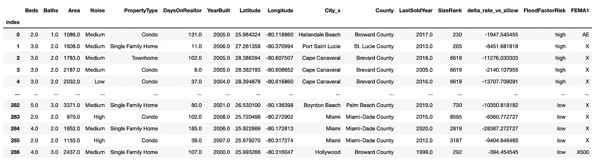**

**作者图片**

**在深入研究 ColorFrame 之前，有必要使用传统的表格建模算法(如 XGBOOST)获得目标数据可预测性的基线，以便我们可以比较 color frame 的性能。但是我们的目标特征是什么呢？**

**记住，为了计算目标值，我们使用以下等式:**

****

**简而言之，我们希望预测每项资产与其相邻资产(可比资产)之间的价格变化率。**

**上述等式实际上可以用以下等式实现:**

****

**[国家经济研究局](https://www.nber.org)最近[发表了一份报告](https://www.nber.org/papers/w27930)，我们将用它作为规划我们的方法的起点和参考。可以肯定的是，这里的目的是从一个非常普遍的意义上看他们做了什么*，而不是重复他们的研究。我们的研究将使用完全不同的方法和数据。***

***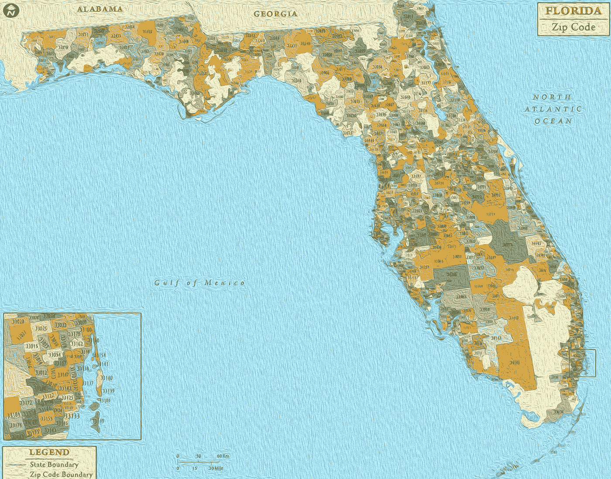***

***佛罗里达邮政编码。图片由作者创作，灵感来自[来源](https://www.amazon.com/Florida-Zip-Code-Map-Laminated/dp/1635973775/ref=pd_sbs_3?pd_rd_w=EXUEf&pf_rd_p=527ea27c-adf6-4b67-9c5f-265eb29e0622&pf_rd_r=7ZNZ131SXSN4629TK83S&pd_rd_r=95794ca9-21bf-49a6-a262-7edeac87e399&pd_rd_wg=e78wA&pd_rd_i=1635973775&psc=1)***

## ***假设***

***我们的假设是，如果确实存在与高洪水风险相关联的强大/重要的价格影响，那么公布的洪水风险评级/分数，例如第一街的洪水因素，应该是高洪水风险房产的最重要的预测特征之一。***

***为了测试这个假设，我们开始使用 EvalML 的 AutoML 特性构建一个基本的管道。***

***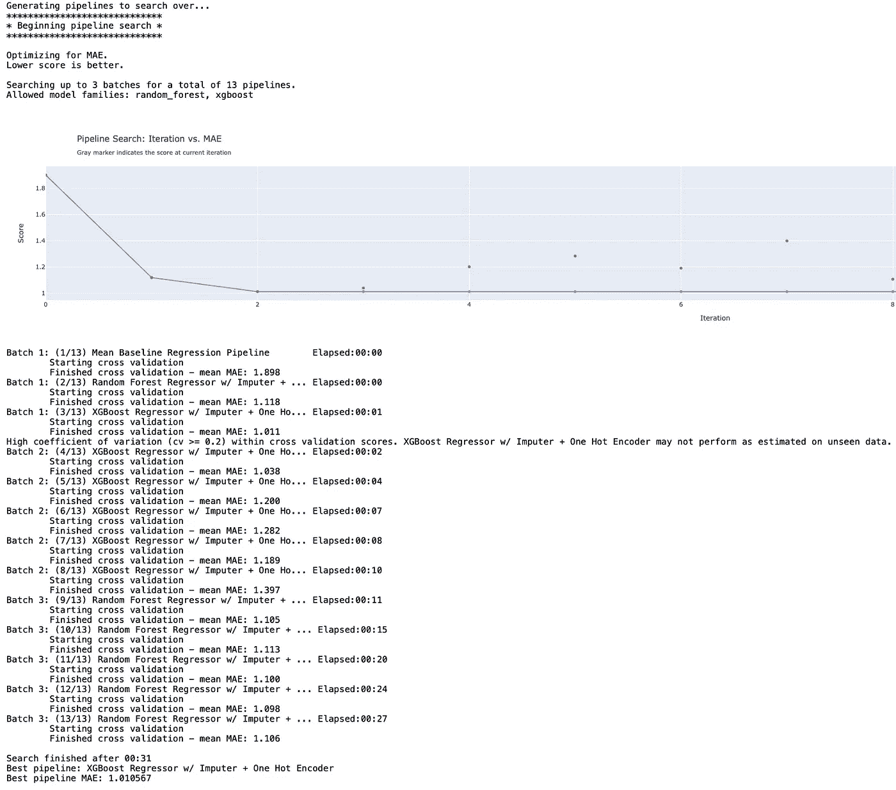***

***通过 EvalML 进行 AutoML。作者图片***

## ***特征重要性***

```
*best_pipeline.feature_importance*
```

***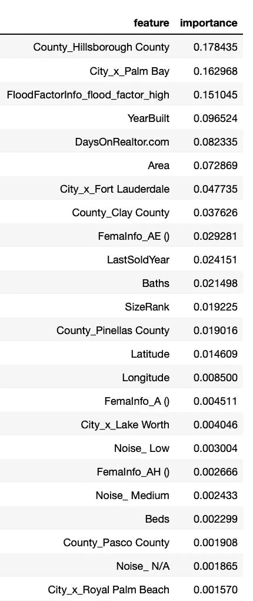***

***功能重要性。作者图片***

***我们可以获得与最终管道的每个特征相关联的重要性。***

***很容易看出，正如所料，第一街的洪水因子分数实际上显示在最重要的要素顶部附近！哇！***

***我们还可以计算和绘制[管线的排列重要性](https://scikit-learn.org/stable/modules/permutation_importance.html)。***

```
*from evalml.model_understanding.graphs import graph_permutation_importance
graph_permutation_importance(best_pipeline, X_holdout, y_holdout, 'MAE')*
```

***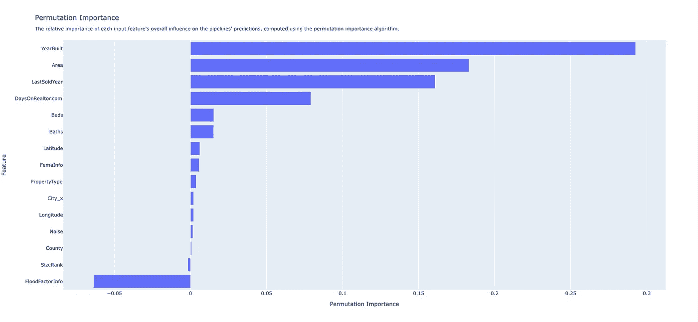***

***排列重要性。作者图片***

# ***解释排列的重要性***

> ***“排列特征重要性是一种模型检验技术，当数据为表格形式时，可用于任何符合[的](https://scikit-learn.org/stable/glossary.html#term-fitted) [估计器](https://scikit-learn.org/stable/glossary.html#term-estimator)。这对于非线性或不透明的[估计器](https://scikit-learn.org/stable/glossary.html#term-estimators)尤其有用。置换特征重要性被定义为当单个特征值被随机打乱 [1](https://scikit-learn.org/stable/modules/permutation_importance.html#id2) 时模型得分的减少。该过程打破了特征和目标之间的关系，因此模型分数的下降指示了模型对特征的依赖程度。这种技术受益于模型不可知，并且可以用特征的不同排列进行多次计算。”— [sklearn](https://scikit-learn.org/stable/modules/permutation_importance.html)***

***在解释排列的重要性时，顶部的值被认为是最重要的特征，底部的值最不重要，这些值表明每个特征的随机排列会降低多少模型性能(在这种情况下，使用“平均绝对误差”作为性能度量)。***

***在上图中，我们立即看到了 FloodFactorInfo 特性的负值。虽然这可能意味着我们在上面看到的高特征重要性只不过是随机的，但重要的是要注意排列重要性非常容易受到特征相关性的影响。***

***为了解决相关性干扰的可能性，让我们用布尔类型的`FloodFactorHigh=True/False`替换`FloodFactorInfo_flood_factor_high/low`特性。让我们也放弃`FemaInfo`功能，因为它可能会干扰`FloodFactorHigh`。然后，让我们进行相关性研究，以消除任何其他潜在的冲突。***

***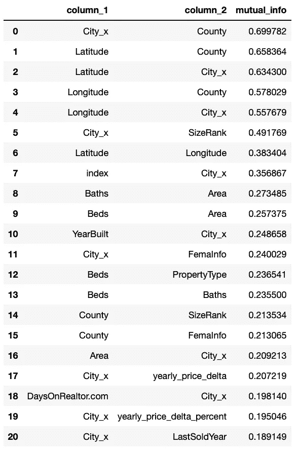***

***使用[木工](https://woodwork.alteryx.com/en/stable/)数据表的 mutual_information()工具进行特征关联研究。作者图片***

***在上面的相关性表中，我们可以看到一些要素的相关性超过 50%，因此，要深入了解排列图中发生的情况，让我们尝试移除 City_x 和 County，这应该会移除所有大于 50%的相关性。***

***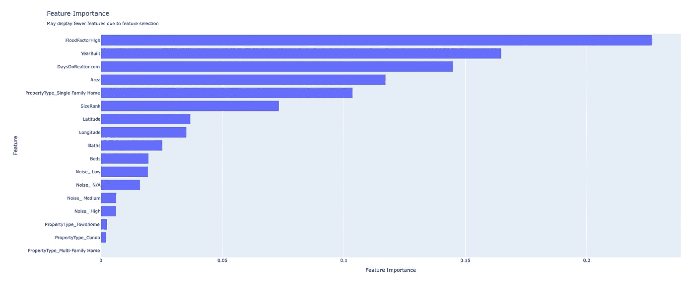***

***移除 City_x 和 County 要素后，修改了要素的重要性，以降低要素之间的相关性。作者图片***

***我们可以在修改后的特征重要性图表中看到，`FloodFactorHigh`成为 XGBOOST 模型中最重要的特征，但是排列重要性呢？***

***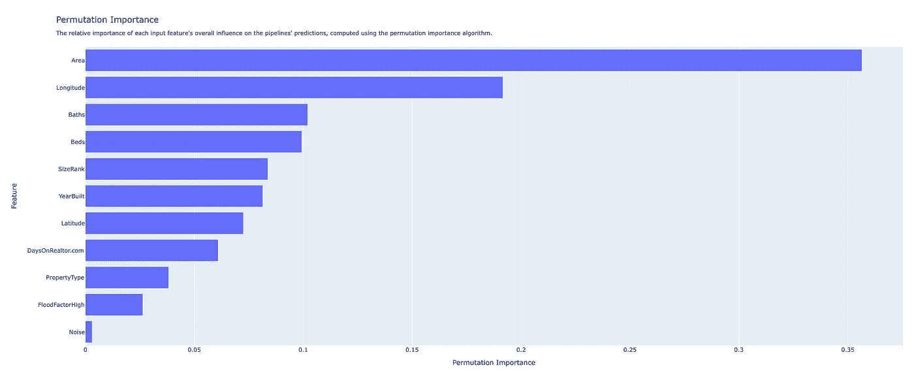***

***移除 City_x 和 County 要素后，修改了排列重要性，以降低要素之间的相关性。作者图片***

***在修改后的排列图中，我们可以看到虽然`FloodFactorHigh`仍然接近底部，但它不再是负的，这比之前的情况有所改善。现在，最重要的排列是`Area`后接`Longitude.`，这个结果看起来至少是合理的，但就个人偏好而言，我倾向于避免过度依赖排列，因为它对特征相关性非常敏感，在处理房地产特征时，这在很大程度上是不可避免的，尤其是在使用较小的数据样本时。***

***让我们转向 SHAP 图书馆，看看我们是否能获得关于我们的模型及其特性重要性的任何其他见解…***

# ***带有 TreeExplainer 的树集成示例(XGBoost/light GBM/CatBoost/scikit-learn/py spark 模型)***

******

***图片来源: [SHAP](https://github.com/slundberg/shap)***

***SHAP 可以解释任何机器学习模型的输出，它的超快速 C++实现支持 XGBoost，LightGBM，CatBoost，scikit-learn 和 pyspark tree 模型，所以让我们试试吧:***

```
*import xgboost
import shap# load JS visualization code to notebook
shap.initjs()# train XGBoost model
model = xgboost.train(best_pipeline.parameters['XGBoost Regressor'], xgboost.DMatrix(X_ttrain, label=y_train.to_series()))# explain the model's predictions using SHAP
# (same syntax works for LightGBM, CatBoost, scikit-learn and spark models)
explainer = shap.TreeExplainer(model)
shap_values = explainer.shap_values(X_ttest)*
```

***现在我们已经创建了解释器对象，让我们制作一些可解释的情节…***

```
*# visualize the first prediction's explanation (use matplotlib=True to avoid Javascript)
shap.force_plot(explainer.expected_value, shap_values[0:1], X_ttest.iloc[0:1])*
```

***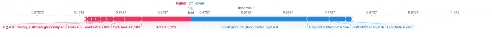***

***SHAP 情节。作者图片***

***上面的解释显示了将模型输出从基础值(我们传递的训练数据集的平均模型输出)推送到模型输出的每个功能。将预测推高的特征显示为红色，将预测推低的特征显示为蓝色(关于力图的细节可以在这里找到:[自然 BME 论文](https://rdcu.be/baVbR))。***

```
*# visualize the test set predictions
shap.force_plot(explainer.expected_value, shap_values, X_ttest)*
```

***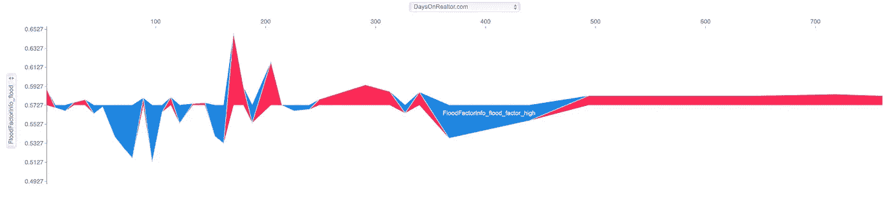***

***SHAP 情节。作者图片***

***为了了解哪些特征对模型最重要，我们可以绘制每个样本的每个特征的 SHAP 值。下图按所有样本的 SHAP 量值总和对要素进行排序，并使用 SHAP 值显示每个要素对模型输出的影响分布。颜色代表特征值(红色高，蓝色低)。例如，这表明高`FloodFactorInfo_flood_factor_high`会增加目标房屋和 Zillow 房屋价值指数之间的预测价格差异。***

```
*# summarize the effects of all the features
shap.summary_plot(shap_values, X_ttest)*
```

***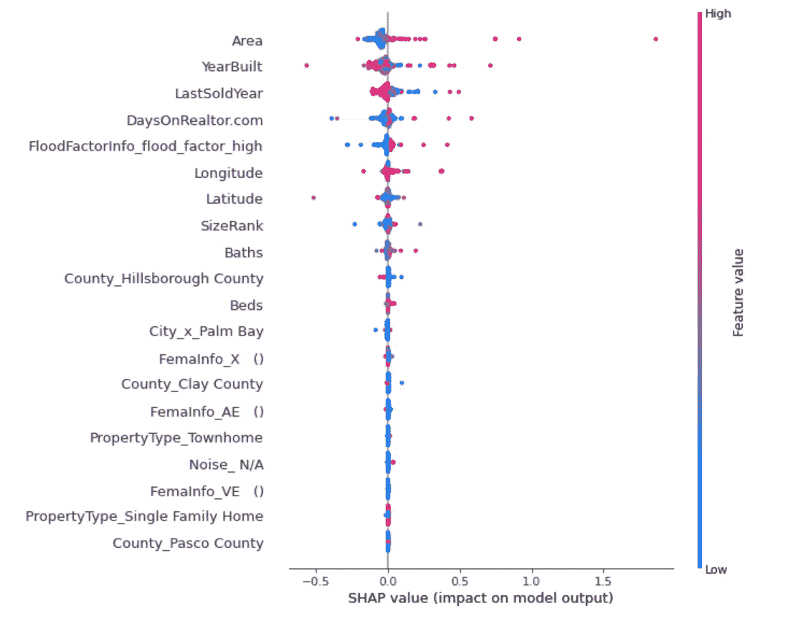***

***SHAP 情节。作者图片***

***要了解单个要素如何影响模型的输出，我们可以绘制该要素的 SHAP 值与数据集中所有示例的要素值的关系。由于 SHAP 值表示要素对模型输出变化的责任，因此下图表示随着`DaysOnRealtor.com`的变化，预测房价的变化。单一值`DaysOnRealtor.com`的垂直离差表示与其他特征的相互作用效应，在本例中为`FloodFactorInfo_flood_factor_high`***

```
*shap.dependence_plot("DaysOnRealtor.com", shap_values, X_ttest, 
                     interaction_index="FloodFactorInfo_flood_factor_high"
                    )*
```

***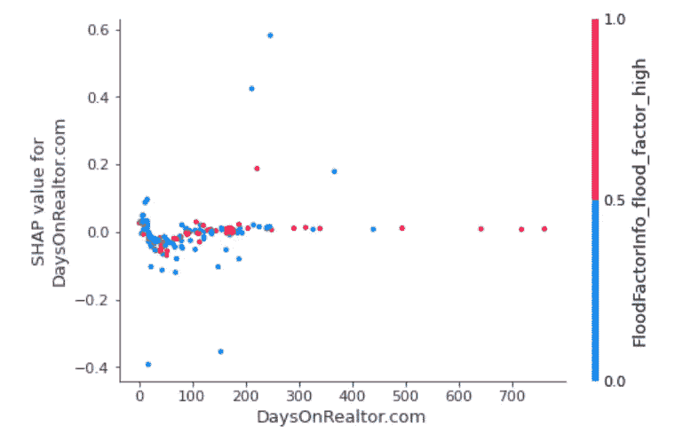***

***SHAP 情节。作者图片***

# ***关键要点***

1.  ******flood factor info*功能是预测给定资产与其可比资产之间价格变化率差异的最重要功能之一。**这种重要性意味着佛罗里达房地产价格已经受到气候变化风险的影响。***
2.  *****因为用于计算 *FloodFactorInfo* 特征的方法特定于每个物业，而 FEMA 洪水等级则不是，因此 FEMA 洪水等级的预测性较低是有道理的。**请注意，联邦应急管理局计划大约在 2014 年发布第一个变更。50 年后的 2021 年秋天，对未来有什么想法？***
3.  *****与 *FloodFactorInfo* 特征是否有其他可能的关联，可以间接解释这些结果，比如靠近海洋或运河？**因为我们已经包含了纬度+经度和其他位置感知功能，所以我们认为这些功能几乎同样重要，如果是这样的话。***

# ***最后的想法***

***更多使用该数据集的相关帖子即将发布！留意使用 ***彩色框架*** 的额外分析，这是一种受 SuperTML……启发的新颖的计算机视觉方法***

***房地产投资者一定要注意这一点和相关的研究结果。在大多数情况下，投资者会根据当地的发展趋势来考虑位置、当前资产估值和潜在上涨空间等因素。但是，越来越多的精明投资者开始分析环境事件和影响，这些类型的考虑正在迅速正式成为标准，如由气候相关财务信息披露(TCFD)任务组(T8)提出的标准。重要的是要意识到这些变化和事件对房地产投资的影响。***

***海平面上升和野火等气候风险对住宅和商业建筑构成重大威胁，并对房地产估价产生负面影响。除了造成财产损失，气候事件还会导致昂贵的保险、维护和运营成本。在最坏的情况下，自然灾害可能导致完全的财产损失和破产的保险供应商。令人欣慰的是，在整个房地产投资行业，围绕气候风险的意识似乎有所增强。***

*****识别气候风险的最佳实践*****

***如果还没有，投资者和投资经理需要实施切实可行的策略来应对气候风险的潜在影响。当考虑在投资组合中增加新资产时，谨慎的做法是探索任何形式的气候风险敞口。积极主动的投资者已经在分析堆积如山的气候数据和其他可用信息，以做出最明智的决策，他们将成为明天的赢家。这里有一些要点可以帮助指导房地产投资决策:***

***将评估气候风险的流程正式化，作为您更广泛的投资决策的一部分。***

***自学缓解和适应策略(更高的海堤、暖通空调、更高的海拔等)。).***

***联系您的保险提供商，了解他们的未来计划。***

***旨在应对气候风险的研究法规。***

***气候风险不应该让房地产投资者感到恐惧，但在现在和可预见的未来，它们应该是一个考虑因素。***