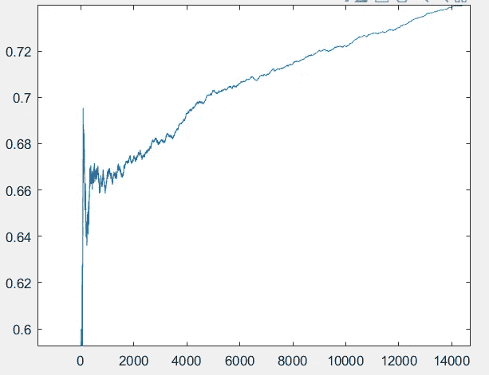
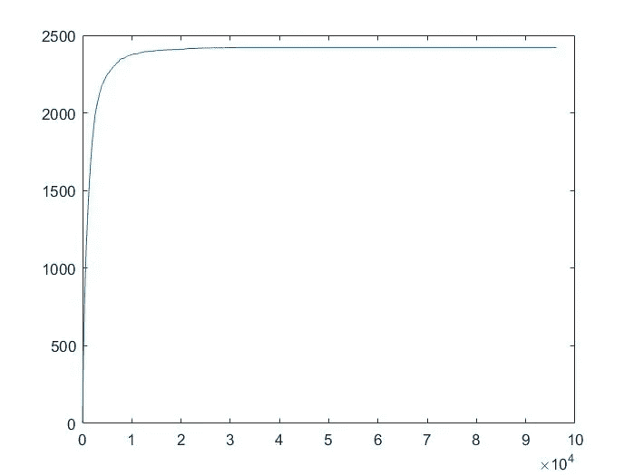
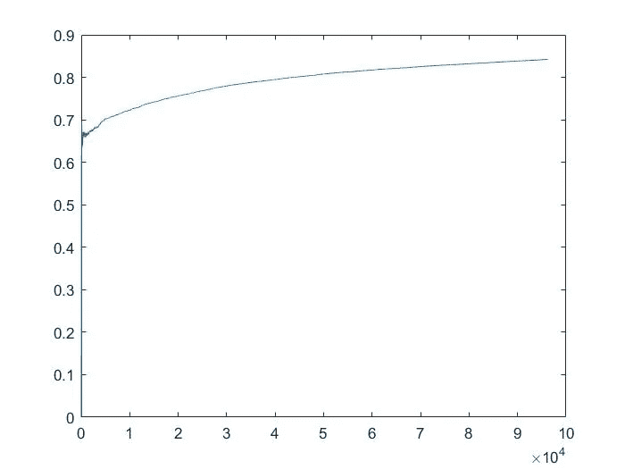
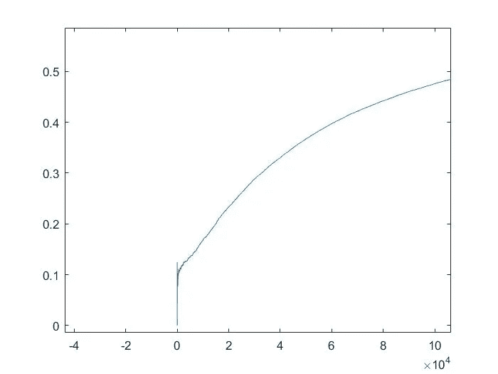
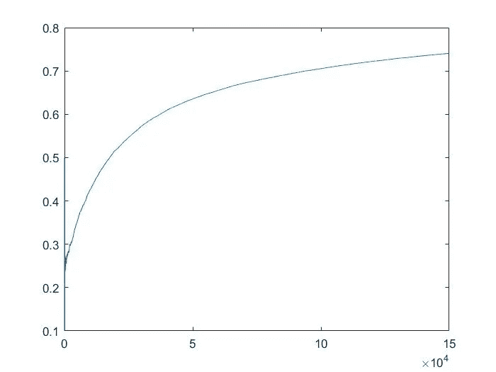
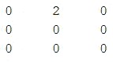
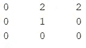
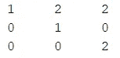
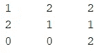
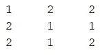

# 将机器学习应用于井字游戏

> 原文：<https://towardsdatascience.com/applying-machine-learning-to-tic-tac-toe-47d954671c73?source=collection_archive---------20----------------------->

## 我创建了一个程序，通过一段时间的模拟来学习如何玩井字游戏

图片由作者提供

## 简介:

在制作了一个可以玩 Connect 4 的 MATLAB 程序后，我决定下一步是设计一个可以学习如何玩井字游戏的程序。毕竟它只是 Connect 4 的简化版，所以机器学习的时间应该会更少，并增加它的胜率。

## 井字游戏机 V1.0

它始于两个完全随机的井字游戏发生器互相游戏。一个游戏结束后，其中一台机器从游戏中收集所有决策数据，并将其放入数据库。如果这步棋赢了，这步棋得 3 分。如果移动导致损失，它失去 1 点。平局比赛的结果是加 1 分。在 100，000 场游戏中，每一个独特的场景都记录在它的数据库中，以及它在那之后选择的移动。在下一局游戏中，得分较高的棋更有可能被选中，而得分较低的棋则不太可能被选中。

这个想法是，在几千场比赛中，赢或平的棋会得到更多的分数，更有可能被选中。由此产生了一个包含 2000 多种独特游戏场景的数据库，每一步都有不同的权重。下面是 100，000 场比赛中数据库中独特场景的总量图。

图片由作者提供

正如你所看到的，数量收敛于值 2，423，在这一点上，机器开始看到重复出现的场景，并为 9 个可能的移动中的每一个调整权重。

但是在 10 万场比赛中，TTT-M1 的胜率如何呢？下面左边是所有模拟的总胜率，右边是前几千个游戏的放大部分。

图片由作者提供

由于 TTT-M1 和它的随机移动对手都是在对游戏一无所知的情况下开始的，所以在前 2000 场游戏中，胜率波动很大。到了某个时候，它开始下沉，形成一条平滑的线，随着时间的推移慢慢增加。这是因为机器现在已经看到了所有可能的场景，并且现在正在细化每个移动的权重。

正是在这一点上，我认为我有一个完整的项目。任何人都不可能打败一台有 10 万次井字游戏经验的机器。嗯，我想错了。

事实证明，虽然 100，000 场游戏很多，但当它与随机移动生成器对战时，它真的没有任何意义。一个真实的人是有直觉的，这是我的机器的对手没有的。因此，击败这台机器是相当容易的，或者至少打平它。这并不意味着机器在阻挡它的对手时没有学到一些技术。它肯定做出了明智的决定，只是没有考虑到一个具有良好逻辑的人类对手。

## 井字游戏机 V2.0

解决这个问题的方法很简单。让另一台机器在没有任何游戏逻辑的情况下启动，并让它面对我的井字游戏机器 1.0 版(TTT-M1)。使用与以前相同的代码，这台新机器(TTT-M2)将学习超过 150，000 场如何玩井字游戏，但它将学习如何对抗具有相当技能的对手。理论上，TTT-M2 应该比 TTT-M1 更聪明，因为它有成千上万场比赛来暴露它的弱点，同时还能制定新的策略。

我感兴趣的一个特殊情况是第一步决策。TTT-M1 率先行动，我预计它会集中在中间位置，这是最好的。事实上，它更喜欢角落，因为它是起点。这给第二个玩家留下了空档，导致 TTT-M1 输掉了很多对真人的比赛。我想看看 TTT-M2 是否会抓住这个弱点，如果轮到它了，就开始瞄准中间的位置。

以下是 TTT-M2 对 TTT-M1 的学习率:

图片由作者提供

正如你所看到的，胜率开始时非常低，因为它面对的是一个有一些游戏知识的对手。随着模拟的进行，它了解了 TTT-M1 的弱点，直到它收敛到 0.50 左右的胜率。考虑到它没有第一步棋，这是非常好的。

它还了解到，如果 TTT-M1 在第一步没有采取中间路线，那么它应该采取它。这证明了一个众所周知的事实，即在井字游戏中，中间点是最好的位置。

现在我有了一个像样的对手，我开发了 TTT-M3。

## 井字游戏机 3.0 版

我的井字游戏机器学习项目的最终演变是 TTT-M3。这台机器在 150，000 场比赛中对阵 TTT-M2，学习最佳策略，同时也在最佳数据库中找到当前的漏洞。经过 150，000 场比赛，结果如下:

图片由作者提供

这说明这个井字游戏机器学习项目的最后一代一开始非常弱。在最初的 1000 场比赛中，它的胜率徘徊在 25%左右，但后来开始腾飞，达到了 74%左右。这是对一个同样有井字游戏逻辑的对手(TTT-M2)。下面是我和 TTT-M3 博弈的一个例子(“2”是 TTT-M3 的棋，“1”是我的棋):

图片由作者提供

我马上注意到它已经发展出一种策略来引诱我选择中心点。一旦我这样做了，每次都是平局，在计算机看来，这是一个好结果。

图片由作者提供

我扮演了中间的角色，落入了圈套。然后，它设置我采取左上角。

图片由作者提供

在顶上挡住它的水平尝试后，它又把我放在最右边的一栏。

图片由作者提供

这是第二排第一列的下一步棋，决定了这场比赛的命运。

图片由作者提供

## 结论:

经过 3 代的进化，这个程序已经发展出一种策略来建立联系，阻止对手，并争取胜利。总的来说，这个项目是成功的，因为创建了一个程序，可以学习新的技能，并在与其他对手玩井字游戏时变得更好。

如果你对这类内容感兴趣，我有一些基于棋盘游戏和数据科学的文章:

*   [模拟垄断](/simulating-monopoly-finding-the-best-properties-using-matlab-130fe557b1ae)
*   [教机器玩 Connect 4](/i-taught-a-machine-how-to-play-connect-4-df261da4e23f)
*   [最佳和最差卡坦板设置](https://medium.com/codex/the-best-and-worst-catan-board-setups-989df4ba550a)