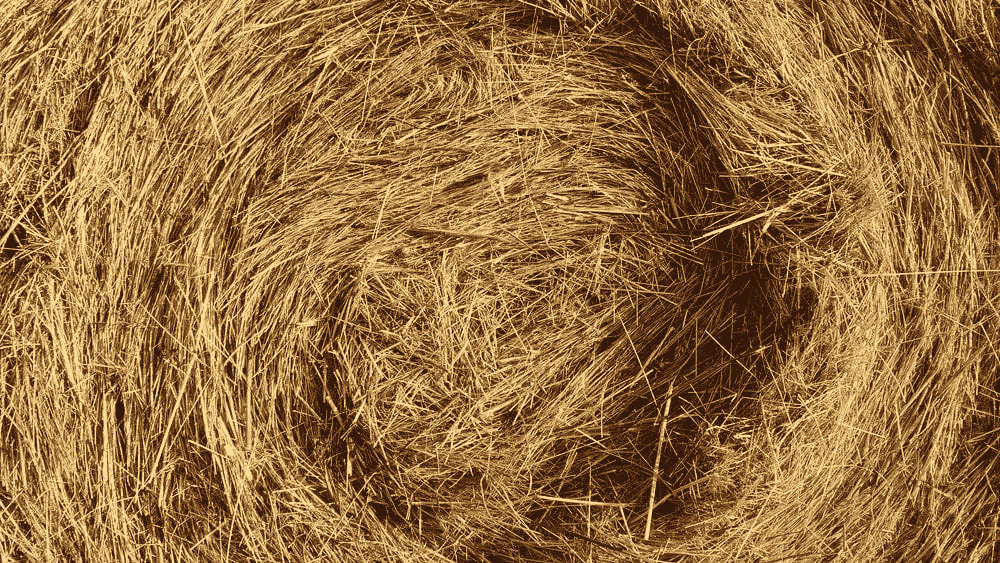
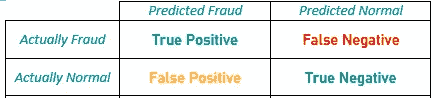
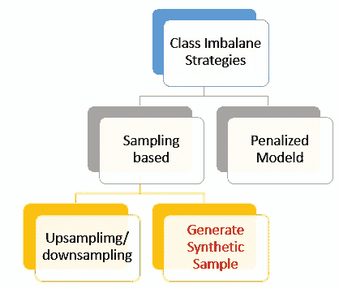
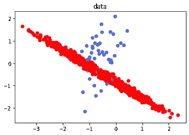
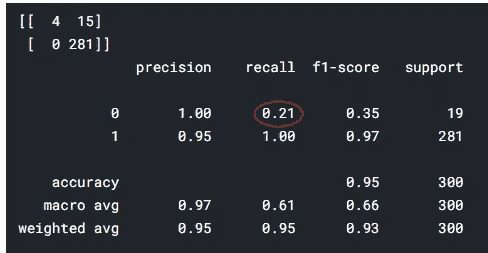
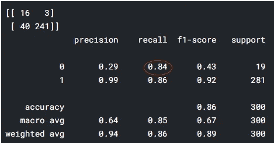

# 使用 Python

> 原文：<https://towardsdatascience.com/applying-smote-for-class-imbalance-with-just-a-few-lines-of-code-python-cdf603e58688?source=collection_archive---------3----------------------->

## 用几行 python 代码实现类平衡


[https://unsplash.com/photos/-9eNCP979zY](https://unsplash.com/photos/-9eNCP979zY)

类别不平衡是一个经常出现的问题，表现在欺诈检测、入侵检测、可疑活动检测等等。在二元分类法的上下文中，出现频率较低的类称为少数类，出现频率较高的类称为多数类。你可以在这里查看我们关于同一主题[的视频。](https://www.youtube.com/watch?v=oJvjRnuoqQM)

**这有什么问题？**

大多数机器学习模型实际上被多数类淹没了，因为它期望类在某种程度上是平衡的。这就像要求一个学生同样学好代数和三角学，但只给他 5 个已解决的三角学问题，而给他 1000 个已解决的代数问题。少数阶级的模式被埋没了。这实际上变成了从干草堆里找一根针的问题。



[https://unsplash.com/photos/9Mq_Q-4gs-w](https://unsplash.com/photos/9Mq_Q-4gs-w)

评价也是去折腾，我们更关心的是少数民族类召回而不是别的。



根据合意性使用颜色的混淆矩阵

假阳性是可以的，但假阴性是不可接受的。诈骗类作为正类。

本文的目标是实现，理论上的理解可以参考 SMOTE [的详细工作原理这里](/class-imbalance-smote-borderline-smote-adasyn-6e36c78d804)。



阶层失衡策略(来源:作者)

当然，最好是有更多的数据，但那也太理想了。在基于采样和基于采样的策略中，SMOTE 属于生成合成样本策略。

**步骤 1:创建样本数据集**

```
from sklearn.datasets import make_classification
X, y = make_classification(n_classes=2, class_sep=0.5,
weights=[0.05, 0.95], n_informative=2, n_redundant=0, flip_y=0,
n_features=2, n_clusters_per_class=1, n_samples=1000, random_state=10)
```

make_classification 是一个非常方便的函数，可以为您创建一些实验数据。这里重要的参数是权重，确保 95%来自一个类，5%来自另一个类。



可视化数据(图片来源:作者)

可以理解为红色阶级是多数阶级，蓝色阶级是少数阶级。

**步骤 2:创建训练、测试数据集、拟合和评估模型**



对基于原始不平衡数据训练的测试集模型的评估(图片来源:作者)

这里的主要问题是，当原始不平衡数据用于训练模型时，少数类的召回率非常低。

**步骤 3:用合成样本创建数据集**

```
from imblearn.over_sampling import SMOTE
sm = SMOTE(random_state=42)
X_res, y_res = sm.fit_resample(X_train, y_train)
```

我们可以用三行代码创建一个平衡的数据集

**步骤 4:在修改的数据集上拟合和评估模型**



对在修改的平衡数据上训练的测试集模型的评估(图片来源:作者)

我们可以直接看到，召回从. 21 提升到. 84。这就是三行代码的力量和魅力。

> SMOTE 的工作方式是选择一对少数类观测值，然后创建一个位于连接这两个观测值的线上的合成点。选择少数点是相当自由的，最终可能会选择异常的少数点。

ADASYN、BorderLine SMOTE、KMeansSMOTE、SVMSMOTE 是选择更好的少数点的一些策略。

**尾注:**

类不平衡是一个很常见的问题，如果不处理，会对模型性能产生明显的影响。模型性能对于少数民族阶层尤为关键。

在这篇文章中，我们概述了如何用几行代码，可以像一个奇迹。

[**引用:**](https://machinelearningmastery.com/tactics-to-combat-imbalanced-classes-in-your-machine-learning-dataset/)

[1][https://www.kaggle.com/saptarsi/smote-notebook](https://www.kaggle.com/saptarsi/smote-notebook)

[2][https://machine learning mastery . com/tactics-to-combat-unbalanced-classes-in-your-machine-learning-dataset/](https://machinelearningmastery.com/tactics-to-combat-imbalanced-classes-in-your-machine-learning-dataset/)

[3][https://www.kaggle.com/qianchao/smote-with-imbalance-data](https://www.kaggle.com/qianchao/smote-with-imbalance-data)