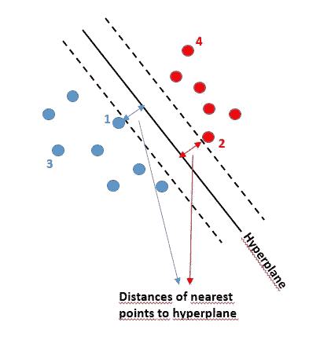
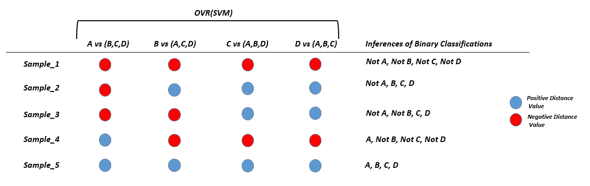

# 基于 SVM 的主动学习在多类数据集上的应用

> 原文：<https://towardsdatascience.com/applying-svm-based-active-learning-on-multi-class-datasets-ba6aacdb52d1?source=collection_archive---------18----------------------->

## [实践教程](https://towardsdatascience.com/tagged/hands-on-tutorials)

## 基于主动学习和半监督学习的多类分类问题标记策略

在新时代，大量的数据被收集和处理，以提取有价值的信息。同样，机器学习模型也在不断改进，新的方法也在不断提供。显然，基于监督学习的方法对于数据驱动的问题会产生更好的准确性。然而，他们不可或缺地需要每个样品的标签。标签信息对于设计更多的实体模型和获得更好的结果至关重要。不幸的是，这些发展中唯一缺乏的是获得正确的标签信息。给数据加标签通常是一个耗时且令人信服的过程。

主动学习背后的想法是，考虑到标记所有样本是很困难的，找到要标记的最有信息量的样本。因此，通过标记整个样本的一个小子集，模型的准确性可能会显著提高。此时，一个简单的问题出现了。如何从整个集合中选择最具信息性的样本？我提到了一种在多类数据集中决定最有信息量的样本的方法。此外，我将提到一个简单的基于半监督的方法来增加样本集中的标签数量。以及如何在同一数据集中同时利用主动学习和半监督学习。


由[克里斯汀娜·帕普](https://unsplash.com/@almapapi?utm_source=medium&utm_medium=referral)在 [Unsplash](https://unsplash.com?utm_source=medium&utm_medium=referral) 上拍摄的照片

为了揭示最丰富的样本，大多数研究受益于概率方法。在这篇文章中，我使用了基于 SVM 的方法，而不是典型的概率模型。众所周知，支持向量机(SVM)旨在找出 N 维空间中使不同类别点之间的距离最大化的超平面。请看图 1，这是一个只包含两个特征的数据集。SVM 基本上是看着这边的样点来决定上课的。类似地，点到超平面的距离(裕度)是样本属于该类有多强的一种度量。因此，SVM 评论说*样品 3* 和 *4* 分别属于蓝色和红色类的概率比*样品 1* 和 *2* 高。

那么，我们如何在主动学习中使用这些信息，换句话说，找出信息量最大的样本？

> 以简单的方式，靠近超平面的样本比远离超平面的样本更能提供信息。SVM 为离超平面最远的样本做出具有更高置信度的预测。另一方面，越靠近超平面的样本的类别就越不确定。出于这个原因，拥有更接近超平面的样本的基础事实比其他样本更有价值。



图 1 —二维空间中的 SVM 描述(图片由作者提供)

但是，对于多类分类问题，就没那么简单了。我使用[](https://scikit-learn.org/stable/modules/generated/sklearn.multiclass.OneVsRestClassifier.html)*多类策略，这是多类分类任务最常用的方法之一。原则上，每个分类器的每个类都与 OvR 中的所有其他类相匹配。因此，与其替代的 OneVsOneClassifier(OvO)相比，它的解释相对容易。*

*作为 OvR 的结果，您期望每个类都有一个预测。为了更清楚，假设我们有 4 个类；a、B、C 和 d。在这样的例子中，您获得 4 个不同的二元分类器结果，它们是*

*A vs (B，C，D)；*

*B vs (A，C，D)；*

*C vs (A，B，D)；*

*D vs (A，B，C)；*

*同样，这意味着 4 个不同的距离测量，如果你在 OvR 上应用 SVM。距离的符号简单地说明了等级；例如，如果上述示例中第一个分类器的距离(A vs (B，C，D))为正，则分类器返回 class A，如果为负，则返回 not A。*

*正如所料，1 个正距离测量值和 3 个负距离测量值的组合是最有把握的预测，这是图 2 中的 *Sample_4* 。OvR 声明样本属于作为 4 个不同分类器的结果的具有正距离值的类别。另一方面，4 个正的或 4 个负的距离测量是不确定预测的例子。在主动学习中，我们对这些最不自信的样本感兴趣。我没有遇到 *Sample_5* 对应的情况。最有可能的情况是，您遇到像 *Sample_1* 这样的场景作为最不自信的样本。在*样本 _1* 之后，*样本 _2* 可以被定义为第二大信息量样本。它也代表了一种歧义情况。预测声明 *Sample_2* 可能是任何 B、C 或 D 类的成员，但不是 a。*

*然后，如果您还有手动标记样品的空间，您可以考虑像 *Sample_3* 这样的样品。此时，首先计算两个正距离值之差的绝对值。差异越小，样本的预测就越模糊。因此，您可以选择差值较小的样本。我试图在图 2 中总结一个 4 类数据集的 OvR 组合。同样的想法可以扩展到所有多类数据集，只需稍加修改。*

**

*图 2-在 4 类数据集上应用 OVR(SVM)-距离值符号的组合(图片由作者提供)*

*你也可以看看下面的代码片段，它是上述方法的实现。*

```
*# It calculates the difference of distance results of only positive 2 distance value
def posit_diff(a,b,c,d):
    lst = list([a,b,c,d])
    print(lst)
    index_lst = [lst.index(i) for i in lst if i>0]
    print(index_lst)
    if len(index_lst) != 2:
        print('Warning! Expecting only 2 positive distance values')
        return -1
    else:
        return abs(lst[index_lst[0]] - lst[index_lst[1]])MODEL = LinearSVC(penalty='l2',dual=False, multi_class='ovr', class_weight = 'balanced', random_state=1709)
ACTIVE_LEARNING_BATCH_SIZE = 100 # lets say I am looking for 100 most informative samples from the data set 
# FEATURES = [...]def active_learning(df_train_set, df_unlabelled_set):
    """
    Applying active learning to an example of 4 classes classification problem. 
    """
    ovr = OneVsRestClassifier(MODEL)
    ovr.fit(df_train_set[FEATURES], df_train_set['LABEL'])
    pred = ovr.predict(df_unlabelled_set[FEATURES])dec_func = (ovr.decision_function(df_unlabelled_set[FEATURES]))df_dec_func = pd.DataFrame(dec_func, columns = ['1','2','3','4'])
    df_dec_func = pd.concat([df_dec_func, df_unlabelled_set],axis=1)df_dec_func['positives'] = df_dec_func[['1', '2', '3', '4']].gt(0).sum(axis=1)
    df_dec_func['negatives'] = df_dec_func[['1', '2', '3', '4']].lt(0).sum(axis=1)df_dec_func_posit_0 = df_dec_func.loc[df_dec_func['positives']==0] # the most informative ones
    df_dec_func_posit_3 = df_dec_func.loc[df_dec_func['positives']==3] # the second most informative ones
    df_dec_func_posit_2 = df_dec_func.loc[df_dec_func['positives']==2] # the third most informative onesdf_dec_func_posit_2['posit_diff'] = df_dec_func_posit_2[['1','2','3','4']].apply(lambda x: posit_diff(*x), axis=1)
    df_dec_func_posit_2 = df_dec_func_posit_2.sort_values(by=['posit_diff'], ascending = True)
    df_dec_func_posit_2.reset_index(drop=True, inplace=True)
    rest_needed = (ACTIVE_LEARNING_BATCH_SIZE) - (df_dec_func_posit_0.shape[0] + df_dec_func_posit_3.shape[0])

    if rest_needed > 0:
        df_dec_func_posit_2_al = df_dec_func_posit_2.iloc[0:rest_needed,:]
        df_act_learn = pd.concat([df_dec_func_posit_0, df_dec_func_posit_3, df_dec_func_posit_2_al], axis=0)
    else:
        df_act_learn = pd.concat([df_dec_func_posit_0, df_dec_func_posit_3], axis=0)
        df_act_learn = df_act_learn.sort_values(by=['positives'], ascending=True)
        df_act_learn = df_act_learn.iloc[0:ACTIVE_LEARNING_BATCH_SIZE,:]
    df_act_learn.reset_index(drop=True, inplace=True)

    return df_act_learn*
```

*更进一步，聚类可以应用于推断为最有信息的样本的样本集。通过从聚类的质心和边界选择样本(等于类的数量)，可以确保最终集合中的变化。*

## *半监督学习*

*增加数据集中标签数量的另一种方法是以自动方式标记最有把握的样本。换句话说，如果预测样本高于预定的阈值，则可以迭代地标记样本。并且阈值可以在每次迭代中增加。*

*假设，分类器预测一个样本属于 A 类的概率为 87%，高于阈值 85%。因此，在接下来的步骤中，它可能被评估为 A 类成员。训练集和未标记集在每次迭代结束时被更新。注意，事实上，它可能不是类 A 的成员，这是基于半监督的方法的一个非常严重的缺点。我在下面的代码片段中分享了这种方法的一个简单代码示例:*

```
*MODEL = RandomForestClassifier(max_depth=4, n_estimators=200, class_weight='balanced', random_state=1709)
LIST_LABELLED_SAMPLES = df_train_set.shape[0]
SS_LEARNING_LABELLING_THRESHOLD = 0.80
SS_THRESHOLD_INCREASE = 0.01
MAX_SS_ITERATION = 10
# FEATURES = [...]def ss_iterations(df_train_set, df_unlabelled_set):  
    """
    It covers all steps of semi supervised learning.
    It uses a simple Ranfom Forest to fit df_train_set and predict df_unlabelled_set 
    to determine the most confident samples 
    those are predicted with a higher accuracy than SS_LEARNING_LABELLING_THRESHOLD. 
    """
    pred_threshold = SS_LEARNING_LABELLING_THRESHOLD

    ovr = OneVsRestClassifier(MODEL)
    print('Before iterations, size of labelled and unlabelled data', df_train_set.shape[0], df_unlabelled_set.shape[0])for i in range (0, MAX_SS_ITERATION):ovr.fit(df_train_set[FEATURES], df_train_set['LABEL'])
        preds = ovr.predict_proba(df_unlabelled_set[FEATURES])df_pred = pd.DataFrame({'1': preds[:, 0], '2': preds[:, 1], '3': preds[:, 2], '4': preds[:, 3]})
        df_pred_ss= pd.concat([df_unlabelled_set, df_pred], axis=1)df_pred_ss['MAX_PRED_RATIO'] = df_pred_ss[['1', '2', '3', '4']].max(axis=1)
        df_pred_ss['LABEL'] = df_pred_ss[['1', '2', '3', '4']].idxmax(axis=1)
        df_pred_ss['LABEL'] = df_pred_ss['LABEL'].astype(int)
        df_pred_ss_up = df_pred_ss[df_pred_ss['MAX_PRED_RATIO'] >= pred_threshold]
        print('The number of samples predicted with high confidence level:', df_pred_ss_up.shape)if len(df_pred_ss_up) > 0:# deleting from unlabelled set
            df_unlabelled_set.drop(index=df_pred_ss_up.index.tolist(),inplace=True)
            df_unlabelled_set.reset_index(drop=True,inplace=True)# adding to train set as if they are ground truths
            df_train_set = pd.concat([df_train_set, df_pred_ss_up[df_train_set.columns]],axis=0)
            df_train_set.reset_index(drop=True, inplace=True)print('Threshold ratio', pred_threshold)
            print('Remaining unlabelled data', df_unlabelled_set.shape[0])
            print('Total labelled data', df_train_set.shape[0])
            print('Iteration is completed', i)pred_threshold += SS_THRESHOLD_INCREASE
        else:
            print('No improvement!')
            breakdf_train_set.reset_index(drop=True,inplace=True)
    df_unlabelled_set.reset_index(drop=True,inplace=True)

    return df_train_set, df_unlabelled_set*
```

# ***标签增强——主动学习 vs 半监督学习***

*总之，标签增加背后的原因非常简单。实际上，主动学习背后的推理与半监督学习相反。*

> *在主动学习中，我们的目标是找到以低概率预测的信息量最大的样本。在找到它们之后，这些样本被分享给专家进行人工标记。如果您有大量未标记的数据，而标记这些数据的资源有限，那么这是一种非常有效的方法。另一方面，预测概率高(信息量最少)的样本被自动标记，就好像它们是基本事实一样，并被添加到下一次迭代的训练集中。*

*主动学习和半监督学习都可以顺序地应用于相同的数据集。首先，应用多个半监督迭代，直到不再有概率高于阈值的预测。然后主动学习的单次迭代可以应用于前一步骤的结果，并且推断的信息样本可以与要标记的领域专家共享。可能会重复一定数量的迭代集。*

# ***有用的链接***

*[](/active-learning-in-machine-learning-525e61be16e5) [## 机器学习中的主动学习

### 大多数有监督的机器学习模型需要大量的数据才能训练出好的结果。即使这样…

towardsdatascience.com](/active-learning-in-machine-learning-525e61be16e5) [](/active-learning-say-yeah-7598767806b2) [## 主动学习——说是！

### 机器学习这个，机器学习那个！你知道该怎么做。来说一个人只是…

towardsdatascience.com](/active-learning-say-yeah-7598767806b2)*