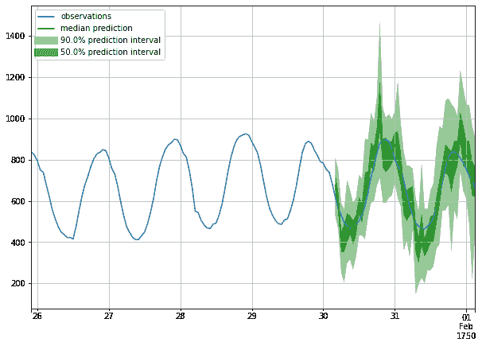

# 交易数据中的异常检测方法

> 原文：<https://towardsdatascience.com/approaching-anomaly-detection-in-transactional-data-744d132d524e?source=collection_archive---------9----------------------->

## 交易数据中的异常检测可能很难，但它带来了在大量数据中发现未知的好处，否则这是不可能的。


查尔斯·德鲁维奥在 [Unsplash](https://unsplash.com?utm_source=medium&utm_medium=referral) 上拍摄的照片

# 1 导言

通常，当人们谈论交易数据**时，他们指的是金融交易。**然而，[根据维基百科](https://en.wikipedia.org/wiki/Transaction_data)，“**交易数据**是描述一个事件(作为交易结果的变化)的数据，通常用动词来描述。交易数据总是有一个时间维度，一个数值，并涉及一个或多个对象”。在本文中，我们将使用向服务器发出请求的数据(互联网流量数据)作为示例，但是所考虑的方法可以应用于前述事务性数据定义下的大多数数据集。

**异常检测**，简而言之，就是在一个生成数据的系统中，找到正常情况下不应该出现的数据点。交易数据中的异常检测有许多应用，下面是几个例子:

*   金融交易中的欺诈检测。
*   制造中的故障检测。
*   计算机网络中的攻击或故障检测(本文涉及的情况)。
*   预测性维护的建议。
*   健康状况监控和警报。

# 2 数据

## 2.1 数据描述

我们将用作示例的数据如下所示:

具有如下所述的列:

*   **时间戳**:事件发生的时间。
*   **serverId:** 被访问的服务器的唯一标识符。
*   **ip** :客户端的 IPv4 地址或 IPv6 地址。
*   **timeMs** :请求和服务器响应之间经过的时间，以毫秒为单位。
*   **clientSSLProtocol** :用于请求的 SSL 加密协议。
*   **clientHTTPMethod** : POST，GET，PUT，PATCH，DELETE。
*   **clientRequestHTTPProtocol**:HTTP 协议的版本，例如 HTTP/1、HTTP/2。
*   **clientRequestPath** :请求的路径，例如。/v3/article/。
*   **userAgent** :一个特征字符串，让服务器和网络对等点识别应用程序、操作系统、供应商和/或发出请求的用户代理的版本。

## 2.2 数据探索

这里我们不是在进行经典的 EDA(探索性数据分析),而是试图从几个给定的例子中理解如何使用数据。

现有功能(列)分为 3 类，并补充了使用它们的方法:

*   **实数(timeMs，…)** 。这些可以直接使用(在基于树的模型的情况下)或者在输入模型之前用[标准化](https://en.wikipedia.org/wiki/Feature_scaling)。
*   **基数低的分类变量(clientSSLProtocol，clientHTTPScheme，clientHTTPMethod，…)** [可以编码(one hot，target 等..)或者嵌入式。](https://en.wikipedia.org/wiki/Categorical_variable)
*   **具有高基数和文本数据的分类变量(clientRequestPath，userAgent，…** )。这些方法比较棘手，一种方法是解析文本并尝试推断基数较低的类别，或者，例如，使用[文本嵌入](https://en.wikipedia.org/wiki/Sentence_embedding)。

## 2.3 特征工程

**2.3.1 时间特征**

**时间戳**可以被编码成如下特征:

*   一小时中的分钟
*   一天中的小时
*   星期几
*   等等...

为了摆脱隐式排序(即周一和周日之间的距离与其他连续日期之间的距离相同，但如果它们分别编码为 1 和 7，则该属性不成立)，通常使用归一化值的[正弦和余弦。](/cyclical-features-encoding-its-about-time-ce23581845ca)

**2 . 3 . 2 IP 地址的处理**

可以使用字典查找将 IP 地址转换为地理位置。这个位置可以被视为一个分类变量。

此外，可以检查 IP 地址是否是众所周知的代理服务器，并将其标记为众所周知的代理服务器(这对于应用 3.1.1 中的规则很有用)

用户代理标志

**userAgent** 值可以被解析以提取关于特定子字符串存在的信息，如“torrent”、“iphone”、“chrome”等，然后相应的标志“uaTorrent”、“uaIphone”、“uaChrome”等被设置为 1。

然而，解析规则可能需要维护，因为相关的关键字往往会随着时间而变化。

2.3.4 clientRequestPath 标志

与**用户代理**相同，但是搜索类似“登录”、“管理”等模式...

## 2.4 标签

数据集中的记录没有按照“坏的”和“好的”参与者进行标记，但是我们假设在下一节中数据集可以具有用于监督建模方法的那些标签。

# 3 建模

在本节中，我们回顾了几种异常流量检测器的建模方法，从最简单到最先进，考虑它们的优缺点。

## 3.1 检测个别异常

**3.1.1 简单规则集**

在这个简单的检测器中，一组规则被应用于每个单独的记录，并且在以下情况下发生警报，例如:

*   时间> X
*   uaTorrent == 1

以及规则的逻辑组合(与、或……)

优点:

*   很容易推理
*   易于实现和测试
*   警报是可以解释的
*   一个相当复杂的规则集是最快的选择

缺点:

*   难以维护，尤其是当规则集变得复杂时
*   不能(快速)适应变化的行为
*   可能会遗漏不明显的病例，因此召回率可能较低

**3.1.2 记录的监督分类**

这种方法假设标签对于数据是可用的，并且问题可以被构造成一个[二元分类](https://en.wikipedia.org/wiki/Binary_classification)。几乎所有的分类模型都可以在这里应用，将特征(2.1)作为输入向量。这些模型可以是简单的，如逻辑回归，也可以是复杂的，如神经网络，输出一个介于 0 和 1 之间的“异常分数”。然而，[树集成](https://en.wikipedia.org/wiki/Ensemble_learning#Boosting)在这里似乎是一个最佳选择，它结合了自然的可解释性、良好的预期预测性能、无需显式编码的分类变量支持以及可接受的推理速度。如果数据量很大，后者非常重要。

优点:

*   分类是一个众所周知的 ML 问题，有许多成功应用的例子
*   (潜在的)高检测性能(也见缺点)
*   大多数模型都是可以解释的

缺点:

*   需要标签，检测质量与标签质量一样好
*   标签很可能是不平衡的(异常流量更少)，这需要应用特殊措施，如[多数类欠采样、少数类过采样](https://en.wikipedia.org/wiki/Oversampling_and_undersampling_in_data_analysis)、[数据扩充](https://en.wikipedia.org/wiki/Data_augmentation)、 [SMOTE](https://arxiv.org/abs/1106.1813) 等。
*   需要用于模型(重新)训练、验证和存储的基础设施

**3.1.3 无监督异常检测**

高质量的标签并不总是可用的，因此无人监管的方法可能会很方便。[异常检测方法/模型](https://en.wikipedia.org/wiki/Anomaly_detection#Popular_techniques)通常学习数据中最流行的模式，然后预测新示例的“异常性”。

优点:

*   模型训练不需要标签

缺点:

*   标签对于模型验证仍然很方便
*   需要用于模型(重新)训练和存储的基础设施

## 3.2 使用时态数据(“行为”分析)

使用时间可以使模型不断适应潜在恶意行为者不断变化的行为，但这需要对数据进行更多的预处理。这种预处理将是在滚动时间窗口上的聚合，并且可以用类似这样的伪火花码来完成:

```
df
 …
 .groupBy(window(col(“timestamp”), 1.minute), col(“ip”))
 .agg(
   count(col(“*”)) as ‘num_reqs,
   avg(col(“timeMs”)) as ‘avgTimeMs,
   skew(col(“timeMs”)) as ‘skewTimeMs,
   count(when(col(“clientRequestPath”).contains(“login”)) as ‘num_logins),
 …
)
```

**注意:**数据按“ip”分组，但根据使用案例，按国家和/或地区组合(从 IP 地址解码)分组可能更好。

通过这个查询，我们可以将数据转换成一组时间序列，并应用下面描述的特定于时间序列的方法。

**3.2.1 对比历史统计**

为了增加规则“模型”的适应性，我们可以使用数据的时态特征和简单的规则集来修改规则，如下所示:

```
currentTimeMs > avgTimeMs + someConstant
```

其中“avgTimeMs”是在最后 N 个时间戳上度量的连续更新的平均值。

对于分类特征，可以使用[比较当前时刻分类变量的分布](https://en.wikipedia.org/wiki/Kullback%E2%80%93Leibler_divergence)和来自相同的最后 N 个时间戳的一些聚集分布。

优点:

*   不需要模型(重新)训练，但仍然提供适应性

缺点:

*   需要附加的预处理步骤

**注:**其他利弊同简单规则集。

**3.2.2 异常检测任务的时间序列预测**

该方法的工作方式如下:基于某个时间窗口，模型预测下一个值，并将预测值与实际观察值进行比较。潜在的[预测方法](https://en.wikipedia.org/wiki/Forecasting#Time_series_methods)可能会有所不同，从更传统的东西，如 SARIMA 到深度学习。[概率预测](https://en.wikipedia.org/wiki/Probabilistic_forecasting)由于不利因素列表中描述的因素而成为首选。

优点:

*   是一种自我监督的方法，因此不需要标签
*   当超出正常值的指标被返回为异常时，可以解释多变量预测的情况，可选地，与正常值的距离为异常分数，数据列用于分组依据
*   例如，在[胶子-ts](https://ts.gluon.ai/) 中提供的概率模型的情况下，不需要设置阈值，只需要设置百分位数，超出百分位数的观察将被视为异常



关于[胶子-ts](https://ts.gluon.ai/) 的概率预测例子

缺点:

*   需要用于模型(重新)训练、验证和存储的基础设施
*   推理时间可能很长，尤其是对于概率模型

## 3.3 解释预测

可解释的预测对于识别检测的根本原因非常重要，这对于调试和调查攻击可能非常有用。所以不推荐像神经网络这种不易解释的模型。

就工具而言，例如 [SHAP](https://arxiv.org/abs/1705.07874) ，它是从黑盒模型中推断特性重要性的最佳软件包之一。

# 4 额外资源

这两个存储库是异常检测和时序预测的研究和工具的重要信息源:

<https://github.com/yzhao062/anomaly-detection-resources>  <https://github.com/cuge1995/awesome-time-series>  

# 5 结论和后续步骤

在本文中，我们回顾并总结了应用于交易数据的异常检测任务的数据预处理、特征工程和建模的几种选择。根据系统要求，选项的数量可以缩小:例如，如果推理时间应该是微秒——深度学习模型最有可能出局。可行的方案应进行离线和在线测试，并根据项目开始时选择的成功标准确定最佳方案。该指标可以是 [precision](https://en.wikipedia.org/wiki/Precision_and_recall) (如果担心误报),或者 [recall](https://en.wikipedia.org/wiki/Precision_and_recall) (如果错过攻击代价高昂),甚至是某种综合指标，可以是这两者与各种指标(如推理时间、训练时间、计算负载、错误成本等)的加权组合