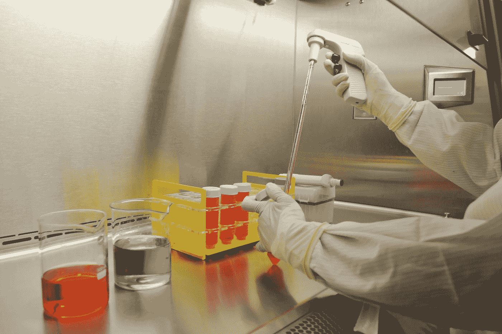
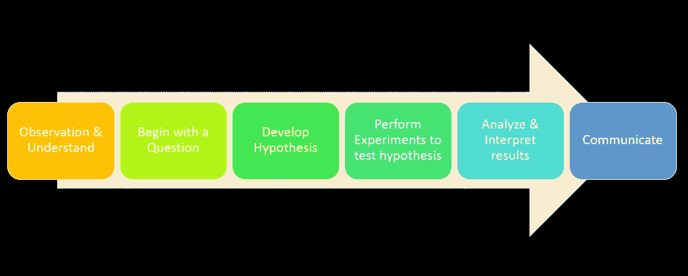
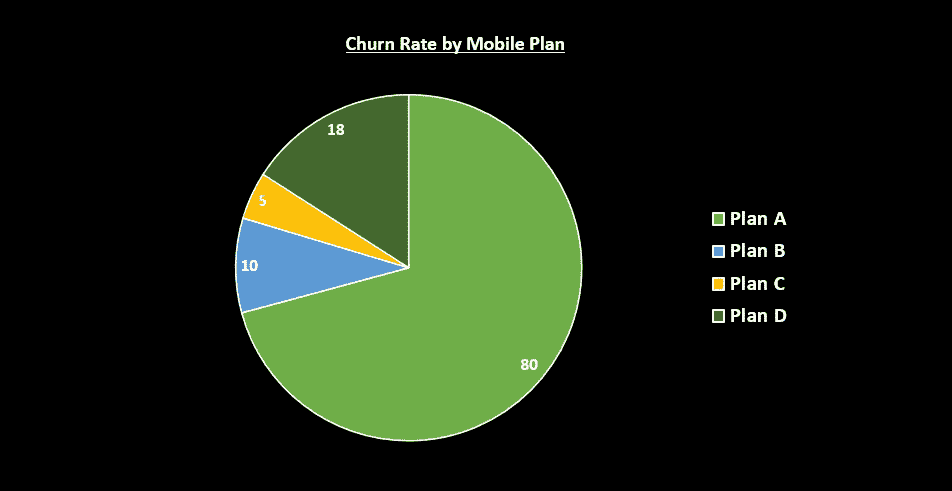

# 像科学家一样对待数据科学项目

> 原文：<https://towardsdatascience.com/approaching-data-science-projects-like-a-scientist-86dcb9e4d6dc?source=collection_archive---------22----------------------->

## [入门](https://towardsdatascience.com/tagged/getting-started)

## 在数据科学项目中使用科学方法

[萨特西什·桑卡兰](https://unsplash.com/@satheeshsankaran?utm_source=medium&utm_medium=referral)在 [Unsplash](https://unsplash.com?utm_source=medium&utm_medium=referral) 上的照片

# 介绍

一个科学家用 [**的科学方法**](https://en.wikipedia.org/wiki/Scientific_method) 进行研究。科学方法一词指的是进行实验的过程，这一过程始于观察，始于提出问题、进行假设、进行实验、观察和分析、得出结论。

使用**科学方法**的方法不仅适用于科学家进行实验，还可以用于我们的日常生活中解决问题，通过这种方法，我们可以学习如何提出问题、收集信息、基于证据进行分析、使用逻辑得出结论，并在生活中做出更好的决定。

在本文中，我们将探索和学习什么是科学方法，以及如何在数据科学项目中使用科学方法。

# 什么是科学方法？

当人们开始通过显微镜进行研究时，弗朗西斯·培根爵士首先介绍了这种科学方法。培根为哲学家创造了科学方法，以确保结果的真实性，并主张哲学家在确认真理之前必须怀疑他们的主张。科学方法由一系列步骤组成，首先是观察、提出问题、形成假设、进行实验以检验假设、分析结果，以及确定假设是正确还是不正确。

> 科学用来获得基于观察的知识的方法，通过实验制定定律和理论、检验理论或假设
> 
> —科学方法的定义:摘自[牛津参考文献](https://www.oxfordreference.com/view/10.1093/oi/authority.20110803100447727) —

现在，让我们从数据科学的角度更深入地理解“科学方法”的方法。

# 理解科学方法

科学方法流程(图片由作者提供)

## 第一步:观察和理解

在开始一个机器学习项目之前，我们首先需要观察、执行一些研究并了解项目所属的业务。在这个阶段，你可能会或可能不会得到一组数据。如果没有提供数据，那么你需要调查类似的案例，进行研究，寻找现有的数据，并进行调查，以获得更好的理解。如果提供了数据，观察、探索并确定哪些是与您的用例相关的信息。

一家电信公司找我们建立一个机器学习模型，来预测和识别在接下来的一个月中可能流失的客户。—这个阶段的观察和理解是什么？

*   理解用例、业务问题和目标/结果的大背景。
*   与利益相关者交流，了解更多关于电信行业的信息。
*   了解以前识别和防止客户流失的方法。
*   浏览数据以更好地理解可用信息。
*   观察在数据集中是否可以看到任何模式。

在观察、理解和探索之后，你会开始有问题浮现在你的脑海中，这使我们进入科学方法过程的下一步——从一个问题开始。

## 第二步:从一个问题开始

在这一阶段，根据前面的观察、理解和探索步骤，提出问题。列出问题是为了更好地理解哪些领域可以用当前的信息集来回答。从 7w 开始提问——“什么”、“为什么”、“如何”、“哪个”、“什么时候”、“谁”或“哪里”。

可能的问题是什么？

*   流失率是多少？
*   客户流失前是否有异常行为或迹象？
*   大多数流失的客户都有类似的移动计划吗？
*   哪些套餐流失率最低？
*   哪个客户下个月会离开？

有了初步的问题列表和对用例的更好理解后，问题将被转化为假设。

## **第三步:提出假设**

在机器学习项目中，假设生成就像是通过识别可能影响企业正在解决的问题的因素来进行“有根据的猜测”。开发假设是数据科学项目中的一个重要过程，因为它有助于识别信息/驱动因素，这些信息/驱动因素有助于模型更准确地预测，并了解需要收集哪些额外数据，或者如果在早期阶段没有提供数据，需要收集哪些额外数据。

例如:

*   搅动的客户通常属于类似的移动计划。
*   搅动的顾客远离联系较弱的城市。
*   与在职成年人相比，老年人的流失率往往更高。

作为一名数据科学家，您必须能够进行批判性思考，并具备识别不同因素和生成相关假设的领域专业知识，以便从模型中获得成功的结果。

假设生成后的下一步是执行实验和测试假设。

## 步骤 4:进行实验来测试假设

在此阶段，您将根据生成的假设收集相关数据，并构建一个探索图表来支持假设，然后在训练机器学习模型时将它们作为因素/驱动因素添加进来。

例如，在制定了假设— ***之后，经常翻炒的客户属于一个类似的移动计划*** ，然后我们将需要查看数据集，以确定我们的假设是否得到数据的支持。这个过程可以通过将结果制成表格或构建可视化视图来实现。

构建一个图表来调查移动计划的流失率(图片由作者提供)

上图显示，计划 A 中的客户流失率最高，这符合我们的假设。因此，在模型训练数据集中具有每个客户移动计划的信息可以导致更好的预测结果。或者，如果数据不支持我们的假设，那么这表明假设不应该被接受。

对生成的每个假设重复这一步，在将它们作为模型训练的因素/驱动因素添加之前，我们测试和验证假设。

假设检验后的下一步是分析和解释结果，这也意味着评估我们的模型性能。

## 第五步:分析和解释结果

在此阶段，我们将根据上一步中训练的模型来评估我们的模型性能。机器学习模型通常会经历模型调整的迭代步骤，但拥有一组经过测试并得到数据支持的强大假设将会导致更好的模型性能。模型定型后，将对照验证集和维持集来验证模型性能。*(如果你想了解更多关于验证集和维持集的区别——*[*参考本文*](/when-training-a-model-you-will-need-training-validation-and-holdout-datasets-7566b2eaad80) *)。)*

在验证模型性能时，有几个问题需要回答，例如:

*   该模型在识别流失客户方面有多准确？错误率是多少？
*   有什么新的假设可以被检验并作为一个特征添加到模型中吗？

有了回答问题陈述的最终模型后，下一步是得出结论，并将结果反馈给涉众。

## 第六步:沟通

最后一步是能够以可理解的格式传达结果，并提供利益相关者可以采纳的建议*(例如，提供下个月可能流失的客户列表，以及营销团队如何根据这些信息采取行动。)*

以可理解的格式向观众展示你的发现的一个很好的方式是通过交互式图表或演示幻灯片的可视化。

# 结论

数据科学不仅仅关注不同的机器学习模型(深度学习、神经网络、聚类等。)但也要考虑到科学方法。就像进行科学实验一样，数据科学中的科学方法可以帮助我们避免得出错误的结论，并根据我们的假设建立一个有偏见的模型。随着组织在项目中采用科学方法，他们将能够理解最终导致构建更健壮的模型和做出更好的决策的数据。

*感谢您阅读我的文章，如果您喜欢并愿意支持我:*

*   *跟我上* [*中*](https://iam-suelynn.medium.com/) 🙆🏻
*   通过我的[推荐链接](https://iam-suelynn.medium.com/membership)成为 Medium 会员🙋

**参考文献&链接:**

[1][https://open StAX . org/books/biology/pages/1-1-the-science-of-biology](https://openstax.org/books/biology/pages/1-1-the-science-of-biology)

[2]科学方法。*牛津参考。*2021 年 11 月 1 日检索，来自[https://www . Oxford reference . com/view/10.1093/oi/authority . 20110803100447727](https://www.oxfordreference.com/view/10.1093/oi/authority.20110803100447727.)

[3][https://search business analytics . tech target . com/feature/The-data-science-process-6-key-steps-on-analytics-applications](https://searchbusinessanalytics.techtarget.com/feature/The-data-science-process-6-key-steps-on-analytics-applications)