# 逼近 KL 散度

> 原文：<https://towardsdatascience.com/approximating-kl-divergence-4151c8c85ddd?source=collection_archive---------26----------------------->

## 无偏的低方差样本估计

阿图尔·尤奇卡在 [Unsplash](https://unsplash.com?utm_source=medium&utm_medium=referral) 上的照片

在本文中，我将讨论 KL 散度的一个样本近似值。我将讨论正向和反向 KL 偏差，所以如果你不熟悉这些概念，在这里查看我关于主题 [**的文章**](/forward-and-reverse-kl-divergence-906625f1df06) 可能会有帮助。

如果你想要一些关于如何用代码实现这一点的指导(来自 open ai*联合创始人 **John Schulman 的评论)！！)查看我的拉动请求 [**此处**](https://github.com/DLR-RM/stable-baselines3/pull/419) 为稳定基线 3。***

# 为什么一开始要近似？

1.  **无解析解**:KL 散度的完整形式解析解可能未知。例如，高斯混合分布就是这种情况。
2.  **高计算复杂度**:计算完整的 KL 散度经常需要对整个分布空间求和。使用不需要这样做的近似是有用的，因为它可以更快。

# 近似值的标准

KL 散度是“真实”分布和“预测”分布之间差异的度量。“真实”分布 **p(x)** 被认为是固定的，而“预测”分布 **q(x)** 是我们可以控制的。我们将从 **q(x)** 中抽取样本作为近似函数的输入，使其成为一个**随机变量**。如果 **p(x)** 是已知的，您可以从那里取样本，但有时情况并非如此，因此概括起来，我们将坚持使用 **q(x)** 。

直觉上，近似应该具有与被近似的原始度量相似的行为。我们可以用两种方法来衡量这种相似性:

1.  **偏差**:理想情况下，近似值应该是无偏的；也就是说，近似值的期望值应该等于原始度量。
2.  **方差**:方差为 0 的无偏近似值(确定性的)将完全等于原始度量！当然，这是不现实的，但理想情况下，方差应该尽可能低，从而增加获得更接近原始度量的值的可能性。

# 近似向前 KL 发散

让我们首先提醒自己完整的分析形式:

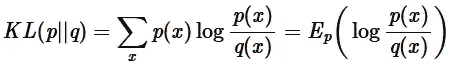

作者图片:KL 向前发散

首先，让我们考虑一下偏见的情况。我们想要:

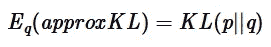

作者图片

其中 approxKL 是我们想要得到的近似值。让我们看看下面的解决方案:

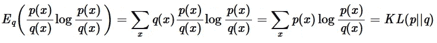

作者图片

因此:

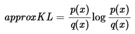

作者图片:向前 KL 发散的无偏近似

但是这个方差仍然很高，因为它可以取负值，而实际 KL 散度不能。改善这种情况的一种方法是添加一个期望值为 0 的项，该项与上面的原始近似值负相关。我们提出以下解决方案:

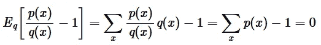

作者图片

这是可行的，因为 **p(x)** 被假定为有效的概率分布。因此，我们可以将近似值更新为:

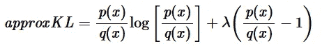

作者图片

其中我们可以求解 **λ** 来找到最小方差。不幸的是，这取决于具体情况，很难分析计算。但是，我们仍然可以通过选择值-1 来找到一个很好的折衷方案。这在任何情况下都导致一个正定的近似！如果我们将比率 **p(x)/q(x)** 作为自己的变量，并将其与近似值 **λ=-1** 相对照，我们会得到以下正定图:

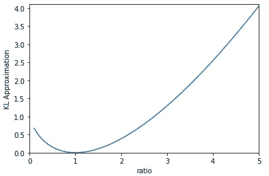

作者图片

因此，前向 KL 散度近似的最终形式是:

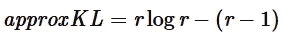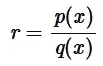

作者图片:最终缩减方差无偏正向 KL 散度近似值

# 近似反向 KL 散度

我们可以采取同样的步骤来得到反向 KL 散度和正向 KL 散度的近似值！

让我们提醒自己完整的分析形式:

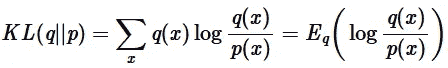

作者图片:反向 KL 发散

再次，我们需要首先获得一个简单的无偏近似；下面给出了一个解决方案:

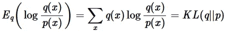

作者图片

因此:

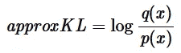

作者图片:反向 KL 发散的无偏近似

这遭受与前向 KL 散度的无偏近似完全相同的问题:这可能取负值，这导致大的方差。我们可以用和上次一样的术语来反驳这一点:

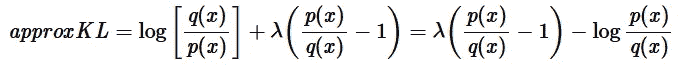

作者图片

同样，我们现在可以求解 **λ** 以找到最小方差，尽管这取决于具体情况。这次一个很好的折中办法是选择 **λ=1** ，以 **p(x)/q(x)** 的比值作为自己的变量，对照这个近似值作图，我们得到如下正定图:

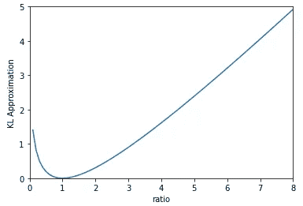

作者图片

因此，反向 KL 散度近似的最终形式是:

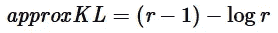

作者图片:最终缩减方差无偏反向 KL 散度近似值

下次你试图通过抽样来测量两个分布之间的差异时，请记住这些近似值！

如果您觉得这篇文章有用，请考虑:

*   跟踪我🙌
*   [**订阅我的邮件通知**](https://medium.com/subscribe/@rohan.tangri) 永不错过上传📧
*   使用我的媒介 [**推荐链接**](https://medium.com/@rohan.tangri/membership) 直接支持我并获得无限量的优质文章🤗

推广的方式，我真的希望你觉得这篇文章有趣，让我知道你的想法！！

# 参考

[http://joschu.net/blog/kl-approx.html](http://joschu.net/blog/kl-approx.html)约翰·舒尔曼的《逼近 KL 散度》