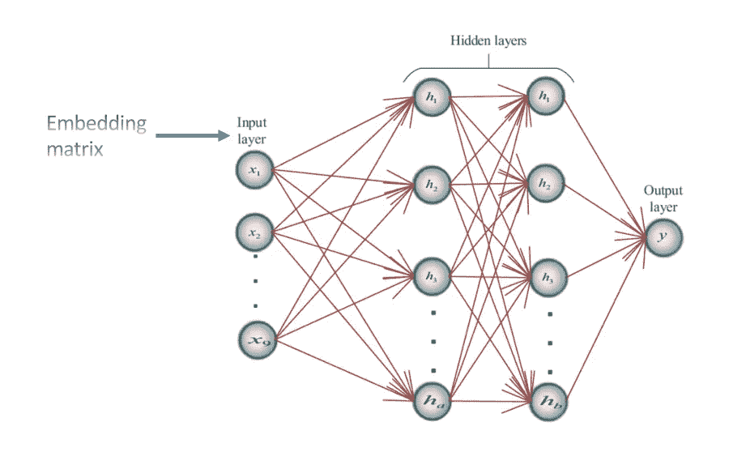
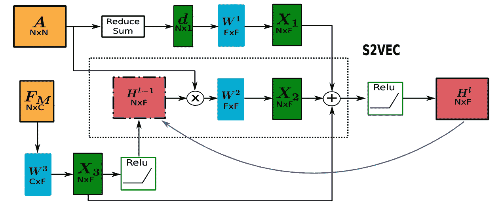
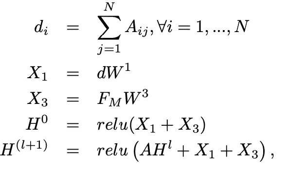
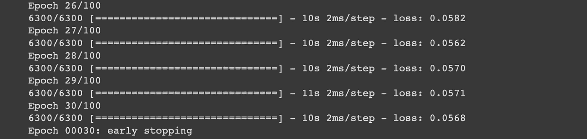

# 接近 Neo4j 的中间中心性分数——对速度的需求

> 原文：<https://towardsdatascience.com/approximating-neo4js-betweenness-centrality-scores-the-need-for-speed-27371d37a559?source=collection_archive---------54----------------------->

## 现在，我把我的 96，000 核心超级计算机放在哪里了？

想象一下，有一天早上你醒来，你对自己说:

> 嗯，如果我可以计算昨天我们加载到 [Neo4j](https://neo4j.com/download-neo4j-now/?utm_program=emea-prospecting&utm_source=google&utm_medium=cpc&utm_campaign=emea-search-branded&utm_adgroup=neo4j-general&gclid=Cj0KCQiArvX_BRCyARIsAKsnTxOk58eNegDpmwXNkk8eUit2o1zkF2WkRGfdWjmbf9M9efXar4EvLZoaAoQ1EALw_wcB) 中的 100 个 mio 节点的中间中心性得分，这不是很棒吗，它代表了我们公司的电子邮件流量。天哪，从信息流的角度来看，这肯定有助于我们识别关键员工。
> 是的，让我们开始工作吧！

你可能会问自己的下一个问题是:“现在，我把我的 96，000 核心超级计算机放在哪里了？”除非你是 Ziyad AlGhamdi(T4)研究团队的一员，否则你会很快记起你所拥有的是 16 个内核。

许多组织经常用 1 亿甚至几十亿个节点来编制图表，这些节点代表产品网络、共同购买、电子邮件流量等。并且在这些图形上执行中心性分析的能力是必不可少的。

然而，对于许多中心性指标，如*中间中心性*或*接近中心性*得分，精确算法的计算复杂性 ***非常昂贵*** 。
例如，Cohen 等人在*”*[*计算经典接近中心性中说明，在规模*](https://dl.acm.org/doi/abs/10.1145/2660460.2660465?casa_token=DP-jrp7O5OIAAAAA:yug3h0jJtCTEw3lzYiBhlG4JbDZ1lpAnGLUOW4LYC8Zov2nq9Gm67JXuXnwNfax09e9t2jqlacuz)*中，使用标准计算资源计算 2400 万个节点的网络上的接近中心性需要惊人的 44222 个小时，或者大约 5 年来计算。*

*<https://dl.acm.org/doi/abs/10.1145/2660460.2660465>  

在这篇文章中， [Mark Needham](https://medium.com/u/68584b0be0fb?source=post_page-----27371d37a559--------------------------------) 和我将说明如何使用一个 ***定制机器学习模型*** 来近似 Neo4j 中大型图的中间中心性分数。

## 使用 Neo4j

[Neo4j 图形数据科学](https://neo4j.com/product/graph-data-science-library/)库有不少于 7 个中心性得分，其中有一个重要但昂贵的*中间中心性*。该算法应用了 Brandes 算法，可以使用以下命令从 GDS 库中调用该算法:

```
CALL gds.betweenness.stream(
{ nodeProjection: "Node", relationshipProjection: "EDGE" }) 
YIELD nodeId, score 
RETURN nodeId, score 
ORDER BY score DESC
```

使用这些 Neo4j 中心性算法，正如我们在以前的文章中所阐述的； [*“启动你的中心性度量引擎:Neo4j vs NetworkX——各种形式的短程加速赛…*](/fire-up-your-centrality-metric-engines-neo4j-vs-networkx-a-drag-race-of-sorts-18857f25be35) *”，*仍然是计算中心性得分的最有效方式之一，但正如所强调的，当图的大小增加时，运行时间也以指数方式增加，因此需要速度。

</fire-up-your-centrality-metric-engines-neo4j-vs-networkx-a-drag-race-of-sorts-18857f25be35>  

## 使用机器学习模型

近似中心性度量的另一种方法是使用机器学习方法，其中*我们在一个小图上训练一个模型，然后将其应用于更大的图*。

假设如下:通常，许多组织的数据库中会有一个图，它或者是一个更大的图的样本，或者是这样一个更大的图的代表。

这种设置的一个例子是对等网络；**Gnutella。
这些数据集可以在斯坦福 [SNAP](http://snap.stanford.edu/) 存储库中找到，由 9 个已发布的网络组成，节点数量从 6300 个到 63000 个不等。
同样，我们的目标是预测介数中心性，在这个实验中，我们将使用最小的 Gnutella 网络进行训练，一旦我们有了训练好的模型，就可以预测该数据集中更大图形的介数中心性得分。**

基本原理是，这种方法不是生成一组随机训练图，而是使用一个与测试图具有相同拓扑属性的真实世界图，并使用[留一交叉验证](https://en.wikipedia.org/wiki/Cross-validation_(statistics)#Leave-one-out_cross-validation) (LOOCV)作为模型学习映射的重采样方法。

## **模型架构**

我们的首要任务是通过神经网络为处理“准备”图表。为此，我们使用了 [NetworkX](https://networkx.org/) Python 包，这是一个构建和分析图的有效工具，如提取邻接矩阵等。

一旦我们对图表进行了预处理，我们就可以把它输入到我们的神经网络中。

> 概括地说,(人工)神经网络由人工神经元组成，这些神经元通过链接连接，而链接又以数字权重为特征。然后，一个神经网络*通过反复调整这些权重来学习*。

我们部署的神经网络是一个简单的多层感知器(MLP)，但有一个转折:模型的输入变量是一个嵌入矩阵，我们使用了[戴等人](http://proceedings.mlr.press/v48/daib16.pdf)建立的 ***Struc2Vec 节点嵌入技术***

在我们的例子中，*嵌入矩阵由节点嵌入组成，由向量*表示。一旦这样的嵌入矩阵被编译，我们通过两个完全连接的层运行它，并使用 Keras 早期停止方法来控制历元的数量。我们可以这样设想:



图片摘自 [Aqib 等人](https://www.researchgate.net/publication/326538421_Disaster_Management_in_Smart_Cities_by_Forecasting_Traffic_Plan_Using_Deep_Learning_and_GPUs)

所有代码都在 TensorFlow 2.2.3 & Keras 中，可以在下面找到:

<https://colab.research.google.com/drive/1m3FBa2KgYxmkLo182wNiOzKF0C3Qbki3?usp=sharing>  

**从 Neo4j 加载图形**

我们假设图形在 Neo4j 中，并调用 [Neo4j Python 驱动程序](https://neo4j.com/docs/api/python-driver/current/)通过以下命令获取图形:

```
from neo4j import GraphDatabase 
import networkx as nx driver = GraphDatabase.driver 
("bolt://localhost:7687", auth=("neo4j", "<password>")) query = "MATCH (n)-[r]->(c) RETURN *"results = driver.session().run(query) G = nx.DiGraph() nodes = list(results.graph()._nodes.values()) 
for node in nodes: 
    G.add_node(node.id, labels=node._labels) rels = list(results.graph()._relationships.values()) 
for rel in rels: 
    G.add_edge(rel.start_node.id, rel.end_node.id, key=rel.id,
              type=rel.type) print(nx.info(G))
```

如代码片段所示:一旦我们在本地机器上加载了图，我们就调用 NetworkX 来构造一个图，从这里我们可以开始我们的工作。

首先，对于 Struc2Vec 方法，我们产生了*归一化度中心性*值，它与图的邻接矩阵相结合，允许每个节点由一个嵌入向量来表示。也就是说，它需要一个节点的*特定信息*，它的*度*，以及这个特定节点的邻居的*嵌入来构造这样一个向量。我们可以将工作流程可视化如下:*



模型工作流程(图片摘自[德门多卡等人](https://ieeexplore.ieee.org/abstract/document/9247306?casa_token=FRpj_XFc7rIAAAAA:oNAfJPiMLvAxNxVpHggGujogv6wwvBjtogTsPbuiAEIUcSZY5fxJE4BbvZWJ1TuG7F25wSc-))

用数学术语来说，该工作流形式化为:



其中 ***d 是度向量*** 和 ***W 是权重矩阵*** 。然后，最后出来的香肠是一个嵌入矩阵， ***H*** ，它将为我们的神经网络提供输入。

至于神经网络，没有什么特别奇特的:我们有一个简单的输入层，接受形状(6301 x 512)的嵌入矩阵，还有一个输出层，中间有两个完全连接的层，它们创建权重矩阵，其中每一层都使用***【Relu】***激活函数。由于它是一个 ***单变量回归模型*** ，我们将一个只有一个神经元的全连接层作为最终层。

**训练模特**

如前所述，在这个实验中，我们使用了*不同的训练协议*。

我们没有生成旨在捕捉真实世界图的拓扑结构的随机训练图，而是使用一个更小的真实世界图(要么是一个样本，要么是一个简化的表示)，并使用[留一交叉验证](https://en.wikipedia.org/wiki/Cross-validation_(statistics)#Leave-one-out_cross-validation) (LOOCV)方法来训练模型。

LOOCV 方法包括将观察值集合分割成元组，其中单个观察值、 ***(x1，y1)*** 用于验证集合，而剩余的观察值 ***{(x2，y2)…。、(x_n，y_n)}*** 组成训练集。

然后，将该模型拟合到 *n-1 个*训练观测值上，并使用其值 *x* 1 对排除的观测值进行预测 *y* 。在我们的例子中， ***x1*** *表示使用 *Struc2Vec* 方法获得的嵌入向量*。

这种方法的好处是它*捕获了我们想要预测的图的精确拓扑*。一旦我们对模型进行了训练，我们就可以计算任何新的、更大的图上的嵌入矩阵，为此我们想要估计节点的*中间中心度*。

该模型的训练被证明是非常有效的，其中使用 [Keras Earlystopping 回调](https://www.tensorflow.org/api_docs/python/tf/keras/callbacks/EarlyStopping)在 30 个时期停止训练，对于 Gnutella 网络中最小的图(具有 6，301 个节点),只需要不到 10 分钟的训练(在 Google Colab 上),并且导致了较低的丢失率，如下图所示。



## 有多准确？

为了测量预测的归一化介数值(和节点的排序)产生可信的结果，我们使用了[肯德尔τ距离度量](https://en.wikipedia.org/wiki/Kendall_tau_distance)。此指标比较两个列表的相似程度，1 分表示两个列表完全匹配。

  

经过 30 个纪元的训练，我们获得了 **0.783** 的肯德尔 Tau 分数。

考虑到我们训练模型的速度如此之快，这是一个相当高的分数，肯定比范等人通过他们的[中间性深度排名器(DrBC)模型](https://dl.acm.org/doi/abs/10.1145/3357384.3357979?casa_token=N4us_gRwkdMAAAAA:FiF4yzZYL6ZKV8NGqF0jEVpD6yGxTEfxsFADj-gx6R-vsF8vLMvGn83_x29LyIJHXf5EvehIRzKG)获得的结果更好，其中前 10%的 Kendall Tau 的分数范围为 0.64 到 0.77。

## 近似介数分数

下一步，我们可以使用这个训练好的模型来预测 Gnutella 集合中具有 62，586 个节点的最大图的介数中心性分数。

我们需要做的唯一预处理是用 *Struct2Vec* 计算嵌入矩阵，它将成为我们神经网络的输入变量。

该工作流只是需要从训练工作流中复制的几个步骤:我们将图加载到模型中，并再次使用 NetworkX 包来构造图，在此基础上 Struc2Vec 函数产生嵌入矩阵。有了我们的训练模型，我们只需要进行几次 TensorFlow 调用就可以得到预测:

```
#re-loading model:path_model = ‘/content/drive/MyDrive/Colab_files/GN08_model.h5’model = tf.keras.models.load_model(path_model)x_new = mu_all #where mu_all is the embedding matrix computed by 
                Struc2Vecy_pred = model.predict(x_new)
```

## 将预测的中间值写回 Neo4j

现在我们已经获得了预测的介数分数，我们可以将它们写回到 Neo4j 中更大的图中。这将允许我们在 Neo4j 中进行各种图形查询，例如，帮助我们识别那些关键员工。为此，我们再次调用 Neo4j Python 驱动程序，并使用我们心爱的熊猫，执行以下 Python 代码:

```
from neo4j import GraphDatabase 
import pandas as pd 
import os driver = GraphDatabase.driver("bolt://localhost:7687",
                              auth=("neo4j", "<password>")) cwd = os.getcwd() 
file_path = ‘y_pred’ 
save_path = os.path.join(cwd, file_to_save) 
path = os.path.join(cwd, file_path) df = pd.DataFrame(y_pred) 
df.index.names = [‘id’] 
df.columns = [‘Betweenness’] 
df[‘NodeId’] = df.index 
df_list_nodes = df.values.tolist() q =""" 
UNWIND $nodes AS line 
MATCH (f:Node {id:toInteger(line[1])}) 
Set f.Betweenness = line[0] 
Return Count(*)"""with driver.session() as session: 
    result = session.run(q, {“nodes”: df_list_nodes })
```

## 结论

在这篇文章中， [Mark Needham](https://medium.com/u/68584b0be0fb?source=post_page-----27371d37a559--------------------------------) 和我试图说明，当速度是关键，一个好的近似就足够了，那么相对简单的机器学习模型可以部署为*&play*工具，通过使用 Neo4j Python 驱动程序可以扩展当前 Neo4j 图形数据科学功能。*