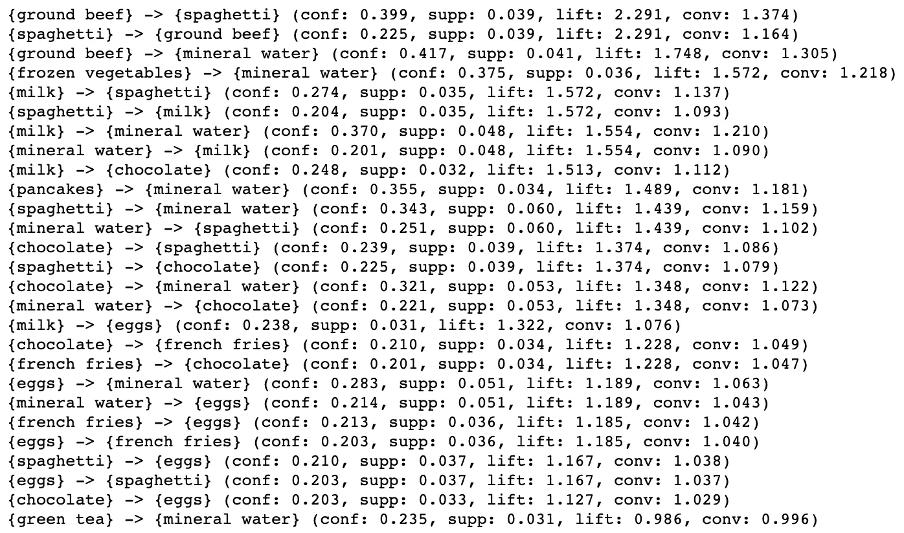

# 关联规则学习的 Apriori 算法——如何发现事务间的清晰联系

> 原文：<https://towardsdatascience.com/apriori-algorithm-for-association-rule-learning-how-to-find-clear-links-between-transactions-bf7ebc22cf0a?source=collection_archive---------3----------------------->

## 机器学习

## Python 中关系数据库的频繁项集挖掘和关联规则学习的解释和示例


关联规则学习。由 5 个项目(A，B，C，D，E)构成的所有可能的项目集。图片由[作者](https://solclover.com/)提供。

# 介绍

你们中的大多数人可能已经熟悉了聚类算法，如 [K-Means](/k-means-clustering-a-comprehensive-guide-to-its-successful-use-in-python-c3893957667d) 、 [HAC](/hac-hierarchical-agglomerative-clustering-is-it-better-than-k-means-4ff6f459e390) 或 [DBSCAN](/dbscan-clustering-algorithm-how-to-build-powerful-density-based-models-21d9961c4cec) 。然而，聚类不是发现数据点之间相似性的唯一非监督方式。您还可以使用关联规则学习技术来确定某些数据点(动作)是否更有可能一起出现。

一个简单的例子是超市购物篮分析。如果有人在买碎牛肉，这是否会让他们更有可能也买意大利面？我们可以通过使用 Apriori 算法来回答这类问题。

# 内容

*   Apriori 算法所属的类别
*   关联规则学习介绍和 Apriori 算法工作原理的直观解释
*   使用真实数据的 Apriori 算法的 Python 示例
*   结论

# Apriori 属于哪一类算法？

如前所述，Apriori 是关联规则学习算法的一部分，属于机器学习的无监督分支。

这是因为先验并不要求我们为模型提供一个目标变量。相反，该算法根据我们指定的约束来识别数据点之间的关系。

下图是**交互式的，**所以请点击不同的类别来**放大并展示更多的**👇。

机器学习算法分类。由[作者](https://solclover.com/)创建的互动图表。

***如果你喜欢数据科学和机器学习*** *，请* [*订阅*](https://solclover.com/subscribe) *每当我发布一个新故事时，你都会收到一封电子邮件。*

# 关联规则学习和 Apriori 算法

## 关联规则学习

如简介中所述，关联规则学习是一种基于规则的机器学习方法，用于发现大型数据库中变量之间的有趣关系。我们用一个简单的超市购物篮分析来说明关联规则是如何发现的。


购物者的超市购物清单。图片由[作者](https://solclover.com/)提供。

假设我们分析上述交易数据，找出经常购买的商品，并确定它们是否经常一起购买。为了帮助我们找到答案，我们将利用以下 4 个指标:

*   支持
*   信心
*   电梯
*   定罪

## 支持

我们和算法的第一步是找到经常购买的物品。这是一个基于频率的简单计算:

```
**Support(A)** = Transactions(A) / Total Transactions
```

所以在我们的例子中:

```
**Support(Eggs)** = 3/6 = 1/2 = 0.5
**Support(Bacon)** = 4/6 = 2/3 = 0.667
Support(Apple) = 2/6 = 1/3 = 0.333
...
**Support(Eggs&Bacon)** = 3/6 = 0.5
...
```

在这里，我们可以通过告诉算法我们想要探索的最小支持级别来设置我们的第一个约束，这在处理大型数据集时非常有用。我们通常希望集中计算资源来搜索经常购买的商品之间的关联，同时忽略不经常购买的商品。

为了我们的例子，让我们**将最小支持设置为 0.5** ，这使得我们在这个例子的剩余部分中处理鸡蛋和熏肉。

**重要:**虽然 Support(Eggs)和 Support(Bacon)单独满足我们的最小支持约束，但理解我们还需要它们的组合(Eggs & Bacon)来通过这个约束是至关重要的。否则，我们不会有一个条目配对来创建关联规则。

## 信心

现在我们已经确定了经常购买的商品，让我们来计算置信度。这将告诉我们(基于我们的数据)有多大的信心，我们可以相信一个项目将被购买，因为另一个项目已经被购买。

```
**Confidence(A→B)** = Probability(A & B) / Support(A)Note, confidence is the same as what is also known as conditional probability in statistics:
P(B|A) = P(A & B) / P(A) *Please beware of the notation. The above two equeations are equivalent, although the notations are in different order:* ***(A→B)*** *is the same as* ***(B|A).***
```

因此，让我们为我们的例子计算置信度:

```
**Confidence(Eggs→Bacon)** = P(Eggs & Bacon) / Support(Eggs) = (3/6) / (3/6) = 1**Confidence(Bacon→Eggs)** = P(Eggs & Bacon) / Support(Bacon) = (3/6) / (2/3) = 3/4 = 0.75
```

以上告诉我们，无论什么时候买鸡蛋，培根也是 100%的时候买。还有，无论什么时候买培根，75%的时候都是买鸡蛋。

## 电梯

鉴于不同的商品以不同的频率被购买，我们如何知道鸡蛋和培根真的有很强的关联，我们如何衡量它？你会很高兴听到我们有办法使用 **lift** 客观地评估这一点。

计算升力的公式有多种表达方式。让我先展示一下公式是什么样子的，然后我会描述一种直观的方式让你思考。

```
**Lift(A→B)** = Probability(A & B) / (Support(A) * Support(B))You should be able to spot that we can simplify this formula by replacing P(A&B)/Sup(A) with Confidence(A→B). Hence, we have:**Lift(A→B)** = Confidence(A→B) / Support(B)
```

让我们计算相关物品的升力:

```
**Lift(Eggs→Bacon)** = Confidence(Eggs→Bacon) / Support(Bacon) = 1 / (2/3) = 1.5**Lift(Bacon→Eggs)** = Confidence(Bacon→Eggs) / Support(Eggs) = (3/4) / (1/2) = 1.5
```

这两个项目的升力等于 1.5。注意，lift>1 表示两件商品更有可能一起买，lift<1 表示两件商品更有可能分开买。最后，lift=1 意味着这两个项目之间没有关联。

理解这一点的直观方法是首先考虑鸡蛋被购买的概率:`P(Eggs)=Support(Eggs)=0.5`因为 6 个购物者中有 3 个购买了鸡蛋。

然后想想每当买熏肉时买鸡蛋的概率:`P(Eggs|Bacon)=Confidence(Bacon->Eggs)=0.75`因为买熏肉的 4 个顾客中，有 3 个也买了鸡蛋。

现在，lift 只是一个简单的度量，它告诉我们在购买培根的情况下，购买鸡蛋的概率是增加了还是减少了。由于在这种情况下购买鸡蛋的概率从 0.5 上升到 0.75，我们看到 1.5 倍的正提升(0.75/0.5=1.5)。这意味着，如果你已经把熏肉放进篮子里，你购买鸡蛋的可能性会增加 1.5 倍(即 50%)。

*看看你的超市附近有没有这两样东西。*😜

## 定罪

信念是衡量联想的另一种方式，尽管要理解它有点困难。它比较了 A 在没有 B 的情况下出现的概率(如果它们是独立的)和 A 在没有 B 的情况下出现的实际频率，我们先来看看通用公式:

```
**Conviction(A→B)** = (1 - Support(B)) / (1 - Confidence(A→B))
```

在我们的示例中，这将是:

```
**Conviction(Eggs→Bacon)** = (1 - Sup(Bacon) / (1 - Conf(Eggs→Bacon)) = (1 - 2/3) / (1 - 1) = (1/3) / 0 = infinity**Conviction(Bacon→Eggs)** = (1 - Sup(Eggs) / (1 - Conf(Bacon→Eggs)) = (1 - 1/2) / (1 - 3/4) = (1/2) / (1/4) = 2
```

如您所见，在计算(鸡蛋→培根)的确信度时，我们除以 0，这是因为我们没有一个鸡蛋被购买而没有培根的实例(置信度=100%)。

一般来说，对 A→B 的高信任度和对 B 的低支持度会产生高确信度。

与解除相反，定罪是一种直接的措施。因此，虽然 lift 对于(鸡蛋→培根)和(培根→鸡蛋)来说是相同的，但两者之间的信念是不同的，Conv(鸡蛋→培根)要高得多。因此，你可以使用信念来评估你的项目之间的方向关系。

最后，与 lift 类似，confidence = 1 表示项目没有关联，而 confidence > 1 表示项目之间的关系(值越高，关系越强)。

## Apriori 算法

Apriori 是一种非常简单的算法，它执行以下一系列计算:

1.  计算大小为 1 的项集的支持度。
2.  应用最小支持阈值并删除不符合阈值的项集。
3.  移动到大小为 2 的项目集，重复步骤 1 和 2。
4.  继续相同的过程，直到找不到满足最小阈值的其他项目集。

为了使该过程更加直观，下面的图表说明了该算法的作用:


Apriori 算法的进程树。图片由[作者](https://solclover.com/)提供。

如您所见，本例中的大多数项目集都被删除了，因为它们没有达到 0.5 的最小支持阈值。

重要的是要认识到，通过设置更低的最小支持阈值，我们将产生更多大小为 2 的项目集。准确地说，在最小支持阈值为 0.3 的情况下，大小为 1 的项集都不会被删除，因此大小为 2 的项集总共有 15 个(5+4+3+2+1=15)。

当我们有一个小的数据集时，这不是一个问题，但是如果你正在处理一个大的数据集，这可能成为一个瓶颈。例如，1，000 个项目可以创建多达 499，500 个项目对。因此，仔细选择你的最低支持阈值。

注意，如果你想要更多的例子，你可以参考封面图片，它显示了所有可能的项目集，这些项目集可以由 5 个单独的项目组成。

[](https://solclover.com/membership)[](https://www.linkedin.com/in/saulius-dobilas/)

# 使用真实数据的 Apriori 算法的 Python 示例

现在让我们抛开理论，用 Python 对现实生活中的数据进行分析。

## 设置

我们将使用以下数据和库:

*   【Kaggle 的购物篮优化数据
*   [关联规则学习的 Apriori 算法](https://pypi.org/project/efficient-apriori/)
*   [熊猫](https://pandas.pydata.org/docs/)进行数据操作
*   [Matplotlib](https://matplotlib.org/stable/contents.html) 用于绘制频率分布图

让我们导入所有的库:

然后我们从 Kaggle 下载[Market _ Basket _ optimization . CSV](https://www.kaggle.com/sindraanthony9985/marketing-data-for-a-supermarket-in-united-states)并获取数据:

数据看起来是这样的:


超市购物篮数据的片段。图片由[作者](https://solclover.com/)提供。

## 探测

在我们运行关联规则分析之前，让我们先来看看项目的频率分布。


购买超市商品的频率计数片段。图片由[作者](https://solclover.com/)提供。

我们可以看到，矿泉水(1788 英镑)是这家超市最受欢迎的商品，其次是鸡蛋(1348 英镑)、意大利面(1306 英镑)、薯条(1282 英镑)和巧克力(1230 英镑)。同时，可怜的老芦笋只被买过一次。

此外，值得注意的是，即使是最常购买的商品也只出现在略高于 6%的交易中。当设置最小支持阈值时，我们可以使用该信息作为指导。

让我们也在条形图中显示频率分布。


购买超市商品的频率分布。图片由[作者](https://solclover.com/)提供。

## 运行 Apriori 算法

在我们运行算法之前，让我们把数据放入要求的格式中。这将是一个**列表**列表，其中所有你在熊猫数据帧中看到的“nan”都被删除了。


列表的事务列表的片段。图片由[作者](https://solclover.com/)提供。

最后，让我们运行 Apriori 算法并保存项目集和关联规则。

该算法发现了 36 个大小为 1 的项目集和 18 个大小为 2 的项目集，它们满足 0.03 的最小支持阈值。这些显示如下。


满足最小支持度阈值约束的所有项目集。图片由[作者](https://solclover.com/)提供。

现在让我们打印算法找到的关联规则。注意，一些集合在规则生成阶段被排除，因为它们不满足我们指定的最小置信度要求(在本例中，min_confidence=0.2)。

上面的代码打印了满足我们的约束条件的所有关联规则，这些约束条件按最高提升和信念排序:



27 关联规则产生的 Apriori 算法基于我们的约束。图片由[作者](https://solclover.com/)提供。

正如我们所看到的，真实数据中提升最高的是碎牛肉和意大利面的组合。然而，碎牛肉的购买者更有可能同时购买意大利面条(信心:0.399，确信:1.374)，而不是相反(信心:0.225，确信:1.164)。

总而言之，看起来这家超市的游客是意大利肉酱面和矿泉水的忠实粉丝。

# 结论

Apriori 是一种简单的算法，可以快速学习项目(数据点)之间的关联规则。虽然我已经向您介绍了它在购物篮分析中的应用，但它还有许多其他实际应用，包括生物信息学(蛋白质测序)、医学诊断(症状和疾病之间的关系)或人口普查数据分析。

在大型数据集上使用 Apriori 时需要注意的一点是最小支持阈值的选择。如果不小心的话，可能会因为大量大小为 2 的项集而很快耗尽内存。

我希望您和我一样发现了先验和关联规则学习。感谢您的阅读，如果您有任何问题或建议，请随时联系我们！

干杯！👏
**索尔·多比拉斯**

***如果你已经花光了这个月的学习预算，下次请记得我。*** *我的个性化链接加入媒介是:*

<https://solclover.com/membership>  

您可能感兴趣的相关文章:

</bbn-bayesian-belief-networks-how-to-build-them-effectively-in-python-6b7f93435bba>  </k-nearest-neighbors-knn-how-to-make-quality-predictions-with-supervised-learning-d5d2f326c3c2> 