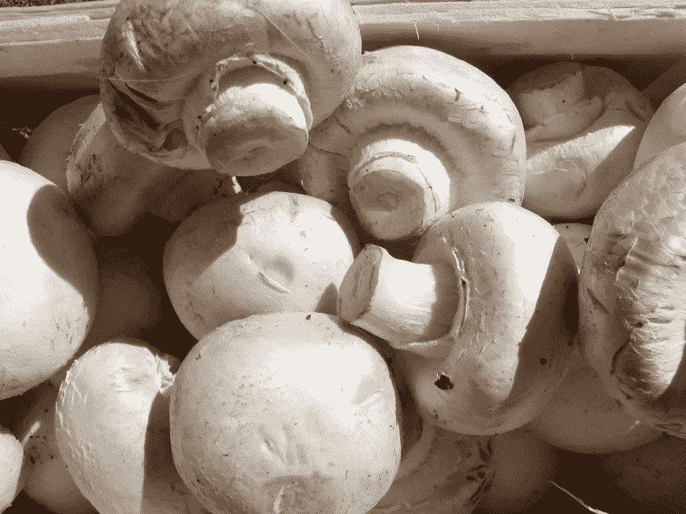
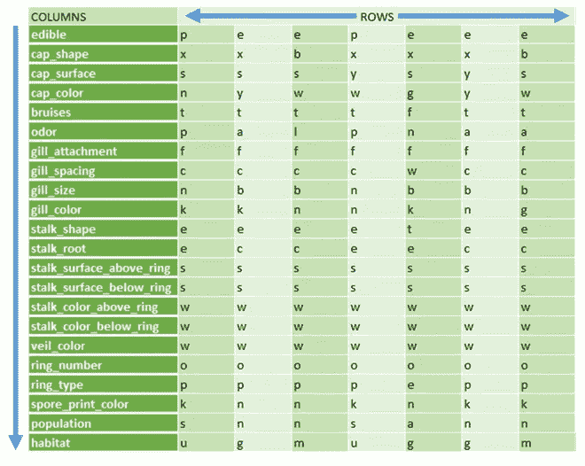
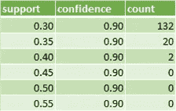
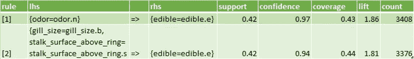
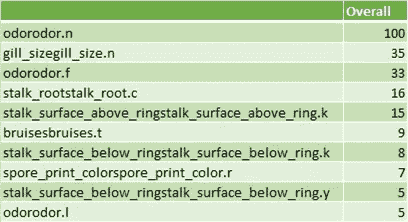
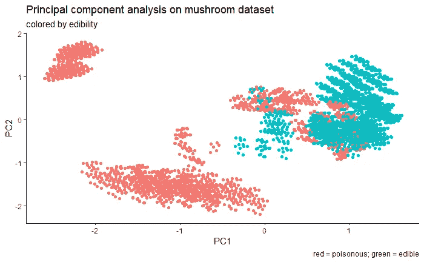

# 《超越销售》中的先验分析

> 原文：<https://towardsdatascience.com/apriori-analysis-in-r-beyond-sells-ffdf56c1d95c?source=collection_archive---------46----------------------->

apriori 算法经常用于所谓的“购物篮分析”中，以确定给定商品是否与其他商品一起被更频繁地购买(就像著名的啤酒和尿布的例子)。由于这是一个相当特殊的用例，我想测试一下我是否能在一个不处理销售的数据集中发现任何模式。我从来自[的**蘑菇数据集**开始，这里的](http://archive.ics.uci.edu/ml/datasets/Mushroom)包含了来自 Audubon Society 的北美蘑菇野外指南的蘑菇记录，仅限于蘑菇属和蘑菇属中的 23 种带菌蘑菇。潜在的假设是，我将根据他们的描述重新提取不同的物种。
顺便说一句，有一种蘑菇是众所周知的广泛传播的沙拉/比萨饼/汤/*把你的菜放在这里*配料:普通的蘑菇*双孢蘑菇*:



资料来源:达科尼，CC BY-SA 2.5，[https://commons.wikimedia.org/w/index.php?curid=671026](https://commons.wikimedia.org/w/index.php?curid=671026)

首先，我们读入数据文件并从 agaricus-lepiota.name 文件中获取列名。为了更好地呈现表格，我必须翻转它，这样您可以看到列和行交换了，但仍然可以破译所有列名和前几行。数据集包含 22 列和 8124 行。对每个特征中的参数分布执行快速检查，我们检测到列“veil_type”只包含一个值，因此我们可以删除它，因为它不提供任何附加信息来对蘑菇进行分类。

```
path <- "my path on computer"
df <- read.table(file.path(path, "agaricus-lepiota.data"), sep=",")
names <- c("edible","cap_shape", "cap_surface", "cap_color", "bruises","odor","gill_attachment","gill_spacing", "gill_size","gill_color","stalk_shape","stalk_root","stalksurface_abovering","stalksurface_belowring","stalkcolor_abovering","stalkcolor_belowring","veil_type","veil_color","ring_number","ring_type","sporeprint_color","population","habitat")
colnames(df) <- names
as.data.frame(t(head(df))) #the table is flipped for demonstration purposes#check, if there are columns of constant values
for (i in 1:ncol(df)){
  if(length(table(df[,i], exclude=NULL))<2){
    print(colnames(df)[i])
  }
}
table(df$veil_type, exclude=NULL)
#veil_type has only 1 value
df <- df[ , -which(names(df) %in% c("veil_type"))]
```



接下来，我们加载库并将数据集转换成 arules 包中实现的 apriori 算法所期望的形式。

```
library(arules)
for (i in 1:ncol(df)){
  df[,i] <- paste(colnames(df)[i], df[,i], sep=".")
}
## create transactions
fungi <- as(df, "transactions")
```

为了对算法有一个感觉，我首先试图找到一些与蘑菇的可食用性相关的规则(尽管，正如已经提到的，这不是分析的目标。先验的优势应该是它的特征识别能力，而不考虑目标，因为它通常是普通机器学习分类算法的情况)。该规则是与特征“可食用”相关联的特征的组合，其形式为“{x，y，z} = >可食用”(给定 x，y，z，特征“可食用”跟随其后)。然而，我需要设置一个门槛，来确定我对某个规则有多自信。这可以通过改变不同的标准来实现:
**支持度**告诉我们，在数据集中观察到特定特征组合的频率，例如，0.1 的支持度对应于 0.1 x 8124 = 812 个样本，这意味着至少 812 个样本符合规则“x & y & z &可食用”。
规则的**置信度**是指给定其左侧的特征组合的频率:置信度({x，y，z} = >可食用)= x & y & z &可食用/ x & y & z。此关系回答了以下问题:在数据集的所有蘑菇样本中，符合规则“x & y & z”的，有多少也符合“x & y & z 【T24arules 包的实现算法也允许控制规则的最小和最大长度(minlen，maxlen)。让我们来看看:

```
library(tidyverse)
supps <- c(); confs <- c(); nums <- c()
for (supp in seq(0.3, 0.7, by=0.05)){
  for (conf in seq(0.5, 0.9, by=0.05)){
    #run apriori algorithm looping over different support and confidence levels
    rules <- apriori(fungi,parameter = list(supp = supp, conf = conf, target = "rules", minlen=2,maxlen=22))
    #limit set of rules to ==>"edible"
    rules_sub <- subset(rules, subset = rhs %in% "edible=edible.e")
    #extract results
    supps <- c(supps,supp); confs <- c(confs, conf); nums <- c(nums,rules_sub@lhs@data@Dim[2])
  }
}
#combine results to data frame
results <- data.frame(support=supps,confidence=confs, count=nums)
results %>% arrange(desc(confidence)) %>% head(.)
```



我们看到，0.4 x 8124 = 3249 个蘑菇样本符合两个规则，其中“可食用”条件的置信度为 0.9。还不错。让我们仔细看看这些:

```
#repeat modeling with pre-selected thresholds for support and confidence
rules <- apriori(fungi,parameter = list(supp = 0.4, conf = 0.9, target = "rules", minlen=2,maxlen=22))
#limit set of rules to ==>"edible"
rules_sub <- subset(rules, subset = rhs %in% "edible=edible.e")
inspect(rules_sub)
```



这就是了。apriori 算法已经确定了这样的规则，即如果没有气味，蘑菇是可食用的。这条规则的置信度为 0.97，这意味着 97%的无气味蘑菇是可食用的(在我们的数据集中！).> 1 的 **lift** (可以解读为气味和可食用性之间的一种相关性)告诉我们，这两个特征之间存在正相关关系。第二条规则更有趣一点。它告诉我们，宽鳃(鳃大小)和环上光滑的柄表面与蘑菇的可食用性有正相关。至少在 94%的宽鳃、光滑柄的伞菌标本中发现了它。
让我们用一个快速而肮脏的随机森林简单地检查一下结果，如果我们得到了鉴别可食用性的相似特征:

```
library(caret)
table(df$edible)
fit_control <- trainControl(method = "cv",number = 10)
set.seed(123456)
rf_fit <- train(as.factor(edible) ~ .,data = df,method = "rf",trControl = fit_control)
rf_fit
saveRDS(rf_fit, file.path(path, "fungiEdibility_RF_model.rds"))
rf_fit <- readRDS(file.path(path, "fungiEdibility_RF_model.rds"))
varImp(rf_fit)
```



不错！随机森林还选择气味作为区分食用蘑菇和毒蘑菇的最重要特征。但这不是我们分析的目标。我们仍在寻找数据集内的 23 个不同物种或任何有趣的模式。

因此，我再次运行该算法，现在不是寻找规则，而是寻找频繁的特征组合。我将特性集的最小长度设置为 15。

```
#run apriori
itemset <- apriori(fungi,parameter = list(supp = 0.1, conf = 0.98,target = "frequent", minlen=15,maxlen=22))
#get top items
top_items <- data.frame(as(items(itemset), "list"))
top_items <- cbind(as.data.frame(t(apply(top_items,2,function(x) sub("[[:alpha:]]+_?[[:alpha:]]+=", "", x)))),itemset@quality)
#spread top items into a tidy dataframe
df2 <- df[0,]
colnames(df2)
for (rownr in 1:nrow(top_items)){
  for (cols in 1:(ncol(top_items)-3)){
        feature <- substring(top_items[rownr,cols], 1, unlist(gregexpr("\\.", top_items[rownr,cols]))-1)
        type <- substring(top_items[rownr,cols], unlist(gregexpr("\\.", top_items[rownr,cols]))+1)
      for (i in 1:ncol(df2)){
        if(feature==colnames(df2)[i]){
          df2[rownr,i] <- type
        } 
    }
  }
}
#exclude columns which have never been selected by apriori 
non_na_cols <- c()
for (k in 1:ncol(df2)){
  if(sum(is.na(df2[,k]))!=nrow(df2)){
    non_na_cols <- c(non_na_cols,colnames(df2)[k])
  }
}
df2[,non_na_cols]
```

在这里，我再次翻转表格，以便您可以更好地阅读。我还添加了由算法识别的不同特征的选定级别的翻译。


有趣的是，该算法只识别了可食用蘑菇的模式，这可能是因为有毒蘑菇的可变性更高，而不是可食用蘑菇。我们还看到，有一个所有特征集共有的子特征集(可食用&木质&擦伤&无气味&无鳃&鳃间距紧密&鳃宽&茎尖逐渐变细&球茎根&茎表面光滑&白色面纱&一个垂环)。这个典型的特性集让我强烈地想起了按钮蘑菇。让我们看看这个描述在确定物种方面能走多远。网页提供了不同蘑菇种类的检索表。从第一页开始，我们浏览描述。由于我们没有读到任何关于我们的蘑菇生长在其他蘑菇上的东西(而是在树林中独居)，问题 1 引出了问题 2，我们肯定地回答了问题 2(我们的蘑菇有鳃)。我们进一步遵循这个关键:3)不像上面那样→ 4)腮不沿着茎向下延伸(我们的腮是自由的)→去腮蘑菇。到目前为止，一切顺利。该链接将我们带到下一个[页面](https://www.mushroomexpert.com/agaricales.html)。根据检索表，我们得到:1)有面纱，没有鱼腥味→ 2)孢子不是粉红色的→ 3)鳃不是黄色的，没有沿着茎向下延伸→ 4)孢子印痕不是橙色的→ 6)孢子印痕是深色的(棕色，黑色)。我们只在两个特征集中有这个特征，但是我假设如果偏离到淡色蘑菇是重要的，它会被算法拾取。跟着上的[键，我们就到了(我在这里省略了键的读数，如果你愿意，你可以从头到尾走一遍):1 → 3 → 12 → 21 → 26 →蘑菇。太好了，算法找到了一些蘑菇的共同特征。我们在网页上读到了一个不太乐观的说法，“你不应该期望能够识别你收集的每一个蘑菇”。事实上，前两个问题已经让我们没有了答案，因为切片时的肉色特征或蒙特利柏树关联在数据集中没有得到解决。我猜奥杜邦协会野外指南的原始答案可能会对这个问题有所启发，然而不幸的是我没有获得这个资源。唯一令人欣慰的是，如果对白色瓶盖的颜色回答“是”，就会出现双孢蘑菇按钮。](https://www.mushroomexpert.com/gilled_dark.html)

那么，从这个玩具分析中，我的**收获**是什么呢？该算法明确地选择了所有蘑菇属蘑菇共有的特征集。然而，我会猜测，从 8124 个样本/ 23 个物种=每个物种 353 个样本开始，该算法会选择其他物种共有的特征集。事实上，对数据集进行快速主成分分析清楚地表明，可食用(绿色)和有毒(红色)样品中存在明显的聚类，很可能对应于不同的物种。

```
theme_set(theme_classic())
#encode factors to hot-one, as PCA works on numeric features only
dummy <- dummyVars(" ~ .", data=df, fullRank=T)
df_hotone <- data.frame(predict(dummy, newdata = df))
mypca <- prcomp(df_hotone) ;  myscores <- mypca$x[,1:3] #scores
#add PCA results to table 
df_hotone_PCA <- cbind(df_hotone,myscores)
ggplot(df_hotone_PCA, aes(PC1,PC2))+
  geom_point(aes(color=factor(edibleedible.p, levels=c("1","0"))))+
  theme(legend.position = "none")+
  labs(title="Principal component analysis on mushroom dataset",subtitle = "colored by edibility", caption = "red = poisonous; green = edible")
```



作者图片

这就结束了这个相当令人失望的分析。我猜想，为了破译对应于数据集不同物种的特征集，需要进一步调整 apriori 算法或转向另一种方法。肯定是有提升空间的，所以还是撸起袖子继续分析吧……另一个故事。