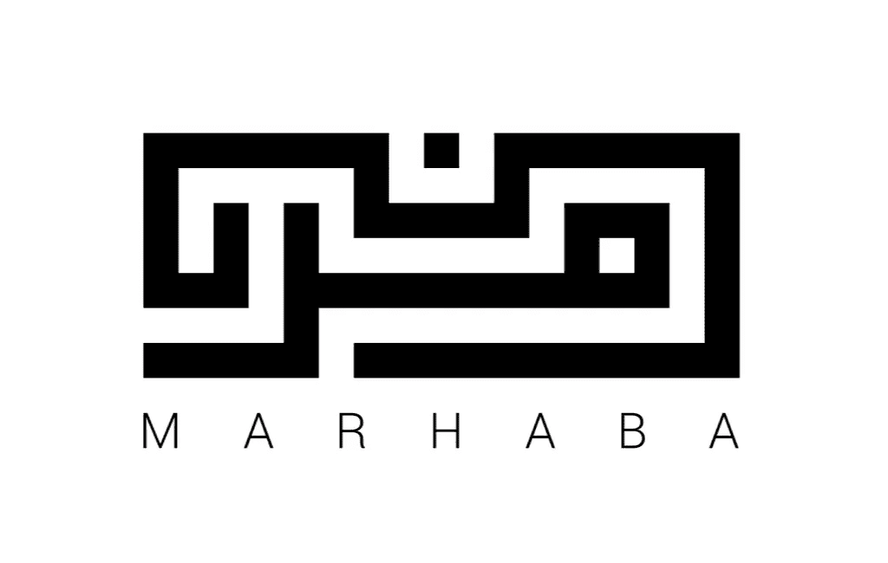
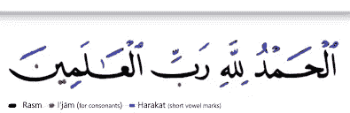

# 阿拉伯语自然语言处理:独特的挑战及其解决方案

> 原文：<https://towardsdatascience.com/arabic-nlp-unique-challenges-and-their-solutions-d99e8a87893d?source=collection_archive---------6----------------------->

## 使用 camel-tools Python 包为机器学习预处理阿拉伯文本



理查德·佩格林的授权图片

在这篇文章中，我提供了一个简明扼要的概述，介绍了在 NLP 项目中使用阿拉伯文本所面临的挑战，以及克服这些挑战的可用工具。我非常依赖于 NYU 阿布扎比骆驼实验室开发的骆驼工具(camel-tools)和 Python 包(Python package)，以及由主任 Nizar Habash 博士(T7)主持的精彩网络研讨会。为他们在这一领域所做的开创性工作以及让公众可以使用他们的工具而大声欢呼吧！

# 挑战

在 NLP 项目中使用阿拉伯文本面临(至少)5 个独特的挑战:

1.  字符的形式和单词的拼写可以根据它们的上下文而变化(奇特的术语:**拼写歧义**)
2.  同一个动词可以有数千种不同的形式(字面上的意思)
3.  阿拉伯语有许多方言，它们之间有很大的差异
4.  由于阿拉伯语是一种语音语言(你写的就是你说的)，当用方言阿拉伯语写作时，可以有不同的方式来写同一个单词，对此没有一致同意的标准(**拼写不一致**)。

阿拉伯语的这四个不同特征都有助于*数据稀疏*。因为有许多不同的单词形式、潜在的不同拼写以及大量的方言，最终可能会有一个 NLP 词汇表达到数百万个单词。这并不是夸大其词:阿拉伯语中的一个动词可以有多达 5400 种形式。)相比之下，英文最多有 6 篇，中文只有 1 篇。

# 解决方法

但是不要害怕！当你被困在资源匮乏的语言的沙漠中，而你的管道停留在一些液体代码上，让你继续前进的时候…会出现一只神奇的、用户友好的骆驼**来帮助你:


图片经由[https://giphy.com/gifs/flaticons-xsWJYMcYexVQJbHzLS](https://giphy.com/gifs/flaticons-xsWJYMcYexVQJbHzLS)

```
pip install camel-tools
```

**我们将把对这个方案的公然自我东方化名称的后殖民评论留到下一天，好吗？

下面我将分享我使用 **camel-tools** 软件包预处理我的阿拉伯文本和处理阿拉伯语言带来的独特挑战的步骤。

**注意**:我假设你已经完成了所有基本的、通用的 NLP 预处理，比如删除重复字符、停用词、表情符号、标签、数字，以及任何 NLP 项目中的其他最佳实践数据清理任务。下面提到的 Github repo 包含了一个完整的阿拉伯停用词列表*，它解释了前面提到的拼写歧义*。**重要提示**:确保将单词“يا”添加到文件中，因为这个词目前不包括在内，而且是一个非常常见的停用词。

注意，NLTK 还包含一个阿拉伯停用词库，但是这个集合忽略了许多常见的拼写不一致。

<https://github.com/mohataher/arabic-stop-words>  

好了，现在让我们开始吧！

## 第一步:去分化

第一步是通过删除文本的附加符号来减少一些严重的数据稀疏。音调符号是位于阿拉伯文本字母上方或下方的符号(在某些情况下相当于英语中的元音)，即下图中的蓝色标记。



[资料来源:en.wikipedia.org](https://en.wikipedia.org/wiki/Arabic_diacritics)

根据上下文，同一个单词可能有不同的发音符号，因此通常的做法是删除这些符号以减少数据稀疏。

从技术上讲，这实际上产生了一个新的问题，因为同一个词根可能有完全不同的意思，这取决于你给它的音调符号……但是我们将在第 4 步处理这个问题。

## 步骤 2:减少拼写歧义

为了解决各种方言中常见的拼写不一致问题(因为一般来说阿拉伯语口语和书面语之间的差距)，下一步是减少拼写歧义。具体来说， **camel-tools** 通过从特定字母(teh-marbuta 中的点和 alef 中的 hamza)中移除特定符号来实现这一点。

## 第三步:简单单词标记化

下一步只是一个简单的单词分词器。我们需要这样做，以便能够将我们的文本输入到下一步的函数中。

## 步骤 4:形态歧义消除

这就是事情变得有趣的地方。还记得我在第一步结束时说过，去掉音调符号实际上会产生一个新问题吗？我们现在只有字根，但从技术上讲，我们无法知道它可能是众多不同单词中的哪一个。例如，下面的单词可能意味着:'*和我们的合同/项链/精神病*或'*'，他强调我们【T3]'，这取决于使用的发音符号、上下文和它所用的方言。*

# وبعقدنا

那么…我们应该选择这个单词的哪种形式呢？

**camel-tools** 软件包带有一个漂亮的“词法分析器”，简而言之，它将你输入的任何单词与一个词法数据库(它带有一个内置的)进行比较，并输出该单词可能的形式和含义的完整分析，包括词条、词性、英语翻译(如果有的话)等。

下面我们对单词'وبعقدنا'.进行一个词法分析

我在下面包含了输出的一部分；这些只是它返回的 20 多个分析中的前 3 个。请注意，它还通过恢复音调符号来“消除”单词的歧义。

```
{'diac': 'وَبِعُقَدُنا', 'lex': 'عُقْدَة_1', 'bw': 'وَ/PART+بِ/PREP+عُقَد/NOUN+ُ/CASE_DEF_NOM+نا/POSS_PRON_1P', 'gloss': '[part.]_+_by;with+complexes+our', 'pos': 'noun', 'prc3': '0', 'prc2': 'wa_part', 'prc1': 'bi_prep', 'prc0': '0', 'per': 'na', 'asp': 'na', 'vox': 'na', 'mod': 'na', 'stt': 'c', 'cas': 'n', 'enc0': '1p_poss', 'rat': 'i', 'source': 'lex', 'form_gen': 'm', 'form_num': 's', 'pattern': 'وَبِ1ُ2َ3ُنا', 'root': 'ع.ق.د', 'catib6': 'PRT+PRT+NOM+NOM', 'ud': 'PART+ADP+NOUN+PRON', 'd1seg': 'وَبِعُقَدُنا', 'd1tok': 'وَ+_بِعُقَدُنا', 'atbseg': 'وَ+_بِ+_عُقَدُ_+نا', 'd3seg': 'وَ+_بِ+_عُقَدُ_+نا', 'd2seg': 'وَ+_بِ+_عُقَدُنا', 'd2tok': 'وَ+_بِ+_عُقَدُنا', 'atbtok': 'وَ+_بِ+_عُقَدُ_+نا', 'd3tok': 'وَ+_بِ+_عُقَدُ_+نا', 'bwtok': 'وَ+_بِ+_عُقَد_+ُ_+نا', 'pos_lex_logprob': -4.923429, 'caphi': 'w_a_b_i_3_u_q_a_d_u_n_aa', 'pos_logprob': -0.4344233, 'gen': 'f', 'lex_logprob': -4.923429, 'num': 'p', 'stem': 'عُقَد', 'stemgloss': 'complexes', 'stemcat': 'N'} 

{'diac': 'وَبِعُقَدنا', 'lex': 'عُقْدَة_1', 'bw': 'وَ/PART+بِ/PREP+عُقَد/NOUN+نا/POSS_PRON_1P', 'gloss': '[part.]_+_by;with+complexes+our', 'pos': 'noun', 'prc3': '0', 'prc2': 'wa_part', 'prc1': 'bi_prep', 'prc0': '0', 'per': 'na', 'asp': 'na', 'vox': 'na', 'mod': 'na', 'stt': 'c', 'cas': 'u', 'enc0': '1p_poss', 'rat': 'i', 'source': 'lex', 'form_gen': 'm', 'form_num': 's', 'pattern': 'وَبِ1ُ2َ3نا', 'root': 'ع.ق.د', 'catib6': 'PRT+PRT+NOM+NOM', 'ud': 'PART+ADP+NOUN+PRON', 'd1seg': 'وَبِعُقَدنا', 'd1tok': 'وَ+_بِعُقَدنا', 'atbseg': 'وَ+_بِ+_عُقَد_+نا', 'd3seg': 'وَ+_بِ+_عُقَد_+نا', 'd2seg': 'وَ+_بِ+_عُقَدنا', 'd2tok': 'وَ+_بِ+_عُقَدنا', 'atbtok': 'وَ+_بِ+_عُقَد_+نا', 'd3tok': 'وَ+_بِ+_عُقَد_+نا', 'bwtok': 'وَ+_بِ+_عُقَد_+نا', 'pos_lex_logprob': -4.923429, 'caphi': 'w_a_b_i_3_u_q_a_d_n_aa', 'pos_logprob': -0.4344233, 'gen': 'f', 'lex_logprob': -4.923429, 'num': 'p', 'stem': 'عُقَد', 'stemgloss': 'complexes', 'stemcat': 'N'} 

{'diac': 'وَبِعُقَدِنا', 'lex': 'عُقْدَة_1', 'bw': 'وَ/PART+بِ/PREP+عُقَد/NOUN+ِ/CASE_DEF_GEN+نا/POSS_PRON_1P', 'gloss': '[part.]_+_by;with+complexes+our', 'pos': 'noun', 'prc3': '0', 'prc2': 'wa_part', 'prc1': 'bi_prep', 'prc0': '0', 'per': 'na', 'asp': 'na', 'vox': 'na', 'mod': 'na', 'stt': 'c', 'cas': 'g', 'enc0': '1p_poss', 'rat': 'i', 'source': 'lex', 'form_gen': 'm', 'form_num': 's', 'pattern': 'وَبِ1ُ2َ3ِنا', 'root': 'ع.ق.د', 'catib6': 'PRT+PRT+NOM+NOM', 'ud': 'PART+ADP+NOUN+PRON', 'd1seg': 'وَبِعُقَدِنا', 'd1tok': 'وَ+_بِعُقَدِنا', 'atbseg': 'وَ+_بِ+_عُقَدِ_+نا', 'd3seg': 'وَ+_بِ+_عُقَدِ_+نا', 'd2seg': 'وَ+_بِ+_عُقَدِنا', 'd2tok': 'وَ+_بِ+_عُقَدِنا', 'atbtok': 'وَ+_بِ+_عُقَدِ_+نا', 'd3tok': 'وَ+_بِ+_عُقَدِ_+نا', 'bwtok': 'وَ+_بِ+_عُقَد_+ِ_+نا', 'pos_lex_logprob': -4.923429, 'caphi': 'w_a_b_i_3_u_q_a_d_i_n_aa', 'pos_logprob': -0.4344233, 'gen': 'f', 'lex_logprob': -4.923429, 'num': 'p', 'stem': 'عُقَد', 'stemgloss': 'complexes', 'stemcat': 'N'}
```

现在，在我的情况下，我正在处理超过 600 万条推文，所以进行逐字分析不会提供太多信息或有效。相反，我们可以使用形态学消歧器(小心，阿诺德！)来为我们做这件事。这将接受一个标记列表作为输入(因此是步骤 3 中的简单单词标记器),并输出所有消除了歧义的标记形式。每个分析都是一个字典，我们可以使用字典键访问我们想要的表单和组件。这些分析按照可能性从大到小的顺序排列，因此通常的做法是简化，将第一个分析指定为输出。

它输出句子中每个单词的二进制形式、词性标记和词条:

```
('نَجَحَ', 'verb', 'نَجَح-a_1')
('بايدن', 'noun_prop', 'بايدن_0')
('فِي', 'prep', 'فِي_1')
('الاِنْتِخاباتِ', 'noun', 'ٱِنْتِخاب_1')
```

例如，这意味着我们可以使用如下函数获取阿拉伯文本的所有词条:

对于我进行主题建模的项目，这是我选择的进行标记化的方式。其他项目可能需要使用形态学标记器的不同方法，它将根据您选择的**方案**对字符串进行不同的标记。

所以…只要找到最适合你的项目的记号化/词条化方法，执行它，然后你就完成了阿拉伯文本的预处理！

# 更多骆驼乐趣

camel-tools 包提供了更多的预处理特性(比如音译、unicode 标准化等)。)可能对你的项目有用。查看完整的文档以获取更多信息。

  

此外，我只想指出，我做了大量的研究，试图找到为 NLP 预处理阿拉伯文本的最佳工具。虽然有许多其他好的选择(如 Farasa、MADAMIRA 和 Stanford CoreNLP ),但我发现 camel-tools 是最通用、最全面、最易于使用的。除了用于处理上述挑战的核心预处理功能，它还具有一些很酷的额外功能:它可以进行情感分析，并且——这确实是最酷的功能之一——它可以识别文本所用的方言(最多 25 种方言)。我肯定会使用方言标识符将“方言”作为一个特性添加到我的 NLP 管道中。

感谢您的阅读！[在 LinkedIn](https://www.linkedin.com/in/richard-pelgrim/) 上关注我，了解定期的分布式计算更新和技巧。

请考虑成为支持写作社区的媒体成员:

<https://richardpelgrim.medium.com/membership> 