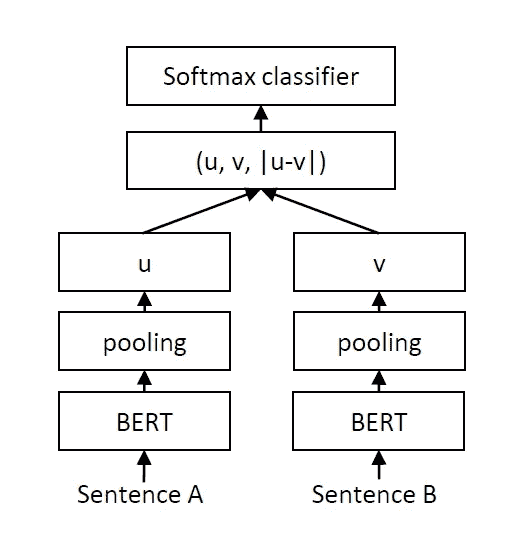
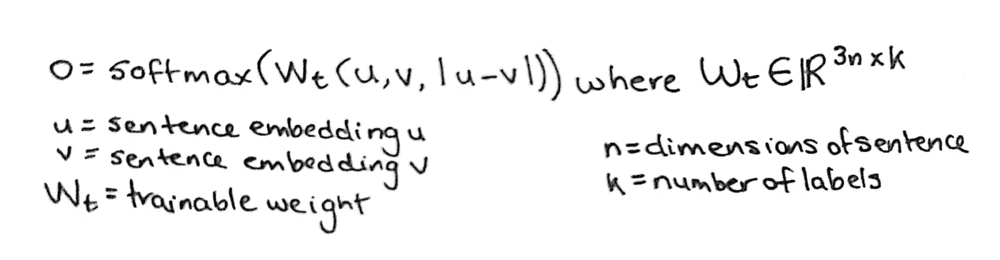
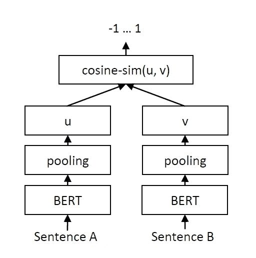
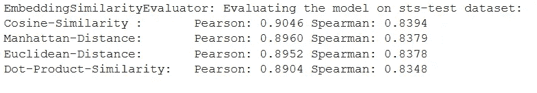

# 多任务学习中的阿拉伯语句子嵌入

> 原文：<https://towardsdatascience.com/arabic-sentence-embeddings-with-multi-task-learning-815801024375?source=collection_archive---------21----------------------->

## [实践教程](https://towardsdatascience.com/tagged/hands-on-tutorials)

## 阿拉伯语自然语言处理教程，通过多任务学习创建阿拉伯语句子嵌入，实现快速高效的语义文本相似性任务。

由[UJI 友子](https://unsplash.com/@ujitomo?utm_source=medium&utm_medium=referral)在 [Unsplash](https://unsplash.com?utm_source=medium&utm_medium=referral) 上拍摄的照片

在这个阿拉伯语自然语言处理(NLP)系列的第一篇文章[中，我介绍了一个名为 AraBERT 的 transformer 语言模型(*来自 Transformers* 的阿拉伯语双向编码器表示)，由](/machine-learning-advancements-in-arabic-nlp-c6982b2f602b) [Antoun et al. (2020)](https://arxiv.org/abs/2003.00104) 发布，它在各种阿拉伯语 NLP 基准上表现得非常好。作为典型的最新语言模型，AraBERT 非常大，基本模型有 1.1 亿个参数，大模型有 3.4 亿个参数。当考虑到这些语言模型的规模时，显而易见的是，在语用研究者和最先进的自然语言处理工具的使用之间存在可访问性差距。

正如一个人对资源的访问所决定的，前沿语言模型的卓越结果可以通过大量的生产考虑来强调。例如，研究人员可能会受到计算资源可用性的限制，这种费用不可避免地需要在金钱和时间之间进行权衡。除了令人望而却步的成本，社会研究极大地受益于 NLP 的应用，特别是因为数据驱动的方法提供了研究常见问题的替代角度。这对于中东和北非(MENA)等研究不足的地区尤为重要，在这些地区，纳入阿拉伯文本不仅对问责制至关重要，也有助于避免西方偏见。

在去年写的一篇文章[中，我讨论了我对 transformer 语句嵌入的兴趣，这是我在](https://medium.com/swlh/transformer-based-sentence-embeddings-cd0935b3b1e0)[的一篇研究论文](https://arxiv.org/abs/1908.10084)中遇到的想法，该论文详细描述了从 Transformer 语言模型中训练高效语句嵌入。这篇论文描述了 NLP 任务，如从一组 10，000 个句子中找到最相似的句子对，通过评估语义文本相似性(STS)来确定，将需要使用 AraBERT 这样的 transformer 语言模型进行 5000 万次推理计算。这将需要大约 65 个小时才能完成，这使得 AraBERT 不适合语义相似性搜索或无监督的任务，如聚类。由[泛在知识处理实验室](https://www.informatik.tu-darmstadt.de/ukp/ukp_home/index.en.jsp)的研究人员设计的聪明的解决方案是使用一个暹罗网络架构来训练变形金刚句子嵌入；这使得前面提到的 STS 任务可以在大约 5 秒钟内完成。

他们的创造句子-BERT (SBERT)，非常适合 STS 任务，本教程用代码概述了使用多任务学习(MTL)将这个 NLP 工具扩展到阿拉伯语。我受到了 UKP 实验室的[句子转换库](https://github.com/UKPLab/sentence-transformers)中共享的示例脚本的启发(由 SBERT 作者 Nils Reimer 创建和维护)，它实现了 MTL 来训练英语句子嵌入模型。在本教程中，我首先提供一些关于 STS 和句子嵌入的背景知识，然后讨论 MTL。接下来，我描述了用于训练阿拉伯语句子嵌入模型的实验设置(我将其命名为 SAraBERT)，随后是 MTL 训练的完整代码演练，并对该过程进行了直观的解释。最后，我在一个阿拉伯语的 STS 基准上评估了训练过的模型，并提供了利用这个工具进行社会研究的想法。

# **语义文本相似度和句子嵌入**

STS 与一对句子之间的意义相似度有关，可以用余弦相似度或[曼哈顿](https://en.wikipedia.org/wiki/Taxicab_geometry)/欧几里德距离等相似度度量来衡量。直观上，句子嵌入可以理解为一种将句子映射到向量的文档处理方法，作为一种用适合机器学习的实数表示文本的手段。给定一个句子集合，句子嵌入可以用来将文本单元转换成表示特征的固定大小的输出向量，然后在整个句子集合中进行比较。比较是可能的，因为句子被映射到向量空间，使得语义相似的句子更加接近。以这种方式评估语义相似性对于各种 NLP 任务是有用的，包括信息检索、释义识别、重复问题检测和摘录文本摘要。

在 SBERT 发布之前，其他不太有效的方法被用来从像 BERT 这样的转换模型中创建固定大小的句子嵌入。最常见的是，均值池用于平均 BERT 的输出层，或者通过使用[CLS]令牌(BERT 嵌入中的第一个令牌，分类令牌)的输出。SBERT 作者表明，这两种类型的句子嵌入在 STS 任务中表现不佳，通常比平均的[手套单词嵌入](https://nlp.stanford.edu/projects/glove/)(使用全局统计学习单词向量表示的无监督算法)更差。这是值得注意的，因为与手套单词嵌入相比，来自 BERT 类型模型的单词嵌入在大多数 NLP 基准上具有显著更高的分数。然而，平均单词嵌入的不良表现表明，单独汇集不能产生非常适合句子级相似性任务的句子嵌入。

这使得像 SBERT 这样的句子嵌入成为必要，SBERT 使用一个连体结构，其中两个网络具有绑定的权重。为了在 STS 任务中获得最佳性能，SBERT 从预先训练的 BERT 模型开始，并使用一个连体设置来微调模型；首先在自然语言推理(NLI)数据集上，然后在 STS 数据集上进一步微调。

在 NLI 数据集上微调句子嵌入的 SBERT 暹罗网络体系结构。[出处。](https://arxiv.org/abs/1908.10084)

从上图可以看出，当微调 NLI 数据集时，两个句子嵌入 *u* 和 *v* 是从合并的伯特单词嵌入中产生的。它们与基于元素的差⏐*u-v*⏐连接，然后乘以可训练权重(w*t*)；其中 W *t* ∈ ℝ *ⁿ*ᵏ* ，并且 *n* 是句子嵌入的维度， *k* 是标签的数量。这可以由下面的分类目标函数来表示，该分类目标函数通过交叉熵损失来优化。

在 NLI 数据集上微调句子嵌入的分类目标函数。图片作者。

当在 STS 数据集上进行微调时，使用回归目标函数，其中通过计算两个句子嵌入 *u* 和 *v* 之间的余弦相似度，并且使用均方误差损失作为损失函数。回归目标函数表示为*余弦 _sim* ( *u* ， *v* )损失函数为:| |*input _ label*—*cos _ score _ transformation*(*余弦 _sim* ( *u* ，*v*)| |，其中默认*cos _ score _ transformation*为 a

SBERT siamese 网络架构，具有回归目标函数，用于对 STS 数据集进行微调。[来源。](https://arxiv.org/abs/1908.10084)

# 多任务学习

MTL 依赖于知识的归纳转移；不是孤立地为单个任务训练模型，而是可以并行地为几个相关的任务训练模型，以便在任务之间共享学习到的信息。引用[卡鲁阿纳(1998)](https://link.springer.com/article/10.1023/A:1007379606734) 经由[塞巴斯蒂安·鲁德](https://arxiv.org/abs/1706.05098)的话，“MTL 通过利用相关任务的训练信号中包含的特定领域信息来提高概括能力。”。对于深度神经网络的多任务学习的可访问概述，我建议 [Ruder 关于主题](https://ruder.io/multi-task/)的博客文章，为了简洁起见，我在本文中限制了细节，并专注于高级概念。

本质上，这种学习方法利用任务之间的共性和差异来训练更好地概括的模型。通常，正则化通过统一惩罚复杂性来防止过度拟合；然而，相比之下，MTL 正则化是通过要求在相关任务上的良好表现来诱导的。换句话说，存在一种归纳偏差，即模型倾向于解释一个以上任务的假设，这种偏好提高了泛化能力。这种归纳偏差意味着 MTL 在小数据集或类标签欠采样时特别有效。除了正则化，MTL 还引入了隐式数据增强和注意力集中。从某种意义上说，MTL 隐含地增加了样本量，允许模型学习更一般的表示；这是因为，联合学习两个任务平均了来自不同任务的数据相关噪声模式。MTL 的注意力集中是通过突出重要特征来实现的，这是可能的，因为该模型从其他任务中获得了特征相关或不相关的额外证据。

自 2018 年以来，根据对可用文献的调查，MTL 已多次被用于阿拉伯语自然语言处理研究，特别是与阿拉伯方言有关的[翻译模型](https://www.hindawi.com/journals/cin/2018/7534712/)，以及社交媒体上的[攻击性语音检测](https://www.aclweb.org/anthology/2020.osact-1.16/)。2019 年， [Abdul-Mageed et al.](https://arxiv.org/abs/1911.00637) 使用句子级 BERT 模型和句子级 MTL 模型，从带注释的阿拉伯语推文中对年龄和性别进行分类；在一项研究中，他们发现 MTL 双任务模型不如单任务伯特模型。研究人员将他们的模型描述为语言不可知的，因为他们的模型建立在句子级别的多语言 BERT(MBERT)模型上，并针对阿拉伯文本样本的分类任务进行了微调。我选择了一种不同的方法，我创建了一个句子级的阿拉伯语 BERT 模型(SAraBERT ),它已经用阿拉伯语 NLI 和 STS 数据进行了微调。这是因为我对特定于阿拉伯语的句子嵌入感兴趣，这些句子嵌入可以用于 *STS 任务*，比如文本摘要。此外，当前最先进的阿拉伯文本分类方法是使用 AraBERT 单词嵌入([发布于 2020 年](https://arxiv.org/abs/2003.00104))。

## **实验设置**

在本教程中，MTL 用于在一个共享任务中对两个数据集(NLI 和 STS)的句子级阿拉伯特(SAraBERT)模型进行微调，而不是每次对每个数据集的单个任务进行顺序微调。具有交叉熵损失的分类目标函数用于 NLI 数据集，具有均方误差损失的回归目标函数用于 STS 数据集。联合学习包括来自每个任务的一个批次与其他任务的所有其他批次相匹配；这种循环匹配以迭代的方式发生。直觉告诉我们，任务之间共享信息会提高概括能力。我使用前面提到的来自 UKP 实验室的[句子变形器](https://github.com/UKPLab/sentence-transformers) Python 库，对于本教程，我使用非分段 AraBERT 模型的第二个版本“bert-base-arabertv02”，它可以通过 [Huggingface 模型](https://huggingface.co/aubmindlab/bert-base-arabertv02)获得。

由于没有开源的特定于阿拉伯语的 NLI 数据集可用，对于 NLI 数据集，我从脸书的[跨语言 NLI 语料库(XNLI)](https://github.com/facebookresearch/XNLI) 中分割出 2490 个阿拉伯语句子对。根据假设和前提之间的关系，这些阿拉伯语句子对被标记为文本蕴涵，每个前提/假设对被标记为“蕴涵”、“矛盾”或“中性”。特别使用 NLI 数据集，因为逻辑蕴涵不同于简单的等价，并且为学习复杂的语义表示提供了更多的信号。

最受欢迎的阿拉伯语 STS 基准， [SemEval-2017 STS](https://www.aclweb.org/anthology/S17-2001/) ，只有 1081 个句子对是从英语翻译过来的。出于对翻译质量和数据集大小的考虑，我选择使用最近发布的由问题对组成的阿拉伯语语义相似度数据集。阿拉伯语[语义问题相似度(SQS)](http://nsurl.org/2019-2/tasks/task8-semantic-question-similarity-in-arabic/) 数据集来自 2019 资源不足语言 NLP 解决方案*研讨会，包含 12，000 个问题对，这些问题对根据两个问题之间的语义相似度标记为“是”或“否”。SQS 数据集比 SemEval-2017 STS 大得多，而且它的优势在于使用阿拉伯语原文。*

# 用多任务学习训练阿拉伯语句子嵌入

本教程的所有代码都是使用 Pytorch 框架的 Python 代码。我建议使用 Google Colab 笔记本，利用自由层 GPU 实例来加快训练速度。第一步是导入所需的包，这些包在下面的代码片段中列出。

下一步是加载 XNLI ( *nli_data* )和阿拉伯语 SQS ( *sts_data* )训练数据集。我们从 XNLI 中分离出阿拉伯语句子对( *arabic_nli_data* )，然后我们在训练期间分割阿拉伯语 SQS 训练集用于验证数据( *sts_data_train，sts_data_test* )，同时保存实际测试集作为维持数据以评估最终模型。

接下来我们将“bert-base-arabertv02”设置为 *model_name* ，并设置训练时保存模型的输出路径。这里，批处理大小设置为 16，这将很容易在 16GB 的 GPU 上运行，这是 Colab 自由层云 GPU 的默认大小。使用三个独立的模块来构建模型:单词嵌入层、均值汇集层和密集层，这些模块堆叠在一起，使得每个连续的模块都从前一个模块的输出开始。最大序列长度设置为 256，其大小与密集层的输出特征相匹配，以保证生成的句子嵌入具有最大序列长度 256。

一个 *label2int* 字典将字符串标签“矛盾”、“蕴涵”和“中性”分别映射到 0、1 和 2。创建一个空数组来保存样本，这些样本是从*Arabic _ nli _ data*data frame 迭代追加的。每个样本都是['sentence1 '，' sentence2 '，' label_id']的列表，这些样本必须加载到 Pytorch 数据加载器中。最后，我们从前面描述的分类目标函数中设置一个损失函数，在这里被视为 SoftmaxLoss。

对于 STS 数据，需要两个空数组，一个用于培训样本，另一个用于开发样本。样本以列表的形式迭代地添加到它们各自的数组中:['question1 '，' question2 '，' label_id']。与 NLI 数据类似，样本被加载到 Pytorch 数据加载器中。余弦相似性损失用于损失函数，其中先前描述的回归目标函数通过余弦相似性得分的均方误差损失来优化。此外，我们创建了一个评估器来使用开发样本测试嵌入的相似性，这一过程也允许我们在训练期间选择最佳模型。

最后，我们为训练设置了几个参数，周期数设置为 4，10%的训练数据用于预热，评估设置为每 1000 步进行一次。训练目标是一个元组列表，每个元组对有一个数据加载器和损失函数，每个任务有一个元组。当拟合模型时，在整个 4 个时期中每 1000 步进行一次评估，并且从每个评估阶段保存最佳模型。

训练后，最后一步是在 STS 测试集中的维持数据上评估模型。为测试样本创建一个空数组，并以类似于 STS 训练数据的方式作为['question1 '，' question2 '，' label_id']列表进行加载。然后加载模型，并创建测试评估器来测试来自测试样本的嵌入的相似性。

下面显示的结果是余弦相似性、曼哈顿距离、欧几里德距离和点积相似性，通过[皮尔逊相关](https://en.wikipedia.org/wiki/Pearson_correlation_coefficient)和[斯皮尔曼相关](https://en.wikipedia.org/wiki/Spearman%27s_rank_correlation_coefficient)指标测量。在 2016 年的一篇题为 [*面向任务的语义文本相似性内在评估*](https://www.aclweb.org/anthology/C16-1009/)*的论文中，Reimer 等人得出结论，皮尔逊相关性的内在评估具有误导性，Spearman 相关性度量更适合评估 STS 任务。通过这种度量，SAraBERT 获得了 83.94%的分数，Spearman 相关性代表了准确确定两个问题是否相似的能力。*

**

*在阿拉伯语义问题相似性基准上保持测试数据的评估。图片作者。*

*下一步包括试验其他方法来训练阿拉伯语句子嵌入，并评估 SAraBERT 能够在多大程度上总结阿拉伯语文本或执行语义搜索。在 Colab 中训练 SAraBERT 只需要不到 5 分钟的时间，而且有了个人电脑，就可以相当快地为大型语料库生成阿拉伯语句子嵌入。*

## *最后的想法*

*如果过去几年有任何迹象，越来越大的语言模型的趋势将继续主导 NLP 领域，使研究人员有必要关注可访问性。我将资源限制视为创造力的挑战，幸运的是，有一个大型开源社区共享代码和预先训练的模型。尽管有这些模型，但是，实现的实用性取决于正确地将工具与任务结合起来。使用 SAraBERT 进行快速有效的阿拉伯语句子嵌入，使得快速利用各种依赖语义搜索的 NLP 技术成为可能。就我的研究而言，这使得为政策评估进行文本摘要和信息检索的实验变得容易。此外，可以将 SAraBERT 用于无监督的任务，如基于句子嵌入的语义相似性的聚类，这为主题识别的任务提供了对传统统计模型如[潜在狄利克雷分配](/topic-modeling-with-latent-dirichlet-allocation-e7ff75290f8)的深度学习替代。*

*MTL 是一个有趣的 ML 范例，我怀疑有更好的选择来训练 STS 任务的句子嵌入，这是我打算在未来探索的一条途径。在我看来，SAraBERT 是一种低资源方法，建立在低资源语言 NLP 工具(AraBERT)上，在低资源设置下训练(免费 GPU +训练时间< 5 mins). My hope is that this cobbled-together creation born out of necessity, will provide utility for other researchers interested in applying Arabic NLP techniques to social research. I welcome questions and feedback, please feel free to connect with me on [Linkedin](https://www.linkedin.com/in/haaya-naushan-a4b5b61a5/) 。最后，非常感谢 UKP 实验室和 Nils Reimer 开源资源，使得本教程成为可能。*