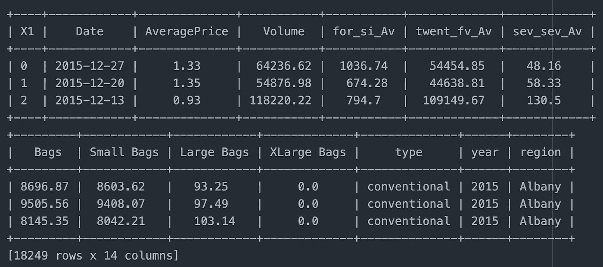
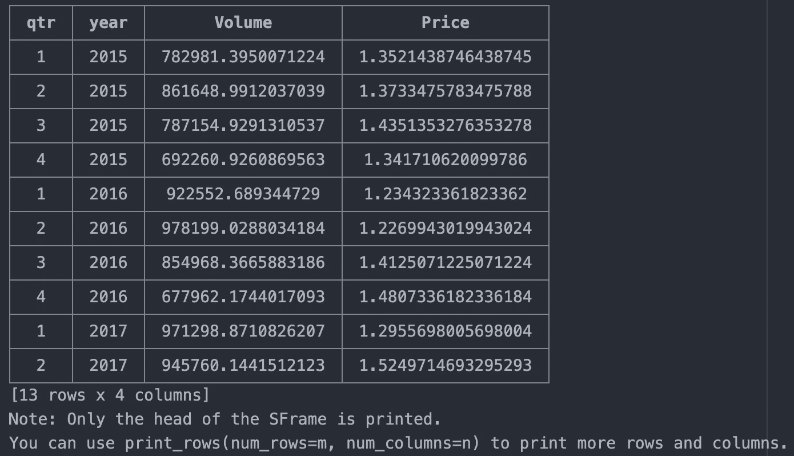
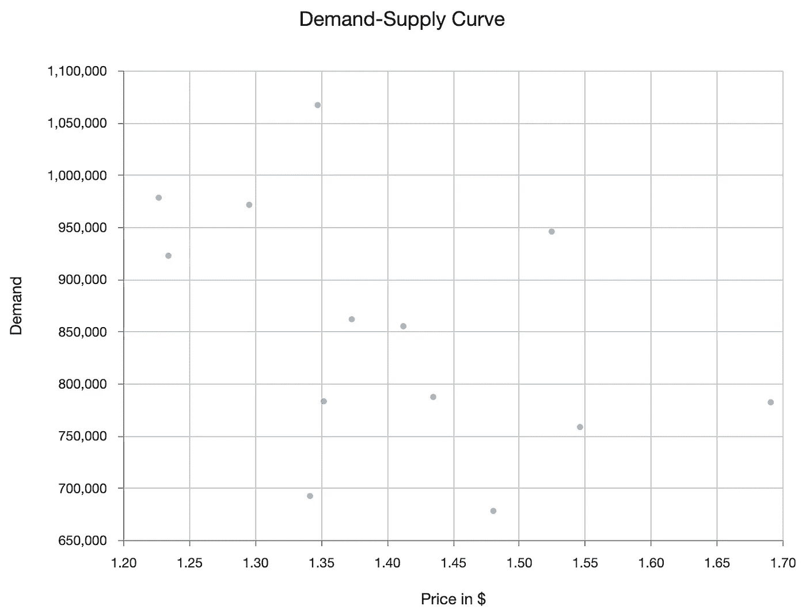
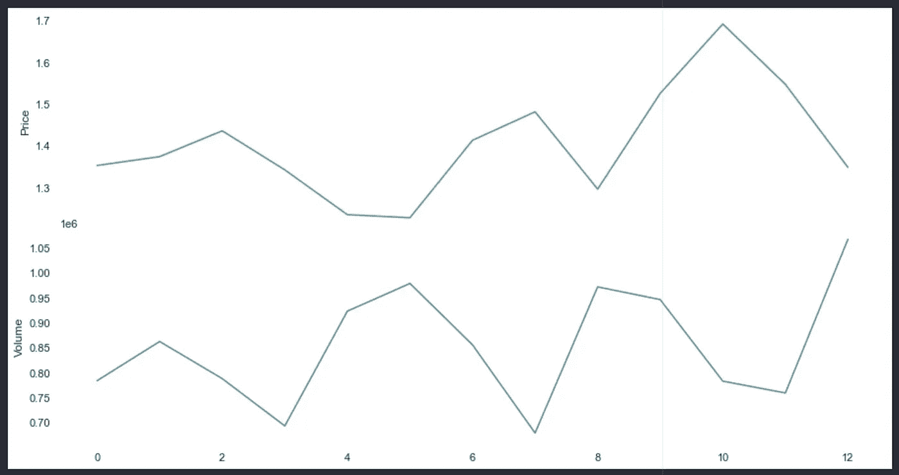
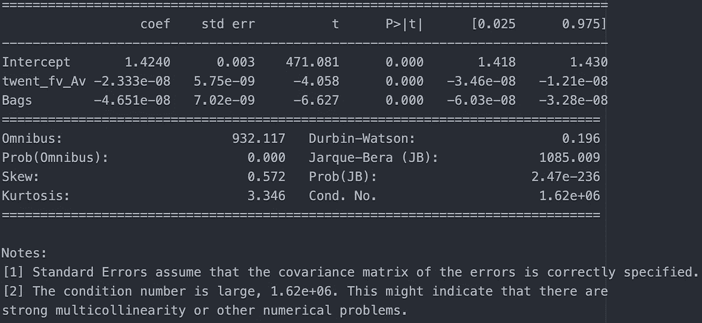
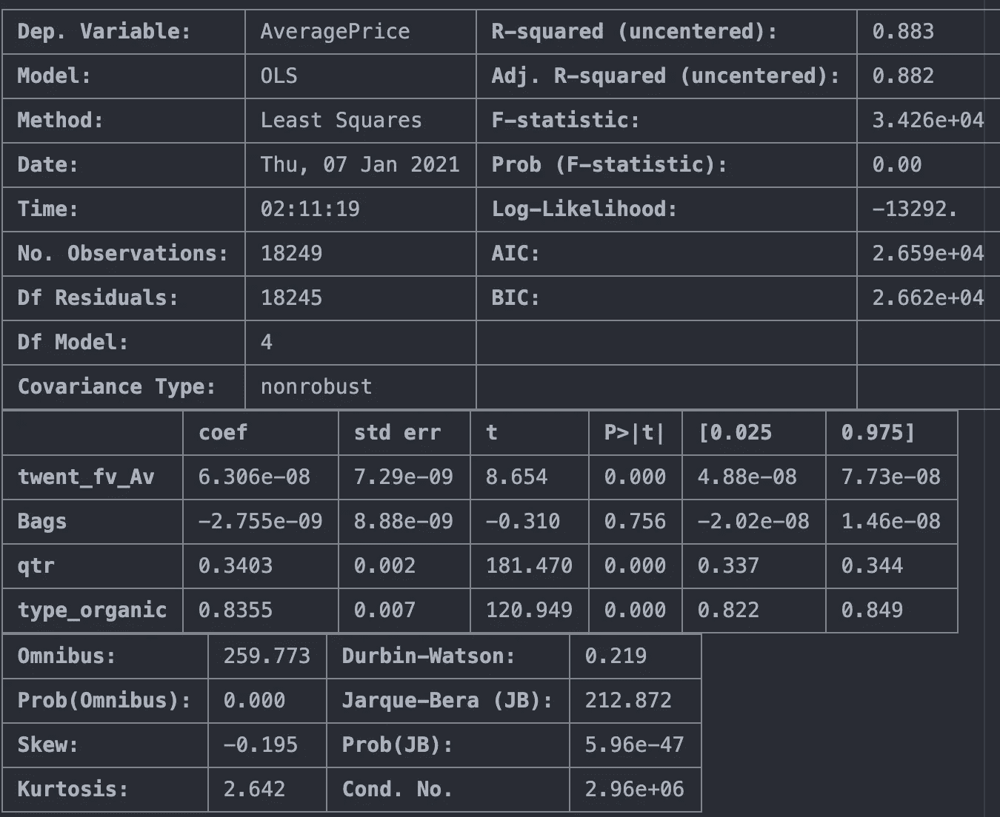
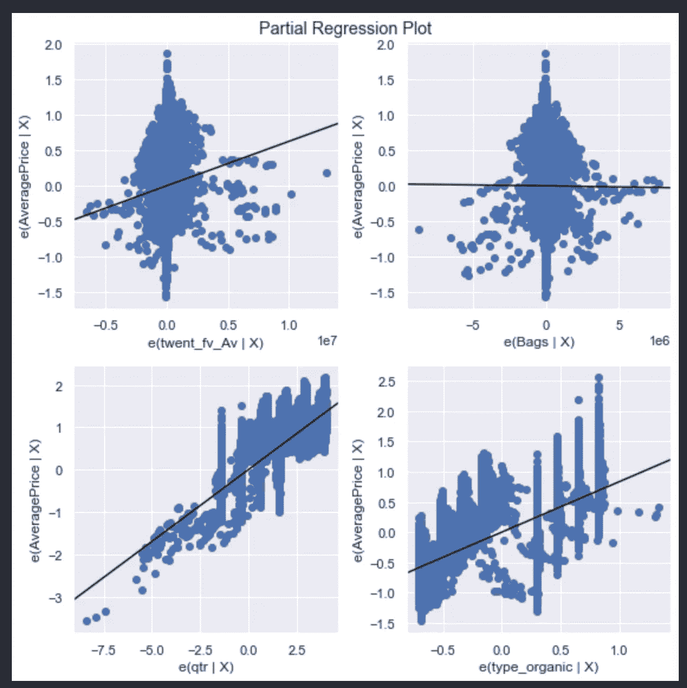
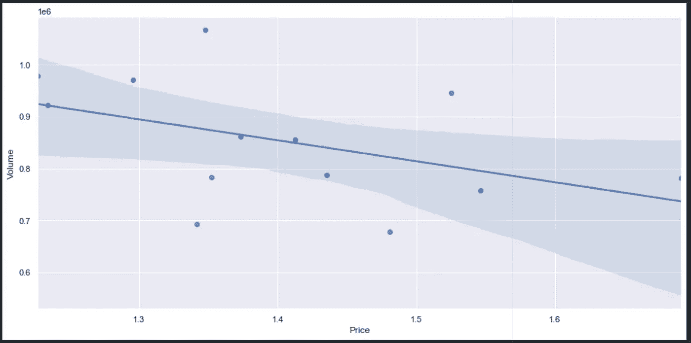

# 牛油果有弹性吗？

> 原文：<https://towardsdatascience.com/are-avocados-elastic-9d072e47605c?source=collection_archive---------37----------------------->

## Python 中需求价格弹性(PED)的温和介绍

2016–2017 年你在哪里？我在纽约——这个城市引领了从时尚到美食，从娱乐到音乐的潮流。我加入了马车，并参与了一些，但有一个让我难以忘怀的是鳄梨面包或鳄梨色拉酱。


照片由 [Unsplash](https://unsplash.com?utm_source=medium&utm_medium=referral) 上的 [Dainis Graveris](https://unsplash.com/@dainisgraveris?utm_source=medium&utm_medium=referral) 拍摄

2017 年，牛油果价格飙升，牛油果价格飙升；我在当地全食超市花了 3.65 美元买了一个哈斯鳄梨。有一个笑话说，所有的千禧一代都很穷，和父母住在一起，因为他们把所有的钱都花在牛油果吐司上了。出于某种原因，这种水果被认为是优质的，并标有较高的价格；其中一个原因是需求。可能还有其他宏观经济因素，如季节性、竞争、天气等，但或多或少，正如我们从经济学理论中得出的结论，价格在很大程度上受需求驱动。

简单来说，如果某样东西不贵，就会有更多的人买，如果某样东西贵，就会有更少的人买。借助于一个叫做 PED(需求价格弹性)的概念，这种确切的行为被量化了。

我想用以下问题来分析这个概念:

> 1.随着时间的推移，鳄梨的供求之间有关系吗？
> 
> 2.牛油果的需求价格弹性是多少？
> 
> 3.需求仅仅取决于价格还是还有其他因素？

## 1.需求价格弹性

PED 测量的是需求 Q 的百分比变化，在其他条件不变的情况下，价格变化 1%。

> *PED =(∂Q/∂P ) * P/Q*

∂Q 是需求的变化，∂P 是价格的变化。

弹性一词与敏感性同义。

在经济理论中，弹性是衡量需求或供给对价格的敏感程度。在市场营销中，消费者对产品价格的变化有多敏感。

## 2.为什么是 PED？

我为什么要为我的产品/商品/服务衡量 PED？

1.  它可以帮助我做出更好的定价决策，即我可以为我的产品设定的最佳价格
2.  如果我降低价格，对需求会有什么影响？
3.  提高或降低价格，收入会下降还是上升？

PED 也可以为许多其他问题提供一个起点。

有了这个基本的了解，让我们继续前进，让我们的绿色手指工作。

## 3.数据

[鳄梨价格数据](https://www.kaggle.com/neuromusic/avocado-prices)可在 Kaggle 上获得，它捕捉了 2015 年至 2018 年水果的平均价格以及销售量。

鳄梨爱好者会注意到三个栏目:

> 4046 —小型/中型哈斯牛油果(~ 3-5 盎司牛油果)
> 
> 4225 —大哈斯牛油果(约 8-10 盎司牛油果)
> 
> 4770 —特大号哈斯牛油果(~ 10–15 盎司牛油果)

其余的不言自明。

让我们加载数据。

```
sf = tc.SFrame.read_csv("avocado.csv")
sf.print_rows(3)
```

哦，顺便说一下…我用的是苹果的 turicreate 框架(【https://github.com/apple/turicreate】T2)，你可以很容易地安装它，使用:

```
pip install -U turicreate
```

如果你发誓忠于熊猫数据帧，那么你也可以使用它，或者如果在执行过程中你不喜欢 turicreate，那么你可以使用

```
df = sf.to_dataframe()
```

有几个难看的列名，我们先修复一下

```
sf = sf.rename({'Total Volume': 'Volume'})
sf = sf.rename({'Total Bags': 'Bags'})
sf = sf.rename({'4225': 'twent_fv_Av'})
sf = sf.rename({'4046': 'for_si_Av'})
sf = sf.rename({'4770': 'sev_sev_Av'})sf.print_rows(3)
```



作者图片

## 4.简单的功能

我试图绘制数据，但 18，249 点没有多大意义。所以，我们暂时把数据卷起来，看看会发生什么。

让我们从数据列中编造一个“季度”变量。

```
qtr = []
for item in sf['Date']:
    date_i = dt.datetime.strptime(item, '%Y-%m-%d')
    qtr.append((date_i.month + 2) // 3)
sf['qtr'] = qtr
```

将按季度和年度汇总数据的临时 SFrame:

```
sf_g = sf.groupby(['year', 'qtr'], tc.aggregate.MEAN(
    'Volume'), tc.aggregate.MEAN('AveragePrice'))
sf_g = sf_g.sort(['year', 'qtr'])# Let's treat the ugly names of the columns as well
sf_g = sf_g.rename({'Avg of Volume': 'Volume', 'Avg of AveragePrice': 'Price'})
```



作者图片

让我们画出曲线

```
tc.visualization.set_target(target='browser')
tc.show(sf_g['Price'], sf_g['Volume'], xlabel="Price",
        ylabel="Demand", title="Demand-Supply Curve")
```



作者图片

不像我们在教科书中看到的那样是一个明显的下降趋势，但是如果我们仔细观察，那么随着价格的上升，鳄梨的销量或多或少会下降。

也许我需要一个更好的曲线。

## 5.需求-供给

让我们暂时转向熊猫数据框架，绘制价格和交易量的时间序列。

```
df_g = sf_g.to_dataframe()def plt_x(): fig, (a1, ax2) = plt.subplots(nrows=2, sharex=True, subplot_kw=dict(frameon=False), figsize=(15, 8))    plt.subplots_adjust(hspace=.0)
    ax1.grid()
    ax2.grid() ax1.plot(df_g['Price'], color='g')
    ax2.plot(df_g['Volume'], color='b')
    ax1.set_ylabel('Price')
    ax2.set_ylabel('Volume') plt_x()
```



作者图片

当我们从 2015 年到 2018 年遍历 13 个数据点时，价格上升的峰值对应着成交量的低谷，反之亦然。

这是一个更好的图表，证实了需求和供给的经济理论。

我们需要更有力的东西来证实我们的假设，也许是统计方法。

## 6.OLS 造型

Statsmodels 提供了一种进入 OLS 的简单方法，这就是我们将在这里使用的方法。

> *零假设:价格和交易量之间没有关系。*

数据集有趣的一点是 Volume = ' 4046 '+' 4225 '+' 4770 '+Bags；所以，我们可以选择模型中的变量。

```
df = sf.to_dataframe() # SFrame to datafamemodel_1 = ols(
    " AveragePrice ~ twent_fv_Av + Bags", data=df).fit()print(model_1.summary())
```



作者图片

p 值小于α = 0.05(显著性值)，因此可以拒绝零假设。

上面那款的问题是 **R** 相当差。这表明，就鳄梨而言，价格不仅是需求的函数，也是其他因素的函数。

让我们做一些改变。

我们有“类型”变量，它极大地影响水果的价格，有机的比传统的要贵。我们可以将它包含在模型中。

```
X = df[['twent_fv_Av', 'Bags','type', 'qtr']]
y = df['AveragePrice']#Encode the categorical variable.
X = pd.get_dummies(X, prefix=["type"], columns=["type"], drop_first = True)
```

再次拟合模型。

```
mod = sm.OLS(y, X).fit()
mod.summary()
```



作者图片

用图形解释结果会更直观。

```
fig = plt.figure(figsize=(8, 8))
fig = sm.graphics.plot_partregress_grid(mod, fig=fig)
```



作者图片

在部分回归图中可以看到一些趋势(每个变量对响应变量的影响，即平均价格)

我不会说他们强壮，但我见过更糟的。

> 1.模型的 r 看起来很好，这意味着 4 个变量结合起来解释了价格值中 88%的可变性。还不错！
> 
> 2.除了“袋子”之外，所有袋子的 p 值都小于α = 0.05，表明它们对价格有影响。

> 因此，鳄梨的价格取决于鳄梨的数量、种类和销售季度。

## 7.PED 和产品

我们知道 PED 公式，但它在现实世界中代表什么呢？

简单规则:

> PED > 1:弹性产品
> 
> PED < 1: Inelastic product

Elastic products are those that are highly sensitive to price changes i.e. a small change in price can cause a major shift in demand. Luxury products such as cars, perfumes etc should be elastic because they are discretionary items i.e. ***他们是‘想要’而不是需要。***

无弹性产品是指那些对价格变化不太敏感的产品，即即使价格大幅变化也不会对需求产生重大影响。 ***为生活寄托的物品落在队列中*** 。如果你生病了，那么你会买 5 美元或 10 美元的药。

***我认为牛油果应该是一种弹性产品，它的 PED 应该是> 1*** *。*让我们来了解一下。

鉴于较大的数据集更嘈杂，让我们使用一个卷到季度。

```
def plt_reg():
    fig, scatter = plt.subplots(figsize=(15, 7))
    sns.set_theme(color_codes=True)
    sns.regplot(x=df_g['Price'], y=df_g['Volume'])plt_reg()
```



嗯…我们知道 PED =(∂Q/∂P ) * P/Q

∂q/∂p =(0.7–1.1)/(1.2–1.7)= 0.8

P/Q = 1.7/0.7 = 2.42

PED = 1.94

***不出所料，PED 因鳄梨> 1 而使其成为一种有弹性的商品。***

源代码可以在我的 [Github](https://github.com/Prashantmdgl9/Price_Elasticity) 上找到。

# 鳄梨酱时间到了

我一直在寻找的三个问题的答案:

> 1 **。随着时间的推移，鳄梨的供求之间有关系吗？**是的，从图表和统计数据来看，情况也是如此。统计模型的 R 为 0.88，这意味着模型中包含的变量解释了价格的大量变化。
> 
> 2.**牛油果需求的价格弹性是多少？** PED 值为 1.94，这是意料之中的，因为鳄梨应该属于弹性产品。
> 
> 3.需求仅仅取决于价格还是还有其他因素？是的，鳄梨的种类、季度销售日期是决定销售量的几个重要因素。

我欢迎反馈和建设性的批评。你可以在推特上找到我