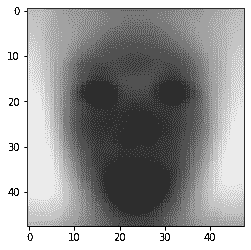

# 情绪是普遍的吗？

> 原文：<https://towardsdatascience.com/are-emotions-universal-55945cd7e0fa?source=collection_archive---------16----------------------->

## 如果是这样，我们如何使用神经网络从面部表情中预测它们？


[腾雅特](https://unsplash.com/@tengyart?utm_source=medium&utm_medium=referral)在 [Unsplash](https://unsplash.com?utm_source=medium&utm_medium=referral) 上拍摄的照片

# 背景和调查目的

在过去的几十年里，在认知科学领域，特别是在情绪理论的主题上，一直存在着争论。一方面，我们有保罗·艾克曼博士，他为情感“自然种类”的存在辩护。他的工作重点是面部表情及其普遍性，以及创造能够揭示这些情绪的测谎仪(Ekman，1997)。这些自然的种类构成了我们使用的基本的、熟悉的名字:“快乐的、愤怒的、厌恶的、恐惧的”。

另一方面，我们有丽莎·巴雷特博士，她为建构主义方法辩护。她的主张是，大脑是一个贝叶斯猜测机器，我们基于几个背景因素来解释情绪(Barret，2006)。对她来说，“皱眉”在某些情况下可能意味着悲伤，在其他情况下可能意味着失望。如何对情感进行分类的决定归结为“细微差别”，而且没有“正确”的答案。

因此，通过这个项目，我打算探索一个具有大约 30，000 幅训练集图像的 Kaggle 数据集，这些图像已经被“正确”分类为具有 7 种情绪之一:愤怒、厌恶、恐惧、快乐、悲伤、惊讶和中性(Pierre-Luc 和 Aaron，2013)。

请找到我在这里使用的确切数据集:【https://drive.google.com/open? id = 1 jztiq 9 fayu 4 tym vy 06 HLM 5 _ BZRthhcxq。

# 用主成分分析法研究自然物质

我首先使用主成分分析研究数据集，以发现面部表情中最具决定性的成分，以及是否有(a)几个重要的成分定义了暗示“自然种类”的表情，或者(b)无数个重要的成分暗示了更微妙的“构建”表情。

# 导入数据

Kaggle 网站上的数据以 CSV 表格的形式呈现。第一列是对人脸上呈现的情绪进行分类:(0 =愤怒，1 =厌恶，2 =恐惧，3 =快乐，4 =悲伤，5 =惊讶，6 =中性)。

第二列包含编码面部的黑白像素的一串值。下面我解码每个字符串条目，并把它们编码成 numpy 数组。

解码了上面的面部图像后，我使用下面的 matplotlib 可视化了前 32 张图像，以确保数据真正转化为图像:

# PCA 分解

```
0.83781
```

```
0.92312
```


图片由作者提供。

正如我们所见，两种分解的碎石图是相似的。对于两者，解释的方差数量呈指数下降，最重要的主成分解释了略低于 0.3 (30%)的方差。因为主成分和解释的方差之间的指数性质，我们用 50 个成分解释了总方差的大约 84%,用 150 个主成分解释了方差的大约 92%,即使我们将成分的数量增加了三倍。向前看，由于解释了增加的方差，我将集中使用 150 分解，尽管我预期我的分类算法对于 150 比对于 50 运行得更慢。

# 主成分重构

现在我已经将每张图片分解成 150 个主要成分，我们可以看看前几个成分是什么样子的，并确定我们是否可以收集一些关于研究问题的见解:


图片由作者提供。

这些乍一看不是很有定论！但是也许通过更仔细地检查其中的一些，我们可以确定一些关于情绪范围的事情。让我们首先关注第一张图片。

第一主分量是具有 48×48 个分量的特征向量。我们可以通过将该特征向量乘以两个不同的特征值来研究维度是如何变化的，并注意图像是如何变化的:


图片由作者提供。



图片由作者提供。

这个特征向量似乎主要与区分面部颜色和背景颜色之间的对比度有关，而与面部表情的差异关系不大。

看着上面的主成分网格，在我看来，数字 14 可能会编码微笑或皱眉或类似的事情。让我们再看一看:


图片由作者提供。


图片由作者提供。

# 讨论和 PCA 结论

首先，除了发现主要组件看起来令人不安之外，我不认为组件的可视化对讨论有任何结论性的帮助。如果至少有几个主要成分清楚地编码了光谱两端的情绪，如“快乐”与“悲伤”，这可能是对自然物种假说的有力支持，但我没有找到这方面的证据(尽管我没有彻底调查每一个成分)。

然而，碎石图也许能提供更多的信息。请注意方差解释是如何呈指数下降的，最初几个主成分之后的后续主成分只增加了一个增量解释。这可能指向人类情感内在的细微差别。当然，这些主成分还编码了与面部结构、肤色、头发等相关的几个特征，因此仅基于它们做出任何界定都是不明智的。也就是说，如果 scree 图真的是相当细微差别存在的证据，这可能是一个支持情感构成的论点。“自然类型”的情况可能会给每种情绪带来很少的区别特征，但这不是我们所看到的:看着可视化，一些似乎编码了眼睛形状，眉毛弯曲，嘴巴形状，以及总共 150 个特征(它们加起来只能解释 92%的面部和表情)。

# 卷积神经网络可以读取情绪吗？利用 VGG16 迁移学习找出

# 训练模型

```
Train on 28709 samples, validate on 7178 samples Epoch 1/10 28709/28709 [==============================] - 1s 21us/step - loss: 13.9044 - accuracy: 0.6616 - val_loss: 1.7528 - val_accuracy: 0.7947 Epoch 2/10 28709/28709 [==============================] - 0s 17us/step - loss: 1.0365 - accuracy: 0.8257 - val_loss: 0.7941 - val_accuracy: 0.8380 Epoch 3/10 28709/28709 [==============================] - 0s 16us/step - loss: 0.6320 - accuracy: 0.8465 - val_loss: 0.5995 - val_accuracy: 0.8471 Epoch 4/10 28709/28709 [==============================] - 0s 16us/step - loss: 0.5235 - accuracy: 0.8521 - val_loss: 0.5234 - val_accuracy: 0.8503 Epoch 5/10 28709/28709 [==============================] - 0s 15us/step - loss: 0.4732 - accuracy: 0.8545 - val_loss: 0.4846 - val_accuracy: 0.8518 Epoch 6/10 28709/28709 [==============================] - 0s 16us/step - loss: 0.4443 - accuracy: 0.8557 - val_loss: 0.4585 - val_accuracy: 0.8530 Epoch 7/10 28709/28709 [==============================] - 0s 15us/step - loss: 0.4266 - accuracy: 0.8562 - val_loss: 0.4412 - val_accuracy: 0.8536 Epoch 8/10 28709/28709 [==============================] - 0s 16us/step - loss: 0.4146 - accuracy: 0.8566 - val_loss: 0.4312 - val_accuracy: 0.8537 Epoch 9/10 28709/28709 [==============================] - 0s 16us/step - loss: 0.4068 - accuracy: 0.8568 - val_loss: 0.4229 - val_accuracy: 0.8540 Epoch 10/10 28709/28709 [==============================] - 0s 15us/step - loss: 0.4014 - accuracy: 0.8569 - val_loss: 0.4183 - val_accuracy: 0.8542 <keras.callbacks.callbacks.History at 0x7fb56aa64e80>
```

```
Train on 28709 samples, validate on 7178 samples Epoch 1/10 28709/28709 [==============================] - 8s 273us/step - loss: 0.5901 - accuracy: 0.8247 - val_loss: 0.4090 - val_accuracy: 0.8571 Epoch 2/10 28709/28709 [==============================] - 8s 267us/step - loss: 0.4036 - accuracy: 0.8558 - val_loss: 0.4004 - val_accuracy: 0.8570 Epoch 3/10 28709/28709 [==============================] - 8s 272us/step - loss: 0.3980 - accuracy: 0.8569 - val_loss: 0.4008 - val_accuracy: 0.8571 Epoch 4/10 28709/28709 [==============================] - 8s 271us/step - loss: 0.3954 - accuracy: 0.8570 - val_loss: 0.4012 - val_accuracy: 0.8571 Epoch 5/10 28709/28709 [==============================] - 8s 271us/step - loss: 0.3938 - accuracy: 0.8571 - val_loss: 0.4032 - val_accuracy: 0.8572 Epoch 6/10 28709/28709 [==============================] - 8s 265us/step - loss: 0.3928 - accuracy: 0.8571 - val_loss: 0.4057 - val_accuracy: 0.8572 Epoch 7/10 28709/28709 [==============================] - 8s 263us/step - loss: 0.3919 - accuracy: 0.8571 - val_loss: 0.4019 - val_accuracy: 0.8571 Epoch 8/10 28709/28709 [==============================] - 8s 262us/step - loss: 0.3918 - accuracy: 0.8571 - val_loss: 0.4018 - val_accuracy: 0.8572 Epoch 9/10 28709/28709 [==============================] - 8s 265us/step - loss: 0.3911 - accuracy: 0.8571 - val_loss: 0.3973 - val_accuracy: 0.8572 Epoch 10/10 28709/28709 [==============================] - 8s 266us/step - loss: 0.3905 - accuracy: 0.8571 - val_loss: 0.3964 - val_accuracy: 0.8572 <keras.callbacks.callbacks.History at 0x7fb56a8ad780>
```

# 评估模型和结论

我们想要评估上述两个模型(基于 PCA 的神经网络和 VGG16 迁移学习神经网络)的最重要指标是验证准确性(显示在拟合过程的输出中)。对于 PCA 模型，我们的验证准确率为 85.42%，对于 VGG16 模型，我们的验证准确率为 85.72%。值得注意的是，这两个结果如此接近，因为第一个是基于简化数据运行的非常简单的模型，第二个是基于从一个获奖算法中提取的特征。VGG16 模型花了 1 分 20 秒来训练，另外 3 分钟用于特征提取过程(总共 4 分 20 秒)。然而，PCA 模型仅花费 3 秒来训练，PCA 分解步骤花费大约 1 分钟(大约 1 分 3 秒)。这意味着精度提高 0.3%需要付出 3 分 17 秒的代价。这还不包括开发 VGG16 算法所花费的时间和精力，相比之下，在 PCA 分解图像上使用简单得多的神经网络。

关于研究问题，这些精度值能告诉我们什么？这两个比率都非常高。这些比率类似于一些专业人员在更确定的类别的分类任务中获得的比率(Shorten，2018 年，讨论了一种类似的方法来将图像分类为狗或猫，他的准确率约为 72%)。

“狗”和“猫”这两个类别是自然的，而不是人类构造的，这一点有很强的论据。我们可能会采用物种形成的传统生物学界限:这两种动物既不能一起繁殖，也不能产生可繁殖的后代(Endler，1977)。关键是，我们的神经网络在对情绪进行分类方面比类似的网络在对科学上离散的类别进行分类方面做得更好。这支持了面部表情表达的情感至少有一些明显不同的类别。

当然，那些反对存在离散的、自然的情感类别的人会争辩说，他们并不反对我们无法对某人的情感做出正确的猜测。他们会特别指出，我们表达情绪的方式强烈依赖于文化因素，因此，我们可能会因为文化习俗而给某人的面部表情贴上标签，而不是因为对不变的、离散的类别有深刻的了解。

我的方法还有进一步的限制。首先，我们的样本可能有偏差。如果我们正在调查情感类别的“普遍性”，那么让我们所有的图像都属于某个特定国家的人将是令人不安的(我没有找到关于这个图像集的人口的特定描述)。第二，研究人员如何选择和分类这些图像可能存在偏见(注意，研究人员不仅为情绪强加了七个类别的存在，而且他们还寻找符合他们自己对这些类别的理解的图像)。数据集的庞大在一定程度上抵消了这些担忧。

当然，观察面部表情可能只是谜题的一部分，而不是争论双方的决定性证据。尽管如此，这个项目强调了即使是机器学习的适度应用也可以为我们提供关于人类大脑如何工作的宝贵见解。今天，研究人员正在使用类似的神经网络来研究可能成为情绪过程基础的大脑路径，从而在不同的分析水平上看待这个问题(Raz，Winetraub，Jacob，Kinreich，Maron-Katz，Shaham，& Hendler，2012)。

# 参考

巴雷特，L. F. (2006 年)。情绪是自然的吗？。心理科学的观点，1(1)，28–58。

埃克曼博士(1997 年)。欺骗，撒谎，和风度。心理状态:美国和后苏联对当代心理学问题的观点，93–105。

恩德勒，J. A. (1977 年)。地理变异、物种形成和梯度(№10)。普林斯顿大学出版社。

皮埃尔-吕克和亚伦(2013 年)。表征学习的挑战:面部表情识别挑战。2020 年 4 月 23 日检索，来自[https://www . ka ggle . com/c/challenges-in-re presentation-learning-face-expression-recognition-challenge/overview](https://www.kaggle.com/c/challenges-in-representation-learning-facial-expression-recognition-challenge/overview)

Raz，g .，Winetraub，y .，Jacob，y .，Kinreich，s .，Maron-Katz，a .，Shaham，g .，… & Hendler，T. (2012 年)。描绘情绪的展开:探索神经网络动力学的多层方法。神经图像，60(2)，1448–1461。

萨卡。(2018 年 11 月 17 日)。在深度学习中用真实世界的应用转移学习的综合实践指南。2020 年 4 月 23 日检索，来自[https://towards data science . com/a-comprehensive-hands-on-guide-transfer-learning-with-real-world-applications-in-deep-learning-212 BF3 B2 f27a](/a-comprehensive-hands-on-guide-to-transfer-learning-with-real-world-applications-in-deep-learning-212bf3b2f27a)

【http://github.com】最初发表于[](https://gist.github.com/edbb98aa426d2c74574ae97f6ac706b4)**。**