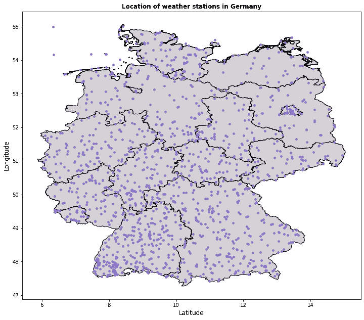
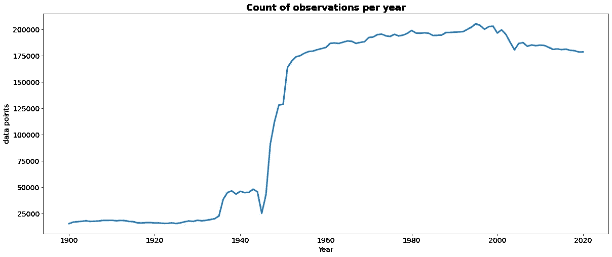
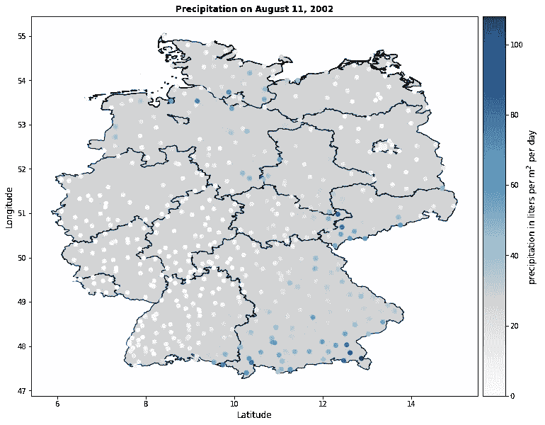
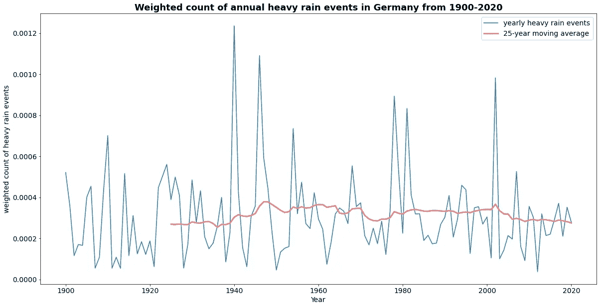
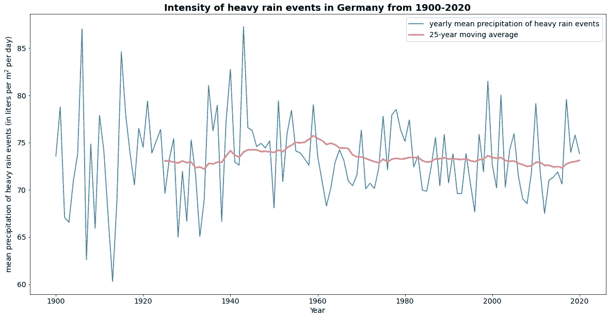
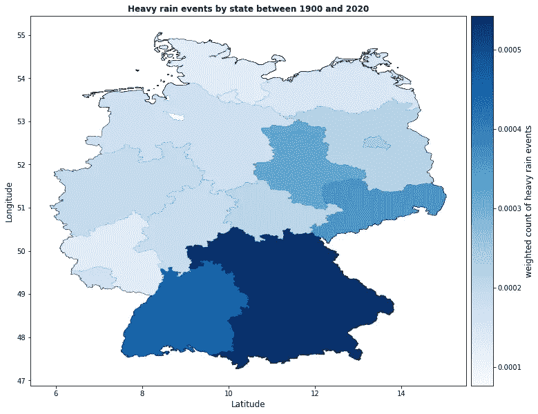
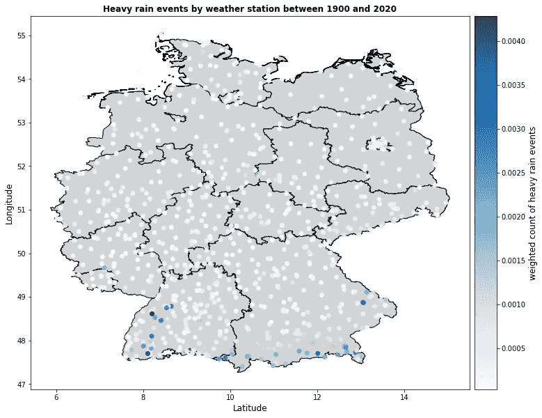

# 德国暴雨事件的频率和强度在增加吗？

> 原文：<https://towardsdatascience.com/are-heavy-rainfall-events-increasing-in-frequency-in-germany-2129b5d9d448?source=collection_archive---------19----------------------->

## 使用数据科学的调查

英格·玛利亚在 [Unsplash](https://unsplash.com/) 上拍摄的照片

2021 年7 月 14 日，北莱茵-威斯特法伦州和莱茵兰-普法尔茨州部分地区一天内降水量超过 100 升/米。后果是 100 多人在洪水中丧生，物质损失达数十亿欧元。

在和一个朋友谈论这件事时，他分享了他的印象，近年来暴雨事件有所增加。我不知道是同意还是不同意。他说的对吗？在德国，这种情况越来越多？它们的强度趋势如何？是不是有些城市的地理位置很不幸，比一般的事件发生得更频繁？

气候变化导致气温上升是一个普遍公认的观察结果，但暴雨事件的趋势在德国新闻媒体中一直是一个不太常见的话题。跟随我踏上旅程，寻找上述问题的答案。我们将从德国 1084 个气象站收集 1900 年至 2020 年的数据。结果是一个包含超过 1650 万次天气观测的数据集。让我们揭开它的秘密。

**我们的数据来自哪里？**德国气象局(Deutscher Wetterdienst)负责收集和归档德国的气象数据。大多数数据都是公开的，可以通过[气候数据中心门户访问。](https://cdc.dwd.de/portal/)我下载了德国所有可用气象站的历史降水数据，删除了缺失的数据，并过滤了 1900 年至 2020 年期间的数据集。

从我们的分析开始，我们可以标绘所有气象站的位置，以检查是否覆盖了每个地区。

数据基础:[德国 Wetterdienst](https://cdc.dwd.de/portal/)

1084 个气象站分布在德国各地。每个州在数据集中至少有几个气象站。然而，德国西南部的气象站比东北部多，这是一个轻微的梯度。

我们来看看数据是什么时候记录的。

数据基础:[德国 Wetterdienst](https://cdc.dwd.de/portal/) ，对单个值进行汇总

二战结束后的几年里，德国的气象观测出现了明显的繁荣。观察中的这种差异值得注意，这意味着在未来的时间序列分析中，我们必须根据每年的观察次数来调整暴雨事件的计数。

当处理数据集时，验证数据的可信度总是一个很好的做法。一种方法是**用已知事件从外部验证数据集。对于这个项目，我们可以看看 2002 年 8 月易北河/多瑙河的洪水。如果数据集是准确的，它应该显示 2002 年 8 月 11 日德国东南部的大量降水导致易北河和多瑙河越过他们的海岸。**

数据依据:[德意志联邦共和国](https://cdc.dwd.de/portal/)

清晰可见的是许多气象站报告高降雨量。因此，数据集的维度时间、位置和降雨量已经证明了它们的可信度。

一次足够验证，让我们深入分析部分:**德国暴雨事件是否越来越频繁？**要回答这个问题，我们首先要了解什么是暴雨事件。这个定义自然因气候区而异。如果你住在巴西雨林，德国的大雨可能会被认为是平常的一天。

德国气象局称[极端事件为](https://www.dwd.de/DE/service/lexikon/begriffe/S/Starkregen.html)，如果:

*   **一小时内降雨量超过每立方米 40 升**或
*   **六小时内降雨量超过每立方米 60 升**

由于历史天气观测只在每日汇总中可用，我不能坚持德国气象局的准确定义。对定义稍作调整，并接受微小的不准确性，我将随后谈论如果**降雨量超过每天每立方米 60 升**的暴雨事件。

也就是说，这是每年暴雨事件总量的图表——根据相应年份的观测总量进行调整。

数据基础:[德国 Wetterdienst](https://cdc.dwd.de/portal/) ，单个值的平均值

这是你所期望的吗？当我第一次看到这个图表时，我很惊讶，因为我暗暗期望看到一个明显的增长。但是我们来详细看一下。

可见的是多年来的高方差，突出了暴雨事件的不可预测性。极端峰值每几十年出现一次，标志着十年或百年一遇的暴雨。然而，25 年移动平均曲线显示，在过去 100 年中，暴雨事件的平均数量没有显著变化。

我们已经看到，到目前为止，德国暴雨事件的平均数量没有增加，现在让我们来看看暴雨强度是否也是如此。

数据基础:[德国 Wetterdienst](https://cdc.dwd.de/portal/) ，单个值的平均值

关于暴雨事件的强度，年变化再次很大。在过去的 100 年里，平均事件的平均降水强度保持不变，约为每立方米 73 升。应谨慎对待 1950 年之前记录的数据，因为观察次数少得多，这解释了数值的极端分散性。

与 1950 年至 1990 年期间相比，2000 年至 2020 年期间出现的峰值更高、更频繁，这表明近年来发生的暴雨事件更加极端。未来必须等待，看看这种观察是否会继续，均值是否会向上修正。

下一次有人问你暴雨事件的数量或强度是否在增加，你现在可以说虽然数量到目前为止似乎没有增加，但其强度在过去 20 年中已经上升了几次。

但是，请注意，所有的统计数据都是根据最佳知识和信念计算的，但不能保证它们的准确性。你也应该经常检查气候研究人员的工作，他们可以使用复杂的模拟工具和可能更多的数据，这些数据可能会也可能不会让他们得出不同的结论。但更多的是在讨论部分。

**现在，你可能会问，地区差异呢？**事件在德国是均匀分布的，还是有几个州更容易受到这些现象的影响？让我们找出答案。

数据基础:[德国 Wetterdienst](https://cdc.dwd.de/portal/) ，单个值的平均值

暴雨事件最有可能发生在巴伐利亚、巴登-符腾堡、萨克森和萨克森-安哈尔特。请注意，我计算了一个加权计数，它独立于每个州运营的气象站的数量。让我们再放大一点。这次是气象站的级别。

数据基础:[德国 Wetterdienst](https://cdc.dwd.de/portal/) ，单个值的平均值

巴伐利亚南部边境和巴登-符腾堡州的暴雨事件数量明显高于平均水平。对此一个可能的解释是这些气象站靠近山脉——阿尔卑斯山和黑森林。除此之外，德国各地似乎只有微小的差异。

**总结词和结果讨论**

这篇博文调查了过去 120 年德国暴雨事件的发生和强度趋势。数据来自德国气象局。尽管每年的事件变化很大，但迄今为止，德国的暴雨事件没有显著增加。虽然平均强度在过去 100 年中也保持不变，但在本世纪的几年中出现了峰值，这一趋势是否会持续还有待观察。

从物理学的角度来看，温度升高 1 度的气团可以多容纳 7%的湿度。这就是为什么科学家们长期以来认为全球变暖也可能影响极端天气事件的原因之一。

来自[美国](https://www.mdpi.com/2073-4441/10/4/350)、[英国](https://www.nature.com/articles/nclimate2927)和[乌拉圭](http://www.ametsoc.net/eee/2017a/ch9_EEEof2017_Abreu.pdf)的研究支持这一论点，并强调了人为全球变暖对各自分析区域极端降雨事件的可能影响。然而，来自德国的两项[研究](https://www.mdpi.com/2073-4441/12/7/1950)没有发现人为气候变化对暴雨事件的明确影响，这表明这些事件中的自然变化可能仍然在今天的德国发挥着更大的作用。

然而，在过去的 20 年里，德国的暴雨事件 **的**后果增加了吗？渐进的土壤密封意味着更少的水可以被地面吸收，这加剧了受影响地区的洪水。****

如果你想更深入地探讨这个话题，这里的[是另一个很酷的地图，让你探索 405 项关于气候变化对极端天气影响的不同研究的结果。](https://www.carbonbrief.org/mapped-how-climate-change-affects-extreme-weather-around-the-world)

如果你对这个项目的代码感兴趣，你可以在我的 [Github](https://github.com/janikvalentin/heavy_rainfall_events) 上查看。

**鸣谢**

如果没有德国气象局(Deutscher Wetterdienst)免费提供的数据，这个项目是不可能完成的。