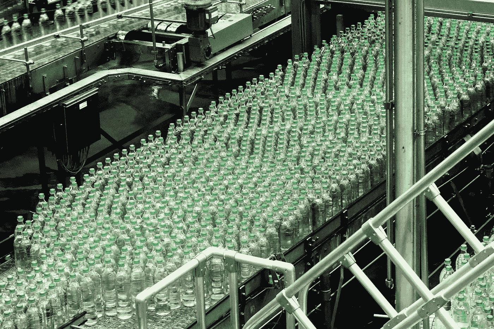
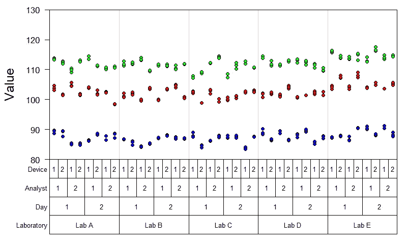
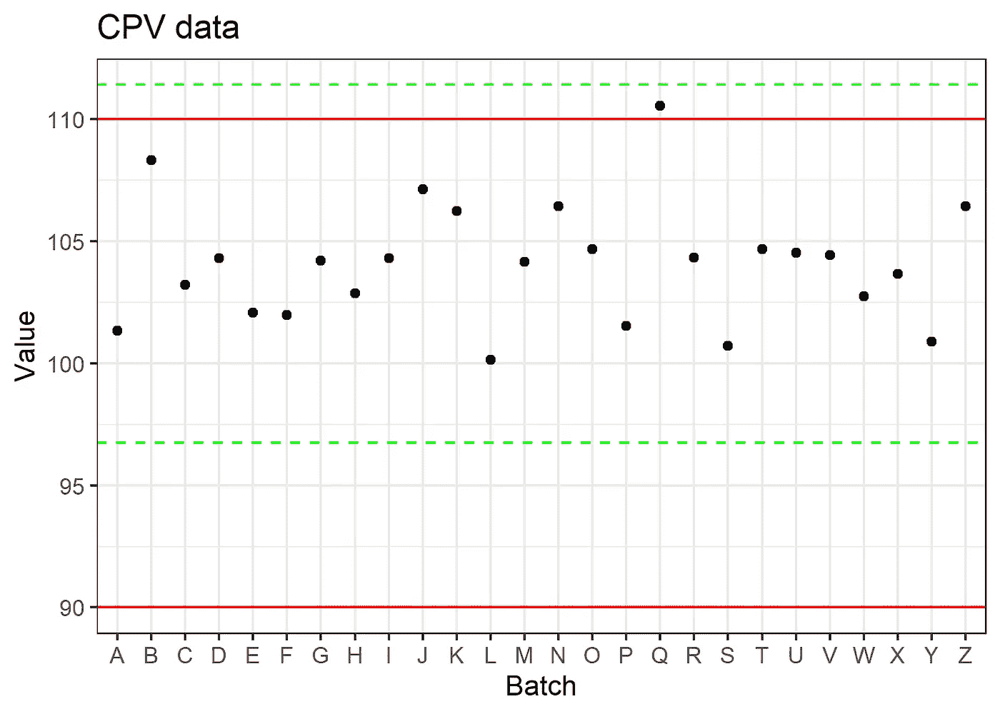
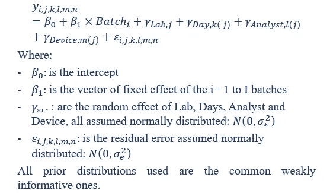
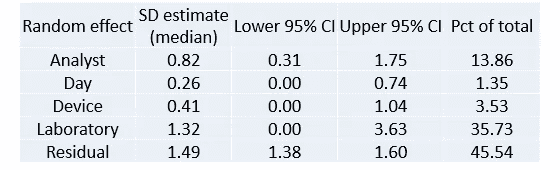
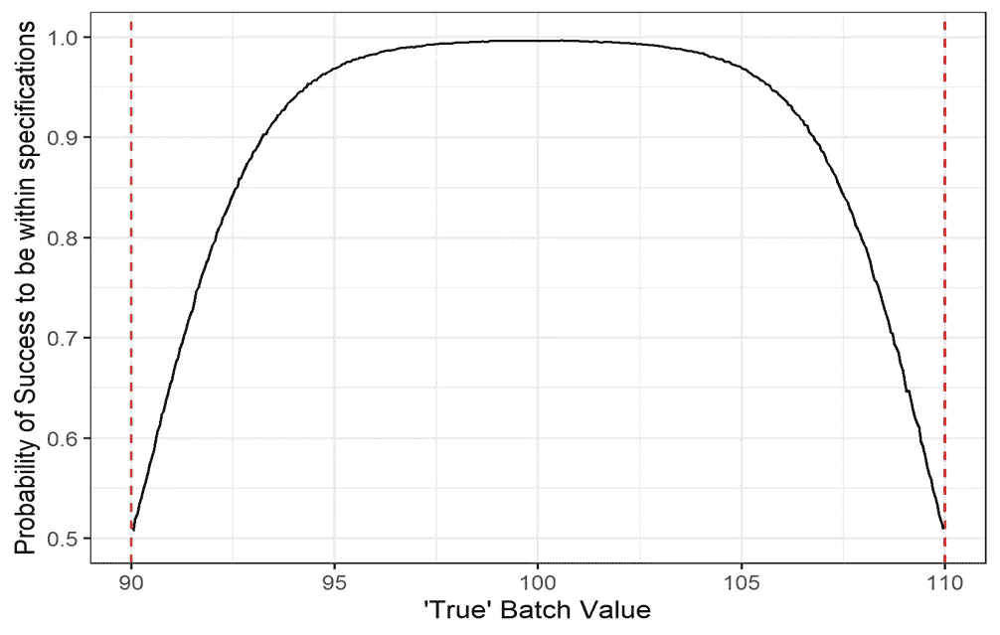
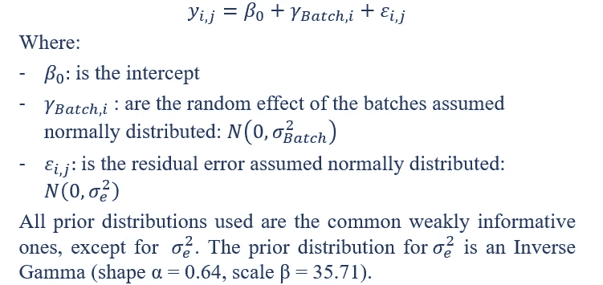
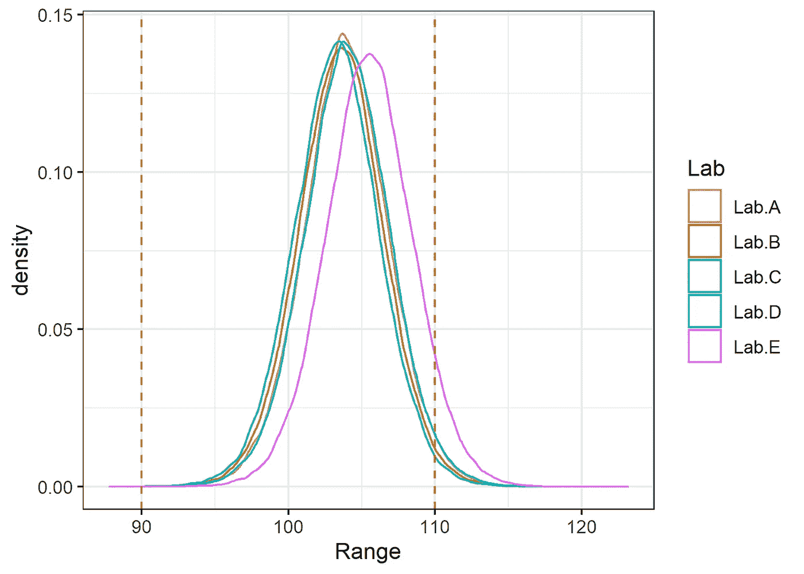

# 我的(生物)药物分析性能可靠吗？只有成功的可能性才算数！

> 原文：<https://towardsdatascience.com/are-my-bio-pharmaceutical-assay-performances-reliable-only-probability-of-success-counts-9f85f27cb208?source=collection_archive---------34----------------------->

## [行业笔记](https://towardsdatascience.com/tagged/notes-from-industry)

## **制药行业传统量具 R 指标的替代品& R 指标**

*作者:Thomas de March in(pharm Alex 统计和数据科学高级经理)、Laurent Natalis(pharm Alex 统计和数据科学副总监)、Tatsiana Khamiakova(让桑制造和应用统计副总监)、Eric Rozet(pharm Alex 统计和数据科学总监)和 Hans Coppenolle(让桑制造和应用统计总监)。本文最初在 NCB 2021 会议上发表。*

瓦尔德马·勃兰特在[取消拍摄](https://unsplash.com/photos/Xlc8HG_FB2k)时拍摄的照片

# 源代码

## 本文的内容已经使用 r 自动生成。用于模拟和分析数据的源代码可从 Github 上的**获得:**[https://github.com/tdemarchin/GageRRPharma](https://github.com/tdemarchin/GageRRPharma)

# 介绍

行业中经常进行 R&R 研究，以确定测量系统的运行性能，并确定其是否能够监控制造过程。一些指标通常与量具 R&R 研究相关，例如精度公差比(P/T)、精度总变差比(%RR)、信噪比(SNR)、%再现性和%重复性。虽然这些指标可能很适合整个行业，但一旦应用于药物制造行业，它们可能会出现问题，原因有几个:(1)(生物)药物分析通常比普通物理化学测量系统更具可变性，并且通常的标准对制药行业来说过于严格，(2)分析方法一旦通过鉴定，就无法始终得到改进，以及(3)测量通常成本高昂且耗时，这使得难以获得足够的数据来高精度地估计所有差异来源。

所有上述困难通常导致对测量系统的指责并触发警报，而测量质量对于其预期目的来说可能是可接受的。此外，通常很难弄清楚如何解释最常用的盖奇 R&R 指标，这些指标缺乏强有力的数学原理[1]，因为它们通常不考虑估计的不确定性。

这项工作的目的是提出一种适用于药品生产的替代方法，以调查测量系统是否符合其预期目的。我们的方法侧重于理解测量系统的属性，旨在回答唯一相关的问题:(1)我的测量系统是否能够区分好的和坏的批次？(2)考虑到盖奇 R&R 实验中调查的工艺和测量可变性，未来的批次是否符合质量标准？

# **数据**

**量具 R & R 数据**

在典型的盖奇 R&R 环境中，不同的分析员在不同的日子使用不同的设备，在某些情况下，在不同的实验室对几个批次进行重复测量。模拟了 Gage R&R 数据:

图 1:作为实验室、日期、分析员、设备和批次的函数的可变性图表。这三种颜色指的是三个不同的批次。

**CPV 数据**

虽然 Gage R&R 数据通常用于提供整个行业中测量系统和工艺可变性的信息，但在制药领域，工艺可变性无法从该数据中正确估计。事实上，通常只测量有限数量的批次(3-5)。此外，通常选择极端批次来跨越规格范围，因此不代表工艺有效批次与浴之间的可变性。

另一方面，过程可变性可以从其他来源估计，如持续过程验证(CPV)。在 CPV，对每批产品的 CQA 进行测量，并随时监控，以验证过程是否处于受控状态。模拟了一个典型的 CPV 数据集，并用其规格([90–110%])绘制了图表:

图 2:生产批次的测量值。红色水平线:规格。绿色虚线:控制限值(平均值 3SD)。

# **结果**

根据盖奇 R&R 数据集，可以估计测量系统的可变性并计算不同的指标。使用贝叶斯框架和 R 包 *brms* 将以下模型拟合到 Gage R&R 数据中:

使用贝叶斯方法的主要优势在于:( 1)考虑了与模型和参数值相关的不确定性;( 2)具有预测性，便于通过模拟来模拟未来的测量值;( 3)可以整合相关的先验概率，这在可用数据有限时非常有用。

以下指标可从量具 R&R 数据集计算得出:

**a)各成分的相对贡献**(方差成分分析)

**b)单次和多次实验室精度**(测量不确定度)。X Y 的结果意味着未来的测量值有 95%的可能是真实值 X 附近的 Y。

c)作为批次真值的函数，成功符合规格的概率。该图有助于确定“安全区域”,在给定测量误差的情况下，真实批次值应位于该区域，以确保满足规格的高概率。

图 3:作为批次真值的函数，符合规格的成功概率。垂直红色虚线:规格。

虽然这些指标对于评估测量系统很有用，但它并没有包含实际的过程可变性，而是让评估者决定过程可变性是否足够小，可以在“安全区域”内操作。是否有可能结合测量和工艺可变性来确定未来的批次是否符合质量标准？

为了回答这个问题，我们可以利用 CPV 数据来确定过程的可变性。CPV 数据通常只包含每批一次测量，因此很难区分过程和测量可变性。

为了区分这两种情况，我们使用了根据 R&R 拟合计算的测量误差先验。这个先验是利用盖奇 R&R 拟合的所有随机效应确定的，除了实验室间的随机效应，因为 CPV 数据只来自一个实验室。使用贝叶斯框架和 R 包 *stan* 对 CPV 数据拟合了以下模型:

由此，使用(1)CPV 模型的批间方差和批截距后验分布，以及(2)盖奇 R&R 模型的批间方差、残差方差和实验室效应后验分布，对不同实验室的结果进行预测

下图显示了不同实验室中未来测量批次的后验预测分布。我们看到，除了实验室 E 的测量值高于其他实验室之外，大多数实验室都可能产生符合规格的测量值。然后，我们可以计算在规范范围内成功的概率。实验室。A = 0.98 实验室。B = 0.98 实验室。C = 0.99 实验室。D = 0.98 实验室。E=0.93。这允许确定哪些实验室能够以良好的成功概率进行测量，并潜在地调查有问题的实验室。

图 4:作为测量实验室功能的未来测量的后验预测分布。垂直红色虚线:规格。

# **结论**

我们使用贝叶斯框架将测量系统属性的知识与过程可变性的知识结合起来。与传统的盖奇 R&R 指标相比，这里提出的指标有助于解释结果。这个例子显示了使用贝叶斯框架来确定测量系统和过程是否有能力的优势和灵活性。

# 参考

1.  唐纳德·惠勒，《一项诚实的 R&R 研究》*稿* 189 (2009)。
2.  [https://www.r-bloggers.com/](https://www.r-bloggers.com/)