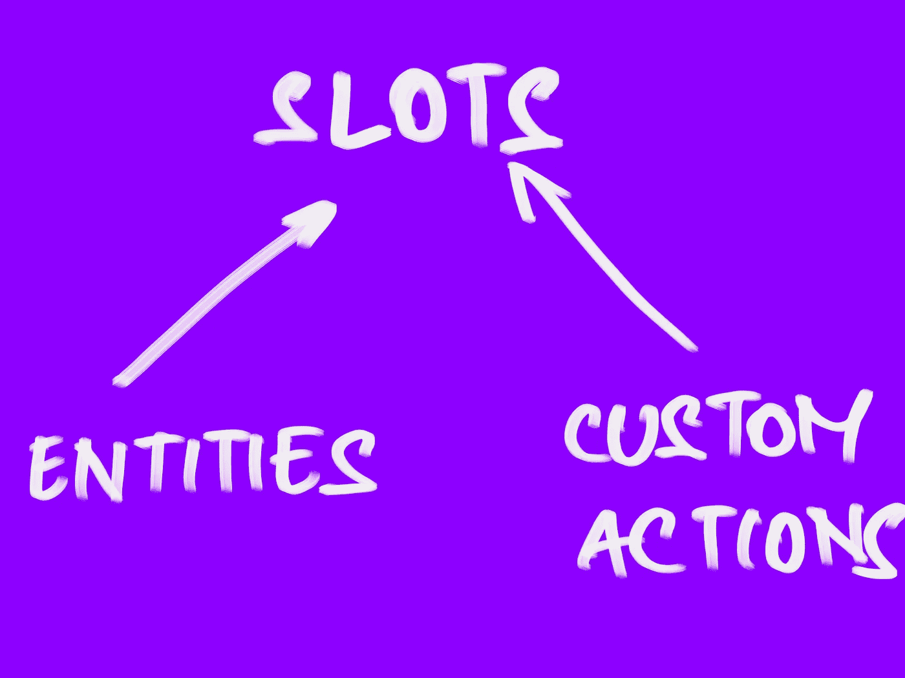
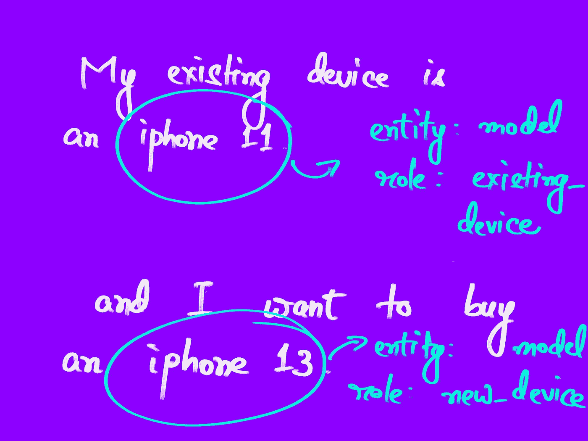
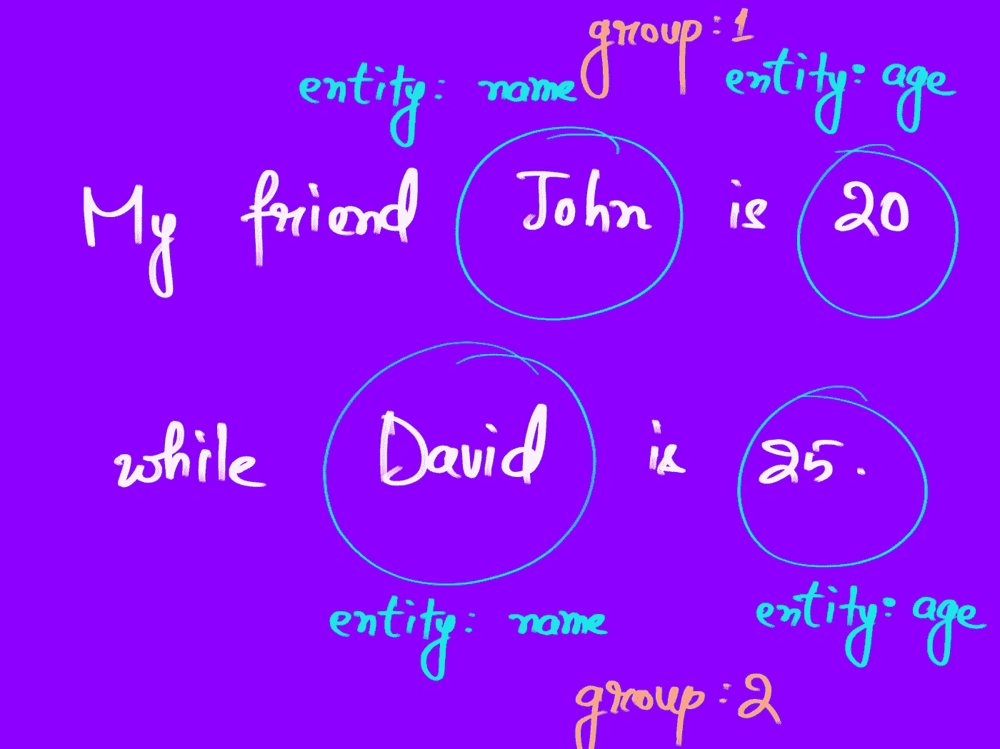

# 插槽和实体是一样的吗？

> 原文：<https://towardsdatascience.com/are-slots-and-entities-the-same-f98a38ac328d?source=collection_archive---------12----------------------->

## 用 Rasa 构建聊天机器人—第二部分


作者图片

在过去的几个月里，我一直在使用 Rasa，最初我对插槽和实体之间的区别感到非常困惑。

在本帖中，我们将讨论插槽和实体是如何相似的，更重要的是，它们是如何不同的。

```
**Table of Contents**
- Defining Entities and Slots
- Are slots and entities interchangeable?
- When to use one over the other
- Setting Slots
- Extracting Entities
```

**快速注释**

这是我关于 Rasa 系列的下一篇文章。你可以看看下面之前的帖子。

</building-a-chatbot-with-rasa-3f03ecc5b324>  

在那里，我们讨论了 Rasa 和聊天机器人的一些基本组成部分，如果你是 Rasa 的新手，先浏览一下这篇文章会有所帮助。

# 定义实体和插槽

快速复习:这就是你如何定义这些术语。

## 时间

插槽是机器人的记忆。在任何需要持久保存值的地方，都可以使用槽。

在定义和使用插槽时，Rasa 为您提供了很大的灵活性。你可以给他们一个类型——文本，布尔，甚至自定义类型——你也可以选择一个槽是否应该影响对话的进行。

## 实体

实体是机器人从用户消息中提取的关键信息，比如用户的联系信息。

提取本身是由聊天机器人的 NLU 部分使用实体提取器完成的。

乍一看，它们似乎非常相似——都存储信息，尽管一个存储的时间更长，更重要的是，它们似乎可以互换。

# 插槽和实体可以互换吗？

他们不是。他们有联系，但只是在一定程度上。

## 类似

*   两者都存储信息
*   两者都会影响谈话的流程

## 差异

*   实体更抽象，由称为实体提取器的 NLU 组件提取。
*   插槽不能直接通过“提取”来填充，只能通过已经提取的实体或自定义操作来填充。
*   实体可以使用像角色、组、同义词和正则表达式这样的特性进行更复杂的结构化和分组，而槽则没有。
*   插槽有类型，rasa 允许您在很大程度上配置它们。

# 何时使用一个而不是另一个

在设计你的机器人时，这是一个非常重要的问题。理论上，您可以将每个实体映射到一个插槽，并让所有内容都保存在您的跟踪器上。但这并不总是必要的。

请记住，只有当您希望信息持久化时，才需要插槽，比如用户名。否则，实体本身就足够了。

## 没有相应插槽的实体

实体通常可以具有与其相关联的槽，因为槽可以被认为是“更持久的”实体。但是请考虑这样的情况，您需要临时提取一些信息，这些信息对于机器人恰当地响应用户的查询至关重要。

一个简单的例子？以一个“计算器”机器人为例。用户提到简单的算术查询，机器人计算答案。

用户会说这样的话:

```
Could you add 1223239 and 190239?
```

所需的信息可以提取为实体:`operand`(两个操作数将落入其中)和`operator`(在本例中是“add”)。

由于这些信息只是暂时有用——也就是说，在下一个问题之前——将它们存储在插槽中并不是一个好主意，尽管如果您愿意的话也可以这样做。

## 没有对应实体的插槽

这是一个更容易想到的用例。如果你需要一个提示，槽不需要通过实体来填充。你也可以使用动作。

插槽可以像全局变量一样使用。你也许可以维护一个名为`is_existing`的槽来跟踪一个用户是否是现有用户。

在这里，拥有一个名为`is_existing`的对应实体也是没有意义的，因为这个信息不能由用户提供，因此也不能被提取——它必须通过数据库查询来验证。

# 设置插槽

## 创建插槽

插槽在`slots`键下定义，位于名为**域**的文件中。Rasa 让我们以多种方式组织您的数据—对于较小的项目，您可以选择将所有内容转储到一个文件中，或者将所有内容分开保存。

定义的插槽如下所示:

```
slots:
  email:
    type: text
    initial_value: null
    auto_fill: true
    influence_conversation: true
```

您可以决定类型，设置默认值，确保任何相应的实体(与您的插槽同名)自动填充它，还可以决定它是否会影响您的对话。

## 插槽设置



可以通过两种方式设置位置——按作者排列图片

可以通过两种方式设置插槽:

*   通过具有相同名称的实体(当设置了`autofill`和`store_entities_as_slots`时，默认情况下是这样)
*   通过自定义操作。

## 通过实体

当实体和插槽具有相同的名称时，可以用相应的提取实体自动填充插槽。这可以借助两个默认为`True`的属性来完成。

*   `auto_fill`(每个插槽默认设置为真)。看起来像这样:

```
slots:
  email:
    type: text
    auto_fill: <true|false>
```

*   `store_entities_as_slots`(在您的**域**文件中设置为配置参数)

```
config:
  store_entities_as_slots: false
```

## 通过自定义操作

也可以通过自定义操作来设置插槽。自定义动作在文件中被定义为一个类，带有一个`name`和一个`run`方法。它继承自 Rasa 的`Action`类。

通过返回列表中的`SlotSet`对象来设置插槽，如下所示:

```
return [SlotSet("my_slot", value), .. ]
```

请记住，定制动作可用于查询数据库、进行 API 调用以及使用`dispatcher`响应用户。

**因此，检查用户是否已经注册了时事通讯**的自定义操作可以这样实现:

动作`action_check_if_existing_user`执行以下操作:

*   从`email`插槽读取用户的电子邮件
*   将其传递给查询数据库的助手函数
*   获取响应并设置`is_existing`布尔槽

```
class ActionCheckIfExistingUser(Action):
    def name(self):
        return "action_check_if_existing_user" def run(self, dispatcher, tracker, domain):
        email = tracker.get_slot('email') # some helper method that queries the database
        action_utils = ActionUtils()
        is_existing = action_utils.check_if_user_exists(email) if is_existing:
            dispatcher.utter_message(text="You're signed up.")
        else:
            dispatcher.utter_message(text="You aren't signed up.")

        **return [SlotSet("is_existing", is_existing)]**
```

# 提取实体

实体由 EntityExtractors 提取。这些是您在配置文件的管道中提到的组件。

有几个现有的，你可以在 Rasa 的文档中找到，你也可以随时设计定制的组件。

我们将在以后的文章中讨论实体提取的细节。

## 角色和组

这是去年发布的一个特性，让你在定义实体时有更多的灵活性。

**角色**

可以把`role`看作是给一个特定的实体添加更微妙的含义的一种方式。

假设你正在开发一个机器人来帮助用户以旧换新他们的移动设备。你有一个实体`model`，嗯，提取智能手机模型。

现在，旧设备和用户想要购买的设备从技术上来说都是智能手机型号，但区分它们对机器人来说很重要。



实体角色-按作者分类的图像

所以，我们可以给`model`实体添加一个`role`。您可以像这样添加训练数据:

```
My existing device is an [iphone 11]{"entity": "model", "role": "existing_device"} and I want to buy an [iphone 13]{"entity": "model", "role": "new_device"}.
```

**组**

群组让你**将**个实体组合在一起，这样它们更有意义。假设您有两个实体— `name`和`age`，一个用户说:

```
My friend John is 20 while David is 25.
```



实体组-按作者分类的图像

这里，机器人需要识别两组姓名和年龄之间的分组。约翰的年龄一定与他的名字有关，大卫也是如此。这就是团队出现的原因。

你可以这样做:

```
My friend [John]{"entity": "name", "group": "1"} is [20]{"entity": "age", "group": "1"} while [David]{"entity": "name", "group": "2"} is [25]{"entity": "age", "group": "2"}
```

# 参考

Rasa 文档中页面的链接

*   [实体](https://rasa.com/docs/rasa/nlu-training-data#entities)
*   [实体提取器](https://rasa.com/docs/rasa/components/#entity-extractors)
*   [插槽](https://rasa.com/docs/rasa/domain/#slots)
*   [影响会话的插槽行为](https://rasa.com/docs/rasa/domain/#slots-and-conversation-behavior)

## 该系列的其他部分(这是第二部分)

> 第一部分:[用 Rasa 构建聊天机器人](/building-a-chatbot-with-rasa-3f03ecc5b324)
> 
> 第三部分:[处理聊天机器人故障](/handling-chatbot-failure-gracefully-466f0fb1dcc5)
> 
> 第四部分:[聊天机器人是如何理解的？](/how-do-chatbots-understand-87227f9f96a7)

# 最后

我们在这篇文章中讨论了插槽和实体，特别讨论了它们是如何关联的，但是不能互换。这篇文章的目的是让人们更容易理解这些是什么，以及在哪些场景中使用哪些。

谈到 Rasa 能提供什么，这只是冰山一角。我将在这个系列中添加更多的部分。

希望有帮助！

## 更新

> 20.3.2022

添加该系列中其他文章的链接