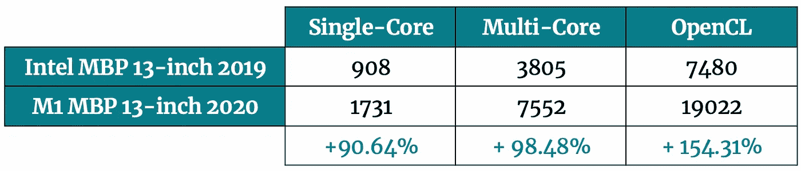

# 新的 M1 macbook 对数据科学有好处吗？让我们找出答案

> 原文：<https://towardsdatascience.com/are-the-new-m1-macbooks-any-good-for-data-science-lets-find-out-e61a01e8cad1?source=collection_archive---------0----------------------->

## 与英特尔 Macbook Pro 在 Python、Numpy、Pandas 和 Scikit 方面的比较-了解

在 [Unsplash](https://unsplash.com/?utm_source=unsplash&utm_medium=referral&utm_content=creditCopyText) 上由[Tomástanislavsk](https://unsplash.com/@tomstanislavsky?utm_source=unsplash&utm_medium=referral&utm_content=creditCopyText)拍摄的照片

新的无英特尔的 Macbooks 已经出现了一段时间。自然是忍不住了，决定买一个。接下来是 2019 年基于英特尔的 MBP 与新的编程和数据科学任务之间的比较。

如果我必须用一个词来描述新的 M1 芯片，我会是这个——**惊人的**。继续阅读更详细的描述。

撇开数据科学不谈，这个东西是革命性的。它的运行速度比我的 2019 年 MBP 快几倍，同时保持完全安静。我运行了多个 CPU 耗尽的任务，粉丝一次也没踢进来。当然，还有电池寿命。太不可思议了— **中度到重度使用 14 小时**没有任何问题。

但是让我们把注意力集中在基准上。总共有五个:

*   CPU 和 GPU 基准测试
*   性能测试—纯 Python
*   性能测试—数字
*   性能测试——熊猫
*   性能测试-sci kit-Learn

# 重要注意事项

如果你正在阅读这篇文章，我想你正在考虑新的 Macbooks 是否值得用于数据科学。它们肯定不是“深度学习工作站”，但首先它们不会花费太多。

整篇文章中的所有比较都是在两个 Macbook Pros 之间进行的:

*   2019 Macbook Pro(i5–8257 u @ 1.40 GHz/8gb lpddr 3/Iris Plus 645 1536 MB)——简称*英特尔 MBP 13 英寸 2019*
*   2020 M1 Macbook Pro(M1 @ 3.19 GHz/8GB)——简称 *M1 MBP 13 寸 2020*

并非所有的库都兼容新的 M1 芯片。我配置 Numpy 和 TensorFlow 没有问题，但是 Pandas 和 Scikit-Learn 还不能本地运行——至少我还没有找到工作版本。

唯一可行的解决方案是通过 Anaconda 安装这两个组件。它仍然通过一个 [Rosseta 2 模拟器](https://www.theverge.com/21304182/apple-arm-mac-rosetta-2-emulation-app-converter-explainer)运行，所以比 native 慢一点。

你将看到的测试在任何方面都不是“科学的”,无论是形式上还是形式上。他们只比较了上述机器之间不同的编程和数据科学任务的运行时。

# CPU 和 GPU 基准测试

让我们先从基本的 CPU 和 GPU 基准测试开始。 [Geekbench 5](https://www.geekbench.com/) 用于测试，你可以在下面看到结果:

图 1 — Geekbench 对比(CPU 和 GPU)(图片由作者提供)

结果不言自明。M1 芯片在我的 2019 Mac 中拆除了英特尔芯片。该基准测试仅测量整体机器性能，与您稍后将看到的数据科学基准测试并不完全相关。

尽管如此，事情看起来很有希望。

# 性能测试—纯 Python

以下是在该基准测试中执行的任务列表:

*   创建一个包含 100，000，000 个介于 100 和 999 之间的随机整数的列表`l`
*   将`l`中的每一项平方
*   对`l`中的每一项求平方根
*   乘以相应的平方和平方根
*   划分相应的平方和平方根
*   对相应的平方和平方根执行整数除法

测试只使用内置的 Python 库，所以不允许使用 Numpy。您可以在下一节看到 Numpy 基准。

下面是测试的代码片段:

结果如下:

图 2 — Python 速度测试—越低越好(图片由作者提供)

可以看到，在 M1 Mac 上通过 Anaconda(和 Rosseta 2 模拟器)运行 Python 减少了 196 秒的运行时间。最好原生运行 Python，因为这进一步减少了 43 秒的运行时间。

总结一下——Python 在新的 M1 芯片上本地运行时，速度大约是**的三倍**,至少在基准测试中是如此。

# 性能测试—数字

以下是在该基准测试中执行的任务列表:

*   矩阵乘法
*   矢乘法
*   奇异值分解
*   乔莱斯基分解
*   特征分解

最初的基准脚本取自 [Github](https://gist.github.com/markus-beuckelmann/8bc25531b11158431a5b09a45abd6276) 上的 *Markus Beuckelmann* ，并稍作修改，因此开始和结束时间都被捕获。脚本看起来是这样的:

结果如下:

图 3 — Numpy 速度测试—越低越好(图片由作者提供)

至少可以说，用 Numpy 得到的结果有点奇怪。由于某种原因，Numpy 在我的 2019 英特尔 Mac 上运行得更快了。也许是由于一些优化，但我不能肯定地说。如果你知道原因，请在评论区分享。

接下来，让我们比较熊猫的表现。

# 性能测试——熊猫

熊猫基准测试与 Python 基准测试非常相似。执行了相同的操作，但结果被合并到一个数据框中。

以下是任务列表:

*   创建空数据框
*   给它分配一列(`X`)100，000，000 个介于 100 和 999 之间的随机整数
*   在`X`广场的每一个项目
*   对`X`中的每一项求平方根
*   乘以相应的平方和平方根
*   划分相应的平方和平方根
*   对相应的平方和平方根执行整数除法

下面是测试的代码片段:

结果如下:

图片 4-熊猫速度测试-越低越好(图片由作者提供)

正如你所看到的，没有对“本土”熊猫的测量，因为我还没有安装它。尽管如此，M1 芯片上的熊猫完成基准测试的速度还是快了两倍。

# 性能测试-sci kit-Learn

和熊猫一样，我还没有设法安装 Scikit-Learn。您只会看到英特尔 MBP 公司和 M1 MBP 公司通过 Rosseta 2 仿真器进行的比较。

下面是基准测试中执行的任务列表:

*   从网上获取数据集
*   执行训练/测试分割
*   声明一个决策树模型，找到最优超参数(2400 个组合+ 5 重交叉验证)
*   用最佳参数拟合模型

这或多或少是一个标准的模型训练过程，不考虑测试多种算法、数据准备和特征工程。

下面是测试的代码片段:

结果如下:

图 5-sci kit-学习速度测试-越低越好(图片由作者提供)

结果传达了与熊猫相同的信息-2019 英特尔 i5 处理器需要两倍的时间来完成相同的任务。

# 结论

与基于英特尔的 2019 Mac 的比较可能与你无关。这很好——您有了基准测试脚本，因此可以在您的机器上运行测试。如果您这样做了，请告诉我—我渴望了解您的配置以及它的比较情况。

新的 M1 芯片是惊人的，最好的还在后面。毕竟这只是第一代。Macbooks 不是机器学习工作站，但你仍然得到了很好的回报。

TensorFlow 的深度学习基准测试将于下周推出，敬请关注。

喜欢这篇文章吗？成为 [*中等会员*](https://medium.com/@radecicdario/membership) *继续无限制学习。如果你使用下面的链接，我会收到你的一部分会员费，不需要你额外付费。*

<https://medium.com/@radecicdario/membership>  

## 加入我的私人邮件列表，获取更多有用的见解。

# 了解更多信息

*   [2021 年学习数据科学的前 5 本书](/top-5-books-to-learn-data-science-in-2020-f43153851f14)
*   [如何使用 Python 创建 PDF 报告—基本指南](/how-to-create-pdf-reports-with-python-the-essential-guide-c08dd3ebf2ee)
*   [Python 并行性:几分钟内加速 Python 代码的基本指南](/python-parallelism-essential-guide-to-speeding-up-your-python-code-in-minutes-5ec71cbd88e1)
*   [SHAP:如何用 Python 解读机器学习模型](/shap-how-to-interpret-machine-learning-models-with-python-2323f5af4be9)
*   [机器学习的三大分类指标——一劳永逸地消除准确性](/top-3-classification-machine-learning-metrics-ditch-accuracy-once-and-for-all-923beab025a4)

*原载于 2021 年 1 月 23 日 https://betterdatascience.com*<https://betterdatascience.com/are-the-new-m1-macbooks-any-good-for-data-science-lets-find-out/>**。**