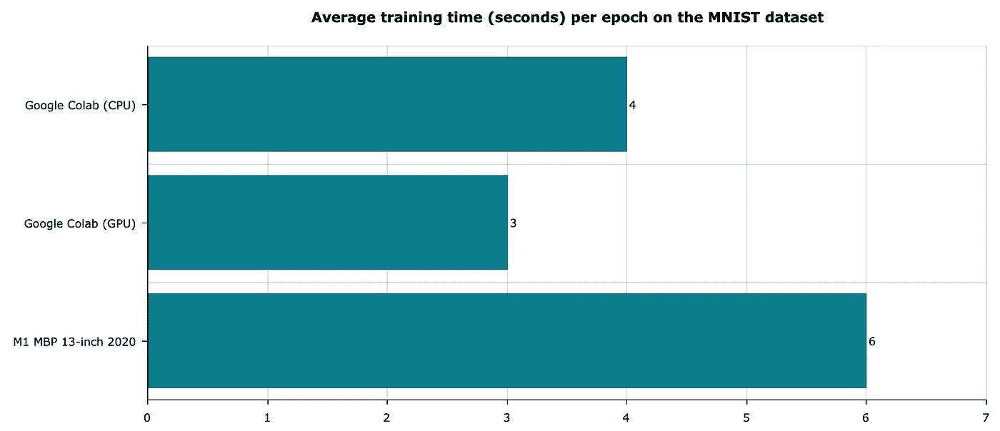
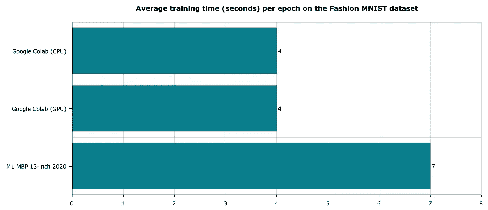
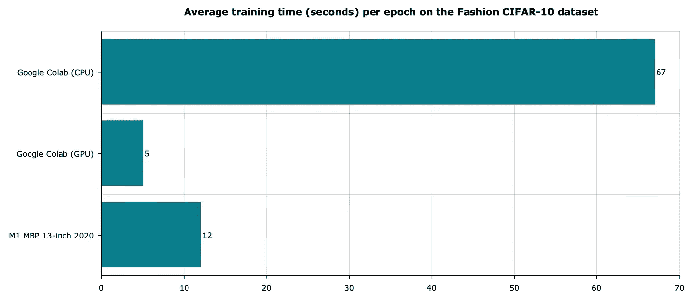

# 新的 M1 macbook 对深度学习有好处吗？让我们找出答案

> 原文：<https://towardsdatascience.com/are-the-new-m1-macbooks-any-good-for-deep-learning-lets-find-out-b475ad70dec2?source=collection_archive---------3----------------------->

## M1 Macs 与谷歌 Colab 的基本深度学习任务

照片由 [**veeterzy**](https://www.pexels.com/@veeterzy?utm_content=attributionCopyText&utm_medium=referral&utm_source=pexels) 发自 [**Pexels**](https://www.pexels.com/photo/background-business-computer-connection-303383/?utm_content=attributionCopyText&utm_medium=referral&utm_source=pexels)

新的苹果 M1 芯片背后有很多宣传。到目前为止，它被证明优于英特尔提供的任何产品。但是这对深度学习意味着什么呢？这就是你今天会发现的。

新的 M1 芯片不仅仅是一个 CPU。在 MacBook Pro 上，它由 8 核 CPU、8 核 GPU 和 16 核神经引擎等组成。处理器和 GPU 都远远优于上一代英特尔配置。

我已经展示了 M1 芯片对于常规数据科学任务的速度有多快，但是深度学习呢？

简而言之——是的，在这个部门有一些改进，但现在的 MAC 电脑比，比如说， *Google Colab* 更好吗？请记住，Colab 是一个完全免费的选项。

这篇文章的结构如下:

*   CPU 和 GPU 基准测试
*   性能测试— MNIST
*   性能测试——时尚 MNIST
*   性能测试— CIFAR-10
*   结论

# 重要注意事项

并非所有的数据科学图书馆都与新的 M1 芯片兼容。让 tensor flow(2.4 版)正常工作说起来容易做起来难。

你可以参考[这个链接](https://github.com/apple/tensorflow_macos)下载。*tensor flow 及其依赖项的 whl* 文件。这只适用于 macOS 11.0 及以上版本，请记住这一点。

你将看到的测试在任何方面都不是“科学的”,无论是形式上还是形式上。他们只比较每个时期的平均训练时间。

# CPU 和 GPU 基准测试

让我们先从基本的 CPU 和 GPU 基准测试开始。比较是在采用 M1 芯片的新 MacBook Pro 和 2019 年的基本型号(英特尔)之间进行的。 [Geekbench 5](https://www.geekbench.com/) 用于测试，你可以在下面看到结果:

图 1 — Geekbench 5 结果(英特尔 MBP 公司对 M1 MBP 公司)(图片由作者提供)

结果不言自明。M1 芯片在我的 2019 Mac 中拆除了英特尔芯片。到目前为止，事情看起来很有希望。

# 性能测试— MNIST

MNIST 数据集有点像深度学习的“hello world”。它内置了 TensorFlow，使测试变得更加容易。

以下脚本为 MNIST 数据集上的十个时期训练了一个神经网络分类器。如果你用的是 M1 Mac，取消对`mlcompute`行的注释，因为这会让程序运行得更快一些:

上面的脚本是在 M1 MBP 和谷歌实验室(CPU 和 GPU)上执行的。您可以在下面看到运行时比较:

图 2-MNIST 模型平均训练时间(图片由作者提供)

对于一台新的 Mac 电脑来说，结果有些令人失望。Colab 在 CPU 和 GPU 运行时都超过了它。请记住，结果可能会有所不同，因为在 Colab 中没有运行时环境的保证。

# 性能测试——时尚 MNIST

该数据集非常类似于常规的 MNIST，但它包含衣服而不是手写数字。因此，您可以使用相同的神经网络架构进行训练:

如您所见，这里唯一改变的是用于加载数据集的函数。相同环境的运行时结果如下所示:

图 3——时尚 MNIST 模特平均训练次数(图片由作者提供)

我们再次得到类似的结果。这是意料之中的，因为这个数据集与 MNIST 非常相似。

但是，如果我们引入更复杂的数据集和神经网络架构，会发生什么呢？

# 性能测试— CIFAR-10

CIFAR-10 也属于“hello world”深度学习数据集的范畴。它包含了来自十个不同类别的 60K 张图片，比如飞机、鸟、猫、狗、船、卡车等等。

这些图像的大小为 32x32x3，这使得它们在某些情况下甚至对于人类来说也难以分类。下面的脚本通过使用三个卷积层来训练分类器模型:

让我们看看卷积层和更复杂的架构如何影响运行时:

图 4 — CIFAR-10 模型平均训练时间(图片由作者提供)

如您所见，Colab 中的 CPU 环境与 GPU 和 M1 环境相去甚远。Colab GPU 环境仍然比苹果的 M1 快 2 倍左右，类似于前两次测试。

# 结论

我喜欢新 M1 芯片的每一点和它带来的一切——更好的性能，没有过热，更长的电池寿命。不过，如果你对深度学习感兴趣，这是一款很难推荐的笔记本电脑。

当然，M1 比我的其他基于英特尔的 Mac 有大约 2 倍的改进，但这些仍然不是为深度学习而制造的机器。不要误会我的意思，你可以使用 MBP 完成任何基本的深度学习任务，但如果你每天都做深度学习，在相同的价格范围内会有更好的机器。

本文仅介绍了简单数据集上的深度学习。下一个项目将在更高要求的任务上比较 M1 芯片和 Colab 比如迁移学习。

感谢阅读。

喜欢这篇文章吗？成为 [*中等会员*](https://medium.com/@radecicdario/membership) *继续无限制学习。如果你使用下面的链接，我会收到你的一部分会员费，不需要你额外付费。*

<https://medium.com/@radecicdario/membership>  

## 加入我的私人邮件列表，获取更多有用的见解。

# 了解更多信息

*   [2021 年学习数据科学的前 5 本书](/top-5-books-to-learn-data-science-in-2020-f43153851f14)
*   [新的 M1 macbook 对数据科学有好处吗？让我们来看看](/are-the-new-m1-macbooks-any-good-for-data-science-lets-find-out-e61a01e8cad1)
*   [如何使用 Python 创建 PDF 报告—基本指南](/how-to-create-pdf-reports-with-python-the-essential-guide-c08dd3ebf2ee)
*   [Python 并行性:几分钟内加速 Python 代码的基本指南](/python-parallelism-essential-guide-to-speeding-up-your-python-code-in-minutes-5ec71cbd88e1)
*   [SHAP:如何用 Python 解释机器学习模型](/shap-how-to-interpret-machine-learning-models-with-python-2323f5af4be9)

*原载于 2021 年 1 月 25 日 https://betterdatascience.com**的* [*。*](https://betterdatascience.com/mac-m1-deep-learning/)