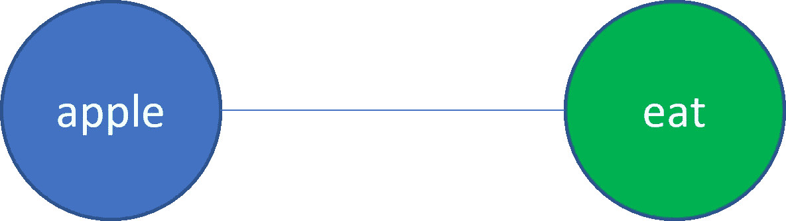
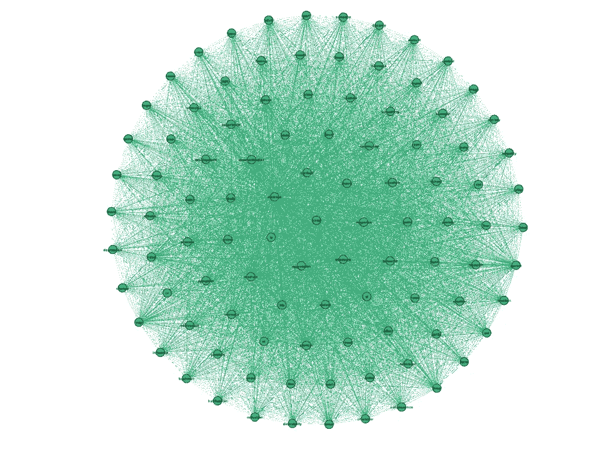
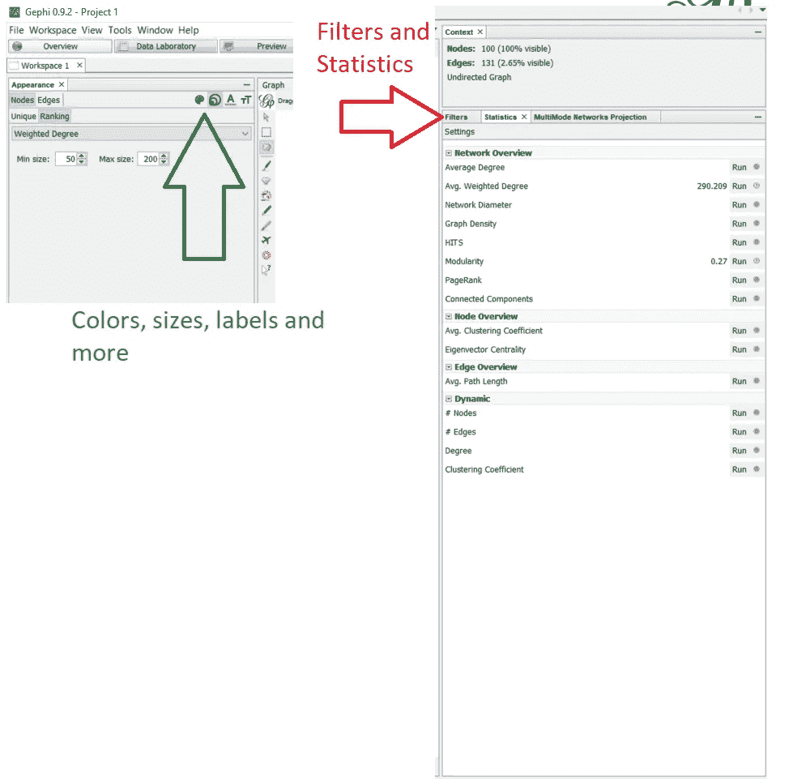
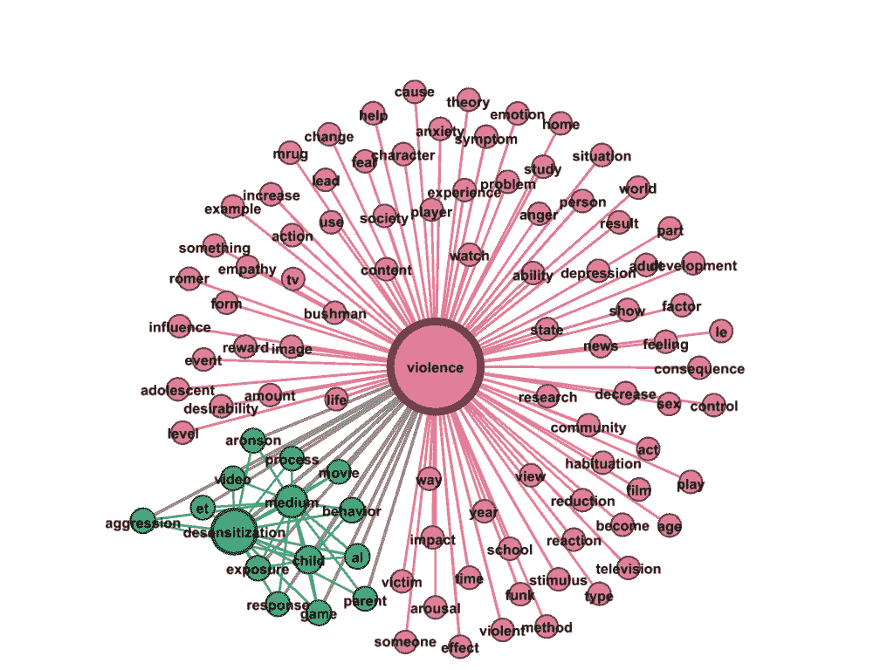

# 话题也是词语社区吗？

> 原文：<https://towardsdatascience.com/are-topics-also-communities-of-words-9b390862ea64?source=collection_archive---------35----------------------->

## 利用图形分析中的社区检测进行主题分析


图片由来自[皮克斯拜](https://pixabay.com/?utm_source=link-attribution&utm_medium=referral&utm_campaign=image&utm_content=4139536)的[托尔斯滕·弗伦泽尔](https://pixabay.com/users/thorstenf-7677369/?utm_source=link-attribution&utm_medium=referral&utm_campaign=image&utm_content=4139536)拍摄

[剧透警报]当丹妮莉丝·坦格利安被她的侄子兼情人琼恩·雪诺谋杀后， [*《权力的游戏》*](https://en.wikipedia.org/wiki/Game_of_Thrones) 社区变得[猿类](https://www.insider.com/game-of-thrones-series-finale-daenerys-death-reactions-2019-5)。

> “我现在太难过了，简直要哭了。呃。F#%k(原文)”愤怒的推特粉丝
> 
> “……她整个赛季都感觉被背叛了，她死的时候也被背叛了……”——另一个愤怒的推特粉丝

好了，句号。我从没真正看过 *GOT* HBO 系列。

*停下来集体喘息*

是的，我只知道我写在最上面的句子的严重性，因为我有一个哥哥是一个狂热的观众，他总是用下面的话来修饰他的解释:

> “你只要看看这个系列就行了，兄弟。就像，给它时间，熬过第一季，然后你就会上瘾。”

但我没看过这个节目，不代表它对我没有影响。我第一次知道这部剧的狂热追随者是在我看一个年轻的研究生米兰·雅诺索夫的演讲时，他用人物之间的关系创建了一个网络图，并用它来预测谁最有可能在下一集死去。引起我注意的是模型的准确性和图论的新颖应用。

不言而喻，文字有助于形成关系。不仅仅是人与人之间的关系，他们还会在一个句子、一段话、一页纸上形成彼此之间的关系。

有什么比网络图更好的方式来表达这些关系呢？Janosov 帮助将这一信息传达给了大量受欢迎的粉丝，并激励了其他人，因为他们从《哈利·波特与火焰杯》到《指环王》和《T21》，甚至从《漫威》到《宇宙》。

大量现有的链接单词和关系的项目都集中在单词中的人以及他们与其他人的关系上。文字本身呢？它们之间的关系可以从图形的角度有效地理解吗？在这里，我看到了在文档中查找主题的图算法的应用。让我们开始吧。

# **话题分析，单词-数据版聚类**

在数据科学中，我们使用无监督算法来帮助我们找到数据的自然(数据驱动)分组。大概应用最多的聚类算法是 [K-Means](/understanding-k-means-clustering-in-machine-learning-6a6e67336aa1) 。然而，当这些数据是单词时，像潜在狄利克雷分配( [LDA](/light-on-math-machine-learning-intuitive-guide-to-latent-dirichlet-allocation-437c81220158) )这样的其他算法更受欢迎。LDA 比 K-Means 更受欢迎，因为 LDA 将多个主题分配给单个文档，而 K-Means 针对互斥组进行优化(也称为硬聚类)。

这两种方法的缺点是，都要求用户为模型输入特定数量的聚类/主题，然后尝试在数据中“查找”。必须事先输入主题的数量可能是一个挑战，因为我们通常不知道分组的最佳数量应该是多少。

*感觉我们被剥夺了描述中“无人监管”的部分？我也是😊*

无论如何，图算法可能为更真实的无监督主题建模方法提供一个可能的答案。在剩下的部分中，我将演示如何使用 [Louvain](/community-detection-algorithms-9bd8951e7dae) 社区检测算法创建主题模型，可视化网络，并提供一些未来方向的提示。

# **构建单词的网络图**

网络图只是一系列通过边连接的节点。在页面上的单词的上下文中，我们可以根据它们在句子或段落中的共同提及来连接两个单词。例如，如果单词“apple”和“eat”同时出现在同一段落中，我们可以如下图所示:



作者图片

在这个简单的例子中，我们可以得出结论，给定的文本段落有一个关于吃苹果的主题。

让我们来看看如何使用 Python 创建一个单词网络。

为了实现第一个目标，我们需要确定数据的来源。对于这个例子，我使用了一些来自社会心理学课程学生的 Word 文档。希望我们的主题模型能帮助我们了解他们写的是什么。下面是我在这个例子中工作的环境:

Windows 10 操作系统

Python 3.6

我们需要的包是:

```
networkx==2.5nltk==3.5python_louvain==0.14pandas==0.25.0community==1.0.0b1scikit_learn==0.24.2
```

为了建立我们的单词网络，我假设每个段落可以代表一个单独的主题，因此单词关系是在段落级别建立的。让我们加载数据，只选择前 6 个段落，并清理数据:

注意，在上面的代码中，我导入了 get_docx_text。这是一个自定义程序，可以在[这里](https://gist.github.com/betacosine/661a1f99424ac3d99eb7d98b31af9c5a)找到。

一旦数据准备好了，我就对数据进行最后一次快速清理，只关注名词。大多数话题可能是关于名词的，但是看看动词和名词或者动词和名词的二元结构也是有用的。

# **大厦边缘列表**

当将数据设计成图形工具和技术认可的格式时，我们需要边列表或邻接矩阵。在这个例子中，我从术语-频率-逆-文档-频率矩阵构建了一个边缘列表。结果边缘列表包含前 100 个单词的“目标”列、表示每个段落的“源”列和提供该文档(例如段落)的单词的 TFIDF 值的“计数”列。

# **建图**

一旦我们创建了边列表，我们现在就可以用 Python 构建一个 graph 对象。在接下来的两个函数中，我们传递一个包含“目标”、“源”和“权重”(我们称权重为“计数”)列的数据帧，以便构建图表。

df_to_graph 函数将返回两种图形类型中的一种，即一部分图形或二部分图形。不要太专业，我们在这个例子中的图是二分的。它是由两部分组成的，因为单词与段落相关，我们没有将这些单词直接相互关联(尽管我们可以)。但是我们最终确实想要将单词彼此联系起来，所以我们利用我们的图的二分性质，创建单词关系的一分投影。

概念如下:如果一个单词和另一个单词出现在同一个段落中，那么我们就把它们连接起来。连接两个单词的权重是它们的 tfidf 值之和(my_weight 函数)。

最后一行代码用 Python 生成了社区解决方案。

# **可视化图形**

用 Python 生成社区检测解决方案远不如可视化和导航网络有趣。所以，我现在转向 [Gephi](https://gephi.org/) 。要将 Networkx graph 对象保存为 Gephi 可读的格式，请使用以下代码:

```
nx.write_gexf(G, “path/to/save/your/graph.gexf”)
```

快速格式化后，这是我们的图表:



作者图片

有点乱吧？为了增加更多的可解释性，我根据权重过滤掉一些边，并在图上运行一些统计数据，包括在过滤后的图上进行 Louvain 社区检测。一旦完成，这些额外的统计数据就可以作为添加颜色、调整节点大小和调整这些节点上的标签大小的选择。



作者图片

这是由此产生的两个社区解决方案:



作者图片

我们学到了什么？

根据社区检测模型发现的两个主题，我们了解到学生们写的是暴力和脱敏。

很酷，对吧？但是我们能从这里去哪里呢？

# **展望未来**

在本文中，我们演示了一个简单的实现，它使用图算法根据段落中的单词关系来识别主题。虽然它很酷，但仍然有一些明显的局限性。一个限制是结果有点像 K-Means 结果，因为单词被“硬聚类”成一个且只有一个聚类。也就是说，我们可以清楚地看到，一个主题中的单词仍然与分配给其他主题的单词有边(关系)。

另一个限制是很难将一个段落分配给一个主题。解决这个问题的一种方法是根据单词及其权重建立一个分类模型，以便预测哪个段落覆盖哪个主题。显然这不像 sci-kit 的那样简单”。预测”界面，但这是一种可能的解决方案。

尽管有这些限制，图形仍然是建模数据的一种有用方法。除了节点之间的关系之外，图表还允许我们给节点和边分配属性，这可以使它们自身有助于更复杂的图表方法，这可能对理解单词关系有所暗示。实际上，[这里的](https://dl.acm.org/doi/fullHtml/10.1145/3366423.3380102)是一篇使用单词嵌入作为节点属性的论文，用图形来通知更复杂的主题建模方法。

我希望这篇文章能启发你更多地思考图形分析及其对数据科学问题的潜在价值。前进！

喜欢连接以了解更多关于数据科学的信息？[加入我](https://www.facebook.com/groups/thinkdatascience)。