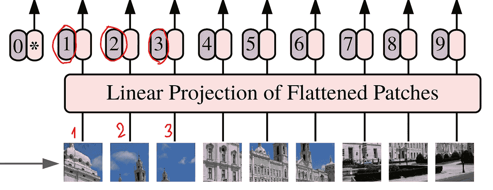
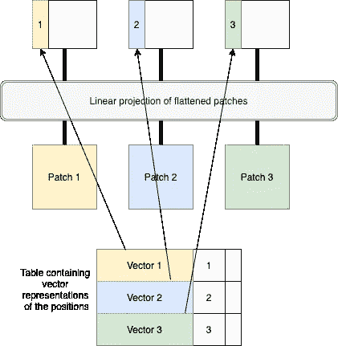
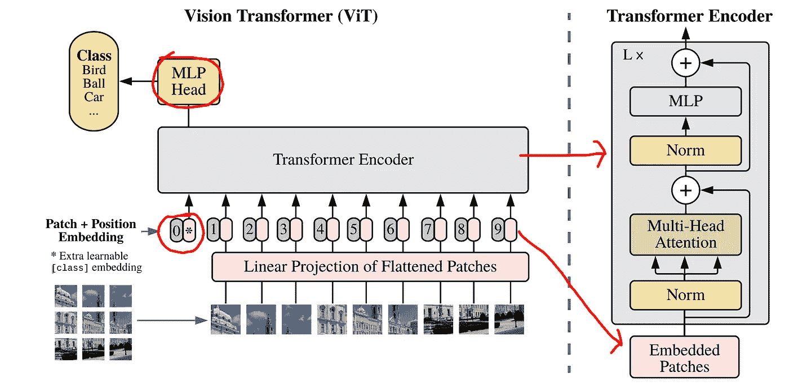
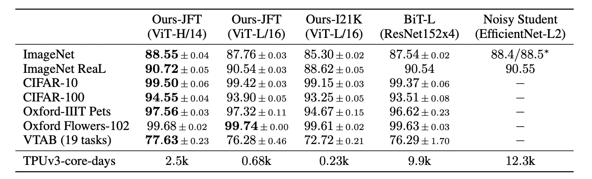
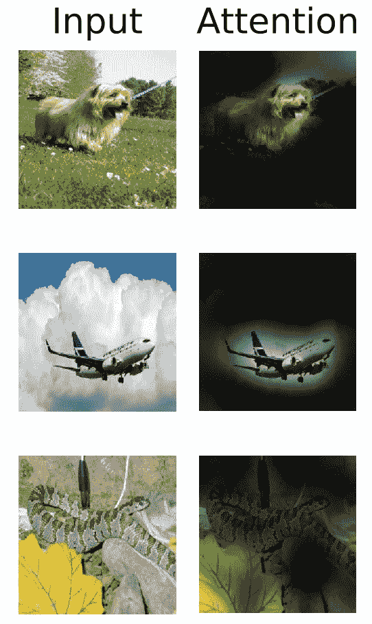

# 变形金刚在图像识别方面比 CNN 强吗？

> 原文：<https://towardsdatascience.com/are-transformers-better-than-cnns-at-image-recognition-ced60ccc7c8?source=collection_archive---------0----------------------->

## 了解视觉转换器:用于图像识别的转换器

论文链接—[https://arxiv.org/pdf/2010.11929.pdf](https://arxiv.org/pdf/2010.11929.pdf)

如今在自然语言处理(NLP)任务中，变换器已经成为 goto 架构(如 BERT、GPT-3 等)。另一方面，变形金刚在计算机视觉任务中的使用仍然非常有限。对于计算机视觉应用(如 Xception、ResNet、EfficientNet、DenseNet、Inception 等)，大多数研究人员直接使用卷积层，或者在卷积块的同时添加某些注意块。关于视觉变换器(ViT)的论文实现了一个纯变换器模型，不需要卷积块，对图像序列进行分类。该论文展示了 ViT 如何在各种图像识别数据集上获得比大多数最先进的 CNN 网络更好的结果，同时使用相当少的计算资源。

**视觉变压器(ViT)**

转换器是对数据序列(例如一组单词)进行操作的网络。这些单词集首先被标记化，然后被输入到转换器中。转换器增加了注意力(二次运算——计算每对标记化单词之间的成对内积)。字数越多，运算次数也越多)。

图像因此更难在变形金刚上训练。图像由像素组成，每个图像可以包含数千到数百万个像素。因此，在转换器中，每个像素将与图像中的每个其他像素进行成对操作。在一个大小为 500*500 像素的图像中，这是 500^2，所以注意机制将花费(500^2)^2 运算。即使使用多个 GPU，这也是一项艰巨的任务。因此，对于图像，研究人员大多使用某种形式的局部注意力(像素簇)，而不是使用全局注意力。

ViT 的作者通过使用全局注意力来解决这个问题，但不是在整个图像上，而是在多个图像块上。因此，首先将一幅大图像分成多个小块(例如 16*16 像素)。这如图 1 所示。

图一。图像分成多个小块(来源:来自原始纸张的图像)

然后，这些图像块被展开成一系列图像，如图 2 所示。这些图像序列具有位置嵌入。

图二。展开成一系列图像的图像块(来源:来自原始文件的图像)

最初，变形金刚不知道哪个补丁应该放在哪里。因此，位置嵌入有助于转换器理解每个补丁应该放在哪里。在论文中，作者使用 1，2，3…n 的简单编号来指定补丁的位置，如图 3 所示。这些不仅仅是数字，而是可以学习的向量。也就是说，不直接使用数字 1，而是存在一个查找表，该查找表包含代表补片位置的每个数字的向量。因此，对于第一个补丁，从表中获取第一个向量，并与补丁一起放入转换器中。类似地，对于第二个面片，从表中获取第二个向量，并将其与第二个面片一起放入转换器中，依此类推。这如图 4 所示。

图 3。具有位置嵌入的补丁(来源:图片来自原始论文)

图 4。作为向量表示的位置嵌入(来源:图片由作者创建)

图像补丁是一个小图像(16*16 像素)。这需要以某种方式输入，以便变压器能够理解。一种方法是将图像展开成 16*16 = 256 维的向量。然而，论文作者使用了线性投影。这意味着只有一个矩阵，表示为“E”(嵌入)。取一个小块，首先展开成一个线性向量。然后，这个向量与嵌入矩阵 e 相乘。然后，最终结果与位置嵌入一起被馈送到变换器。

然后，所有的补片(线性投影)连同它们各自的位置嵌入被输入到一个变换编码器中。这个变压器是一个标准的变压器架构(你需要的只是注意力——纸)。

有一个额外的可学习嵌入，标记为位置 0，如图 5 所示。这种嵌入的输出用于最终对整个图像进行分类。

图 5。整个 ViT 架构，带有额外的可学习嵌入——用红色标记，最左边的嵌入(来源:图片来自原始论文)

**结果**

表 1 显示了 ViT 与最先进的 CNN 架构在不同数据集上的结果对比。ViT 在 JFT-300 数据集上进行了预训练。下面的结果表明，在所有数据集上，ViT 的性能都优于基于 ResNet 的体系结构和 EfficentNet-L2 体系结构(针对有噪声的学生权重进行预训练)。这两种模型都是当前最先进的 CNN 架构。表 1 中，ViT-H 指的是 ViT-Huge(32 层)，ViT-L 指的是 ViT-Large(24 层)。ViT-H/L 后面的数字 14 和 16 表示从每个图像中创建的补丁大小(14*14 或 16*16)。

该表还显示，ViT 比其他两种 CNN 模型需要更少的计算资源。

表 1。在各种图像数据集上将 ViT 结果与其他 CNN 架构进行比较(来源:原始论文中的表格)

图 6 显示了变压器在对各种图像进行分类时所给予的关注。

图 6:从输出记号到输入空间的注意机制(来源:图片来自原纸)

**结论**

***视觉变形金刚会在计算机视觉任务中取代 CNN 吗？***

到目前为止，CNN 已经统治了计算机视觉任务。图像基于这样一种思想，即一个像素依赖于它的相邻像素，下一个像素依赖于它的紧邻像素(无论是颜色、亮度、对比度等等)。美国有线电视新闻网的工作就是基于这个想法，在一幅图像上使用过滤器来提取重要的特征和边缘。这有助于模型仅从图像中学习必要的重要特征，而不是图像的每个像素的细节。

但是，如果将整个图像数据输入到模型中，而不仅仅是过滤器可以提取的部分(或它认为重要的部分)，则模型表现更好的机会更高。这正是视觉变形金刚内部正在发生的事情。这可能是为什么在这种情况下，视觉变形金刚比大多数 CNN 模型更好的一个原因。

***但这是否意味着未来在计算机视觉任务中，变形金刚会取代 CNN 的？***

答案是，不会这么快。就在几天前，EfficientNet V2 模型发布了，它的性能甚至比视觉变形金刚还要好。这只是意味着，随着更新、更好、更高效的模型在不久的将来不断推出，我们可以期待两种类型(CNN 和变形金刚)的新架构一决高下。