# 我们在宇宙中是孤独的吗？飞碟目击的数据分析和数据可视化

> 原文：<https://towardsdatascience.com/are-we-alone-in-the-universe-data-analysis-and-data-visualization-of-ufo-sightings-with-r-42d0798679c3?source=collection_archive---------7----------------------->

## 如何分析和可视化美国和世界其他地方上个世纪的 UFO 目击数据

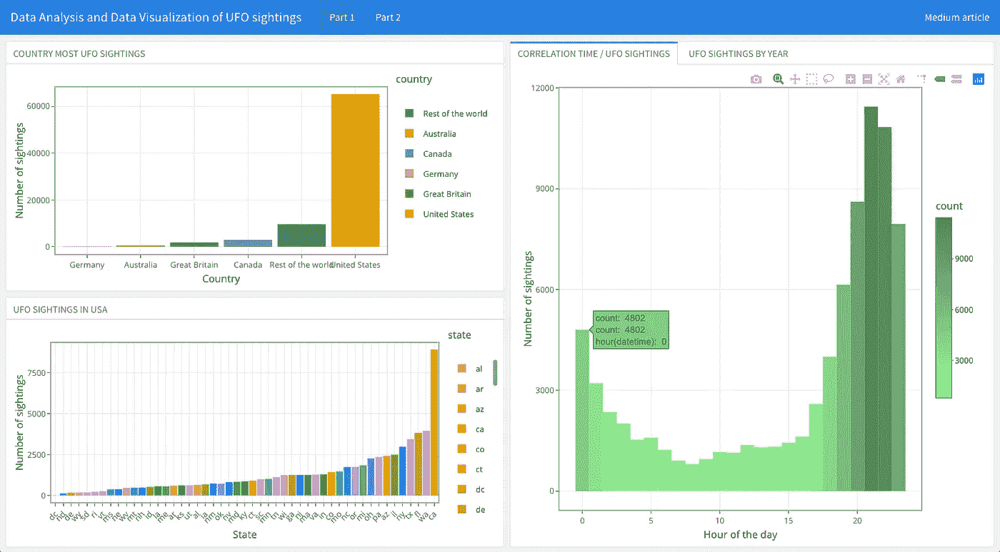

仪表板，以查看生成的关于不明飞行物目击的情节。文末的链接

人类可以问自己的一个问题是，我们在宇宙中是否是孤独的。我认为，假设我们是唯一一个拥有足够智慧去拜访宇宙中其他世界的文明，这将是荒谬和极其徒劳的。如果比我们更聪明的其他文明已经拜访过我们了呢？如果他们现在正在看着我们呢？如果天空中那些奇怪的未知景象与此有关呢？

> “或者也许他们在这里，但是因为一些*卡拉狄加*的法律，一些不干涉新兴文明的道德准则而藏了起来。我们可以想象他们好奇而冷静地观察我们，就像我们观察琼脂培养皿中的细菌培养一样，以确定今年我们是否能够避免自我毁灭。”
> ——卡尔·萨根，

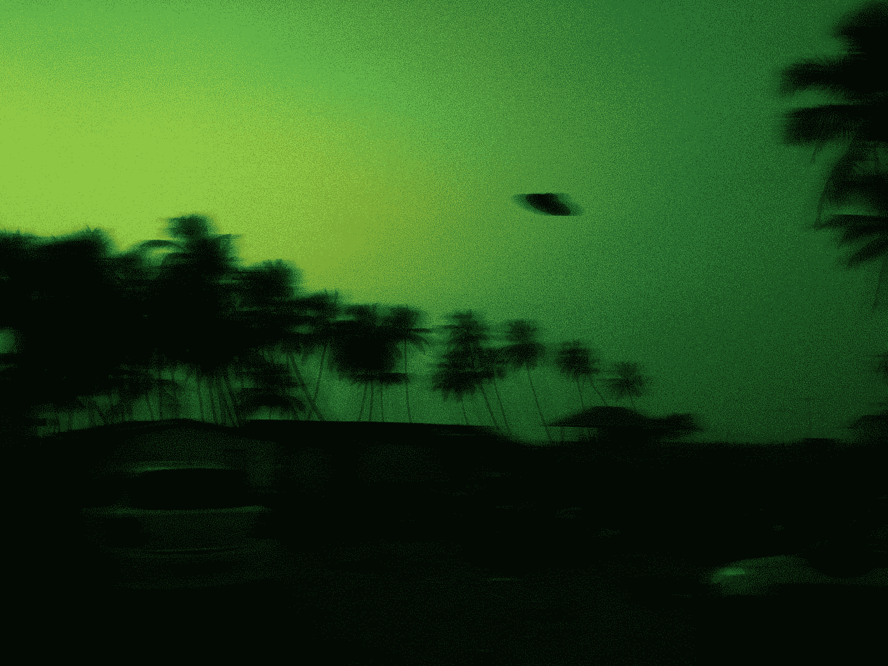

照片由[阿尔伯特·安东尼](https://unsplash.com/@albertforreal?utm_source=medium&utm_medium=referral)在 [Unsplash](https://unsplash.com?utm_source=medium&utm_medium=referral) 拍摄

2020 年 4 月，五角大楼解密了美国海军录制的三段视频，确认了它们的真实性。在这些视频中，你可以看到不明飞行物飞过天空，无视我们所知道的物理定律。

平均每三个人中就有一个人目睹过天空中一些不寻常的现象，我们通常称之为“UFO 现象”。

# 数据准备

这是一个包含世界各地 UFO 目击数据的数据集。它包括了上个世纪向国家 UFO 报告中心(NUFORC)报告的超过 80，000 份 UFO 目击记录。该数据集在网上免费提供，数据可以从 [**Kaggle**](https://www.kaggle.com/NUFORC/ufo-sightings) (通用公共许可证)下载

现在，您将加载将在分析过程中使用的库并读取数据。

```
# REQUIRED LIBRARIESlibrary(dplyr);
library(ggplot2);
library(mclust);
library(lubridate);
library(mapdata);
library(maps);# READ DATAdataUfo <- read.csv(file="data/scrubbed.csv", header=T);dataUfoClear <- dataUfo %>%
  dplyr::select(latitude, longitude, shape, country,
                datetime, date.posted, city, state,
                duration = duration..seconds.);
```

在原始数据集中可以找到以下字段:

**日期时间**——UFO 目击事件发生在这个日期和这个时间。
**城市**——不明飞行物目击的地点。
**州** —该州以发现它的城市命名。
**国家** —基于州，发现它的国家。
**形状** —看到的 UFO 的形状。
**持续时间(秒)** —以秒为单位，照准的长度。
**【分钟】** —以分钟为单位，照准的长度。
**评论**——看到不明飞行物的人做了如下评论。
**发布日期** —当目击事件被报告给 NUFORC 时，这就是日期。
**纬度** —照准的纬度。
**经度** —照准的经度。

在对数据集进行第一次检查后，发现有些数据不完整，因为缺少一些列。此外，该集合中的一些数据不适合该目的。因此，我们稍微清理了一下数据，使其更易于分析。下面的代码演示了如何清理数据。

```
# DATA CLEANdataUfoClear$latitude <- as.numeric(as.character(dataUfoClear$latitude));
dataUfoClear$longitude <- as.numeric(as.character(dataUfoClear$longitude));
dataUfoClear$country <- as.factor(dataUfo$country);
dataUfoClear$datetime <- mdy_hm(dataUfoClear$datetime);
dataUfoClear$date.posted <- mdy(dataUfoClear$date.posted);
dataUfoClear$duration <- as.numeric(as.character(dataUfoClear$duration));# DATA USAdataUfoClear <- na.omit(dataUfoClear);
dataUfoUSA <- filter(dataUfoClear, country=="us" & !(state %in% c("ak", "hi", "pr")));head(dataUfo);
head(dataUfoClear)
```

数据字段**“注释”**出现在该数据集中。一个科学的文本分析会消耗整个研究，这就是为什么选择不考虑它而专注于其他数据。持续时间(分钟)功能也被取消了，因为它与持续时间(秒)相比是多余的。您将用于分析的更准确的数据集描述如下:

**日期时间**——UFO 目击事件发生在这个日期和这个时间。
**城市**——不明飞行物目击的地点。
**州** —该州以发现它的城市命名。
**国家** —基于州，发现它的国家。
**形状**——看到的 UFO 的形状。
**持续时间**——以秒为单位，照准的长度。
**发布日期** —当目击事件被报告给 NUFORC 时，这就是日期。
**纬度** —照准的纬度。
**经度** —照准的经度。

可以看出，数据集包含一些有趣的数据。考虑到这一点，我想提出一系列问题，这些问题可以通过彻底的研究来解决，从而提取有用的信息并得出结论。

# 哪个国家目击 UFO 的次数最多？

根据数据集，要执行的第一个分析是确定在上个世纪地球上哪个国家出现的次数最多。

```
# COUNTRY MOST UFO SIGHTINGSlevels(dataUfoClear$country) <- c("Rest of the world", "Australia", "Canada", "Germany", "Great Britain", "United States");
ggplot(dataUfoClear, aes(x=reorder(country, country, FUN=length), fill=country)) +
  stat_count() + 
  theme_bw() + 
  scale_fill_brewer(palette="Dark2") +
  labs(x = "Country", y = "Number of sightings", 
     title="Most UFO sightings by Country", 
     subtitle = "United States and Rest of the world")
```

根据柱状图，美国在上个世纪是目击数量最多的国家。也许因为 NUFORC 是一个总部设在美国的组织，大多数美国人意识到他们可以报道他们所看到的。因此，您可以将这些数据的分析集中在美国。

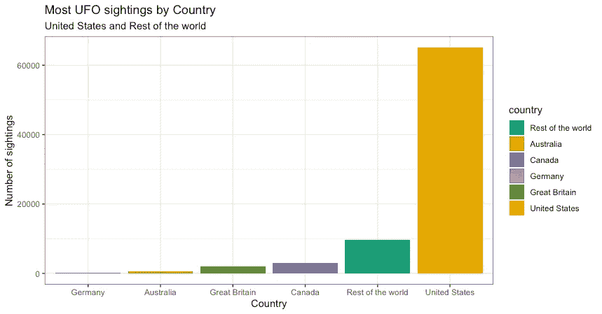

UFO 目击事件的数据分析和数据可视化-按国家绘制大多数 UFO 目击事件

# UFO 目击事件的全球密度是多少？

之前已经确定美国比其他任何国家都有更多的目击事件。但是首先，让我们画一张世界地图来检查在每个国家的目击事件有多密集，以及它们是否只出现在这个国家的一个地区或整个地区。

```
# HOW DENSE SIGHTINGS AROUND THE WORLDggplot(dataUfoClear, aes(x=longitude, y=latitude, colour=country)) + 
  borders("world", colour="gray", fill="seashell3") +
  geom_point(shape=15) +
  theme_bw() + 
  labs(x = "Longitude", y = "Latitude", 
       title="Map UFO sightings around the world", 
       subtitle = "United States and Rest of the world")
```

这张地图也支持了这样一种观点，即美国比其他任何国家都有更高的目击密度。你可以看看它们在各州的分布情况。

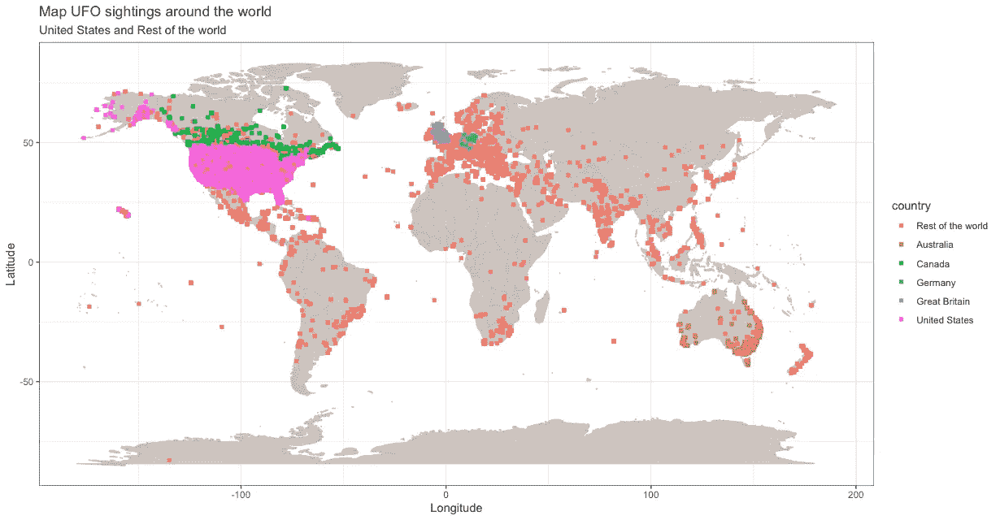

UFO 目击事件的数据分析和数据可视化——绘制全球 UFO 目击事件地图

# UFO 目击事件在美国是如何分布的？

现在您已经确定了美国拥有最多和最密集的目击事件，您可以查看每个州的目击事件数量。

```
# SIGHTINGS IN UNITED STATESggplot(dataUfoUSA, aes(x=reorder(state, state, FUN=length), fill=state)) + 
  stat_count() +
  theme_bw() + 
  theme(axis.text.x = element_text(angle=45, size=9, hjust=1)) + 
  labs(x = "State", y = "Number of sightings", 
       title="UFO sightings in United States", 
       subtitle = "Sightings by state")
```

直方图显示，该州指定的“ca”，即加利福尼亚州，在上个世纪有最多的 UFO 目击事件。

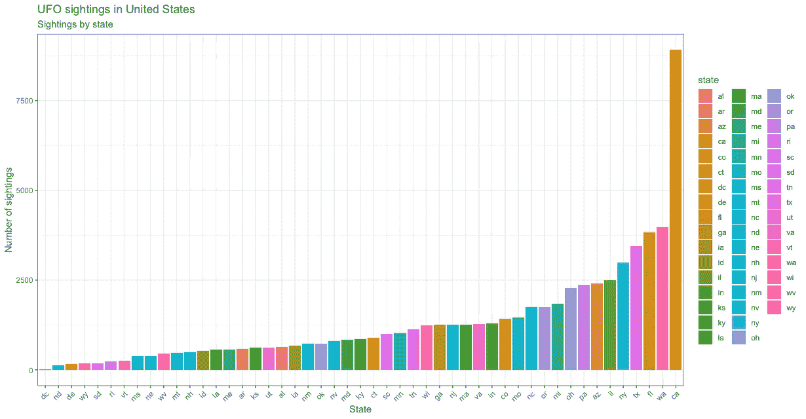

UFO 目击事件的数据分析和数据可视化——美国 UFO 目击事件的绘图

你也可以在一张完整的美国地图上看到同样的结果。

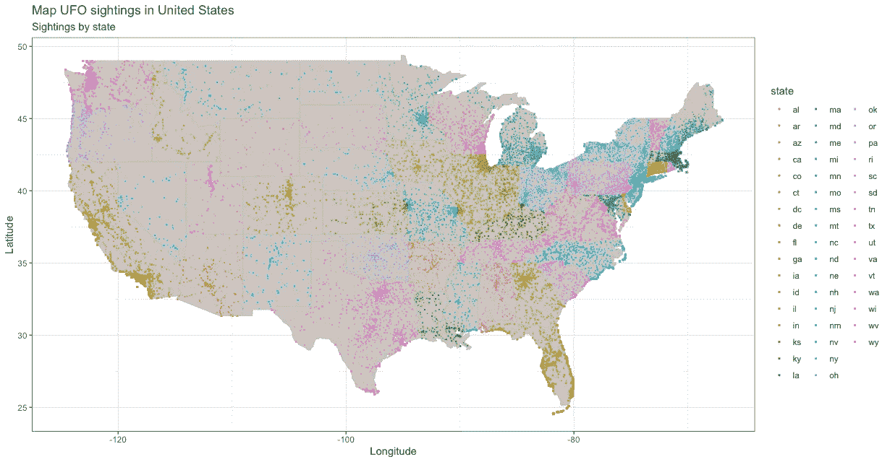

UFO 目击的数据分析和数据可视化——美国 UFO 目击地图

# 出现的最典型的 UFO 形状有哪些？

你可以看看世界上存在的最普遍的形状，因为你已经按国家和州查看了 UFO 活动。

```
# MOST SHAPES THAT APPEARggplot(dataUfoClear, aes(x=reorder(shape, shape, FUN=length), fill=shape)) + 
  geom_bar(show.legend=F) +
  coord_flip() +
  theme_bw() + 
  labs(x = "Shape", y = "Number of sightings", 
       title="Most typical UFO shapes that appear", 
       subtitle = "UFO shapes seen around the world")
```

条形图显示，描述的最常见的形状是一个标记为“光”的普通形状，它经常被有这种经历的人解释为耀眼的光环。

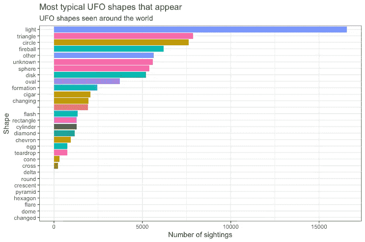

UFO 目击的数据分析和数据可视化——绘制最典型的 UFO 形状

# UFO 目击事件和时间有关联吗？

你可以看看目击的次数和一天中的时间是否有关联。此外，您可以用月份和年份进行测试。

```
# CORRELATION BETWEEN THE TIME AND SIGHTINGSggplot(dataUfoClear, aes(x=hour(datetime))) + 
  geom_histogram(bins=24, aes(fill=..count..)) +
  theme_bw() + 
  scale_fill_gradient(low = "palegreen", high = "palegreen4") +
  labs(x = "Hour of the day", y = "Number of sightings", 
       title="Correlation between daytime / UFO sightings", 
       subtitle = "Sightings during the day")
```

直方图清楚地表明，大多数的目击事件发生在没有光线或光线很弱的时候。然而，值得注意的是，白天也有不明飞行物的报道。

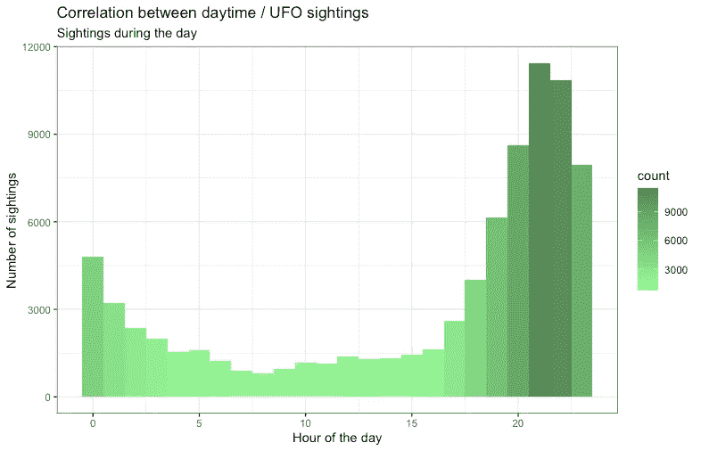

UFO 目击事件的数据分析和数据可视化——日间/ UFO 目击事件之间的关联图

# 不明飞行物的形状和时间有关联吗？

你可以看看形状和一天中的时间之间的关系。这可以解释为什么光的形状是最常被报道的形状。

```
# CORRELATION BETWEEN THE TIME AND UFO SHAPEshapesDaytime <- 
  dataUfoClear %>% 
  group_by(hour=hour(datetime), shape, duration) %>% 
  summarize(count=n());

ggplot(shapesDaytime, aes(x=hour, y=shape)) + 
  geom_point(aes(color=count, size=count)) + 
  scale_colour_gradient(low = "palegreen", high="palegreen4") +
  labs(x = "Hour of the day", y = "UFO Shape", 
       title="Correlation between daytime / UFO Shape", 
       subtitle = "Sightings during the day")
```

从图中可以看出，这些形状在夜间也更加普遍/持久。我们可以看到，与其他常见形状相比，光在夜间和傍晚出现的频率更高，但在白天出现的频率较低。

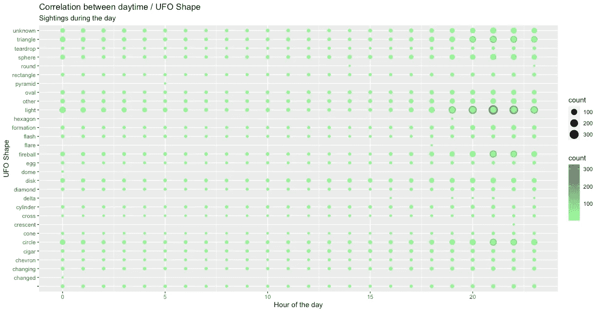

UFO 目击的数据分析和数据可视化——白天/ UFO 形状之间的绘图相关性

现在，您将进行“卡方”测试，看看一天中的时间和形状之间是否有联系。

假设:每个样本观察值都是独立的，进行卡方独立性检验。每个案例至少有一个条目。

```
chisq.test(dataUfoClear$shape, hour(dataUfoClear$datetime), simulate.p.value=T);
```

从这些数据中可以看出，p 值小于 0.05，即 p 0.05，这表明 UFO 的形状确实取决于一天中的时间。

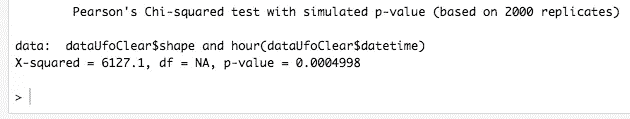

UFO 观测的数据分析和数据可视化— RStudio 控制台卡方输出

# 随着时间的推移，UFO 目击的频率上升了吗？

你希望在静态时刻研究 UFO 遭遇后，分析整个时间的 UFO 遭遇。

```
# SIGHTINGS BY YEARsightingsYear <- 
  dataUfoClear %>% group_by(year=year(datetime)) %>% 
  summarize(count=n());# REPORTS BY YEARreportsYear <- 
  dataUfoClear %>% group_by(year=year(date.posted)) %>% 
  summarize(count=n());ggplot(sightingsYear, aes(x=year, y=count)) + 
  geom_line(size=1, colour="palegreen4") + 
  geom_line(data=reportsYear, aes(y=count), size=1, colour="red") + 
  geom_smooth(method="lm") +
  labs(x = "Year", y = "red = reports, green = sightings", 
       title="UFO sightings / UFO reports by year", 
       subtitle = "Sightings during the day")
```

不仅在美国，全世界报告和发现的病例数量也在增加。从线性回归图中可以看出，UFO 目击数量并不是线性增长的。

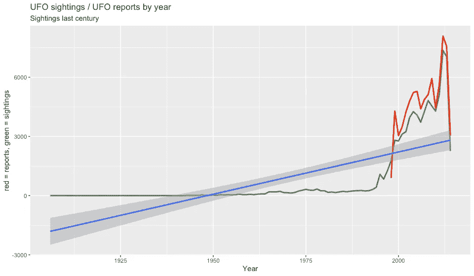

UFO 目击事件的数据分析和数据可视化—按年份绘制 UFO 目击事件/ UFO 报告

总之，你的发现表明，美国，即加利福尼亚州，有最高的目击数量。然而，要注意的重要一点是，根据人口密度，华盛顿州的目击密度高于加利福尼亚州。加利福尼亚州和华盛顿州都已经将娱乐用大麻合法化，这可以解释为什么在西海岸有这么多的目击事件。


布鲁斯·沃林顿在 [Unsplash](https://unsplash.com?utm_source=medium&utm_medium=referral) 上的照片

同样值得注意的是，这种被称为“光”的形状在每个国家都是有史以来最常被记录的，而且主要发生在晚上。随着时间的推移，目击和报告的数量似乎有所上升，但最近有所下降。我们不能根据这种分析来确定外星人是否存在，因为我们只有关于目击的信息。

这些 UFO 目击事件可能只是这些国家的技术测试吗？这些不明飞行物会不会是被派去评估先进国家力量的外星人的先进工具？只有时间和额外的数据会提供答案，但那是另一个数据分析实验的主题。

非常感谢您的善意阅读。和我的大部分文章一样，我在一个 **flexdashboard** 中分享了与**一起产生的情节，我把它放在一起更有美感一点:[https://rpubs.com/cosmoduende/ufo-sightings-usa-world](https://rpubs.com/cosmoduende/ufo-sightings-usa-world)**

在这里你可以找到完整的代码:[https://github.com/cosmoduende/r-ufo-sightings](https://github.com/cosmoduende/r-ufo-sightings)

感谢你坚持到最后，祝你分析非常愉快，可以把一切都付诸实践，对结果感到惊讶，和我一样开心！