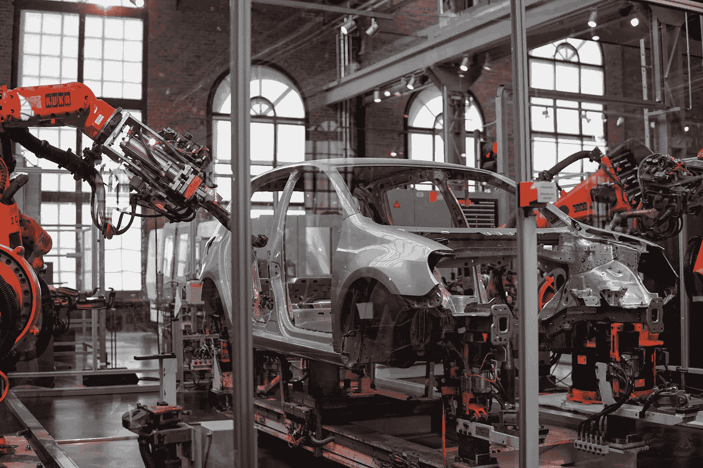

# 我们准备好迎接全自动社会了吗？

> 原文：<https://towardsdatascience.com/are-we-ready-for-a-fully-automated-society-f13a13fa2cb1?source=collection_archive---------14----------------------->

## 意见

## 分析使用人工智能取代人类工作的伦理含义和局限性

莱尼·屈尼在 [Unsplash](https://unsplash.com/s/photos/robot-factory?utm_source=unsplash&utm_medium=referral&utm_content=creditCopyText) 上的照片

2005 年，著名的未来学家 Ray Kurzweil 描述了奇点——一个机器智能变得比所有人类智能加起来还要强大的时间点。与奇点密切相关的一个想法是用人工智能实现人类工作的自动化。

人类劳动的自动化是我们今天已经可以看到的现象。无收银员的商店和配备机器人服务器的餐馆只是自动化的两个例子。有些人甚至相信，在某一时刻，所有的工作都将由计算机程序自动完成。但真正的问题是，我们真的能用人工智能实现所有工作的自动化吗？即使我们可以自动化许多工作，这个世界真的为完全自动化做好准备了吗？

# 人工智能的现状

当考虑人工智能运行社会的可能性时，我们必须问的第一个问题是人工智能的当前状态和能力。人工智能有四种类型，可以被视为不同的复杂程度。

1.  **无功艾**
2.  **有限的内存**
3.  **心理理论**
4.  **自我意识**

前两种类型的人工智能已经存在于今天的世界，但最后两种类型是理论概念，不会成为现实，直到未来的某个时候。

## 活性人工智能

反应式人工智能没有记忆的概念，只是被设计来对某些输入做出反应并产生一个输出。反应式人工智能是最简单的人工智能形式，大多数早期的人工智能系统都属于这一类。

IBM 的深蓝，一台打败了加里·卡斯帕罗夫的象棋计算机，是反应式人工智能的一个例子。图片来源:科学美国人。

## 有限记忆人工智能

有限记忆人工智能能够从过去的经验中学习，并具有一定程度的记忆，允许它随着时间的推移提高性能。深度学习的许多进步，如使用 LSTMs 处理序列数据和强化学习的发展，已经使这种类型的人工智能成为现实。

自动驾驶汽车是有限记忆人工智能的一个例子。罗伯特·尼克森在 [Unsplash](https://unsplash.com/s/photos/machine-learning-model?utm_source=unsplash&utm_medium=referral&utm_content=creditCopyText) 上的照片

## 心理理论人工智能

当机器有能力与人类的思想和感情互动时，我们将达到“心理理论”人工智能。心理理论是心理学中的一个概念，指的是通过将精神状态归因于他人来理解他人的能力。当机器拥有这种能力时，它们将拥有社交和情商，这使它们能够解决更广泛的问题。

照片由[安迪·凯利](https://unsplash.com/@askkell?utm_source=unsplash&utm_medium=referral&utm_content=creditCopyText)在 [Unsplash](https://unsplash.com/s/photos/robot-with-girl?utm_source=unsplash&utm_medium=referral&utm_content=creditCopyText) 上拍摄

## 自我意识人工智能

当 AI 使机器能够实现具有自我意识的智能时，具有自我意识的 AI 将成为现实。在这一点上，由具有自我意识的 AI 驱动的机器将是有意识的实体，这就提出了机器和人类如何共存的问题。

照片由 [Arseny Togulev](https://unsplash.com/@tetrakiss?utm_source=unsplash&utm_medium=referral&utm_content=creditCopyText) 在 [Unsplash](https://unsplash.com/s/photos/machine-learning?utm_source=unsplash&utm_medium=referral&utm_content=creditCopyText) 上拍摄

# 哪些工作可以轻松实现自动化？

涉及重复步骤或可预测决策的工作可以使用反应式人工智能实现自动化。这些工作通常涉及体力劳动或涉及遵循明确说明的任务。属于这一类别的工作包括:

*   制造业和仓库工作。
*   建筑中的体力劳动工作。
*   商店店员和收银员的工作。
*   废物管理工作。
*   农业中的体力劳动工作(灌溉、收割等)。)

上面的列表绝不是详尽的，但这里的关键点是，所有这些工作都涉及到带有明确定义的指令或可预测决策的任务，即使有反应式人工智能，机器也可以遵循这些指令或决策。

# 哪些工作最终可以实现自动化？

涉及基于过去事件和不同情况的更复杂决策的工作最终可以自动化，但比涉及重复的算法任务的工作更难自动化。属于这一类工作的一个很好的例子是出租车司机的工作。

驾驶过程中肯定会涉及到决策模式，但驾驶员需要能够根据具体情况做出决策。例如，我们可以训练自动驾驶汽车在看到人脸时停下来。但是，车遇到一个脸被遮住的人怎么办？汽车遇到过马路的不是人而是狗怎么办？作为人类，我们可以根据以前的经验和我们所谓的“常识”本能地做出这些决定。

驱动自动驾驶汽车的人工智能模型需要经过训练，以便对各种各样的情况做出适当的反应，并保留一定程度的关于过去事件的记忆。一般来说，涉及更复杂、依赖于情景的决策的工作最终可以通过严格训练和测试的有限记忆人工智能来自动化。

# 目前哪些工作应该留给人类？

某些工作需要的智能超出了人工智能能够提供给机器的有限内存。需要社交和情商的工作可能不会很快被人工智能自动化。事实上，我认为这些工作现在应该留给人类去做。我下面列出的所有工作都需要一定程度的社交和情商，这超过了我们当前人工智能系统的极限。

## 心理健康专家

尼克·舒利亚欣在 [Unsplash](https://unsplash.com/s/photos/therapy?utm_source=unsplash&utm_medium=referral&utm_content=creditCopyText) 上的照片

毫不奇怪，人工智能在目前的状态下，无法有效地自动化精神卫生专业人员的工作。治疗师、咨询师和心理学家需要能够理解他人的情绪和精神状态。在写这篇文章的时候，人工智能还不能理解人类的情感。有些人会认为，大型语言模型，如 GPT-3，能够进行类似人类的对话，但进行对话和真正理解另一个人的思想和感情是有区别的。

在我们实现心理理论人工智能之前，机器人治疗师或顾问的想法将是不可行的。事实上，我们可以放心，心理健康专家的工作将会长期存在。

## 医生和医务人员

照片由 [Olga Guryanova](https://unsplash.com/@designer4u?utm_source=unsplash&utm_medium=referral&utm_content=creditCopyText) 在 [Unsplash](https://unsplash.com/s/photos/er-doctor?utm_source=unsplash&utm_medium=referral&utm_content=creditCopyText) 拍摄

尽管机器可能会通过使用复杂的计算机视觉模型来执行复杂的手术，如心脏移植，但在目前的状态下，医生和其他医疗专业人员的工作无法完全被人工智能取代。

医疗专业人员，尤其是那些在急诊室等高风险环境中工作的人员，需要了解生死情况的紧迫性。也有研究表明，同理心是成为一名医生的重要组成部分。简单治愈一种疾病和真正治疗一个病人是有区别的。治疗病人需要理解病人的顾虑，并把他们看作一个人，而不仅仅是一种疾病。由有限记忆人工智能驱动的机器可以胜任执行医疗程序，但总是无法在人类层面上与患者联系。

使用机器代替医生的工作也带来了伦理问题。例如，如果机器人外科医生错误地进行了肺移植手术，并导致患者严重受伤甚至死亡，那么谁应该承担责任？我们要责怪监督手术的医生吗？我们会责怪机器人背后的程序员吗？即使机器人没有意识，我们还会责怪它吗？如果我们试图用人工智能实现医疗工作的自动化，这些就是我们将面临的困境。

## 执法人员

马特·波波维奇在 [Unsplash](https://unsplash.com/s/photos/law-enforcement?utm_source=unsplash&utm_medium=referral&utm_content=creditCopyText) 上的照片

就像心理健康专家和医生的工作一样，成为一名执法人员需要社交和情商，以及超越最先进人工智能能力的情景意识水平。虽然可以训练机器开枪或检测道路上超速的车辆，但有限的记忆 AI 无法理解对其他人的安全有威胁的紧急情况。例如，记忆有限的 AI 可能能够追踪到建筑物中的活跃枪手，但无法理解枪手正在将人类生命置于危险之中，并导致建筑物中的人们恐慌。

用武器武装机器，把一个社区的人的生命交给没有意识的机器，也会带来伦理问题。如果我们武装没有感情的机器，让它们成为我们警察或军队的一部分，是什么阻止它们成为无情的杀人机器？如果警察队伍的很大一部分由机器人组成，一个社区真的会感到舒适和安全吗？如果一台机器打伤或打死了一个正在执勤的市民，谁该负责？这些问题只是凸显了一个事实，那就是我们还没有为人工智能自动化执法工作做好准备。

# 摘要

虽然人工智能确实是一个可以执行许多任务的强大工具，但我们需要了解人工智能的局限性，特别是在自动化人类工作方面。今天存在的最先进的人工智能形式，包括 GPT-3 等最先进的模型，是有限记忆人工智能。记忆有限的人工智能可以从过去的数据和经验中学习，但缺乏与人类的思想和感情互动的能力。这种能力通常被称为心理理论，在人类的许多工作中都需要。

如果没有社交和情商，AI 永远无法真正取代所有人类的工作。在心智理论人工智能成为现实之前，许多基本工作仍将留给人类。

# 加入我的邮件列表

加入我的[邮件列表](https://mailchi.mp/e8dd82679724/amols-data-science-blog)，获取我的数据科学内容的更新。当你[注册](https://mailchi.mp/e8dd82679724/amols-data-science-blog)的时候，你还会得到我免费的**解决机器学习问题的逐步指南**！也可以在 [Twitter](https://twitter.com/amolmavuduru1) 关注我，了解内容更新。

当你这么做的时候，考虑加入媒体社区，阅读成千上万其他作家的文章。

# 来源

1.  A.辛慈，[理解人工智能的四种类型，从反应式机器人到有自我意识的存在](https://theconversation.com/understanding-the-four-types-of-ai-from-reactive-robots-to-self-aware-beings-67616)，(2016)，对话。
2.  长度 Greenemeier，[深蓝 20 年后:AI 如何在征服国际象棋](https://www.scientificamerican.com/article/20-years-after-deep-blue-how-ai-has-advanced-since-conquering-chess/)，(2017)，《科学美国人》。
3.  E.赫希博士，[医学中移情的作用:一个医学学生的视角](https://journalofethics.ama-assn.org/article/role-empathy-medicine-medical-students-perspective/2007-06)，(2007)，AMA 伦理杂志。