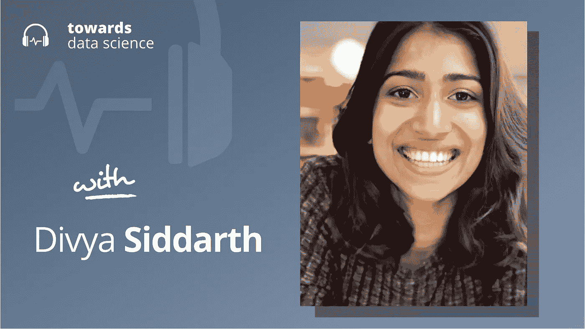

# 我们对 AI 的思考是不是错了？

> 原文：<https://towardsdatascience.com/are-we-thinking-about-ai-wrong-4c826f9615c0?source=collection_archive---------22----------------------->

## [播客](https://towardsdatascience.com/tagged/tds-podcast)

## Divya Siddarth 谈人工智能的更好范例，以及台湾如何在技术治理方面领先

[苹果](https://podcasts.apple.com/ca/podcast/towards-data-science/id1470952338?mt=2) | [谷歌](https://www.google.com/podcasts?feed=aHR0cHM6Ly9hbmNob3IuZm0vcy8zNmI0ODQ0L3BvZGNhc3QvcnNz) | [SPOTIFY](https://open.spotify.com/show/63diy2DtpHzQfeNVxAPZgU) | [其他](https://anchor.fm/towardsdatascience)

*编者按:这一集是我们关于数据科学和机器学习新兴问题的播客系列的一部分*，*由 Jeremie Harris 主持。除了主持播客，Jeremie 还帮助运营一家名为*[*sharpes minds*](http://sharpestminds.com)*的数据科学导师初创公司。*

人工智能研究经常被框定为一种人类与机器的竞争，这将不可避免地导致人类的失败，甚至被人工超级智能大规模取代，这些人工超级智能拥有自己的代理意识和自己的目标。

Divya Siddarth 不同意这种框架。相反，她认为，这种观点导致我们关注人工智能的应用，这些应用既不像它们可能的那样有利可图，也没有足够的安全性来防止我们遭受危险的人工智能系统的长期潜在灾难性后果。她应该知道:Divya 是微软首席技术官办公室的政治经济学家和社会技术专家。

她还花了很多时间思考政府能够——也正在——做些什么，以将人工智能的框架从与人类直接竞争的集中系统转向更具合作性的模式，这种模式将人工智能视为一种由人际网络利用的便利工具。达薇亚指出台湾是数字民主的一个实验，台湾正在做的正是 T21 所做的。

以下是我最喜欢的一些外卖食品:

*   Divya 通过*启示的透镜来看待技术。*启示是一项技术的特征，它支持或限制我们对它的使用(“我们可以使用的杠杆”)，并以微妙的方式塑造我们与技术的互动，这可能会对社会产生意想不到的重要影响。以 Instagram 为例，它有各种各样的启示，旨在使上传和分享图片变得非常非常容易。Instagram 的广泛采用——以及这些特定功能的广泛采用——导致了一个社会，在这个社会中，我们许多人都感到有一定的压力，要在没有其他方式的情况下拍摄和分享照片。同样，像 Twitter 这样的平台也有启示(比如点赞和评论区)，将用户推向表演、两极分化和分裂的行为。尽管公司的既定使命可能很重要，但它对可提供性的具体选择在决定其对社会的影响方面同样重要。
*   Divya 将这种启示的概念扩展到了人工智能。她认为，今天的人工智能已经偏向于更少人类合作和更多人类竞争的应用。例如，强化学习明确地将机器学习框架为其目标是创造追求与我们不同目标的独立代理。这种类似代理的美学让人们更难将人工智能视为促进人类合作的工具，因为它正式将人工智能代理与人类决策过程分开。
*   Divya 指出，台湾是一个找到了更具建设性、以人为本的方式使用技术和人工智能来促进社会凝聚力和建立共识的国家的例子。简而言之:台湾使用一个叫做 [pol.is](https://pol.is/home) 的工具开发了两个审议平台。这些平台允许公民就特定的政策问题发表意见，并确定共同观点的集群以及不同集群之间的共同点。重叠区域与潜在的解决方案一起被强调，结果是一组启示，它们有助于达成共识而不是竞争。

你可以[点击这里](https://twitter.com/divyasiddarth)在 Twitter 上关注达薇亚，或者点击这里在 Twitter 上关注我。

## 章节:

*   0:00 介绍
*   1:55 达薇亚的背景
*   6:30 台湾的技术管理
*   17:30 台湾科技教育
*   28:30 当前人工智能思维的问题
*   36:35 对复制人类行为进展的反对意见
*   44:15 给新公司的建议
*   57:00 等待人类文明集体有机地拿出解决方案
*   1:01:44 个总结