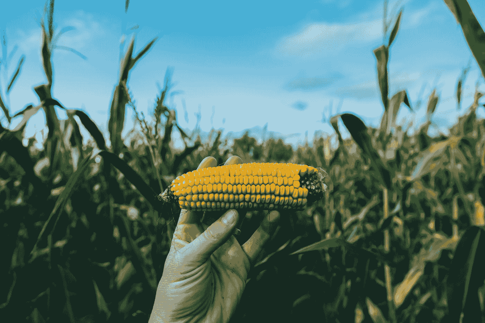
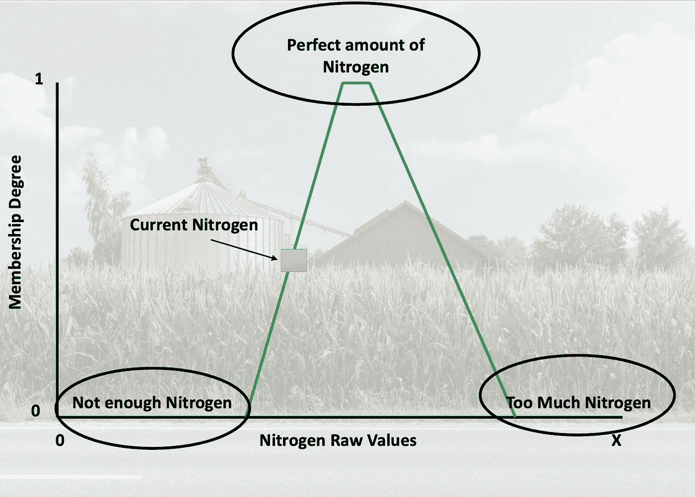

# 我们是否在逆向思考可解释性？

> 原文：<https://towardsdatascience.com/are-we-thinking-about-explainability-backwards-c9a719cb1250?source=collection_archive---------28----------------------->

## [模型可解释性](https://towardsdatascience.com/tagged/model-interpretability)

## 在构建人工智能解决方案之前，你应该能够回答三个问题

围绕人工智能的一个普遍问题是它的黑盒性质，但为可解释性而设计是可能的。不是每个用例都需要一个可解释的解决方案，但是很多都需要。当我们开发 XAI 时，我们经常问，“我们能解释什么？”在这篇文章中，我要求我们首先考虑最终用户。我强调了在构建你的人工智能解决方案之前要考虑的三个问题，这样它就可以通过设计来解释。

照片由[法库里安设计](https://unsplash.com/@fakurian?utm_source=medium&utm_medium=referral)在 [Unsplash](https://unsplash.com?utm_source=medium&utm_medium=referral) 上拍摄

# 动机

我的大部分博士研究都围绕着可解释的数据融合。结果，我花了相当一部分时间研究可解释的人工智能。可解释性引起了我的兴趣，因为它涉及到算法将自身的一些东西翻译给用户。哲学辩论围绕着解释的构成，但是算法解释需要向用户展示一些关于它们自己的东西。

我们以不同的方式发展 XAI 方法。一种常见的方法是独立于人工智能开发 XAI。例如，流行的 LIME [1]位于人工智能之外，允许它是人工智能不可知论者；然而，这限制了它所提供的解释类型。第二种方法是从一开始就将 XAI 直接开发到我们的人工智能中——通过设计来解释。我的 XAI 之旅凸显了在开发之初考虑最终用户的重要性。我鼓励你们思考需要建立什么，而不是能够建立什么——这是我学到的最重要的一课。

设计的可解释性给了人工智能工程师最大的自由来开发相关的解释，以赋予算法的用户权力。在我的职业生涯中，我创造了多种 XAI 方法，并将我所学到的归纳为三个以用户为中心的问题— ***谁、什么、如何*** 。

# **1。谁会使用你的人工智能？**

**开发相关解决方案需要了解谁将使用您的人工智能。会不会是一个**:

*   人工智能工程师
*   数据科学家
*   商业领袖
*   农民
*   医生
*   人工智能驱动车辆的驾驶员
*   法官
*   军事领导

这些人每天都在做出重大的、改变生活的决定，所以了解谁得到了解释以确保我们得到正确的翻译是非常重要的。无人驾驶汽车的驾驶员想要驾驶汽车时使用的图像的显著图，这是值得怀疑的。不要误解我，显著图有效地突出了图片的一部分，但我认为这种解释与人工智能模型构建器最相关。并不是所有的 XAI 都会产生相关的解释，首先，考虑谁会收到解释将确保你正在构建相关的 XAI。今天大多数可用的 XAI 集中于将信息传递给人工智能从业者，而不是终端用户。为了制造有效的 XAI，我们必须打破这种模式。我们必须跳出框框思考。我们必须理解用户的用例，以便在正确的时间向他们传递正确的信息。

**考虑最终用户似乎是显而易见的，对吗？**但是，大多数 XAI 开发者本质上都是数学家，我们专注于扩展数学，而不是翻译给非数学家。首先，我会挑战我们去理解我们的用户，在开发 XAI 时发现最好的 ***媒介*** (双关语)来交付翻译。

例如，让我们考虑一个对预测产量感兴趣的农民。他们不会关心模型的可解释性。但是，他们需要了解人工智能正在做什么，以及如何使用它来增强他们的决策。

# **②*。他们想知道什么？***

在考虑你的 XAI(或人工智能)影响时，识别和理解你的受众可以说是最关键的因素。一旦被认可，对话就可以面向他们希望解决的问题；他们不知道他们需要什么 AI 或者 XAI。根据我的经验，用户希望了解每个数据点对最终模型输出的影响。为什么？**揭示数据影响允许他们干预以改变结果。**

例如，考虑一个预测一个农民今年玉米产量的算法。农民的目标是最大化产量和最小化成本，因此了解每个数据点的影响将为农民提供最佳决策信息。作为一名数据科学家/人工智能工程师，识别这个痛点为实施适当的解决方案打开了大门，以便将这些信息传递给农民。农民根本不在乎相关系数——他们拿它没办法。

# 3.我们如何向他们传达这一点？

到目前为止，我们只讨论了理解谁将使用 XAI (AI)以及他们想知道什么。在这一节中，我们将深入探讨 XAI 的一些方法。存在许多不同的思想流派来产生解释。仅在我的酒吧里，我就用了三种不同的类型。我喜欢这篇论文中的框架[5]。作者深入研究了几种不同的解释，他们的分类考虑了最终用户。

> “……我们可以区分出*文本解释、可视化、局部解释、举例解释、简化解释*和*特征相关性*。”[4]

每种方法在适当的背景下都是必不可少的，因为人是不可概括的，所以不可能建立一个完全适合每个人的解释。使用每种类型的解释，我们可以开发出一个可以在多个层次上解释的解决方案，以达到更广泛的受众。

Bryce，这在高层次上是很棒的，但是我们如何实现一个可以通过设计来解释的系统呢？问得好。让我们考虑一下我们的农民。

# **举例**

杰西·加德纳在 [Unsplash](https://unsplash.com?utm_source=medium&utm_medium=referral) 上的照片

第一部分指出了我们基于不同特征预测整个农场玉米产量的问题。接下来，我们确定了我们的最终用户——农民。然后，我们强调了对基于预测收益率的干预选项的兴趣。现在，我们必须确定将农民的愿望融入我们的 AI/XAI 设计的最佳方式。

我们可以将我们的问题描述为“开发一个玉米产量的预测模型，为农民提供改善产量的选择。”

我将增加一个约束来实现一个解决方案——使用 2/3 的计算智能分支。你能花点时间想想你会如何解决这个问题吗？方法有很多。

为了设计一个利用计算智能的这两个分支的系统，我们需要了解我们需要这些分支中的哪些算法。具体来说，一个**模糊推理系统(FIS)** 将提供底层分类能力，以有效地为农民的田地建模。查看这篇文章可以找到一个很好的例子。FIS 由可学习的参数组成。例如，我们可以优化规则的数量和每个规则的隶属函数。如果你读过我的 CI 文章，你会发现这是一个使用**遗传算法**的绝佳机会。染色体是每一组规则，其中每个基因是一个模糊隶属函数的参数。以这种形式设置问题允许我们优化最能预测农民产量的 FIS 参数。你猜怎么着？一旦我们知道了参数，我们就可以明确地将它们传递给农民。有两种可能的解释。首先，文本解释陈述了一个规则:

> "如果氮含量高，产量也会高."

或者是一张隶属图，它显示了相对于玉米已经施用的量，最佳的氮量是多少。

绿线代表学习到的隶属函数——“高”，橙色框代表当前的氮量。这意味着农民需要产出更多的氮。背景由[朱利安·谢尔](https://unsplash.com/@js90)提供。

在这两种情况下，农民都可以采取直接措施，在农田里施更多的氮肥。因此，我们有效地为农民创建了一个 XAI，并提供了相关的解决方案。

# *结论*

我相信，作为人工智能的创造者，我们最终有责任确保我们的算法翻译正确的信息。释放数据和人工智能的潜力是我们的责任，我们必须利用这一点。所以很多时候，我们作为人工智能工程师，把自己限制在目前可能的范围内(用目前的数学)。让我们颠倒一下我们对 XAI 的看法——让我们在计算之前先考虑用户。让我们跳出框框思考。让我们为没有明确解决方案的问题创造解决方案。转变我们的视角让我们能够跳出框框思考，并为非专业人士设计解决方案。要做到这一点，需要了解用户，他们需要和想要知道什么，并实施有效的 AIs 人工智能。

**参考文献**

[1][https://homes.cs.washington.edu/~marcotcr/blog/lime/](https://homes.cs.washington.edu/~marcotcr/blog/lime/)

[https://ieeexplore.ieee.org/document/9149954/](https://ieeexplore.ieee.org/document/9149954/)

[3][https://ieeexplore.ieee.org/document/8491501](https://ieeexplore.ieee.org/document/8491501)

[4]https://ieeexplore.ieee.org/document/9494563

[5][https://www . science direct . com/science/article/pii/s 1566253519308103](https://www.sciencedirect.com/science/article/pii/S1566253519308103)