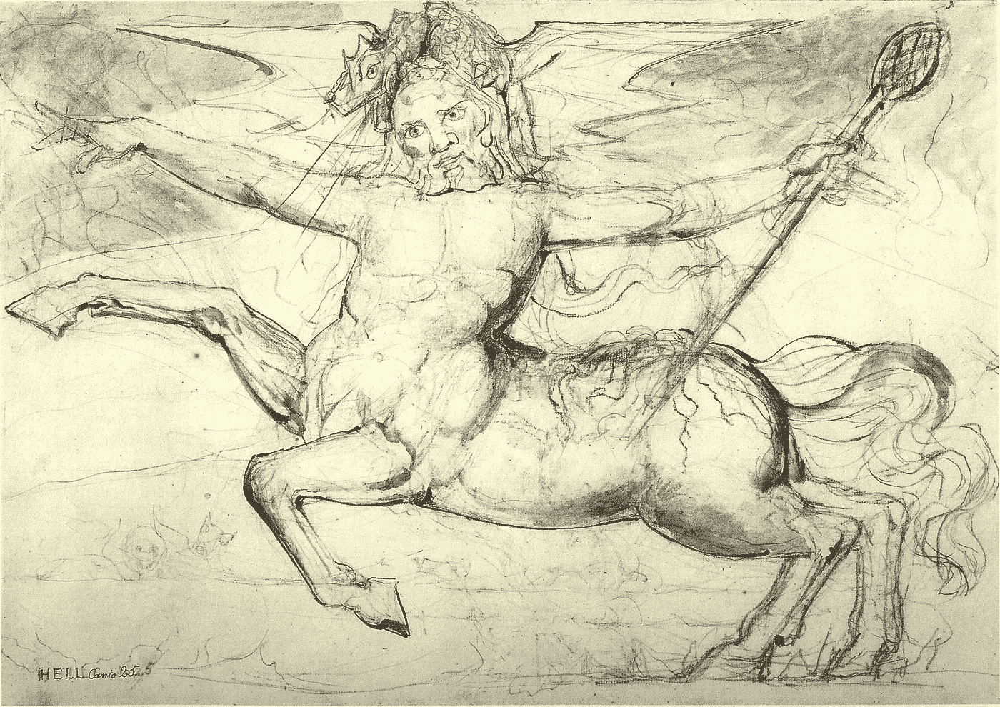
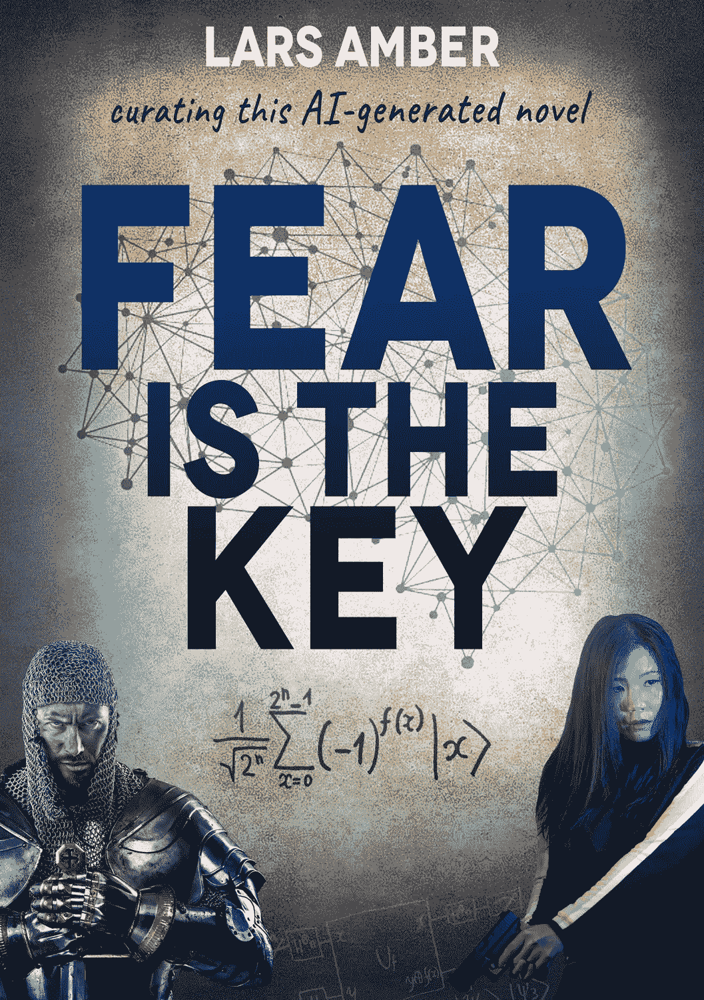

# 你会很快读一本“半人马书”吗？

> 原文：<https://towardsdatascience.com/are-you-going-to-read-a-centaur-book-soon-44368fed8829?source=collection_archive---------45----------------------->

威廉·布莱克的《半人马》(公共领域，通过维基共享资源)

## **这是关于主流文学的 AI 未来——现在你可以自己判断了**

*关于半人马图书*，我指的不是 1981 年灭绝的传奇奇幻图书出版商。不，我说的是一种全新的文学类型，人类和机器的创造性互动，由结合了人和动物的神话生物来说明。

艾的书已经问世好几年了，但很少有人愿意去读。这一类别中的佼佼者，如由罗斯·古德温和肯里克·麦克道尔策划的项目，可能会美得不可思议，但过于实验，无法吸引更多的图书读者。相比之下， ***恐惧是关键，*** 笔名拉斯琥珀，是第一部借助先进的文本生成模式写成的长篇且“可以理解”的小说。它的叙述从第一段到最后一段是连贯的。惊悚小说作者当馆长！这个故事是关于它的形成。

首先，我们必须追溯到上个世纪。国际象棋世界冠军加里·卡斯帕罗夫被 IBM 的深蓝击败。那是 1997 年。加里仍然是一名活跃的精英球员，非正式地排名第五。艾不是他的死敌，恰恰相反。在他历史性的失败后的一年，这位俄罗斯大师引入了一种新的游戏方式，他将其命名为半人马国际象棋。然后，在 2005 年，半人马国际象棋锦标赛证明了人工智能辅助下的人类棋手可能战胜最好的人工智能国际象棋机器。一个创造性的概念因此进入了其他人工智能领域。人类更擅长想象新的路径，而机器依靠存储的记忆和海量数据，在解决已知结构的问题方面无与伦比。

与此同时，这个问题可能更加复杂。中国的围棋被视为最具战略性的棋类游戏，其可能的位置数量远高于国际象棋。2016 年，谷歌的人工智能机器 AlphaGo 确实以一个人类不会想到的怪异举动击败了人类最好的围棋选手。在缺乏更好的定义来描述自我改进神经网络的层层动态的情况下，人们可能会谈到隐藏在一些最佳算法中的无法解释的直觉。今天的人工神经网络在组合单词的方式上确实难以捉摸，在上下文中更是如此。认知科学家无法一步一步地解释它们到底是如何运作的。人工神经网络有时会在自己不是诗人的情况下产生诗歌，在纯粹的胡言乱语中产生一些精心制作的句子。

书的封面恐惧是由简·费莉佩·比尔设计的钥匙(www.janfelipegraphics.com)，图片购自 iStock/Getty Images(www.istock.com/br)

"我把卡斯帕罗夫的半人马概念应用到了文学中."

人工智能机器永远不会像《寻找逝去的时光》的作者马赛尔·普鲁斯特那样写作。也就是说，在我们发明了人工通用智能，也就是梦寐以求的 AGI 之前！正是通过语言，人类的大脑可以达到一些最复杂的表现，特别是由于其使用符号和表达情感的能力。当一台计算机自己从头到尾写完一部好小说的时候，它就已经获得了超越人类的智能，并且很可能在各个领域实现超越人类的智力任务。

在此期间，人工智能程序可能会成为强大的创造性队友。我把卡斯帕罗夫的半人马概念应用到文学中。即使*恐惧是关键*是一部先导小说，新冠肺炎·疫情的果实，我打赌这种体裁很快就会成为主流。

2016 年，Kimagure 人工智能作家项目的日本研究人员发表了一部计算机写小说 的 ***日。他们的目的是揭示创造力的本质。这是一个成功，因为它的文体质量受到了国际贸易媒体的一致称赞(它几乎获得了文学奖！).日本的“小说”有 10，000 个字符的长度，根据定义，它属于短篇小说(非常短的一个)。据该项目组的一名参与者称，其内容不超过 20%是人工智能生成的。*恐惧是关键，*则长达 78000 字。作为一个科技文学的比较，伊恩·弗莱明的第一部介绍詹姆斯·邦德的小说《皇家赌场》有 65000 字。我的目标是达到百分之五十的人工智能含量。因此，我并不成功，但我认为我 37%的分数(大约)已经相当不错了。如果我把机器给予的灵感包括在内，这本书 50%的内容不仅仅是因为我的创造力。因此，我相信*恐惧是关键*是独特的。***

**“文字机器人现在有创意了”**

这是一个事实:我们不应该再认为写作的创造性是人类独有的特权。也许这是偶然的，但文字机器人现在很有创造力。*电脑写小说的那一天*暗示了五年前的立场。*恐惧是关键*可能被视为概念的统计证明。

自然语言生成领域(NLG，即计算机生成的文本)正以接近光速的速度发展。我一直使用 GPT-2 语言程序，已经过时了。它是由 **OpenAI** 在 2019 年开发的(2016 年由埃隆·马斯克(Elon Musk)联合创建，但他在三年后退出了公司董事会)，如今具有盈利和非盈利的混合状态。

更具体地说，我使用了这一代最完整的 **1.5B** **GPT-2** 型号。由于我本人不是技术人员，在运行阶段，我得到了一些人和组织的宝贵帮助。我首先与 Erick Fonseca 讨论了这个项目，他是一位自然语言处理学者(NLP，即当机器阅读语言时会发生什么),也是一位来自巴西的博客作者，目前正在里斯本的电信研究所做博士后。埃里克自愿成为合伙人。由于他在葡萄牙的计划日程很紧(并且缺乏一些足够的硬件)，我不得不寻找另一个技术支持，这使我来到了印度古城艾哈迈达巴德，一个快速发展的服务中心。在那里，1.5B 车型由 Pragnakalp Techlabs 及其创始人 Mittal Patel 进行了微调。原来不是那么微不足道。它只有在得到一个庞然大物谷歌云 TPU(张量处理单元)的支持后才起作用。因此，最终产生了大约 60 万个单词。NLP 研究人员称之为“令牌”。无论面额多少，产量都对应 6 部大型小说。

这个输出被我设计的数百个写作提示激活了。您卑微的仆人还选择了用于微调的 16 MB 文学数据集的内容。它由大约 35 部小说和许多次要文件组成。每一章(总共 44 章，外加一个序言)都以一个题词，一个文学引语开始，其中大部分摘自文集。

“有时我觉得自己就像一个牛仔，努力不让自己从野马竞技会的马鞍上掉下来！”

*现在我们生活在一个疯狂的世界里
恐惧是你想成为什么样的人的关键
你没有发言权
直到你死的那一天，你都被那些混蛋压得喘不过气来*

小说开头的主要词牌取自一首铁娘子歌。它包含了我的书名，这本书是在互联网上搜索的，反映了焦虑的永久状态，这种状态比以往任何时候都更主导着我们现在的生活。本着同样的精神，组成书籍封面拼贴的视觉元素是互联网搜索生成的。阴谋=圣殿骑士；动作=代理；未来=量子计算；手稿=手写；时间=永无止境的算法的主要变量……但封面艺术作品，被认为像丹·布朗的仿制品，完全是人类的，由平面设计师**简·费莉佩·比尔**创作(尽管显然也是在电脑上！).

我们应该提到这个项目的缺点。文本生成模型还不能构成一个有效的工具来完整地传递长文本。我花了更多的时间和更多的压力来创作*恐惧是这种机械方式的关键*，而不是之前那些仅仅以人类为背景的文学作品。有时候，我觉得自己就像一个牛仔在野马竞技表演中努力不从马鞍上掉下来！这仍然是一场痛苦的斗争。我有一种直觉，GPT-2 的问题之一是它最初预训练的 800 万个网页中的许多质量很差。在很大程度上，这些数据集收集的页面来自讨论组中的 Reddit 帖子。对我来说，它们经常反映出令人震惊的偏见和成见。除此之外，GPT 2 号由于无法欣赏真实世界，自然倾向于快速切换到晦涩难懂的模式。GPT-2 崇拜阴谋；它对色情有好感；它似乎憎恶欧盟，却没有任何有力的论据支持它…

但在其罕见的辉煌时刻，它产生了足以与豪尔赫·路易斯·博尔赫斯相媲美的句子甚至段落。或者唐纳德·E·维斯雷克…

以下是《T4》第一页的节选，恐惧是关键:

*——*虽然冷静的分析可能会强调，在人类历史上，我们将首次被允许通过一种全新类别的算法来控制天气，甚至可能控制生物圈，但我们不能忽视未来几年甚至几十年将是戏剧性的。第一个评估模糊了我们选择生活的背景。在这样的背景下，保持沉默确实是一个重大错误。毫无疑问，法国绿色活动家劳雷·杜哈梅尔和她的亿万富翁叔叔相信，他们能够确保人类的希望得到适当的回应。我们不时会遇到常见的全球自大狂金融家，他们在每本论述政治、商业和国际福利之间联系的书中都能找到。这个故事也不例外。**

*除了我插入的命名字符，以及两三个非常小的语言调整，上面的整个段落都是人工智能制作的。这里还有一个:*

*对他来说，这个地方似乎拥有一种奇特的自我意识。它传达了某种萨满的能量。这里的氛围和没有噪音让他觉得自己身处一个地方，在那里，生活中必不可少的组成部分是人工制品，而不是人。房间越安静，气氛就越均匀。他回忆起在拉·西塔德尔码头下船时那种钦佩的感觉:那是在一个正在进行的杰作面前，一个不真实的创造，它的品质被未知的力量所控制。弓形窗具有博物馆级的防反射玻璃，提供清晰、无障碍的视野，同时减少不必要的眩光和反射。他们中的一部分直接面向海湾，但大部分是定向的，所以整个岛屿的景观看起来很诱人。这座豪宅还有其他雅致的彩色玻璃窗，但都是垂直设计的。*

*小说结尾出现了一些很酷的动作:*

**就在被雪崩击中之前，他被一个极高的白色圆柱所包围。他周围的雪像旋转的风一样刮着。几秒钟后，他就失明了，从斜道下滚下山坡。他感到肋骨里有重物撞击的声音。好吧，如果这是一次相当大的雪崩，他肯定会受伤，也许是被他自己的滑雪板。感觉好像在他的右脚下打开了一个冰缝，在白色有毒石板的重压下，他的腿痛苦地上下膨胀。一些湿漉漉的东西从他右膝盖上部流下来。腿的其余部分感觉被殴打。现在唯一有意义的声音是他心跳的嘎吱声，那是一种浅浅的循环模式，还有他那结了冰的牙齿在抗议手臂的重量时发出的破裂声。一次又一次，他听到戴着手套的右手下熟悉的雪裂声。有一个黑色的窗帘，固体和静止的，围绕着他。他瞬间失去了对疼痛的控制。他从未经历过这样的恐惧。**

*在小块，我们是正确的，发现这真棒。即便如此，我认为 OpenAI 应该遵循我的角色 Anita Alm 博士的建议，他是《恐惧是关键》中瑞典人工智能研究的神童，通过额外的开放式算法实现更好的文本生成机器(通过阅读小说你会了解到这一点)。但老实说，我还没有尝试过 2020 年 6 月发布的 **GPT-3** ，它的性能将比 GPT-2 好得多，因为它是在 1750 亿个参数上训练的(比上一代多一百倍)。相当奇怪的是，正如企业家兼数据科学家 **Julien Lauret** 指出的，“GPT-3 没有从经验中学习；它只训练过一次，当我们查询它时，模型权重不会更新。更强大，但更少的人，然后！但 GPT-3 不仅是文本智能的，它还可以编写基本的代码，并翻译成英语，即使这些功能不是它的发明者想要的。*

*为了生成我的下一部 AI 小说的重要部分，我需要获得 OpenAi 的邀请，以启动 GPT-3 的微调项目(到那时可能也会有 GPT-4 准备好)。在我看来，这应该符合公司的利益，向更广泛的公众展示文本生成的潜力。*

*与美国小说作家罗宾·斯隆(Robin Sloan)一样，我相信最先进的文本生成机器的主要好处不是它们实际的逐字输出，而是它们可能带来的新的灵感角度。勇敢的写作同事们，你们以后不会失业的！但你可能已经找到了一个不眠之心的陪练。*

*最后，我必须警告莎翁的《习语》的鉴赏家们。GPT 二中从来没有抛弃过一个好的英语老师。大多数人工智能小说文本在出版前需要进行语言上的修改和编辑。但这也适用于人类作家，好吗？*