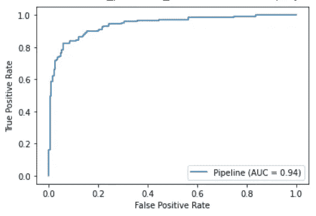
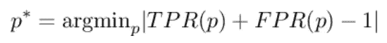
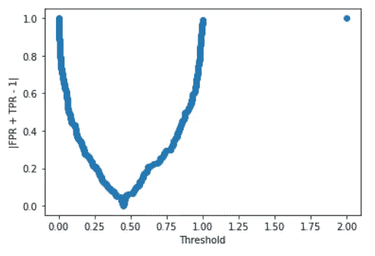
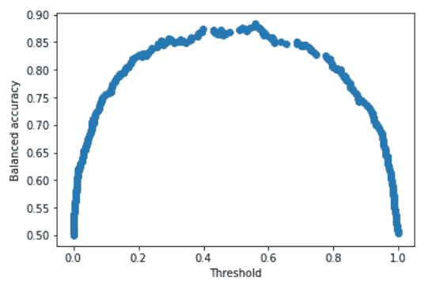

# 你还用 0.5 做门槛吗？

> 原文：<https://towardsdatascience.com/are-you-still-using-0-5-as-a-threshold-c5728aa98583?source=collection_archive---------31----------------------->

## 二元分类问题中调整阈值的一些方法


凯文·Ku 在 [Unsplash](https://unsplash.com?utm_source=medium&utm_medium=referral) 上的照片

在二元分类问题中，我们通常将模型给出的分数转换为应用阈值的预测类。如果分数大于阈值，我们预测 1，否则，我们预测 0。这个阈值通常设置为 0.5，但是正确吗？

# 0.5 背后的原因

在二元分类中，当模型给我们一个分数而不是预测本身时，我们通常需要将这个分数转换为应用阈值的预测。因为分数的意义是根据我们的模型给我们一个 1 的感知概率，所以使用 0.5 作为阈值是显而易见的。事实上，如果有 1 的概率大于有 0 的概率，那么将预测转换为 1 是很自然的。0.5 是确保给定的 1 概率大于 0 概率的自然阈值。这就是为什么当我们调用估算器实例的*预测*方法时，它是 Python 的 scikit-learn 库中使用的默认阈值。

那么，为什么 0.5 可能不是一个好主意呢？很简单，因为这是一个假设，而我们作为数据科学家，必须根据数据而不是假设做出决策。有时候 0.5 不是完成我们目标的合适门槛。例如，它可能不会给我们高精度，或者可能导致混淆矩阵中的高错误值。因此，我们必须根据某个性能指标的优化过程来调整阈值。这种度量标准的选择取决于我们的问题。

# Python 中调整阈值的示例

现在让我们看看如何调整将分数转换为预测值的阈值，并使用 Python 来实现。你可以在我的 [GitHub 库](https://github.com/gianlucamalato/machinelearning/blob/master/Threshold.ipynb)中找到全部作品。

首先，让我们导入波士顿数据集和逻辑回归，加上一些指标，如平衡准确度和 ROC 曲线。

```
import numpy as np 
import matplotlib.pyplot as plt 
from sklearn.datasets import load_boston 
from sklearn.linear_model import LogisticRegression 
from sklearn.preprocessing import StandardScaler 
from sklearn.pipeline import make_pipeline 
from sklearn.model_selection import train_test_split,cross_val_score
from sklearn.metrics import roc_curve,plot_roc_curve, balanced_accuracy_score
```

现在，我们可以将波士顿数据集转换为二进制分类问题，创建一个新的目标，如果原始目标值大于平均值，则该目标值为 1，否则为 0。最后，我们将数据集分成训练集和测试集。

```
X,y = load_boston(return_X_y=True) 
y = (y > y.mean()).astype(int) 
X_train, X_test, y_train, y_test = train_test_split(X, y, test_size=0.33, random_state=42)
```

我们可以创建我们的逻辑回归管道(用一个标准的定标器)并对其进行拟合。

```
model = make_pipeline(StandardScaler(),LogisticRegression())
model.fit(X_train,y_train)
```

现在，让我们看看我们可以使用的一些调优方法。

# 基于 ROC 曲线的调谐

让我们绘制在训练集中计算的 ROC 曲线。

```
plot_roc_curve(model,X_train,y_train)
```



作者图片

使用 ROC 曲线来调整阈值的想法是，确定为我们提供曲线左上角的阈值。从数学上讲，满足以下等式的阈值 *p* :

相当于求真正率等于真负率(为 1-FPR)的 *p* 的值。

这是一种调整阈值的通用方法，经常出现在学术论文中，并被一些数据科学家使用。

更一般地，我们希望找到满足以下条件的阈值:



这是一种非常常见的方法，因为我们将求根问题转化为优化问题。

实际上，我们可以计算我们的模型生成的所有分数，并找到最小化上述论点的分数。

我们可以使用下面的代码很容易地计算出我们需要的所有对象:

```
fpr, tpr, thresholds = roc_curve(y_train,model.predict_proba(X_train)[:,1], drop_intermediate=False)
```

我们可以画出关于阈值的目标函数，看看它的最小值在哪里。

```
plt.scatter(thresholds,np.abs(fpr+tpr-1)) plt.xlabel("Threshold")
plt.ylabel("|FPR + TPR - 1|") plt.show()
```



作者图片

如你所见，我们在 0.5 之前有一个最小值。正确的值是:

```
thresholds[np.argmin(np.abs(fpr+tpr-1))] 
# 0.44625685602433796
```

所以，这就是我们要找的门槛。

# 最大限度提高准确性

我们可以遵循的另一种方法是找到使精度最大化的阈值。对于这个例子，我更喜欢使用平衡精度，因为它考虑到了可能的不平衡数据集。

我们首先遍历所有的分数，并将精确度存储在一个列表中。然后我们绘制它们。

```
threshold = [] 
accuracy = [] 
for p in np.unique(model.predict_proba(X_train)[:,1]):       
 threshold.append(p) 
 y_pred = (model.predict_proba(X_train)[:,1] >= p).astype(int) 
 accuracy.append(balanced_accuracy_score(y_train,y_pred))
```

情节是这样的:

```
plt.scatter(threshold,accuracy) plt.xlabel("Threshold")
plt.ylabel("Balanced accuracy") plt.show()
```



作者图片

在 0.4 和 0.6 之间有一个明显的最大值。它的确切值是:

```
threshold[np.argmax(accuracy)] 
# 0.5602892029098923
```

# 结论

在本文中，我们看到了两种优化二元分类问题阈值的可能方法。还有其他方法可以使用，但这是两种常见的方法，可以很容易地推广以适应项目的所有需求。永远不要忘记只优化训练数据集，而不要优化测试数据集。优化阈值相当于优化管道的超参数，因此我们只在训练数据集上进行优化。

*原载于 2021 年 6 月 14 日 https://www.yourdatateacher.com*[](https://www.yourdatateacher.com/2021/06/14/are-you-still-using-0-5-as-a-threshold/)**。**