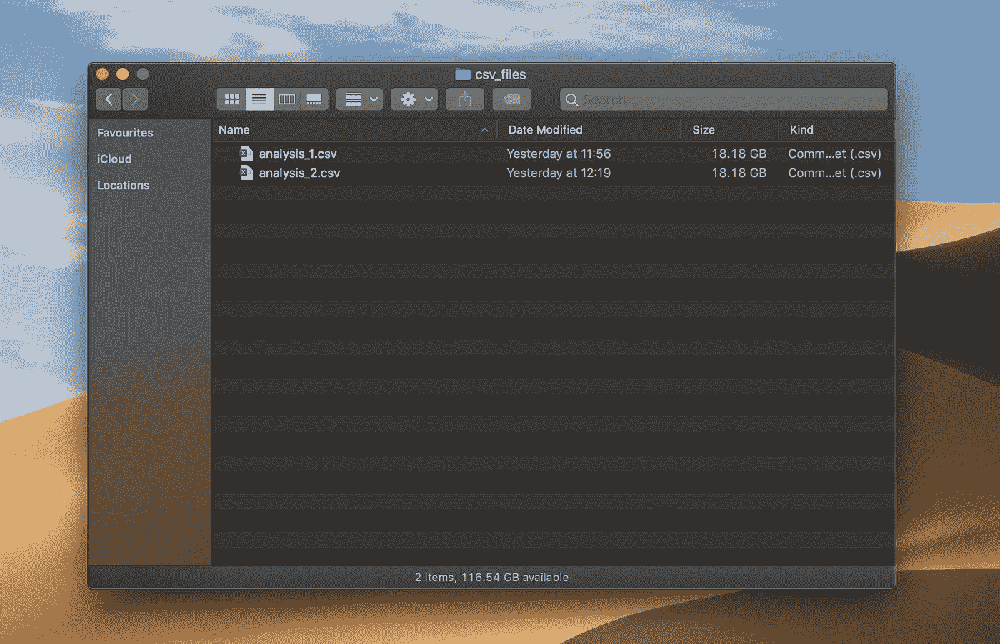
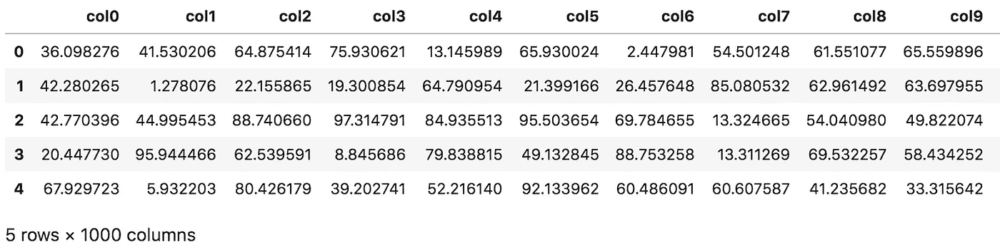
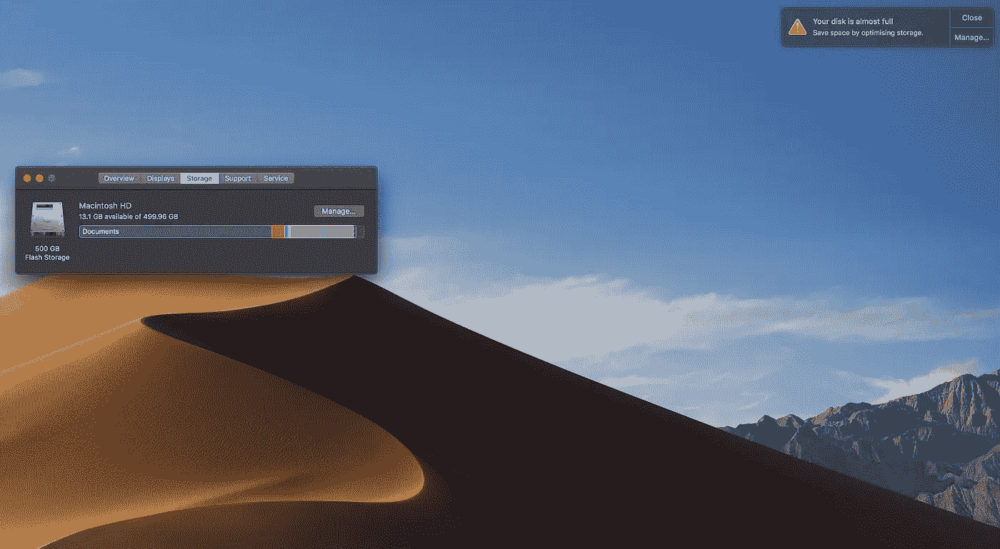
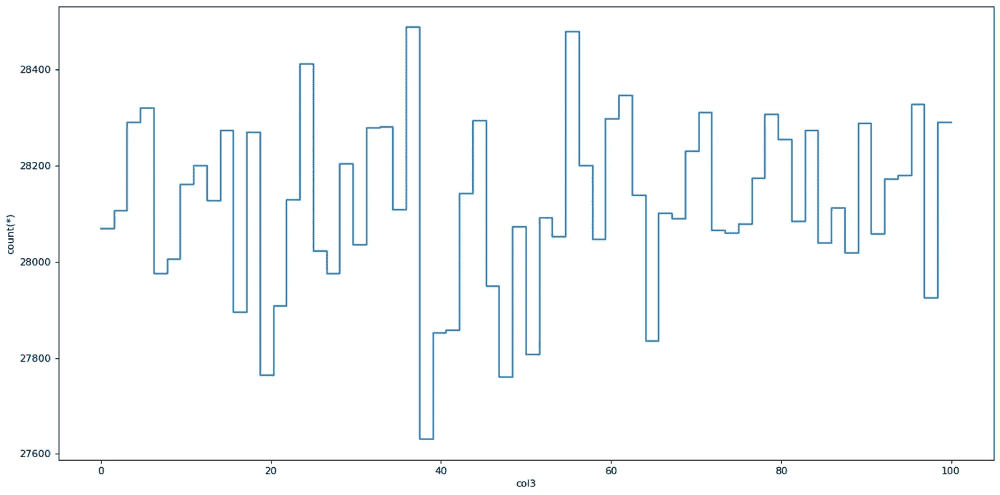
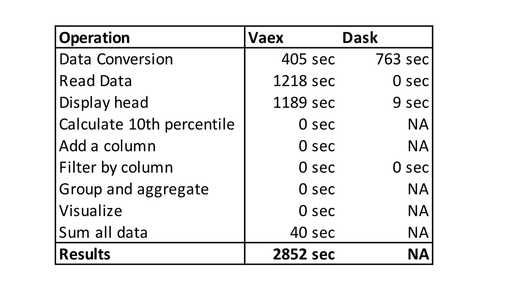

# 2021 年你还在用熊猫处理大数据吗？

> 原文：<https://towardsdatascience.com/are-you-still-using-pandas-to-process-big-data-in-2021-850ab26ad919?source=collection_archive---------0----------------------->

## 熊猫处理不好大数据。这两个库有！哪个更好？更快？


美国宇航局在 [Unsplash](https://unsplash.com?utm_source=medium&utm_medium=referral) 拍摄的照片

我最近写了两篇关于用 [Dask](/are-you-still-using-pandas-for-big-data-12788018ba1a) 和 [Vaex](/how-to-process-a-dataframe-with-billions-of-rows-in-seconds-c8212580f447) 处理大数据的介绍性文章——用于处理大于内存数据集的库。在写的时候，一个问题突然出现在我的脑海里:

> ***这些库真的能处理比内存更大的数据集吗，或者这只是一个销售口号？***

这激起了我的兴趣，我用 Dask 和 Vaex 做了一个实际的实验，尝试处理一个大于内存的数据集。数据集太大了，你甚至不能用熊猫打开它。

## **这里有几个你可能会感兴趣的链接:**

```
- [Complete your Python analyses 10x faster with Mito](https://trymito.io/) [Product]- [Free skill tests for Data Scientists & ML Engineers](https://aigents.co/skills) [Test]- [All New Self-Driving Car Engineer Nanodegree](https://imp.i115008.net/c/2402645/1116216/11298)[Course]
```

你想看更多这样的文章吗？如果是这样，你可以点击上面的任何链接来支持我。其中一些是附属链接，但你不需要购买任何东西。

# 我说的大数据是什么意思？


[ev](https://unsplash.com/@ev?utm_source=medium&utm_medium=referral) 在 [Unsplash](https://unsplash.com?utm_source=medium&utm_medium=referral) 上拍摄的照片

大数据是一个定义松散的术语，它的定义和谷歌上的点击量一样多。在本文中，我使用这个术语来描述一个非常大的数据集，以至于我们需要专门的软件来处理它。对于大，我指的是“大于单台机器上的主内存”。

> 来自维基百科的定义:
> 
> 大数据是一个研究如何分析、系统地提取信息或处理数据集的领域，这些数据集太大或太复杂，传统的数据处理应用软件无法处理。

# Dask 和 Vaex 是什么？


照片由[JESHOOTS.COM](https://unsplash.com/@jeshoots?utm_source=medium&utm_medium=referral)在 [Unsplash](https://unsplash.com?utm_source=medium&utm_medium=referral) 上拍摄

**Dask** 为分析提供先进的并行处理能力，为您喜爱的工具提供规模化性能。这包括 numpy，熊猫和 sklearn。它是开源的，可以免费获得。它使用现有的 Python APIs 和数据结构，使得在 Dask 支持的等价物之间切换变得容易。

**Vaex** 是一个高性能的 Python 库，用于懒惰的核外数据帧(类似于 Pandas)，以可视化和探索大的表格数据集。它每秒可以计算超过 10 亿行的基本统计数据。它支持多种可视化，允许对大数据进行交互式探索。

Dask 和 Vaex 数据帧与 Pandas 数据帧不完全兼容，但这两种工具都支持一些最常见的“数据争论”操作。Dask 更侧重于扩展代码以计算集群，而 Vaex 则更容易在单台机器上处理大型数据集。

如果你错过了我关于 Dask 和 Vaex 的文章:

[](/are-you-still-using-pandas-for-big-data-12788018ba1a) [## 你还在用熊猫做大数据吗？

### Pandas 不支持多重处理，处理大数据集时速度很慢。有一个更好的工具可以把那些…

towardsdatascience.com](/are-you-still-using-pandas-for-big-data-12788018ba1a) 

# 实验


照片由[路易斯·里德](https://unsplash.com/@_louisreed?utm_source=medium&utm_medium=referral)在 [Unsplash](https://unsplash.com?utm_source=medium&utm_medium=referral) 上拍摄

我已经生成了两个具有一百万行和一千列的 CSV 文件。文件的大小为 18.18 GB，总共 36.36 GB。文件具有 0 到 100 之间均匀分布的随机数。



两个包含随机数据的 CSV 文件。作者拍摄的照片

```
import pandas as pd
import numpy as npfrom os import pathn_rows = 1_000_000
n_cols = 1000for i in range(1, 3):
    filename = 'analysis_%d.csv' % i
    file_path = path.join('csv_files', filename)
    df = pd.DataFrame(np.random.uniform(0, 100, size=(n_rows, n_cols)), columns=['col%d' % i for i in range(n_cols)])
    print('Saving', file_path)
    df.to_csv(file_path, index=False)df.head()
```



文件的头。作者拍摄的照片

这个实验是在一台拥有 32 GB 主内存的 MacBook Pro 上进行的——相当大的一台机器。当测试熊猫数据帧的极限时，我惊奇地发现在这样的机器上达到内存错误是一个相当大的挑战！

当内存接近其容量时，macOS 开始将数据从主内存转储到 SSD。pandas 数据帧的上限是机器上 100 GB 的空闲磁盘空间。

> W 当你的 Mac 需要内存时，它会将当前未使用的内容推入一个交换文件进行临时存储。当它需要再次访问时，它将从交换文件中读取数据并返回到内存中。

我花了一些时间思考我应该如何解决这个问题，这样实验才会公平。我想到的第一个想法是禁用交换，这样每个库只有主内存可用——祝你在 macOS 上好运。花了几个小时后，我无法禁用交换。

第二个想法是使用暴力方法。我已经将 SSD 填满了它的全部容量，这样操作系统就不能使用 swap，因为设备上没有剩余的可用空间。



你的磁盘在实验期间几乎满了。作者拍摄的照片

这成功了！熊猫无法读取两个 18 GB 文件，Jupyter 内核崩溃。

如果我再做一次这个实验，我会创建一个内存更少的虚拟机。这样就更容易展示这些工具的局限性。

Dask 或者 Vaex 能帮我们处理这些大文件吗？哪个更快？让我们找出答案。

# Vaex vs Dask


弗里达·布莱德森在 [Unsplash](https://unsplash.com?utm_source=medium&utm_medium=referral) 上拍摄的照片

在设计实验时，我考虑了进行数据分析时的基本操作，如分组、过滤和可视化数据。我想出了以下操作:

*   计算列的第 10 个分位数，
*   添加新列，
*   按列过滤，
*   按列分组并聚合，
*   可视化列。

上述所有操作都使用单个列来执行计算，例如:

```
# filtering with a single column
df[df.col2 > 10]
```

因此，我很想尝试一种需要处理所有数据的操作:

*   计算所有列的总和。

这可以通过将计算分解成更小的块来实现。分别读取每一列并计算总和，最后一步计算总和。这些类型的计算问题被称为[令人尴尬的并行](https://en.wikipedia.org/wiki/Embarrassingly_parallel)——不需要努力将问题分成单独的任务。

# Vaex


照片由[拍摄，照片由](https://unsplash.com/@photos_by_lanty?utm_source=medium&utm_medium=referral) [Unsplash](https://unsplash.com?utm_source=medium&utm_medium=referral) 上的 Lanty 拍摄

先说 Vaex。该实验的设计遵循了每种工具的最佳实践，即对 Vaex 使用二进制格式 HDF5。所以我们需要将 CSV 文件转换为 HDF5 格式(层次数据格式版本 5)。

```
import glob
import vaexcsv_files = glob.glob('csv_files/*.csv')for i, csv_file in enumerate(csv_files, 1):
    for j, dv in enumerate(vaex.from_csv(csv_file, chunk_size=5_000_000), 1):
        print('Exporting %d %s to hdf5 part %d' % (i, csv_file, j))
        dv.export_hdf5(f'hdf5_files/analysis_{i:02}_{j:02}.hdf5')
```

Vaex 需要 405 秒将两个 CSV 文件(36.36 GB)转换为两个 HDF5 文件，这两个文件总共有 16 GB。从文本到二进制格式的转换减小了文件大小。

**使用 Vaex 打开 HDF5 数据集:**

```
dv = vaex.open('hdf5_files/*.hdf5')
```

Vaex 读取 HDF5 文件需要 1218 秒。我预计它会更快，因为 Vaex 声称可以近乎即时地打开二进制格式的文件。

> [来自 Vaex 文件](https://vaex.readthedocs.io/en/latest/example_io.html#Binary-file-formats):
> 
> 不管磁盘上的文件大小如何，打开这样的数据都是即时的:Vaex 将只是对数据进行内存映射，而不是在内存中读取它。这是处理大于可用 RAM 的大型数据集的最佳方式。

**带 Vaex 的显示头:**

```
dv.head()
```

Vaex 显示头部需要 1189 秒。我不知道为什么显示每列的前 5 行要花这么长时间。

**用 Vaex 计算第 10 个分位数:**

请注意，Vaex 具有 percentile_approx 函数，用于计算分位数的近似值。

```
quantile = dv.percentile_approx('col1', 10)
```

Vaex 需要 0 秒来计算 col1 列的第 10 个分位数的近似值。

**用 Vaex 添加新列:**

```
dv[‘col1_binary’] = dv.col1 > dv.percentile_approx(‘col1’, 10)
```

Vaex 有一个虚拟列的概念，它将一个表达式存储为一个列。它不占用任何内存，并在需要时动态计算。虚拟列被视为普通列。正如预期的那样，Vaex 需要 0 秒来执行上面的命令。

**用 Vaex 过滤数据:**

Vaex 有一个[选择](https://vaex.readthedocs.io/en/latest/tutorial.html#Selections-and-filtering)的概念，我没有使用，因为 Dask 不支持选择，这会使实验不公平。下面的过滤器类似于 pandas 的过滤器，只是 Vaex 不复制数据。

```
dv = dv[dv.col2 > 10]
```

Vaex 需要 0 秒来执行上面的过滤器。

**使用 Vaex 对数据进行分组和聚合:**

下面的命令与 pandas 略有不同，因为它结合了分组和聚合。该命令按 col1_binary 对数据进行分组，并计算 col3 的平均值:

```
group_res = dv.groupby(by=dv.col1_binary, agg={'col3_mean': vaex.agg.mean('col3')})
```


用 Vaex 计算平均值。作者拍摄的照片

Vaex 需要 0 秒来执行上面的命令。

**可视化直方图:**

更大数据集的可视化是有问题的，因为用于数据分析的传统工具没有被优化来处理它们。我们试试看能不能用 Vaex 做一个 col3 的直方图。

```
plot = dv.plot1d(dv.col3, what='count(*)', limits=[0, 100])
```



用 Vaex 可视化数据。作者拍摄的照片

Vaex 显示剧情需要 0 秒，速度快得惊人。

**计算所有列的总和**

一次处理一列时，内存不是问题。让我们尝试用 Vaex 计算数据集中所有数字的和。

```
suma = np.sum(dv.sum(dv.column_names))
```

Vaex 需要 40 秒来计算所有列的总和。

## 达斯克


由 [Kelly Sikkema](https://unsplash.com/@kellysikkema?utm_source=medium&utm_medium=referral) 在 [Unsplash](https://unsplash.com?utm_source=medium&utm_medium=referral) 上拍摄的照片

现在，让我们用 Dask 重复上面的操作。Jupyter 内核在运行 Dask 命令之前被重新启动。

我们没有用 Dask 的 read_csv 函数直接读取 csv 文件，而是将 CSV 文件转换为 HDF5，以使实验公平。

```
import dask.dataframe as ddds = dd.read_csv('csv_files/*.csv')
ds.to_hdf('hdf5_files_dask/analysis_01_01.hdf5', key='table')
```

Dask 转换需要 763 秒。如果有更快的方法用 Dask 转换数据，请在评论中告诉我。我试图读取用 Vaex 转换的 HDF5 文件，但没有成功。

> Dask 的最佳实践:
> 
> HDF5 是具有高性能需求的 Pandas 用户的热门选择。我们鼓励 Dask DataFrame 用户使用 Parquet 来存储和加载数据。

**用 Dask 打开 HDF5 数据集:**

```
import dask.dataframe as ddds = dd.read_csv('csv_files/*.csv')
```

Dask 需要 0 秒来打开 HDF5 文件。这是因为我没有显式运行 compute 命令，该命令实际上会读取文件。

**带 Dask 的显示头:**

```
ds.head()
```

Dask 需要 9 秒钟来输出文件的前 5 行。

**用 Dask 计算第 10 个分位数:**

Dask 有一个分位数函数，它计算实际分位数，而不是近似值。

```
quantile = ds.col1.quantile(0.1).compute()
```

由于 Juptyter 内核崩溃，Dask 无法计算分位数。

**用 Dask:** 定义一个新列

下面的函数使用 quantile 函数来定义一个新的二进制列。Dask 无法计算它，因为它使用分位数。

```
ds['col1_binary'] = ds.col1 > ds.col1.quantile(0.1)
```

**用 Dask 过滤数据:**

```
ds = ds[(ds.col2 > 10)]
```

上面的命令需要 0 秒来执行，因为 Dask 使用延迟执行范例。

**使用 Dask 对数据进行分组和聚合:**

```
group_res = ds.groupby('col1_binary').col3.mean().compute()
```

Dask 无法对数据进行分组和汇总。

**可视化第 3 列的直方图:**

```
plot = ds.col3.compute().plot.hist(bins=64, ylim=(13900, 14400))
```

达斯克无法将数据可视化。

**计算所有列的总和:**

```
suma = ds.sum().sum().compute()
```

Dask 无法将所有数据相加。

# 结果

下表显示了 Vaex 与 Dask 实验的执行时间。NA 表示工具无法处理数据，Jupyter 内核崩溃。



实验中执行时间的摘要。作者拍摄的照片

# 结论


Joshua Golde 在 [Unsplash](https://unsplash.com?utm_source=medium&utm_medium=referral) 拍摄的照片

Vaex 需要将 CSV 转换为 HDF5 格式，这并不影响我，因为你可以去吃午饭，回来后数据就会被转换。我也明白，在恶劣的条件下(像在实验中)，用很少或没有主内存读取数据将需要更长的时间。

我不明白的是 Vaex 显示文件头需要的时间(前 5 行 1189 秒！).Vaex 中的其他操作经过了大量优化，这使我们能够对比主存数据集更大的数据集进行交互式数据分析。

我有点预料到 Dask 的问题，因为它更适合计算集群，而不是单台机器。Dask 是建立在熊猫的基础上的，这意味着熊猫慢的操作在 Dask 也会慢。

实验的赢家很明显。Vaex 能够处理大于笔记本电脑主内存的文件，而 Dask 却不能。这个实验很特别，因为我是在单台机器上测试性能，而不是在计算集群上。

# 在你走之前

在 [Twitter](https://twitter.com/romanorac) 上关注我，在那里我定期[发布关于数据科学和机器学习的](https://twitter.com/romanorac/status/1328952374447267843)。


由[考特尼·海杰](https://unsplash.com/@cmhedger?utm_source=medium&utm_medium=referral)在 [Unsplash](https://unsplash.com/?utm_source=medium&utm_medium=referral) 拍摄的照片