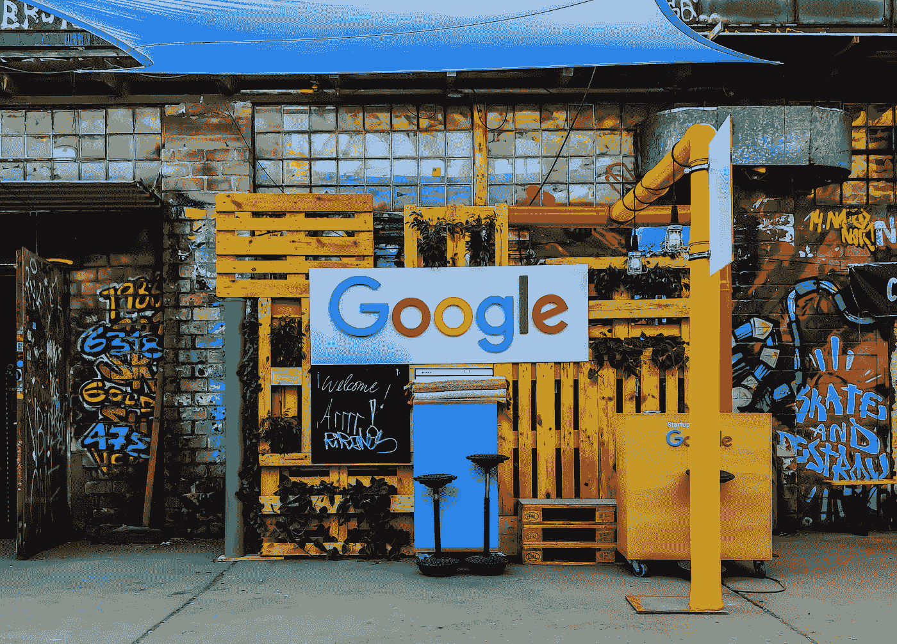

# 你是在不知不觉中帮助训练谷歌的人工智能模型吗？

> 原文：<https://towardsdatascience.com/are-you-unwittingly-helping-to-train-googles-ai-models-f318dea53aee?source=collection_archive---------13----------------------->

## 谷歌如何使用你的 reCAPTCHA 条目来训练机器学习模型

拉杰什瓦尔·巴楚在 [Unsplash](https://unsplash.com?utm_source=medium&utm_medium=referral) 上的照片

谷歌的 reCAPTCHA 服务被宣传为一种保护网站免受机器人攻击的手段。如果系统怀疑一个机器人试图访问一个网站，它会进行一些测试，只有人类*才能通过。如果你花足够的时间在互联网上，你会看到这种服务的版本。一个图像面板出现了，你必须选择所有包含消防栓、汽车或桥梁的图像。我们以前都遇到过这个系统。如果你以前在试图访问你最喜欢的网站时与这个系统进行过交互，那么恭喜你，你通过为一些谷歌机器学习模型标记一些数据，为它们做出了贡献。在谷歌的 reCAPTCHA 网页的内部，这是该公司关于从该系统捕获的数据的使用的说法:*

> reCAPTCHA 还通过使用解决方案来数字化文本、注释图像和建立机器学习数据集，积极利用人类在解决验证码方面的努力。这反过来有助于保存书籍，改进地图，解决人工智能的难题。

让我们看看谷歌是如何做到这一点的，推测我们正在帮助改进的模型，以及我对这个系统的看法，在这个系统中，人们不知不觉地训练了一些 Alphabet Inc 人工智能模型。

## 监督机器学习的快速概述

安迪·凯利在 [Unsplash](https://unsplash.com?utm_source=medium&utm_medium=referral) 上拍摄的照片

简而言之，受监督的机器学习模型试图根据模式学习或表征不同类别的*特征*对数据进行分类。为了做到这一点，一个受监督的机器学习模型被提供了大量带标签的数据，称为训练数据。带标签的数据是带有标识类的标签的数据。受监督的 ML 算法将学习与类相关联的特征，因此它可以对新数据进行分类。

因此，为了训练 ML 模型来对例如火车、飞机或船只的图像进行分类，成千上万的物品的标记图像被输入到算法中，在算法中，像尺寸、颜色、形状等特征被用来区分类别。训练后，人们可以传入船只、火车和飞机的新的、未标记的图像，ML 模型将基于来自训练数据集的学习对它们进行分类。

## 谷歌是如何从 reCAPTCHA 收集数据的？

如前所述，如果 reCAPTCHA 服务怀疑一个机器人试图与一个网站进行交互，它将进行测试以确认你是人类。有时它是一个简单的复选框。其他时候，更有趣的挑战是从一组图像中选择符合特定描述的图像。一旦您正确识别出符合描述的图片，您就可以访问您想要访问的页面。因此，你在这些挑战中所做的是提供一些带标签的数据，这些数据将用于 Alphabet Inc 旗下一些人工智能的训练数据集。

显而易见的问题是，谷歌如何知道一个网络用户何时选择了所有符合描述的图片？如果谷歌的好处是美国用户为人工智能模型标记一些数据，那么毫无疑问，他们事先并不知道这些图像包含什么。答案是，当谷歌向你展示一组图片时，比如说，六张图片，其中五张已经被标注了。网络用户被要求正确识别五张图片，*包括*，也就是谷歌想要标注的那张。你只需要正确识别谷歌已经标记的四张图片，你对第五张未知图片的答案就会进入人工智能训练数据集。

## 这些数据的用途是什么？

在 [Unsplash](https://unsplash.com?utm_source=medium&utm_medium=referral) 上[海拉戈斯蒂奇](https://unsplash.com/@heylagostechie?utm_source=medium&utm_medium=referral)的照片

至于这些数据被用来训练什么人工智能，这基本上是不可知的，除非你在公司内部。但是我们可以根据我们被要求识别的图像类型做出一些有根据的猜测。reCAPTCHA 挑战似乎与道路、交通信号或汽车有关。这可能是一个线索，这些数据将用于训练 Alphabet Inc .的自动驾驶汽车公司 [Waymo 使用的某种模型。谷歌在他们的网页上提到，这些数据可以用来帮助改进地图，根据我们看到的图像，这也是有道理的。再说一次，如果不在 Alphabet Inc .内部，很难知道所有数据最终去了哪里。](https://waymo.com/open/data/)

## 最后的想法

我认为大多数人会觉得谷歌使用我们提供的数据的方式有一种欺骗或不诚实的感觉，这是一种商业行为，没有适当地通知用户正在发生什么。事情是这样的，如果谷歌明确表示 reCAPTCHA 的一些答案将在未来用于训练谷歌模型，我不相信大多数人会感到不安。我确实认为让人们了解正在发生的事情并给出选择退出的选项是很重要的。

还值得注意的是，这一系统只存在于 V2 的 reCAPTCHA。谷歌现在有一个 reCAPTCHA V3，它完全不会打断用户来检测机器人。相反，reCAPTCHA V3 根据一系列指标对网站的所有访问者进行评分，分数越低，你越有可能是一个机器人。然而，reCAPTCHA V2 仍然活跃在一些网站上。最后，我要说，应该鼓励科技公司提高透明度。我只能假设缺乏透明度的原因是因为担心用户会选择不遵守，但这应该是我们用户做出的决定。