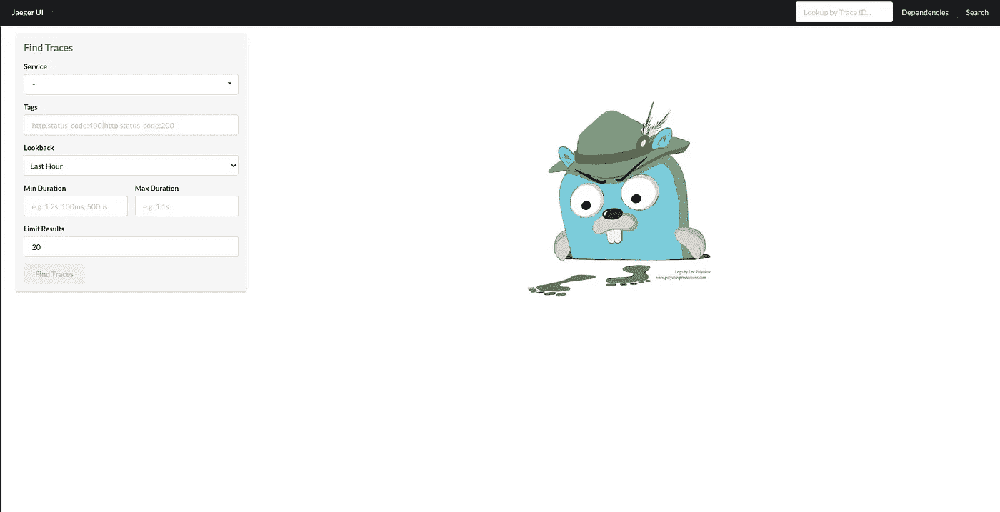

# 您的微服务是否以应有的方式运行？耶格可以帮忙！

> 原文：<https://towardsdatascience.com/are-your-microservices-performing-the-way-they-should-jaeger-can-help-6e428f017cc?source=collection_archive---------24----------------------->

## 对复杂分布式系统中的服务进行监控和故障排除，比如 Kubernetes。


阿巴斯·特拉尼在 [Unsplash](https://unsplash.com/s/photos/trace?utm_source=unsplash&utm_medium=referral&utm_content=creditCopyText) 上拍摄的照片

假设您部署了一个应用程序，报告以美元为单位的加密货币的当前价格。如果你想形象化它，想想类似于[的东西。](https://coinmarketcap.com/)

现在，让我们假设 CoinMarketCap 在 3 秒内做出响应。这意味着，如果用户导航到他们的页面，他们可以很快获得他们感兴趣的硬币的价格。另一方面，您的应用程序至少需要 8 秒钟来提供答案。我敢打赌，一两周之后你就不会有很多用户了！

你需要迅速找出问题所在。怎么花了这么长时间？哪项服务表现不佳？您知道您必须对代码进行一些更改，但是您如何知道从哪里开始呢？在云原生世界中，像获取比特币的美元价格这样简单的事情可能涉及许多微服务。

这个故事介绍了 Jaeger ，这是一个开源的端到端分布式跟踪工具，可以让您观察应用程序内部的情况。

> [学习率](https://www.dimpo.me/newsletter?utm_source=medium&utm_medium=article&utm_campaign=jaeger)是为那些对 AI 和 MLOps 的世界感到好奇的人准备的时事通讯。你会在每周五收到我关于最新人工智能新闻和文章的更新和想法。在这里订阅！

# 监控与可观察性

当错误发生时，开发人员需要正确的反馈，这样他们就知道该修复什么。我们有“日志记录”,但是日志记录告诉你发生了什么，但是如果你的代码运行到完成，它不能告诉你为什么它表现不好。

同样，监控不会告诉我们应用程序内部发生了什么。它会给出诸如内存可用性低之类的指标，但它不会帮助我们查明问题的原因。

然后，我们有可观测性。在可观察性中，我们可以直接进入我们的应用程序，观察它的各种过程和功能。我们可以看到服务如何执行以及它们如何交互。然后，我们可以揭示几个问题或发现优化，使我们的应用程序性能更好。

根据经验，请记住:**我们监控系统并观察应用程序**。你还会听到人们使用术语*可观察性*来对这两个概念进行分组(即监控*和*可观察性)。如果您想了解更多关于监控和可观察性的信息，请查看以下内容:

[](/monitoring-and-observability-in-cloud-native-architectures-54e68e52b103) [## 云本地架构中的监控和可观察性

### 为什么监控对于云原生应用程序至关重要？有哪些工具可以完成这项工作？

towardsdatascience.com](/monitoring-and-observability-in-cloud-native-architectures-54e68e52b103) 

# 贼鸥

Jaeger 是领先的开源端到端分布式追踪工具。什么是分布式跟踪？简而言之，就是在微服务的世界里寻迹。它允许您在被监控的应用程序中跟踪请求或事务的过程。

优步在 2015 年创建了 jaeger，并将其捐赠给了云原生计算基金会(CNCF)。Jaeger 收集应用程序信息，而领先的监控工具 Prometheus 收集系统信息。

此外，与“日志记录”相反，Jaeger 告诉你一个函数是如何执行的，而不是它是如何失败的。它通过各种服务跟踪请求，这使得它非常适合测量延迟问题。

耶格使用轨迹和跨度来实现这一切。所以，一些术语:

*   一个**轨迹**是一个通过系统的数据/执行路径，可以被认为是一个有向无环的跨度图。
*   一个**跨度**表示 Jaeger 中的一个逻辑工作单元，它有一个操作名、操作的开始时间和持续时间。跨度可以被嵌套和排序以模拟因果关系。


走线与跨度

## 装置

为了安装 Jaeger 服务器，我们依赖 Docker 提供的便利。因此，我们可以只运行以下命令:

```
docker run -d -p5775:5775/udp -p6831:6831/udp -p6832:6832/udp -p5778:5778 -p16686:16686 -p14268:14268 -p9411:9411 jaegertracing/all-in-one:0.8.0
```

现在您可以启动您最喜欢的浏览器，Jaeger UI 将在`[localhost:16686](http://localhost:16686)`等待您:



Jaeger UI——作者图片

这是我们将发送跟踪的服务器。接下来，我们需要安装必要的 Python 包，以便能够发送这些跟踪:

```
pip install jaeger-client
```

## 简单的例子

正如我们所说，我们希望构建一个应用程序，返回前 100 种加密货币的价格。因此，首先，我们需要安装 Python `requests`库，这样我们就可以发出 HTTP 请求:

```
pip install requests
```

下一步是初始化一个`tracer`对象:

我们可以使用这个 tracer 对象来生成我们的跨度。我们需要两个跨度:

1.  第一个将是父跨度。它将跟踪整个过程需要多长时间才能完成。
2.  第二个是跟踪检索每种加密货币的信息所需的时间。

上面的代码首先获取父 span 中所有可用的 crypto，然后为每个 crypto 发出一个新的请求来获取它的信息并打印它的价格。当然，我们可以在没有第二个请求的情况下这样做，因为我们在第一个调用中获得了我们需要的所有信息，但这是一个用于演示目的的示例。

如果我们现在导航到 Jaeger UI，刷新页面，从`Service`菜单中选择`crypto-service`并按下`Find Traces`按钮，我们将得到这个视图:


耶格痕迹——作者图片

通过深入研究它收集的 101 个跨度(1 个父节点和 100 个顶级加密节点)，我们可以看到每个请求的响应时间:


耶格潜伏——作者图片

现在，我们又多了一条关于我们需要做得更好的线索！

# 结论

这个故事介绍了 Jaeger，领先的开源端到端分布式追踪工具。

使用 Jaeger，我们可以直接进入我们的应用程序，观察它的各种过程和功能。我们可以看到服务如何执行以及它们如何交互。然后，我们可以揭示几个问题或发现优化，使我们的应用程序性能更好。

在后面的文章中，我们将看到如何用 Grafana 构建仪表板，向用户公开这些信息，并集成来自 Prometheus 的监控信息。

# 关于作者

我的名字是[迪米特里斯·波罗普洛斯](https://www.dimpo.me/?utm_source=medium&utm_medium=article&utm_campaign=jaeger)，我是一名为[阿里克托](https://www.arrikto.com/)工作的机器学习工程师。我曾为欧洲委员会、欧盟统计局、国际货币基金组织、欧洲央行、经合组织和宜家等主要客户设计和实施过人工智能和软件解决方案。

如果你有兴趣阅读更多关于机器学习、深度学习、数据科学和数据操作的帖子，请关注我的 [Medium](https://towardsdatascience.com/medium.com/@dpoulopoulos/follow) 、 [LinkedIn](https://www.linkedin.com/in/dpoulopoulos/) 或 Twitter 上的 [@james2pl](https://twitter.com/james2pl) 。

所表达的观点仅代表我个人，并不代表我的雇主的观点或意见。