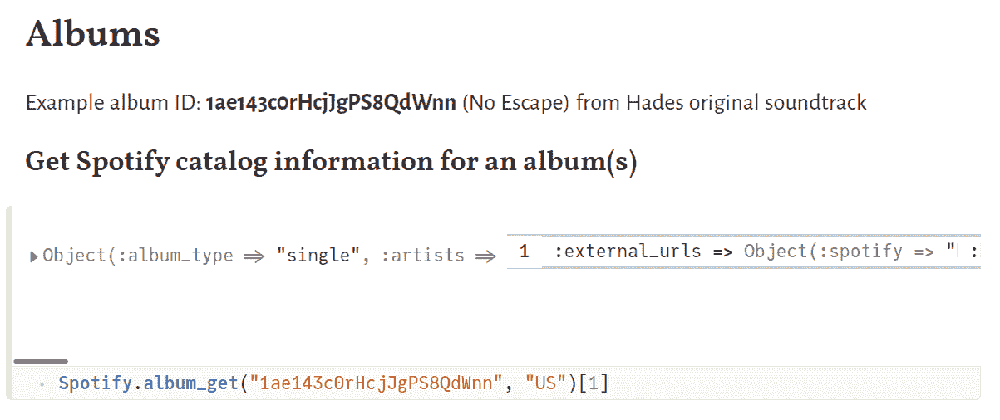
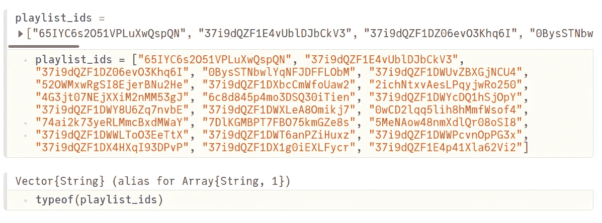
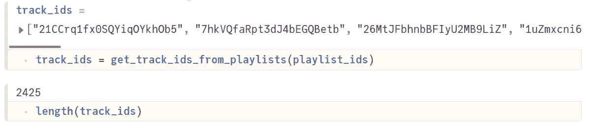
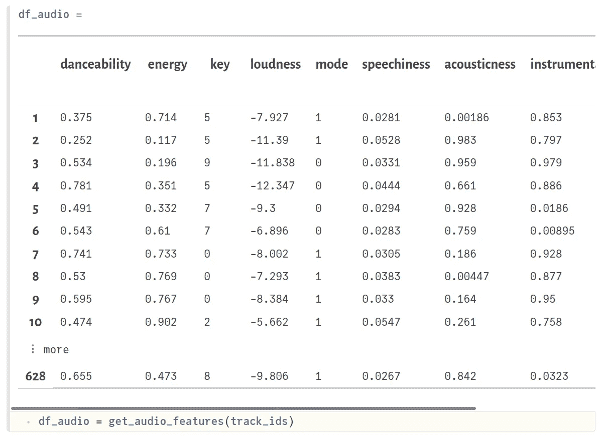
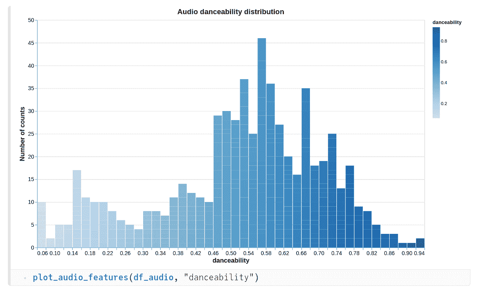
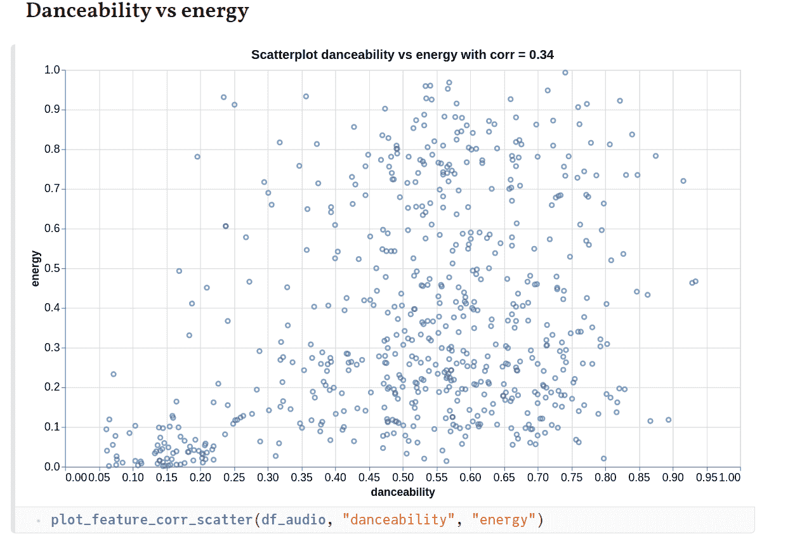
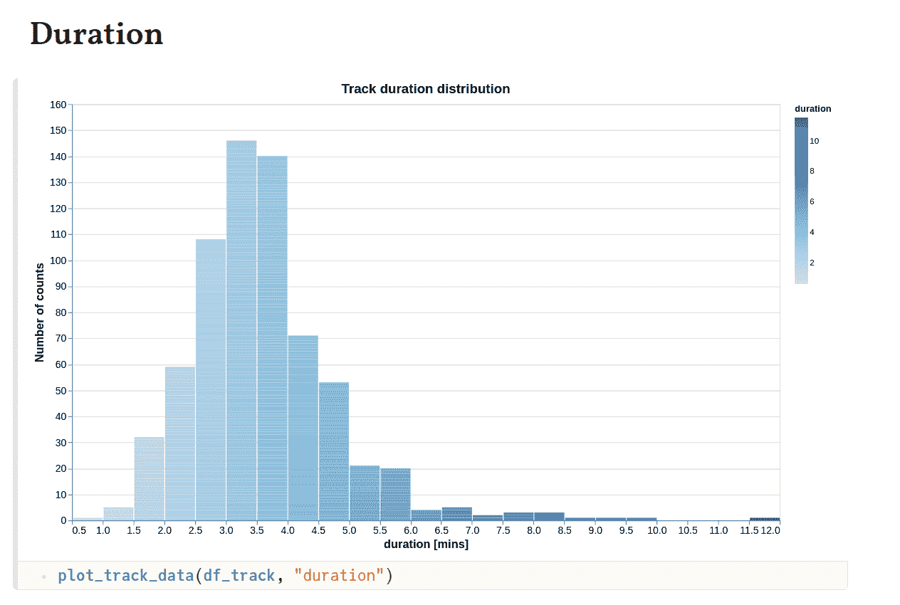
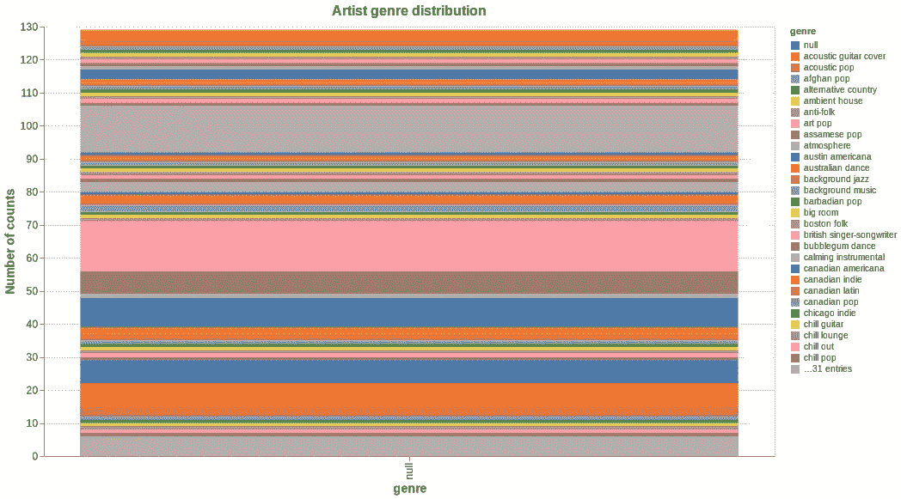
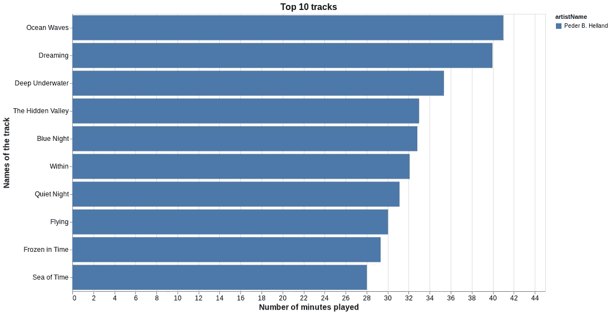

# 你的播放列表够酷吗？

> 原文：<https://towardsdatascience.com/are-your-playlists-groovy-enough-7809faaf9c33?source=collection_archive---------36----------------------->

## 让我们和朱莉娅一起使用 Spotify 的公共 API 来找出答案


由 [Unsplash](https://unsplash.com?utm_source=medium&utm_medium=referral) 上的 [Blaz Photo](https://unsplash.com/@blazphoto?utm_source=medium&utm_medium=referral) 拍摄

最近，我看到一些优秀的文章，作者利用 Spotify 的 API 来分析他们的音乐数据。这让我非常好奇，我决定尝试使用 Julia 做类似的事情。谢天谢地，API 的包装器已经在 **Spotify.jl** 中实现了，但是这个包还没有注册。这当然不是问题，我们总是可以直接从它的 [GitHub](https://github.com/kwehmeyer/Spotify.jl) 库安装它。

在本文中，我将演示如何使用 Pluto 笔记本检索和可视化您的音乐数据。关于如何为你的系统设置 Pluto 的说明可以在我之前的[文章](/analyze-your-health-and-fitness-data-using-julia-d6f4c3842b17)中找到。设置完成后，打开一个新的笔记本或直接使用[中的现有笔记本。](https://github.com/vnegi10/Spotify_data_analysis)可以使用提供的**实例化包环境。toml** 文件。这对保持结果的再现性是有用的(但不是必须的)。

```
using Pkg
Pkg.activate(pwd())
Pkg.instantiate
```

要在您的工作环境中导入所有相关的包，请执行以下命令:

```
using Spotify, DataFrames, VegaLite, Setfield, JSON, Statistics, Query
```

# 获取 API 访问的凭据

为了使用 API，您首先需要获得适当的凭证。这可以通过创建一个 Spotify [开发者](https://developer.spotify.com/)账户来实现。打开您的仪表板，通过填写名称和用途来创建应用程序。然后点击“显示客户机密”查看您的密钥。将这些凭证复制到您的**Spotify _ credentials . ini**文件中，该文件将在您首次尝试使用该包时自动创建。凭证仅在 1 小时内有效。因此，一旦过期，您需要通过执行以下命令进行刷新:

```
Spotify.refresh_spotify_credentials()
```

终端输出应显示到期时间，例如:

```
[ Info: Expires at 2021–10–30T19:37:32.556
```

# 测试您的证书

例如，您可以通过获取关于某个相册的信息来测试 API 是否正常工作。所有对象，包括专辑，曲目，艺术家等。拥有唯一的 Spotify ID。我们使用 **album_get** 函数以及相册 ID 和位置(=“US”)参数，如下所示:



获取有关相册的信息

# 请求个人数据

您可以通过以下方式向 Spotify 请求一份您的个人数据:

*   在桌面浏览器上打开 Spotify 进入个人资料→账户
*   从左窗格打开“隐私设置”
*   向下滚动到“下载您的数据”部分，并继续执行步骤 1

一旦您的数据可供下载，您将收到一封电子邮件。对我来说，它看起来有 3 天了。你会收到一个 JSON 文件的集合，我们主要对流数据感兴趣，它显示了我们花了多少时间听不同的曲目。

# 检索我的播放列表的音频功能

我首先想看的是一些我最喜欢的播放列表的音频特性。我从 Spotify 桌面播放器中收集播放列表 ID，方法是打开播放列表并在 URL 的末尾复制 ID(字母数字字符)。我将它们放在一个数组(类型字符串)中，如下所示:



播放列表 id

每个曲目都有音频特性，这意味着我们首先需要从每个播放列表中获取曲目 id。这是通过使用函数 **get_playlist_tracks，**来完成的，其中我们发出一个 HTTP GET 请求来获取这些信息。

这个功能还不是 Spotify.jl 的一部分(很快会做一个 PR)。返回的最大曲目数量为 50 首。你可以想象，在一个给定的播放列表中可以有超过 50 首曲目。因此，我们需要用新的偏移量(返回的第一项的索引，默认为 0)重复调用这个函数。最后，我们删除重复的曲目(相同的曲目可以出现在许多播放列表中)，并返回曲目 id 数组。



曲目 id 列表

接下来，我们要获取每个音轨 ID 的音频特征。我们将使用 Spotify.jl 的**tracks _ get _ audio _ features**功能，并将它们收集在一个数据帧中。关于音频功能的细节可以在[这里](https://developer.spotify.com/documentation/web-api/reference/#/operations/get-audio-features)找到。

得到的数据帧 **df_audio** 应该是这样的:



具有音频特征的数据帧

请注意，我们没有针对所有曲目的功能。要么它们不可用，要么我们可能遇到 API 调用限制。无论如何，我们有足够的数据来做一些很好的可视化。

# 绘制音频特征

我们可以创建一个通用的绘图函数，它将一个列名作为参数，以便从 **df_audio** 创建一个直方图。

现在，让我们来看看我选择的播放列表中曲目的各种音频特征的分布。



各种音频特征的分布

*   第一个图显示了“可跳舞性”的分布。从 Spotify 的[文档](https://developer.spotify.com/documentation/web-api/reference/#/operations/get-audio-features)，

> 可跳舞性描述了基于音乐元素(包括速度、节奏稳定性、节拍强度和整体规律性)的组合，一首曲目适合跳舞的程度。值 0.0 最不适合跳舞，1.0 最适合跳舞。

似乎我的大多数曲目都有很高的可跳性(> 0.5)。

*   第二个图显示了音频“能量”。Spotify 表示…

> 能量是一种从 0.0 到 1.0 的度量，代表强度和活动的感知度量。通常，高能轨道感觉起来很快，很响，很嘈杂。对该属性有贡献的感知特征包括动态范围、感知响度、音色、开始速率和一般熵。

因为我喜欢听大部分由乐器组成的放松播放列表，所以更多的音轨能量值低于 0.5 是有道理的。

*   第三个图显示了音频“语音”。根据文档，

> 语音检测音轨中是否存在语音单词。越是类似语音的录音(例如脱口秀、有声读物、诗歌)，属性值就越接近 1.0。高于 0.66 的值描述可能完全由口语单词组成的轨道。介于 0.33 和 0.66 之间的值描述可能包含音乐和语音的轨道，可以是分段的，也可以是分层的，包括说唱音乐。低于 0.33 的值很可能代表音乐和其他非语音类轨道。

我的大多数曲目都有一个值< 0.2, which is consistent with the fact that I prefer instrumental tracks.

*   Last plot shows the audio “valence”.

> It’s a measure from 0.0 to 1.0 describing the musical positiveness conveyed by a track. Tracks with high valence sound more positive (e.g. happy, cheerful, euphoric), while tracks with low valence sound more negative (e.g. sad, depressed, angry).

Most of my tracks seem to have a valence value less than 0.5\. Does that mean that I am into sad/angry music? I wouldn’t like to think so, many of my relaxing playlists actually help to improve my mood. How does your valence distribution look like? Do let me know in the comments.

# Correlation between different audio features

I thought it would be interesting to also look at how correlated audio features are w.r.t. one another. To help quantify that, we can also compute the [皮尔逊相关系数](https://en.wikipedia.org/wiki/Pearson_correlation_coefficient)，值越接近 1 表示相关性越强。

下面是各种图的样子:



音频特征之间的相关图

可跳舞性显示出与能量的某种相关性，这是可以预料的，因为能量越大的曲目通常也非常适合跳舞。可跳性高的曲目也往往更欢快、更快乐。因此，与化合价的强相关性可以得到解释。类似地，具有更高能量的轨道也可能显示出与更高价态更强的相关性，这就是我们所看到的。

# 跟踪持续时间和受欢迎程度数据

对于每首曲目，我们可以使用 **tracks_get** 函数获得额外的信息，比如流行度和持续时间。

绘制从上述函数返回的数据帧( **df_track** )与前面的例子类似。



根据上面的图表，我认为我喜欢的歌曲的最佳时长是 3-4 分钟左右。关于受欢迎程度的数字(0-100 分，100 分最受欢迎)，似乎许多艺术家都有相当高的受欢迎程度(> 50)。

# 音乐流派

从 **tracks_get** 函数返回的 dict 也包含艺术家的 ID。我们可以收集所有的艺术家 id，然后获取艺术家数据，比如与他们相关的音乐流派。相关代码可以在冥王星笔记本上找到。似乎“阿富汗流行”、“艺术流行”和“氛围”是我一直在听的一些比较常见的流派。



# 绘制个人流数据

我们不应该忘记可以从 Spotify 请求的个人数据(JSON 文件)。档案**<>。json** 可以转换成 DataFrame ( **df_stream** )并排序 w.r.t .分钟播放。

我们现在可以看看前 10 个轨道，它们实际上是 **df_stream** 的前 10 行。



如果能得到顶级艺术家的名单会很有趣。这是一些额外的工作，因为我们现在必须组合来自相同艺术家但不同曲目的流时间。因此，对于每一位艺术家，我们过滤 **df_stream** 并合计相关曲目的总时长。


休伦大人是我最喜欢的歌曲之一，很明显，在过去的 1-2 年里，我经常听他们的歌。普拉蒂克·库哈德是另一颗宝石，当然，A.R .拉赫曼无需介绍。“当地火车”有一些很棒的歌曲，已经成为印度最好的乐队之一。

# 结论

对于 Spotify 用户来说，可以从他们的音乐流媒体数据中学到很多东西。我发现这个 API 有很好的文档记录，非常有用。还有一些其他有趣的端点，但是我将把它们留给另一个讨论。我希望你喜欢阅读这篇文章。感谢您的宝贵时间！完整代码(冥王星笔记本)可在[这里](https://github.com/vnegi10/Spotify_data_analysis)获得。如果你想联系，这是我的 LinkedIn。

# 参考

1.  [https://developer . Spotify . com/documentation/we b-API/quick-start/](https://developer.spotify.com/documentation/web-api/quick-start/)
2.  [https://github.com/kwehmeyer/Spotify.jl](https://github.com/kwehmeyer/Spotify.jl)
3.  [https://towards data science . com/visualizing-Spotify-data-with-python-tableau-687 F2 f 528 cdd](/visualizing-spotify-data-with-python-tableau-687f2f528cdd)