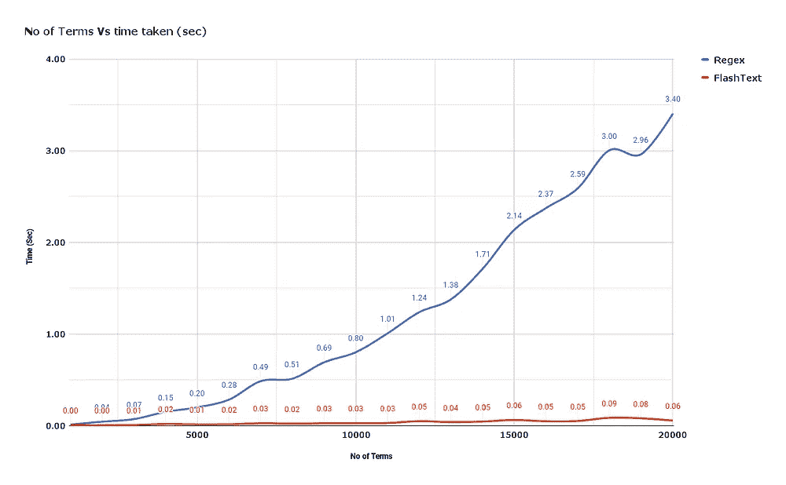
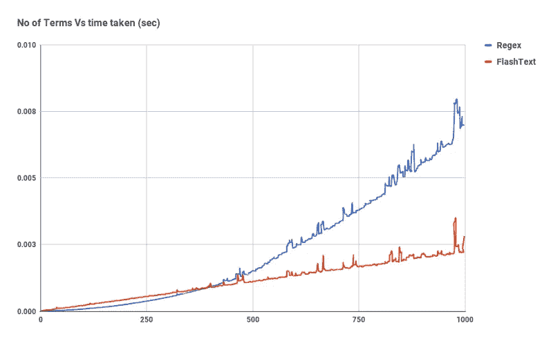

# 你的正则表达式操作需要时间吗？如何让它们更快

> 原文：<https://towardsdatascience.com/are-your-regex-operations-taking-time-how-to-make-it-faster-ae974a5a1874?source=collection_archive---------14----------------------->

## FlashText——NLP 任务正则表达式的更好替代


图片由来自 [Pixabay](https://pixabay.com/?utm_source=link-attribution&amp;utm_medium=referral&amp;utm_campaign=image&amp;utm_content=259375) 的 [Michal Jarmoluk](https://pixabay.com/users/jarmoluk-143740/?utm_source=link-attribution&amp;utm_medium=referral&amp;utm_campaign=image&amp;utm_content=259375) 拍摄

自然语言处理(NLP)是人工智能的一个子领域，涉及计算机和自然人类语言之间的交互。NLP 涉及文本处理、文本分析、将机器学习算法应用于文本和语音等等。

文本处理是 NLP 或基于文本的数据科学项目中的关键元素。正则表达式有多种用途，如特征提取、字符串替换和其他字符串操作。正则表达式也称为 regex，它是许多编程语言和许多 python 库都可以使用的工具。

Regex 基本上是一组字符或模式，用于对给定的字符串进行子串化，可以进一步用于搜索、提取、替换或其他字符串操作。

# FlashText:

**FlashText** 是一个开源的 python 库，可以用来替换或提取文本中的关键词。对于 NLP 项目，无论是否需要进行单词替换和提取，我们都会遇到一些文本处理任务，FlashText 库使开发人员能够有效地执行关键字的提取和替换。

## 安装:

可以使用 PyPl 安装 FlashText 库:

```
**pip install flashtext**
```

## 用法:

FlashText 库的使用是有限的，它被限制在提取关键字，替换关键字，获取关于提取的关键字的额外信息，删除关键字。在下面的示例笔记本中，您可以找到计算和比较 FlashText 和 RE 之间的基准数的代码片段，用于从取自维基百科的文本中提取和替换关键字。

(作者代码)

使用 re 和 FlashText 库对取自机器学习的[维基百科页面的文本文档(约 500 个单词)进行关键词提取和替换。](https://en.wikipedia.org/wiki/Machine_learning)


(图片由作者提供)，RE 和 FlashText 库之间的基准时间约束

您可以观察两个库之间的基准时间数，这是为两个任务执行的:关键字提取和替换。这些任务是针对大约 500 个单词的一小段文本执行的。时间数量的差异非常小，因此性能是不可区分的。

下图表示对具有 10，000 个标记的文本文档进行 1000 个关键词替换操作的次数。可以看出，FlashText 操作比 Regex 快 28 倍。



( [Souce](https://www.freecodecamp.org/news/regex-was-taking-5-days-flashtext-does-it-in-15-minutes-55f04411025f/) )，**左: **replace()** 函数的**时间约束，**右:**search()函数的时间约束，介于 Regex 和 FlashText 之间

# 为什么不是 Regex，为什么是 FlashText？

对于小尺寸文档的正则表达式操作，时间数非常接近，并且两个库的性能没有区别。对于大尺寸文档，FlashText 库的性能明显超过，其中 FlashText 库的 1000 个关键字的替换操作比 Regex 快 28 倍。

> 根据 [FlashText 文档](https://pypi.org/project/flashtext/):
> 
> Regex 基于自定义算法，如[Aho-coraseck 算法](https://en.wikipedia.org/wiki/Aho%E2%80%93Corasick_algorithm)和 [Trie 字典](https://en.wikipedia.org/wiki/TrieDictionary)。FlashText 库可以在一个文档中搜索或替换关键字，并且时间复杂度不依赖于要搜索或替换的术语的数量。FlashText 库被设计为只匹配完整的单词，不像 Regex 那样也匹配子字符串。

```
For a document of size ***N tokens*** and a dictionary of ***M keywords***,
Time Complexity of ***FlashText*** is **O(N)**.
Time Complexity of ***Regex*** is **O(MxN)**.
```

> 因此，FlashText 算法比 Regex 快得多。
> 
> [点击此处](https://arxiv.org/abs/1711.00046)阅读 FlashText 算法的整篇文章。

# 结论:

对于小文档，两个库的性能比较取决于很多因素，比如缓存。FlashText 库在处理具有大量标记的文本文档方面明显优于其他库。FlashText 的时间复杂度为 O(N ),而 Regex 的时间复杂度为 O(M*N ),因此建议对超过 500 个标记的文本文档使用 Regex。

> [点击此处](https://github.com/vi3k6i5/flashtext/)获取 FlashText 的 GitHub 库

# 参考资料:

[1]大规模替换或检索文档中的关键词，(2017 年 11 月 9 日):[https://arxiv.org/abs/1711.00046](https://arxiv.org/abs/1711.00046)

[2] FlashText 文档，(2018 年 2 月 16 日):[https://pypi.org/project/flashtext/](https://pypi.org/project/flashtext/)

> 感谢您的阅读