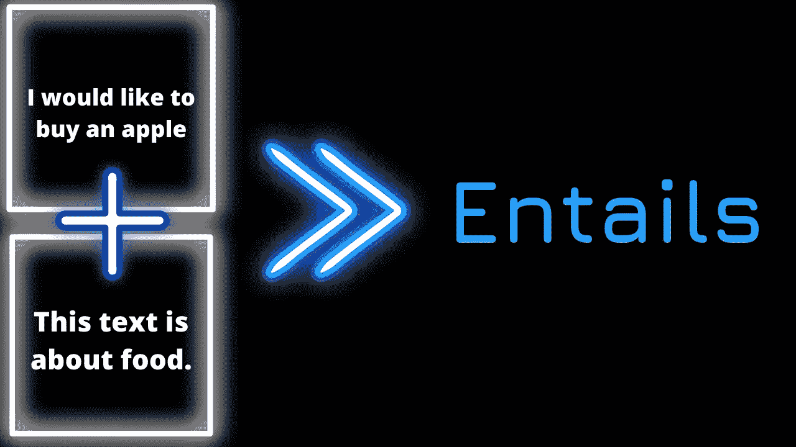
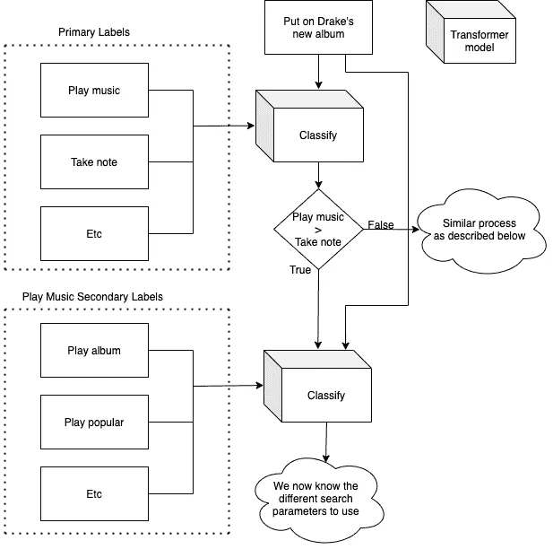

# 零镜头文本分类变压器模型是更好的聊天机器人的关键吗？

> 原文：<https://towardsdatascience.com/are-zero-shot-text-classification-transformer-models-the-key-to-better-chatbots-dd91dac3854a?source=collection_archive---------18----------------------->

## *为您的下一个聊天机器人项目*使用零镜头文本分类转换器模型克服对训练数据的需求


作者图片

对于许多自然语言处理(NLP)项目来说，最麻烦的任务之一是收集和标记训练数据。但是，对于聊天机器人的意图分类，有一个潜在的解决方案，那就是使用零镜头文本分类转换器模型。如果成功，这种方法将降低开发聊天机器人所需的复杂性，同时潜在地提高它们的性能。我鼓励你扩展这些想法，并可能将它们集成到你的聊天机器人系统中。

意图分类是聊天机器人执行的基本任务。意图分类是确定用户希望执行哪个动作的动作。例如，假设你问一个聊天机器人，“请播放 U2 的最新歌曲”，那么机器人必须确定用户希望“播放一首歌曲”。从那里，该模型将典型地使用实体识别来确定播放哪首歌曲。本文提出了一种在没有任何训练数据的情况下利用新技术执行意图分类的可能方法。

# 零镜头文本分类

零镜头文本分类转换器模型于 2019 年在论文“基准零镜头文本分类:数据集、评估和蕴涵方法”[1]中提出。模型的输入被表述为每个标签的蕴涵问题。因此，给定文本“我想买一个苹果”和标签“食物”，前提将是文本，假设将类似于“这篇文本是关于食物的。”然后，模型确定假设是否需要前提。有了这项技术，NLP 实践者可以在单个文本蕴涵数据集上训练他们的模型，然后使用该模型对任意标签执行文本分类。



作者图片

我们将使用在拥抱脸的模型分发网络上下载量第二多的零镜头文本分类[模型](https://huggingface.co/facebook/bart-large-mnli)，它是由脸书·艾创建的。它是在麻省理工学院许可下发布的，这是一个许可许可你可以在这里阅读更多关于[的内容。](https://opensource.org/licenses/MIT)

# 体系结构

本文提出了一个基于树的意图分类系统，该系统利用零镜头文本分类模型。有些意图可能会被归类在一起，因此，我认为最好先确定意图的类别，然后再确定要执行的具体行动。例如，一个类别可以是“播放音乐”，然后该类别的意图可以是“播放艺术家”或“播放专辑”

在不应用零射击模型的情况下，使用类似的基于树的系统可能是遥不可及的，原因有两个。首先，您可能需要一个模型来对类别进行分类，然后为每个类别建立一个模型。所以，如果你在处理一个有很多可能动作的系统，这可能会有很多模型。然后，由于型号和类别数量的增加，需要更多的培训。因此，通过使用这个提出的系统，对于这个整个基于树的分类系统，只需要一个**单一模型**。



作者图片

# 模型创建

目前，拥抱脸的变形金刚库是实现零镜头文本分类变形金刚模型的首选方式。因此，我们可以用下面一行代码从 PyPI 下载这个包。

```
pip install transformers
```

拥抱脸创建了一个名为“管道”的功能，它抽象了使用变压器模型进行推理通常涉及的复杂性。还是导入吧。

```
from transformers import pipeline
```

我们需要向管道类提供我们希望执行的任务和模型名称。然后，它将输出一个我们可以用来开始分类文本的对象。任务 id 为“零镜头分类”，模型名称为“ [facebook/bart-large-mnli](https://huggingface.co/facebook/bart-large-mnli) ”。

```
task = "zero-shot-classification"
model = "facebook/bart-large-mnli" classifier = pipeline(task, model)
```

# 主要意图分类

让我们为模型定义一个任意的标签列表来对文本进行分类。对于这个例子，我将为虚拟电话助理将要执行的常见任务添加标签。

```
primary_labels = ["take note", "play music", "search internet ", "send email", "create reminder"]
```

我们现在可以将文本归入这些标签之一。首先，让我们定义与这些标签之一相关的文本。我们将使用一个属于“播放音乐”类别的例子。

```
input_text = "Put on Drake's new album"
```

为了生成预测，我们可以向我们的分类器提供文本和标签，如下所示。

```
classifier_output = classifier(input_text, primary_labels)
```

我们现在可以打印结果了。

```
print(classifier_output["labels"]) print(classifier_output["scores"])
```

*结果:*

*['播放音乐'，'做笔记'，'创建提醒'，'搜索互联网'，'发送电子邮件'][0.8064008355140686，0.1329479217529297，0.04738568142056465，0.010709572583436966，0.00255559617206454277]*

标签和分数都按最高分排序。因此，在这里我们看到“播放音乐”是最高的结果，得分为 80.64%，这是有道理的。

# 次要意图分类

对于每个主要标签，我们必须创建一个次要标签列表，以进一步细化用户的意图。继续上面的例子，因为主要标签是“播放音乐”,下面是潜在动作的列表。

```
secondary_labels = ["play artist", "play song", "play album", "play popular", "play new", "play old"]
```

如前所述，我们可以使用零镜头文本分类模型来确定预期的动作。我们将向模型提供原始文本和二级标签。

```
secondary_classifier_output = classifier(input_text, secondary_labels) print(secondary_classifier_output["labels"]) print(secondary_classifier_output["scores"])
```

*['播放专辑'，'播放艺人'，'播放新'，'播放流行'，'播放歌曲'，'播放旧']
0.2994290888309479，0.23053139448165894，0.209768395962143，0.136963962316513，0.1226228971113205*

我们走吧！我们只是决定执行哪些操作。我们看到“播放艺术家”、“播放专辑”和“播放新闻”得分都很高。因此，现在我们可以使用实体识别来检测文本中的艺术家，然后查询该艺术家的最新专辑。

# 结论

在这篇文章中，我提出了一种利用零触发文本分类模型来消除意图识别对训练数据的需求的方法。我还讨论了如何使用这种方法来创建一个树状搜索算法，以细化用户希望执行的确切操作。我希望这篇文章能启发你创建更强大的聊天机器人！

如果您成功地为一个项目实施了这一建议方法，请发送电子邮件至 eric@vennify.ca。我很想听听。

# 参考

[1] W. Yin，J. Hay，D. Roth，[基准测试零镜头文本分类:数据集、评估和蕴涵方法](https://arxiv.org/abs/1909.00161) (2019)，EMNLP 2019

[2] A.Williams，N. Nangia，S. Bowman，[通过推理进行句子理解的广泛覆盖挑战语料库](https://aclanthology.org/N18-1101/) (2018)，计算语言学协会

# 资源:

[本教程中使用的代码](https://colab.research.google.com/drive/1nfmdmIaCCkfKLjwGmlxps9gU6Jfxx-Fa?usp=sharing)

# 类似文章

如果你喜欢这篇文章，那么你可能也会喜欢下面这篇文章，它涵盖了我的一个原创研究项目，涉及零镜头文本分类转换器模型。

*题目:如何标注文本分类训练数据—用 AI* *总结:用一个零镜头的文本分类模型来标注训练数据。然后，使用带标签的训练数据来微调更容易在生产中使用的小型监督模型。*

[***条***](/how-to-label-text-classification-training-data-with-ai-11ed11a5e893?sk=2340bbfb3befa376bfa3b83da88f4fa4)

[***视频***](https://youtu.be/2BkMrra3F9s)

*原载于 2021 年 9 月 8 日*[*https://www . vennify . ai*](https://www.vennify.ai/zero-shot-transformer-models-chatbots/)*。*