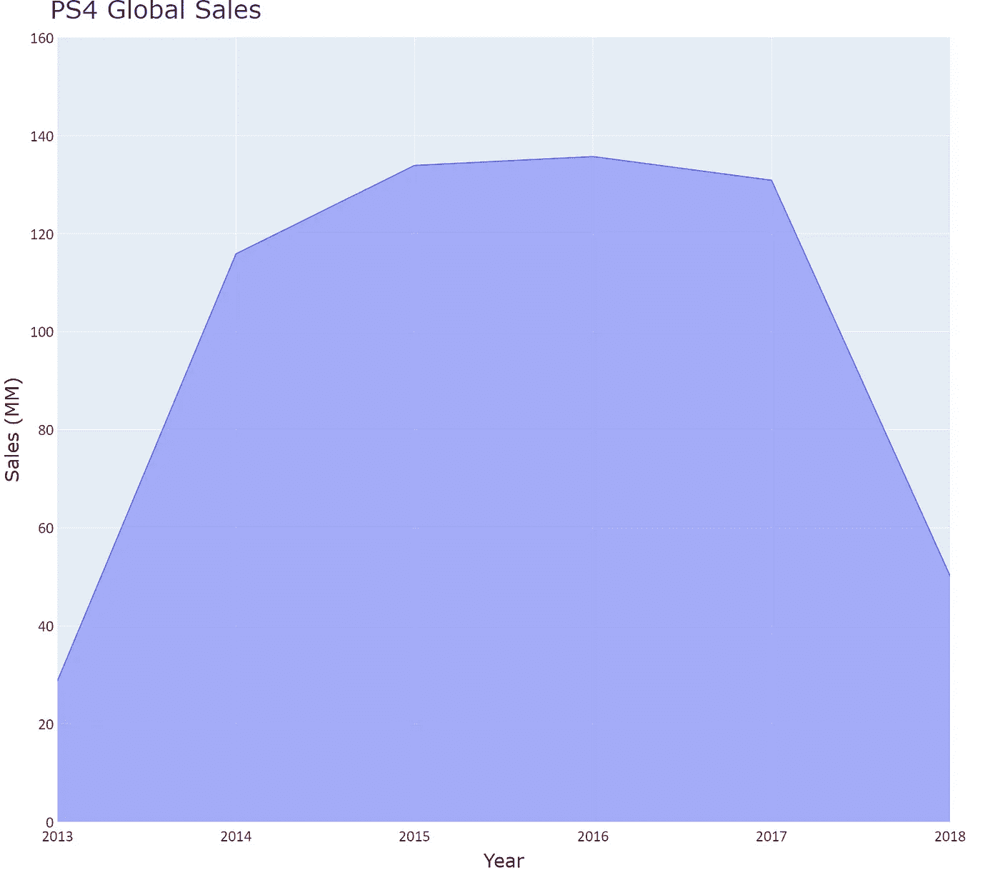

# 带 Plotly Express 的面积图

> 原文：<https://towardsdatascience.com/area-charts-with-plotly-express-510a1f12ac11?source=collection_archive---------29----------------------->

## **痕迹&布局**


图片由来自 Unsplash 的 Pawel Czerwinski 提供

# **Plotly 图形对象**

**面向对象的人物创作界面 Plotly Express** 于 2019 年发布。它是 **Plotly.py** 的高级包装器，包括绘制标准 2D & 3D 图表和 choropleth 地图的函数。与 Plotly 生态系统的其余部分完全兼容，是快速开发探索性图表的优秀工具。

但是如果您想增强您的绘图，您需要导入一组名为 *graph objects* 的类。

```
import plotly.graph_objects as gofig = go.Figure()
```

*plotly.graph_objects* 模块包含 Python 类的层次结构。*图*是初级类。*图*有一个**数据属性**和一个**布局属性**。数据属性有 40 多个对象，每个对象引用一个特定类型的图表( **trace)** 及其相应的参数。布局属性指定图形的整体属性(轴、标题、形状、图例等。).

概念上的想法是使用 *fig.add_trace()* 和 *fig.update_layout()* 来操纵这些属性，以便增强已经构建的图形。

让我们用不同类型的面积图来分析这种方法。

# **面积图**

面积图是折线图的一种形式，横轴和连接数据点的线之间的区域用颜色填充。它们用于**传达总体趋势**，而不关心显示准确的数值。

纵轴代表定量变量，而横轴是时间线或一系列数值区间。数据点由形成折线的线段连接，折线和水平轴之间的区域用颜色或某种类型的阴影填充。

面积图(AC)有四种类型:1)标准 AC；2)堆叠式 AC；3)堆叠交流百分比；4)交迭交流。

1.— **标准面积图**(又名面积图):它们对于显示一个数值变量随时间的演变特别有效。这样做的目的是更加强调整体趋势以及连接数据点的线的波峰和波谷。

2.— **堆积面积图**:就像几个面积图一个叠一个。在这种类型的图表中，有第三个变量，通常是分类变量，以及相应的数据系列。每一个数据序列的表示都从先前数据序列结束的地方开始(**它们不重叠**)。最后一个数字表示所有数据的总和。

3.— **百分比堆积面积图**(也称为 100%堆积面积图):就像前面的图表一样，几个区域堆叠在另一个区域的顶部，并表示第三个分类变量。这是一个**部分到整体的图表**，其中每个区域表示每个部分相对于类别总数的**百分比**。垂直轴的最终高度始终为 100%。这意味着图表顶部有第二条基线，有助于跟踪某些特定趋势。

4.— **重叠区域图**:在这种图形中，区域之间有一些重叠。颜色和透明度必须适当调整，以便可以很容易地看到特定的线条。它们让我们能够很好地比较不同的趋势。

# **带 Plotly Express 的面积图**

我们使用了从 Kaggle [1]下载的数据集。该数据集包含从 VzCharts 收集的与视频游戏销售和游戏评级数据相关的记录。我们特别选择了一个 *csv 文件*，其中有 1031 条关于索尼在 Playstation 4 平台上销售视频游戏的记录。我们想知道 2013 年至 2018 年期间全球不同地区的销售额分布情况。

首先，我们导入 Plotly Express 为 *px，*Pandas 库为 *pd* ，并将我们的 *csv 文件*转换成 dataframe:

```
import pandas as pd
import plotly.express as pxpath  ='your path'
df = pd.read_csv(path + 'PS4_GamesSales2.csv', 
     index_col = False, header = 0, sep = ';', engine='python')
```

下面的屏幕截图显示了数据集的前十条记录:


记住:**真实世界的数据是脏的**。所以我们在使用数据之前做了一些清理。具体来说，我们使用 *dropna* 删除 *Year* 列中具有 *N/A* 值的行，并使用 *drop* 删除 *Global* 列中具有 *0* 值的行。然后，我们根据*年*列将数据分组，并对每个组应用函数 *sum()* 。

```
df.dropna(subset = ['Year'], inplace = True)df.drop(df[df['Global'] == 0.0].index, inplace = True)df_area = df.groupby(['Year']).sum().reset_index()
```

现在我们准备绘制我们的第一张图表。

对于本文的标准面积图，Plotly Express 函数为 *px.area* ，对应的参数为:*data _ frame*；x=表示时间线的*数据帧*中的列的名称；*y =**data _ frame*中的列名，代表计算的统计数据。我们用 *update.layout* 更新了图表:设置标题、字体大小，用*宽度*和*高度*设置图形尺寸。然后我们更新了 x 轴和 y 轴(文本、字体、tickfont)。我们将图表保存为静态的 *png* 文件，最后，我们使用默认模板( *plotly* 、【带 Plotly Express 的直方图、主题&模板】、[https://towards data science . com/Histograms-with-Plotly-Express-e 9e 134 AE 37 ad](/histograms-with-plotly-express-e9e134ae37ad))绘制图表。

```
fig1 = px.area(
       df_area, x = 'Year', y = 'Global')fig1.update_layout(
     title = "PS4 Global Sales",
     title_font_size = 40, 
     width = 1600, height = 1400)fig1.update_xaxes(
     title_text = 'Year',
     title_font=dict(size=30, family='Verdana', color='black'), 
     tickfont=dict(family='Calibri', color='darkred', size=25))fig1.update_yaxes(
     title_text = "Sales (MM)", 
     range = (0,160), 
     title_font=dict(size=30,family='Verdana',color='black'), 
     tickfont=dict(family='Calibri', color='darkred', size=25))fig1.write_image(path + "figarea1.png")
fig1.show()
```



图 1:标准面积图。作者用 Plotly Express 制作的图表。

上图显示了 2013 年至 2018 年期间 PS4 全球销量的变化。如果没有面积图的视觉效果，同样的故事也可以用折线图来讲述。

但是请记住，我们想知道同一时期世界不同地区的销售额是如何分布的。因此**我们需要一个堆积面积图**，其中每个面积(每个区域)占总销售额的比例。每个区域的高度代表每个特定区域的值，而最终高度是这些值的总和。

现在我们使用了模块 *plotly.graph_objects* 和不同的方法学[ *fig.add_trace()* ]和不同的跟踪[ *go。散射()*】。 *x* =是代表时间线的*数据帧*中的列的名称，而 *y* =是代表特定区域的*数据帧*中的列的名称。*堆栈组*参数用于将同一组中不同轨迹的 y 值相加。我们必须用*mode =‘lines’来为*绘制线条而不是点。

```
import plotly.graph_objects as go
fig2 = go.Figure()fig2.add_trace(go.Scatter(
     x= df_area['Year'], y = df_area['North America'],
     name = 'North America',
     mode = 'lines',
     line=dict(width=0.5, color='orange'),
     stackgroup = 'one'))fig2.add_trace(go.Scatter(
     x= df_area['Year'], y = df_area['Europe'],
     name = 'Europe',
     mode = 'lines',
     line=dict(width=0.5,color='lightgreen'),
     stackgroup = 'one'))fig2.add_trace(go.Scatter(
     x= df_area['Year'], y = df_area['Japan'],
     name = 'Japan',
     mode = 'lines', 
     line=dict(width=0.5, color='blue'),
     stackgroup = 'one'))fig2.add_trace(go.Scatter(
     x= df_area['Year'], y = df_area['Rest of World'],
     name = 'Rest of World',
     mode = 'lines', 
     line=dict(width=0.5, color='darkred'),
     stackgroup = 'one'))fig2.update_layout(
     title = "PS4 Global Sales per Region",
     title_font_size = 40, legend_font_size = 20,
     width = 1600, height = 1400)fig2.update_xaxes(
     title_text = 'Year',
     title_font=dict(size=30, family='Verdana', color='black'),
     tickfont=dict(family='Calibri', color='darkred', size=25))fig2.update_yaxes(
     title_text = "Sales (MM)", range = (0,160),
     title_font=dict(size=30, family='Verdana', color='black'),
     tickfont=dict(family='Calibri', color='darkred', size=25))fig2.write_image(path + "figarea2.png")
fig2.show()
```


图 2:堆积面积图。作者用 Plotly Express 制作的图表。

让我们看看百分之**堆积面积图**是否有助于讲故事。我们只需要做一个小改动:将 *groupnorm = 'percent'* 添加到第一个 *add_trace()中。*

```
fig3 = go.Figure()fig3.add_trace(go.Scatter(
     x= df_area['Year'], y = df_area['North America'],
     name = 'North America',
     mode = 'lines',
     line=dict(width=0.5, color='orange'),
     stackgroup = 'one', 
     groupnorm = 'percent'))fig3.add_trace(go.Scatter(
     x= df_area['Year'], y = df_area['Europe'],
     name = 'Europe',
     mode = 'lines',
     line=dict(width=0.5,color='lightgreen'),
     stackgroup = 'one'))fig3.add_trace(go.Scatter(
     x= df_area['Year'], y = df_area['Japan'],
     name = 'Japan',
     mode = 'lines', 
     line=dict(width=0.5, color='blue'),
     stackgroup = 'one'))fig3.add_trace(go.Scatter(
     x= df_area['Year'], y = df_area['Rest of World'],
     name = 'Rest of World',
     mode = 'lines', 
     line=dict(width=0.5,  color='darkred'),
     stackgroup = 'one'))fig3.update_layout(
     title = "PS4 Global Sales per Region",
     title_font_size = 40, legend_font_size = 20,
     yaxis=dict(type='linear',ticksuffix='%'),
     width = 1600, height = 1400)fig3.update_xaxes(
     title_text = 'Year',
     title_font=dict(size=30, family='Verdana', color='black'),
     tickfont=dict(family='Calibri', color='darkred', size=25))fig3.update_yaxes(
     title_text = "Sales (%)", range = (0,100),
     title_font=dict(size=30, family='Verdana', color='black'),
     tickfont=dict(family='Calibri', color='darkred', size=25))fig3.write_image(path + "figarea3.png")
fig3.show()
```


图 3:百分比堆积面积图。作者用 Plotly Express 制作的图表。

图 3 是一个部分对整体的图表，其中每个区域表示每个地区占全球总销售额的百分比。重点是趋势，**每个类别的百分比如何随时间变化，**而不是确切的值。

最后，我们可以使用**重叠面积图**来比较销售额最高的地区。代替 stackgroup，我们将 *fill = 'tozeroy'* 添加到第一个 *add_trace()* 中，将*fill = ' to texty '*添加到第二个 *add_trace()中。*

```
fig4 = go.Figure()fig4.add_trace(go.Scatter(
        x= df_area['Year'], y = df_area['North America'],
        name = 'North America',
        mode = 'lines', line=dict(width=0.5,color='lightgreen'),
        fill = 'tozeroy'))fig4.add_trace(go.Scatter(
        x= df_area['Year'], y = df_area['Europe'],
        name = 'Europe',
        mode = 'lines', line=dict(width=0.5, color='darkred'),
        fill = 'tonexty'))fig4.update_layout(
        title = "PS4 Sales North America vs Europe",
        title_font_size=40, legend_font_size = 20,   
        width = 1600, height = 1400)fig4.update_xaxes(
        title_text = 'Year',
        title_font=dict(size=30, family='Verdana', color='black'),       
        tickfont=dict(family='Calibri', color='darkred', size=25))fig4.update_yaxes(
        title_text = "Sales (MM)", range = (0,70),
        title_font=dict(size=30, family='Verdana', color='black'),       
        tickfont=dict(family='Calibri', color='darkred', size=25))fig4.write_image(path + "figarea4.png")
fig4.show()
```


图 4:重叠面积图。作者用 Plotly Express 制作的图表。

**总结一下:**

我们使用面积图来传达整体趋势和每个部分对整体的相对贡献，而不关心显示准确的值。

我们使用 *plotly.graph_objects* 模块通过 *add_trace* 方法顺序添加轨迹。然后，我们通过 *update_layout、update_xaxes 和 update_yaxes 操作图表属性。*

如果你对这篇文章感兴趣，请阅读我以前的([https://medium.com/@dar.wtz](https://medium.com/@dar.wtz)):

带有 Plotly Express、趋势线和分面的散点图

</scatter-plots-with-plotly-express-1b7f5579919b>  

带有 Plotly Express、主题和模板的直方图

</histograms-with-plotly-express-e9e134ae37ad>  

参考

【1】:https://www.kaggle.com/sidtwr/videogames-sales-dataset?[select=PS4_GamesSales.csv](https://www.kaggle.com/sidtwr/videogames-sales-dataset?select=PS4_GamesSales.csv)