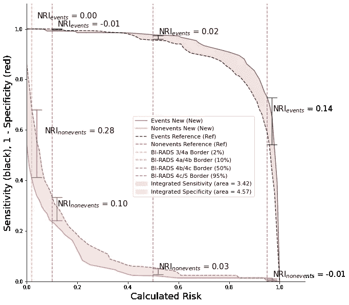
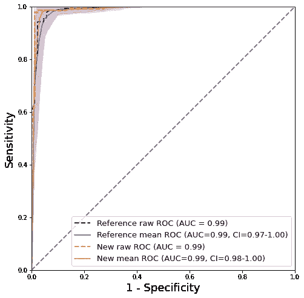

# 曲线下和曲线外的区域，具有综合的区分改善和净重新分类

> 原文：<https://towardsdatascience.com/area-under-the-curve-and-beyond-f87a8ec6937b?source=collection_archive---------10----------------------->

## [实践教程](https://towardsdatascience.com/tagged/hands-on-tutorials)，机器学习&诊断统计

## 例如，使用 python 代码，演示了如何生成 AUC、IDI 和 NRI 指标并进行深入研究



作者图片

# TLDR

*   **AUC** 是比较两种型号性能的一个很好的起点，但它并不总能说明全部情况
*   **NRI** 着眼于新模型正确重新分类癌症和良性疾病的能力，应该与 AUC 一起使用
*   **IDI** 对区分曲线斜率的改善进行量化，并对其作图，可以提供 AUC 单独无法提供的信息。
*   [**发表**医学中这些概念的例子。](https://www.nature.com/articles/s43856-021-00024-0#Fig3)
*   **以下示例的代码**和有用的 AUC、NRI、IDI 函数可以在 [**github**](https://github.com/LambertLeong/AUC_NRI_IDI_python_functions) 中找到。

[](https://www.nature.com/articles/s43856-021-00024-0#Fig3) [## 用于成分生物标记物的双能三室乳腺成像，以改善对乳腺癌的检测

### 虽然乳房成像如全视野数字乳房 x 线照相术和数字乳房断层合成术有助于减少…

www.nature.com](https://www.nature.com/articles/s43856-021-00024-0#Fig3) 

# 曲线下面积

在机器学习和诊断医学中，受试者操作特征(ROC)曲线下面积(AUC)是用于评估模型或诊断测试的预测性能的常用指标。新模型通常以使用 AUC 的已有模型为基准。比较新旧模型的 AUC 以评估改进是一个很好的起点，但是，许多人在这里结束了他们的分析，并认为简单地报告更高的 AUC 就足够了。AUC 可能具有误导性，因为它对全部范围的敏感性和特异性值给予同等的权重，即使有限的范围或特定的阈值可能具有实际意义。在这篇文章中，我们展示了如何全面询问新的和改进的模型性能，超越简单的 AUC 比较，以便在给定问题的背景下提供对改进的更全面的理解。我们还提供了一个用 Python 编写的代码示例，来演示我们提出的概念。

# 例如:乳腺癌

乳腺癌是全世界女性癌症死亡的主要原因。早期检测有助于降低死亡率，越早发现恶性肿瘤，患者越有可能存活。因此，已经投入了巨大的努力来开发预测模型以更好地识别癌症。在这个例子中，我们使用提取的成像特征来建立模型，以预测恶性肿瘤的概率。我们使用来自位于 UCI 机器学习仓库的[威斯康辛乳腺癌诊断数据库](https://archive.ics.uci.edu/ml/datasets/Breast+Cancer+Wisconsin+(Diagnostic)) [ [1](https://www.lambertleong.com/thoughts/AUC-IDI-NRI#ref-uci) ]的数据。

如前所述，AUC 对所有阈值给予相同的权重，但这在乳腺癌诊断中可能不实用。[乳腺影像报告和数据系统或(BI-RADS)](https://www.cancer.org/cancer/breast-cancer/screening-tests-and-early-detection/mammograms/understanding-your-mammogram-report.html) [ [2](https://www.lambertleong.com/thoughts/AUC-IDI-NRI#ref-birads) 。为给定的恶性肿瘤概率提供一个行动方案。简而言之，如果恶性肿瘤的概率大于 2%，建议进行活检。活组织检查是侵入性的程序，它们可能对患者的身体和精神有害。理想地，新的和改进的乳房模型将在识别癌症(灵敏度增加)和减少假阳性(特异性增加)方面更好，优选低于 2%以避免侵入性和不必要的活检。

我们用下面的代码片段来设置这个例子。

## 示例设置

```
# Import Modules #
import os
import sys
import numpy as np
import pandas as pd
import matplotlib.pyplot as plt
import matplotlib.gridspec as gridspec
import seaborn as sns
from sklearn.ensemble import RandomForestClassifier
from sklearn.datasets import load_breast_cancer
from sklearn.model_selection import train_test_split
from sklearn import metrics
from sklearn.metrics import roc_auc_score
from sklearn.metrics import roc_auc_score
```

在导入必要的模块后，我们加载乳腺癌数据集，并将数据分成训练集和测试集。请注意，最好也创建一个验证集，我们通常会这样做，但是为了这个示例，我们将只使用一个训练集和测试集。

```
# Import data #
data = load_breast_cancer()
# Create DataFrame and Split Data
df = pd.DataFrame(data=data['data'],columns=data['feature_names'])
df['label']=data['target']
x_train, x_test, y_train, y_test = train_test_split(df.iloc[:,:-1], df.iloc[:,-1], test_size=0.40, random_state=123)
```

同样为了这个例子，我们将假设我们的参考/基准模型建立在与纹理、凹点、平滑度、分形维数和紧密度相关的乳房成像特征上。我们还将假设新模型使用与半径、周长、面积、对称性和凹度相关的附加成像生物标记/特征。总的来说，参考模型使用总共 15 个特征构建，而新模型使用 30 个特征构建(原始模型使用 15 个特征，15 个新特征)。下面的代码片段创建了两组功能。

```
# create ref and new model feature sets #
ref_feat, new_feat = [],[]
for i in data['feature_names']:
    if 'fractal' in i or 'smoothness' in i or 'texture' in i ...
or 'concave' in i or 'compactness' in i:
        ref_feat+=[i]
```

## 建模

我们创建了一个包含 15 个特征的参考或“参考模型”，以及包含所有 30 个特征的“新模型”。

```
ref_model = RandomForestClassifier()
new_model = RandomForestClassifier()
# fit models to train data
ref_model.fit(x_train[ref_feat], y_train)
new_model.fit(x_train[new_feat], y_train)
# make predictions on test data
test_ref_pred=ref_model.predict_proba(x_test[ref_feat])
test_new_pred=new_model.predict_proba(x_test[new_feat])
```

## 比较模型 AUC 的问题

我们之前提到过，比较 AUC 是一个很好的起点。我们这样做是为了了解新模型相对于我们的参考模型的表现如何。我们使用下面的自定义函数来可视化 ROC 曲线和置信区间(CI)。

```
#[https://www.nature.com/articles/s43856-021-00024-0#Fig3](https://www.nature.com/articles/s43856-021-00024-0#Fig3)
**def** bootstrap_results(y_truth, y_pred,num_bootstraps **=** 1000):
    n_bootstraps = num_bootstraps
    rng_seed = 42  *# control reproducibility*
    y_pred=y_pred
    y_true=y_truth
    rng = np.random.RandomState(rng_seed)
    tprs=[]
    fprs=[]
    aucs=[]
    threshs=[]
    base_thresh = np.linspace(0, 1, 101)
    for i in range(n_bootstraps):
        *# bootstrap by sampling with replacement on the prediction indices*
        indices = rng.randint(0, len(y_pred), len(y_pred))
        if len(np.unique(y_true[indices])) < 2:
            *# We need at least one positive and one negative sample for ROC AUC*
            continue
        fpr, tpr, thresh = metrics.roc_curve(y_true[indices],y_pred[indices])
        thresh=thresh[1:]
        thresh=np.append(thresh,[0.0])
        thresh=thresh[::-1]
        fpr = np.interp(base_thresh, thresh, fpr[::-1])
        tpr = np.interp(base_thresh, thresh, tpr[::-1])
        tprs.append(tpr)
        fprs.append(fpr)
        threshs.append(thresh)
    tprs = np.array(tprs)
    mean_tprs = tprs.mean(axis=0)  
    fprs = np.array(fprs)
    mean_fprs = fprs.mean(axis=0)
    return base_thresh, mean_tprs, mean_fprs**def** get_auc_ci(y_truth, y_pred,num_bootstraps = 1000):
    n_bootstraps = num_bootstraps
    rng_seed = 42  # control reproducibility
    bootstrapped_scores = []
    y_pred=y_pred
    y_true=y_truth
    rng = np.random.RandomState(rng_seed)
    tprs=[]
    aucs=[]
    base_fpr = np.linspace(0, 1, 101)
    for i in range(n_bootstraps):
        # bootstrap by sampling with replacement on the prediction indices
        indices = rng.randint(0, len(y_pred), len(y_pred))
        if len(np.unique(y_true[indices])) < 2:
            # We need at least one positive and one negative sample for ROC AUC
            continue
        score = roc_auc_score(y_true[indices], y_pred[indices])
        bootstrapped_scores.append(score)
        fpr, tpr, _ = metrics.roc_curve(y_true[indices],y_pred[indices])
        roc_auc = metrics.auc(fpr, tpr)
        aucs.append(roc_auc)
        tpr = np.interp(base_fpr, fpr, tpr)
        tpr[0] = 0.0
        tprs.append(tpr)
    tprs = np.array(tprs)
    mean_tprs = tprs.mean(axis=0)
    std = tprs.std(axis=0)
    mean_auc = metrics.auc(base_fpr, mean_tprs)
    std_auc = np.std(aucs)
    tprs_upper = np.minimum(mean_tprs + std*2, 1)
    tprs_lower = mean_tprs - std*2
    return base_fpr, mean_tprs, tprs_lower, tprs_upper, mean_auc, std_auc**def** plot_auc(truth, reference_model, new_model,n_bootstraps=1000, save=False):
    y_truth = truth
    ref_model = reference_model
    new_model = new_model
    ref_fpr, ref_tpr, ref_thresholds = metrics.roc_curve(y_truth, ref_model)
    new_fpr, new_tpr, new_thresholds = metrics.roc_curve(y_truth, new_model)
    ref_auc, new_auc = metrics.auc(ref_fpr, ref_tpr), metrics.auc(new_fpr, new_tpr)
    print('ref auc =',ref_auc, '\newn auc = ', new_auc)
    base_fpr_ref, mean_tprs_ref, tprs_lower_ref, tprs_upper_ref, mean_auc_ref, std_auc_ref=get_auc_ci(y_truth, ref_model,n_bootstraps)
    base_fpr_new, mean_tprs_new, tprs_lower_new, tprs_upper_new, mean_auc_new, std_auc_new=get_auc_ci(y_truth, new_model,n_bootstraps)
    plt.figure(figsize=(8, 8))
    lw = 2
    plt.plot(ref_fpr, ref_tpr, color='blue',
             lw=lw, label='Reference raw ROC (AUC = %0.2f)' % ref_auc, linestyle='--')
    plt.plot(base_fpr_ref, mean_tprs_ref, 'b', alpha = 0.8, label=r'Reference mean ROC (AUC=%0.2f, CI=%0.2f-%0.2f)' % (mean_auc_ref, (mean_auc_ref-2*std_auc_ref),(mean_auc_ref+2*std_auc_ref)),)
    plt.fill_between(base_fpr_ref, tprs_lower_ref, tprs_upper_ref, color = 'b', alpha = 0.2)
    plt.plot(new_fpr, new_tpr, color='darkorange',
             lw=lw, label='New raw ROC (AUC = %0.2f)' % new_auc, linestyle='--')
    plt.plot(base_fpr_new, mean_tprs_new, 'darkorange', alpha = 0.8, label=r'New mean ROC (AUC=%0.2f, CI=%0.2f-%0.2f)' % (mean_auc_new,(mean_auc_new-2*std_auc_new),(mean_auc_new+2*std_auc_new)),)
    plt.fill_between(base_fpr_new, tprs_lower_new, tprs_upper_new, color = 'darkorange', alpha = 0.2)
    plt.plot([0, 1], [0, 1], color='gray', lw=lw, linestyle='--')
    plt.xlim([0.0, 1.0])
    plt.ylim([0.0, 1.0])
    plt.xlabel('1 - Specificity', fontsize=18)
    plt.ylabel('Sensitivity', fontsize=18)
    plt.legend(loc="lower right", fontsize=13)
    plt.gca().set_aspect('equal', adjustable='box')
```

我们运行以下程序来生成 AUC 图。

```
plot_auc(y_test.values,test_ref_pred[:,1],test_new_pred[:,1],n_bootstraps=100)
```



作者图片

图 1:使用自举法计算可信区间的 AUC 曲线

图 1 中的平均曲线和 95%置信区间。是通过 100 轮自举计算出来的，参见上面的代码。参照(蓝色曲线)和新模型(橙色曲线)分别在 0.99 和 0.99 产生相似的 AUC。新模型的置信区间略窄。总的来说，仅从 AUC 曲线很难得出任何有意义的结论，似乎具有额外特征的新模型对改善恶性肿瘤预测几乎没有作用。

# 超出曲线下的区域

我们的例子在[图 1 中。](https://www.lambertleong.com/thoughts/AUC-IDI-NRI#auc_plot)展示了仅使用 AUC 的局限性，并建议分析需要超越相似的 AUC 比较。我们提出了两个额外的指标，通常用于评估新特征或生物标记对模型的影响。这些指标包括净重新分类指数(NRI)和综合歧视改善指数(IDI) [ [3](https://www.lambertleong.com/thoughts/AUC-IDI-NRI#ref-pencina) 。这两个指标将有助于理解两个模型的实际差异，这些差异在图 1[中可能并不明显。](https://www.lambertleong.com/thoughts/AUC-IDI-NRI#auc_plot)

# 净重新分类指数(NRI)

NRI 是将 NRI 事件和 NRI 非事件的数量相加得出的。在我们的例子中，事件是癌症或恶性肿瘤患者的同义词，NRI 非事件是良性病变患者的同义词。NRI 事件是指发生事件的患者被重新分配到较高风险类别的净比例，而 NRI 非事件是指未发生事件的患者被重新分配到较低风险类别的人数[ [4](https://www.lambertleong.com/thoughts/AUC-IDI-NRI#ref-pencina2) ]。我们使用以下 Python 函数来计算 NRI。

```
**def** check_cat(prob,thresholds):
    cat=0
    for i,v in enumerate(thresholds):
        if prob>v:
            cat=i
    return cat**def** make_cat_matrix(ref, new, indices, thresholds):
    num_cats=len(thresholds)
    mat=np.zeros((num_cats,num_cats))
    for i in indices:
        row,col=check_cat(ref[i],thresholds),check_cat(new[i],thresholds)
        mat[row,col]+=1
    return mat**def** nri(y_truth,y_ref, y_new,risk_thresholds):
    event_index = np.where(y_truth==1)[0]
    nonevent_index = np.where(y_truth==0)[0]
    event_mat=make_cat_matrix(y_ref,y_new,event_index,risk_thresholds)
    nonevent_mat=make_cat_matrix(y_ref,y_new,nonevent_index,risk_thresholds)
    events_up, events_down = event_mat[0,1:].sum()+event_mat[1,2:].sum()+event_mat[2,3:].sum(),event_mat[1,:1].sum()+event_mat[2,:2].sum()+event_mat[3,:3].sum()
    nonevents_up, nonevents_down = nonevent_mat[0,1:].sum()+nonevent_mat[1,2:].sum()+nonevent_mat[2,3:].sum(),nonevent_mat[1,:1].sum()+nonevent_mat[2,:2].sum()+nonevent_mat[3,:3].sum()
    nri_events = (events_up/len(event_index))-(events_down/len(event_index))
    nri_nonevents = (nonevents_down/len(nonevent_index))-(nonevents_up/len(nonevent_index))
    return nri_events, nri_nonevents, nri_events + nri_nonevents
```

我们将参考模型和新模型预测输入 NRI 函数，计算事件、非事件和总 NRI。

```
print(nri(y_test.values,test_ref_pred[:,1],test_new_pred[:,1],[0.02,0.1,0.5,0.95]))
```

上面代码的输出是:

```
0.1642857142857143, 0.125, 0.2892857142857143
```

“与参考模型相比，新模型对 29%的患者进行了重新分类”,这种说法很诱人，但这并不准确，也不是对 NRI 的正确解释。由于 NRI 是事件比例的总和，而不是事件比例的总和，因此 NRI 可能为 2%或 200%。声称新模型对 200%以上的个体进行了重新分类是不可能的，因为这意味着患者数量突然增加了一倍。更正确的解释是，与参考模型相比，新模型正确分类的癌症病例多 16%,良性多 13%,总 NRI 为 29%。

NRI 向我们展示了在新模型中增加更多的特征可以对恶性和非恶性患者进行重新分类。这一信息不能仅从 AUC 得出，可能会错误地使人们认为模型是相同的。在临床环境中，新的模型会发现更多的癌症，这可能会挽救更多的生命。此外，新的模型将正确地识别更多的益处，这将转化为对个体更少的压力，并可能使他们免于像活检这样的侵入性程序。

无类别或 cfNRI 是一个较新的指标，跟踪事件和非事件的总体变化，不考虑类别。以我们的乳腺癌为例，美国放射学院(ACR)有不同的 BI-RADS 类别，因此我们认为没有必要计算 cfNRI。我们提供了计算 cfNRIs 的编码函数，以满足您的问题。

```
**def** track_movement(ref,new, indices):
    up, down = 0,0
    for i in indices:
        ref_val, new_val = ref[i],new[i]
        if ref_val<new_val:
            up+=1
        elif ref_val>new_val:
            down+=1
    return up, down**def** category_free_nri(y_truth,y_ref, y_new):
    event_index = np.where(y_truth==1)[0]
    nonevent_index = np.where(y_truth==0)[0]
    events_up, events_down = track_movement(y_ref, y_new,event_index)
    nonevents_up, nonevents_down = track_movement(y_ref, y_new,nonevent_index)
    nri_events = (events_up/len(event_index))-(events_down/len(event_index))
    nri_nonevents = (nonevents_down/len(nonevent_index))-(nonevents_up/len(nonevent_index))
    #print(events_up, events_down, len(event_index), nonevents_up, nonevents_down, len(nonevent_index), nri_events, nri_nonevents, nri_events+nri_nonevents)
    return nri_events, nri_nonevents, nri_events + nri_nonevents
```

# 综合歧视指数(IDI)

IDI 是区分斜率变化的量度，显示了新生物标记对二元预测模型的影响。IDI 是综合敏感性(is)和综合特异性(IP)的总和，像 NRI 一样，它分离出事件和非事件，或者在这种情况下是癌症和良性疾病。我们使用下面的代码来计算和绘制 IDI 曲线[ [5](https://www.lambertleong.com/thoughts/AUC-IDI-NRI#ref-pickering) ]。

```
**def** area_between_curves(y1,y2):
    diff = y1 - y2 # calculate difference
    posPart = np.maximum(diff, 0)
    negPart = -np.minimum(diff, 0)
    posArea = np.trapz(posPart)
    negArea = np.trapz(negPart)
    return posArea,negArea,posArea-negArea**def** plot_idi(y_truth, ref_model, new_model, save=False):
    ref_fpr, ref_tpr, ref_thresholds = metrics.roc_curve(y_truth, ref_model)
    new_fpr, new_tpr, new_thresholds = metrics.roc_curve(y_truth, new_model)
    base, mean_tprs, mean_fprs=bootstrap_results( y_truth, new_model,100)
    base2, mean_tprs2, mean_fprs2=bootstrap_results( y_truth, ref_model,100)
    is_pos,is_neg, idi_event=area_between_curves(mean_tprs,mean_tprs2)
    ip_pos,ip_neg, idi_nonevent=area_between_curves(mean_fprs2,mean_fprs)
    print('IS positive', round(is_pos,2),'IS negative',round(is_neg,2),'IDI events',round(idi_event,2))
    print('IP positive', round(ip_pos,2),'IP negative',round(ip_neg,2),'IDI nonevents',round(idi_nonevent,2))
    print('IDI =',round(idi_event+idi_nonevent,2))
    plt.figure(figsize=(10, 10))
    ax=plt.axes()
    lw = 2
    plt.plot(base, mean_tprs, 'black', alpha = 0.5, label='Events New (New)' )
    plt.plot(base, mean_fprs, 'red', alpha = 0.5, label='Nonevents New (New)')
    plt.plot(base2, mean_tprs2, 'black', alpha = 0.7, linestyle='--',label='Events Reference (Ref)' )
    plt.plot(base2, mean_fprs2, 'red', alpha = 0.7,  linestyle='--', label='Nonevents Reference (Ref)')
    plt.fill_between(base, mean_tprs,mean_tprs2, color='black',alpha = 0.1, label='Integrated Sensitivity (area = %0.2f)'%idi_event)
    plt.fill_between(base, mean_fprs,mean_fprs2, color='red', alpha = 0.1, label='Integrated Specificity (area = %0.2f)'%idi_nonevent)#''' #TODO: comment out if not for breast birads
    ### BIRADS Thresholds ###
    plt.axvline(x=0.02,color='darkorange',linestyle='--',alpha=.5,label='BI-RADS 3/4a Border (2%)')
    plt.axvline(x=0.10,color='green',linestyle='--',alpha=.5,label='BI-RADS 4a/4b Border (10%)')
    plt.axvline(x=0.5,color='blue',linestyle='--',alpha=.5,label='BI-RADS 4b/4c Border (50%)')
    plt.axvline(x=0.95,color='purple',linestyle='--',alpha=.5,label='BI-RADS 4c/5 Border (95%)')
    **def** nri_annotation(plt, threshold):
        x_pos = base[threshold]
        x_offset=0.02
        x_offset2=x_offset
        text_y_offset=0.01
        text_y_offset2=text_y_offset
        if threshold==2:
            text_y_offset=0.04
            text_y_offset2=0.04
            x_offset2=0.05
            print(x_pos+x_offset, (np.mean([mean_tprs2[threshold], mean_tprs[threshold]])+text_y_offset),
                    x_pos, (np.mean([mean_tprs2[threshold], mean_tprs[threshold]])))
        text_y_events=np.mean([mean_tprs2[threshold], mean_tprs[threshold]])+text_y_offset
        text_y_nonevents=np.mean([mean_fprs[threshold], mean_fprs2[threshold]])+text_y_offset2
        plt.annotate('', xy=(x_pos+0.02, mean_tprs2[threshold+1]), xycoords='data', xytext=(x_pos+0.02,
                            mean_tprs[threshold]), textcoords='data', arrowprops={'arrowstyle': '|-|'})
        plt.annotate('NRI$_{events}$ = %0.2f'%(mean_tprs[threshold]-mean_tprs2[threshold]),
                     xy=(x_pos+x_offset, text_y_events), xycoords='data',
                     xytext=(x_pos+x_offset, text_y_events),
                     textcoords='offset points', fontsize=15)
        plt.annotate('', xy=(x_pos+0.02, mean_fprs[threshold]), xycoords='data', xytext=(x_pos+0.02,
                             mean_fprs2[threshold]), textcoords='data', arrowprops=dict(arrowstyle= '|-|',color='r'))
        plt.annotate('NRI$_{nonevents}$ = %0.2f'%(mean_fprs2[threshold]-mean_fprs[threshold]),
                     xy=(x_pos+x_offset2, text_y_nonevents), xycoords='data',
                     xytext=(x_pos+x_offset2, text_y_nonevents),
                     textcoords='offset points', fontsize=15)
        print('Threshold =',round(x_pos,2),'NRI events =',round(mean_tprs[threshold]-mean_tprs2[threshold],4),
              'NRI nonevents =',round(mean_fprs2[threshold]-mean_fprs[threshold],4),'Total =',
              round((mean_tprs[threshold]-mean_tprs2[threshold])+(mean_fprs2[threshold]-mean_fprs[threshold]),4))
    nri_annotation(plt,2)
    nri_annotation(plt,10)
    nri_annotation(plt,50)
    nri_annotation(plt,95)
    #'''
    plt.xlim([0.0, 1.10])
    plt.ylim([0.0, 1.10])
    ax.spines['right'].set_visible(False)
    ax.spines['top'].set_visible(False)
    plt.xlabel('Calculated Risk', fontsize=18)
    plt.ylabel('Sensitivity (black), 1 - Specificity (red)', fontsize=18)
    plt.legend(loc="upper right", fontsize=11)
    plt.legend(loc=0, fontsize=11,  bbox_to_anchor=(0,0,1.2,.9))
    plt.gca().set_aspect('equal', adjustable='box')
    #if save:
    #    plt.savefig('idi_curve.png',dpi=300, bbox_inches='tight')
    look=95
    plt.show()
```

我们运行下面的命令来生成图 2 中的[图。](https://www.lambertleong.com/thoughts/AUC-IDI-NRI#idi_plot)

```
plot_idi(y_test.values,test_ref_pred[:,1],test_new_pred[:,1])
```

输出:

```
IS positive 3.58 IS negative 0.16 IDI events 3.42
IP positive 4.61 IP negative 0.04 IDI nonevents 4.57
IDI = 7.98
0.04 1.04 0.02 1.0
Threshold = 0.02 NRI events = 0.0 NRI nonevents = 0.2762 Total = 0.2762
Threshold = 0.1 NRI events = -0.008 NRI nonevents = 0.1002 Total = 0.0922
Threshold = 0.5 NRI events = 0.0215 NRI nonevents = 0.0317 Total = 0.0532
Threshold = 0.95 NRI events = 0.1389 NRI nonevents = -0.0136 Total = 0.1252
```


作者图片

图 2: IDI 曲线，在每个级别或双半径边界计算 NRI

虚线和实线分别代表参考模型和新模型。在理想情况下，黑色实线将移至右上方，表示灵敏度提高最多，红色实线将移至右下方，表示特异性提高最多。黑色和红色曲线之间的面积等于 IS 和 IP，黑色和红色面积的总和等于 IDI。IDI 提供了更多关于 AUC 曲线的信息，特别是关于橙色垂直虚线或 BI-RADS 3/4a 边界。在此边界处，IP 或红色区域较大，这表明新模型能够更好地预测 benigns。这个界限特别有趣，因为建议所有 BI-RADS 4 或以上的患者接受活检[ [6](https://www.lambertleong.com/thoughts/AUC-IDI-NRI#ref-leong) ]。3/4a 边界处的大面积显示，向新模型添加新特征增加了特异性，并可能防止 28%以上的人(NRI 无事件=0.28)进行不必要的活检。

# 最后的想法

AUC 是一个很好的指标，但不能提供全面分析新生物标志物和模型影响所需的所有信息。应使用 NRI 和 IDI 来补充 AUC 调查结果和解释。作为一名使用 Python 的数据科学家和癌症研究人员，很难找到计算和绘制 NRI 和 IDI 的函数和代码片段。这是我张贴这篇文章的动机，我希望我的代码可以帮助其他人的研究，发现和追求更好的医疗保健解决方案。

# 参考

【Dua，d .和 Graff，C .(2019)，加州尔湾:加州大学信息与计算机科学学院，UCI 机器学习资源库【http://archive.ics.uci.edu/ml】。

[【2】](https://www.cancer.org/cancer/breast-cancer/screening-tests-and-early-detection/mammograms/understanding-your-mammogram-report.html)了解乳腺摄影报告:乳腺摄影结果。(未注明)。检索于 2021 年 5 月 6 日，来自[https://www . cancer . org/cancer/breast-cancer/screening-tests-and-early-detection/乳房 x 光片/understanding-your-乳房 x 光片-报告. html](https://www.cancer.org/cancer/breast-cancer/screening-tests-and-early-detection/mammograms/understanding-your-mammogram-report.html)

[【3】](https://onlinelibrary.wiley.com/doi/abs/10.1002/sim.2929)pen Cina，M. J .，D'Agostino Sr，R. B .，D'Agostino Jr，R. B .，& Vasan，R. S .，评估一种新标记物的额外预测能力:从 ROC 曲线下面积到重新分类及重新分类之后，(2008)，医学统计学，27(2)，157–172。

[【4】](https://onlinelibrary.wiley.com/doi/abs/10.1002/sim.4085)pen Cina，M. J .，D'Agostino Sr，R. B .，& Steyerberg，E. W .，测量新生物标志物有用性的净重新分类改进计算的扩展，(2011)，医学统计学，30(1)，11–21。

【Pickering，j . w .】&Endre，Z. H .，评估候选生物标志物诊断潜力的新指标，(2012)，美国肾病学会临床杂志，7(8)，1355–1364。

[【6】](https://www.nature.com/articles/s43856-021-00024-0)Leong，l .、Malkov，s .、Drukker，k .、Niell，b .、Sadowski，p .、Wolfgruber，t .…&Shepherd，j .、双能量三室乳腺成像(3CB)，用于改进恶性病变检测的新型成分生物标志物，(2021)。

*原载于 2021 年 5 月 1 日 https://www.lambertleong.com**的* [*。*](https://www.lambertleong.com/thoughts/AUC-IDI-NRI)