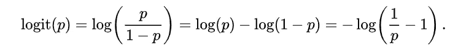
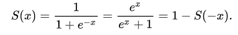
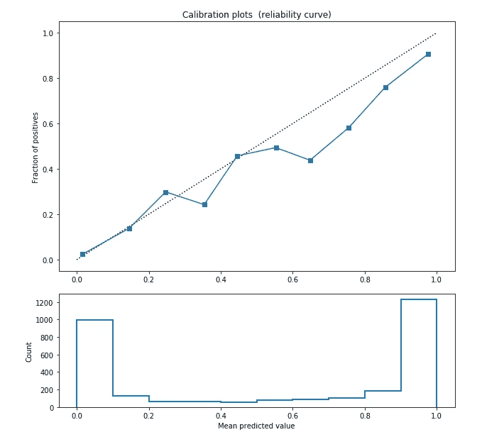
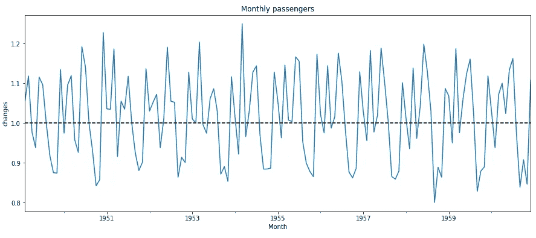
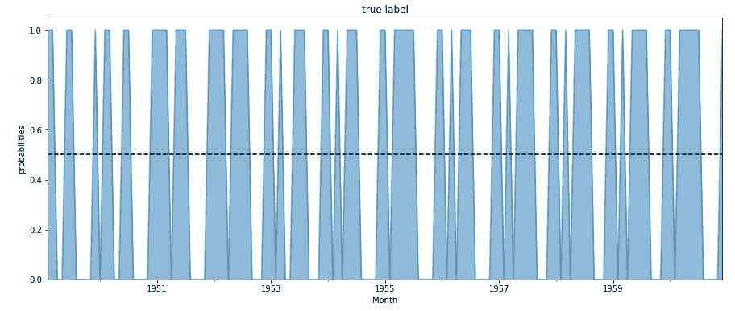
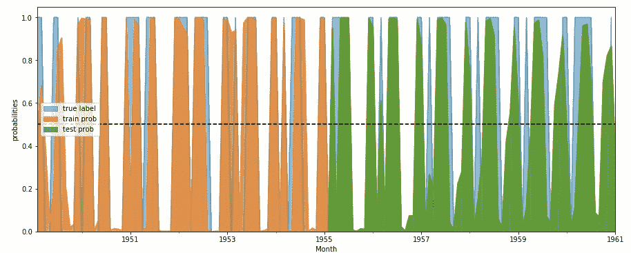

# 用于软标签分类的 ARIMA

> 原文：<https://towardsdatascience.com/arima-for-classification-with-soft-labels-29f3109d9840?source=collection_archive---------23----------------------->

## 如何让你的模型产生概率

照片由[赛义德·阿里](https://unsplash.com/@syedmohdali121?utm_source=medium&utm_medium=referral)在 [Unsplash](https://unsplash.com?utm_source=medium&utm_medium=referral) 上拍摄

分类任务的性质意味着已知目标的可用性。在实际应用中，标签是由某种人工活动生成的，或者是作为某种确定性操作的结果而获得的。可能发生的情况是，标记产生不准确的目标，这影响了我们的机器学习模型的训练。为了减轻过度适应或过度自信带来的风险，我们可以检查概率结果。

某种概率分数的存在使我们有可能采用先进的技术来挤压结果(阈值调整、校准)。我们并不总是能够以概率的形式获得结果。一些算法不产生它们，或者没有被设计成以概率的方式处理任务。这可能是一个严重的缺失，尤其是在商业价值方面。

在这篇文章中，我们尝试使用软标签从回归算法开始执行分类任务。一般来说，我们可能会采用回归模型，这是由于问题的性质，或者是因为标记目标的方式没有给出好的结果。这个简单的技巧使我们能够利用回归算法的学习能力保持概率解释。

我们开始介绍一个在分类环境中使用正常回归算法的一般应用。然后，我们在时间序列域中转换相同的过程，其中我们尝试使用 ARIMA 来建模二进制分类问题。

# 用软标签分类

采用回归方法来模拟二元目标并不是一个好选择。首先，错误分类没有受到足够的惩罚。分类任务中的决策边界很大，而在回归中，两个预测值之间的距离可能很小。第二，从概率的角度来看，用回归建模我们对目标的分布做了一些特定的假设。而实际上，二进制目标来自伯努利分布。

也就是说，我们可以训练一个分类器来最小化均方误差，但是这会产生不一致的结果，并且没有相关的概率结果。我们有的选择既简单又有效。我们使用反 sigmoid 函数将您的目标转换到对数优势比空间。

Logits:来源[维基百科](https://en.wikipedia.org/wiki/Logit)

我们有软目标/标签`p ∈ (0, 1)`(确保将目标夹在`[eps, 1 - eps]`中，以避免我们记录日志时的不稳定性问题)。然后拟合一个回归模型。最后，为了进行推断，我们从回归模型中提取预测的 sigmoid。

来源[维基百科](https://en.wikipedia.org/wiki/Sigmoid_function)

我们以每个样本的预测概率结束，其中，一如既往地，概率高于 0.5 意味着模型预测类别 1(否则类别 0)。假设一个线性关系，这和建立一个逻辑回归没有太大的不同。**附加值在于在各种情况下采用该程序，以及更复杂的关系**。

我们用岭回归作为基本估计量来模拟之前在二元分类场景中介绍的方法。所获得的结果是足够一致的，以确认该方法是有效的，以模拟分类任务并产生概率结果。

使用岭回归和软标签获得的校准图(图片由作者提供)

# 用 ARIMA 和软标签分类

使用回归模型和软标签进行分类的最佳特征之一是，该过程是完全模型不可知的。将它应用于 ARIMA 模型怎么样？

现在，我们重复上面所做的，但在时间序列领域。假设我们有一个时间序列的二元目标，我们试图预测他们符合 ARIMA。在我们的例子中，我们处理了一系列每月航班乘客的变化。每个月的变化是通过本月`(Mt)`与上月`(Mt-1)`的乘客比例得出的。高于 1 的比率意味着该月的乘客数量比上个月有所增加。我们的二元目标是 1 代表积极变化，0 代表消极变化。

每月航空公司乘客变化(图片由作者提供)

二进制格式的每月航空乘客变化(图片由作者提供)

给定一系列二进制目标，我们将它们转换成软标签并应用 logit 函数。我们用 AIC 准则拟合选择最佳超参数的 ARIMA。应用 sigmoid 变换获得最终预测。在下图中，我们在背景中显示了真实标签(蓝色)，以及训练集(橙色)和测试集(绿色)的预测概率。

使用 SARIMAX 为训练集和测试集生成的概率(图片由作者提供)

结果很有意思。我们的方法产生良好的预测，显示出以概率形式产生结果的能力。这同样可以推广到每一个二元时间序列或扩展到多分类作为一个与休息的程序。

# 摘要

在这篇文章中，我们介绍了一种使用软标签和回归模型执行分类任务的技术。首先，我们将它应用于表格数据，然后用它对 ARIMA 时间序列进行建模。一般来说，它适用于每种环境和每种场景，还提供了概率得分。这对于标注平滑也非常有用，可以减少标注中出现的一些错误。

[**查看我的 GITHUB 回购**](https://github.com/cerlymarco/MEDIUM_NoteBook)

保持联系: [Linkedin](https://www.linkedin.com/in/marco-cerliani-b0bba714b/)