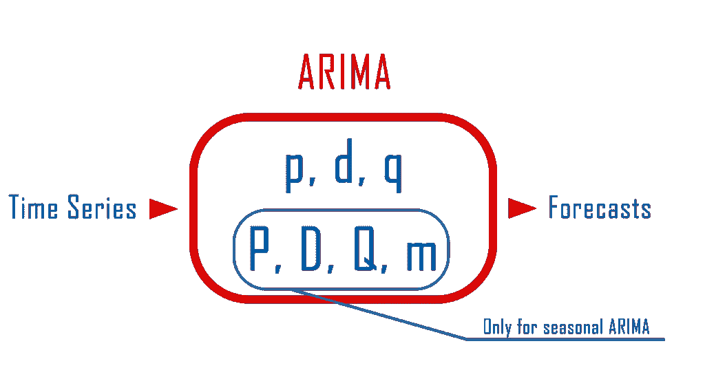

# Python 中的 ARIMA 模型

> 原文：<https://towardsdatascience.com/arima-model-in-python-7bfc7fb792f9?source=collection_archive---------6----------------------->

## 时间序列预测完全指南


照片由 [K 许](https://unsplash.com/@akuan5?utm_source=unsplash&utm_medium=referral&utm_content=creditCopyText)在 [Unsplash](https://unsplash.com/s/photos/airport?utm_source=unsplash&utm_medium=referral&utm_content=creditCopyText)

ARIMA 是最流行的统计模型之一。它代表自回归综合移动平均，适合时间序列数据，用于预测或更好地理解数据。我们不会涵盖 ARIMA 模型背后的整个理论，但我们会告诉你正确应用它需要遵循的步骤。

[ARIMA](https://en.wikipedia.org/wiki/Autoregressive_integrated_moving_average) 车型的主要特点如下:

*   AR:自回归。这表明时间序列根据其自身的滞后值[回归](https://en.wikipedia.org/wiki/Linear_regression)。
*   **I:综合。**这表示数据值已被替换为其值与先前值之间的差值，以便将序列转换为平稳序列。
*   **MA:移动平均线。**这表明[回归误差](https://en.wikipedia.org/wiki/Errors_and_residuals_in_statistics)实际上是误差项的[线性组合](https://en.wikipedia.org/wiki/Linear_combination)，其值在过去的不同时间同时出现。

当我们有季节性或非季节性数据时，可以应用 ARIMA 模型。不同之处在于，当我们有季节性数据时，我们需要向模型中添加更多的参数。

对于非季节性数据，参数为:

*   **p** :模型将使用的滞后观测的数量
*   **d** :原始观测值被差分直到平稳的次数。
*   **q** :移动平均线窗口的大小。

对于季节性数据，我们还需要添加以下内容:

*   P:模型将使用的季节性滞后观测的数量
*   **D** :季节观测值差分到平稳的次数。
*   **Q** :季节移动平均线窗口的大小。
*   **m**:1 个季节的观测次数



作者图片

# 季节性或非季节性数据

这个很好理解。季节性数据是指有时间间隔的数据，如每周、每月或每季度。例如，在本教程中，我们将使用按月聚集的数据，我们的“季节”是一年。因此，我们有季节性数据，对于 ARIMA 模型中的 **m 参数**，我们将使用 **12** ，即每年的月数。

# 平稳性

ARIMA 模型只能应用于平稳数据。这意味着我们不想有一个时间趋势。如果时间序列有趋势，那么它是非平稳的，我们需要应用差分将其转换为平稳的。下面是一个平稳和非平稳序列的例子。


作者图片

我们还可以使用**扩展的 Dickey-Fuller** 测试来帮助我们判断序列是否平稳。检验的零假设是有一个单位根，或者没有单位根。换句话说，如果 p 值低于 0.05(或您将使用的任何临界尺寸)，我们的系列是**固定的**。

开始编码吧。

对于本教程，我们将使用来自 Kaggle 的[航空乘客数据。](https://www.kaggle.com/rakannimer/air-passengers)

```
import pandas as pd
import numpy as np
from statsmodels.tsa.seasonal import seasonal_decompose

#[https://www.kaggle.com/rakannimer/air-passengers](https://www.kaggle.com/rakannimer/air-passengers)
df=pd.read_csv(‘AirPassengers.csv’)

#We need to set the Month column as index and convert it into datetime
df.set_index(‘Month’,inplace=True)
df.index=pd.to_datetime(df.index)df.head()
```


作者图片

首先，让我们绘制数据。

`df.plot()`


作者图片

正如你可以清楚地看到，有一个时间趋势，这表明数据不是静止的。然而，只是为了确保我们将使用一个扩大的迪基-富勒测试。

```
from statsmodels.tsa.stattools import adfullerresult=adfuller(df['#Passengers'])#to help you, we added the names of every value
dict(zip(['adf', 'pvalue', 'usedlag', 'nobs', 'critical' 'values', 'icbest'],result)){'adf': 0.8153688792060468,
 'pvalue': 0.991880243437641,
 'usedlag': 13,
 'nobs': 130,
 'criticalvalues': {'1%': -3.4816817173418295,
  '5%': -2.8840418343195267,
  '10%': -2.578770059171598},
 'icbest': 996.692930839019}
```

正如所料，我们未能拒绝零假设，该系列有一个单位根，因此不是平稳的。

# 使用差分将非平稳转换为平稳(D 和 D 参数)

下一步是将我们的数据转换为静态数据，这样我们就可以估计出将在模型中使用的 D 和 D 参数。这可以通过使用**差分**来完成，并通过从当前观察值中减去先前观察值来完成。

> 差异(T) =观察值(T) —观察值(T-1)

然后，我们将使用扩展的 Dickey-Fuller 测试再次测试它的平稳性，如果它是平稳的，我们将进行下一步。如果没有，我们将再次应用差分，直到我们有一个平稳的序列。使用**移位**功能，熊猫可以很容易地进行区分。

```
df['1difference']**=**df['#Passengers']**-**df['#Passengers'].shift(1)df['1difference'].plot()
```


作者图片

似乎我们去除了趋势，序列是平稳的。然而，我们将使用扩展的 Dickey-Fuller 测试来证明这一点。

```
#note we are dropping na values because the first value of the first difference is NAresult=adfuller(df['1difference'].dropna())
dict(zip(['adf', 'pvalue', 'usedlag', 'nobs', 'critical' 'values', 'icbest'],result)) {'adf': -2.8292668241699857,
 'pvalue': 0.05421329028382734,
 'usedlag': 12,
 'nobs': 130,
 'criticalvalues': {'1%': -3.4816817173418295,
  '5%': -2.8840418343195267,
  '10%': -2.578770059171598},
 'icbest': 988.5069317854084}
```

如你所见，我们没有拒绝零假设，因为我们的 p 值大于 0.05。这表明序列不是稳定的，我们需要再次使用差分法，取第二个差。第二个差可以作为第一个差来计算，但是这次我们将使用第一个差，而不是使用观察值。

```
df['2difference']**=**df['1difference']**-**df['1difference'].shift(1)df['2difference'].plot()
```


作者图片

让我们从第二个差异的扩展 Dickey-Fuller 测试中得到结果。

```
result**=**adfuller((df['2difference']).dropna())dict(zip(['adf', 'pvalue', 'usedlag', 'nobs', 'critical' 'values', 'icbest'],result)){'adf': -16.384231542468452,
 'pvalue': 2.732891850014516e-29,
 'usedlag': 11,
 'nobs': 130,
 'criticalvalues': {'1%': -3.4816817173418295,
  '5%': -2.8840418343195267,
  '10%': -2.578770059171598},
 'icbest': 988.602041727561}
```

p 值小于 0.05，因此我们可以拒绝零假设。这意味着第二个差异是固定的，这表明对值 d 的一个好的估计是 2 。

我们的数据是季节性的，所以我们还需要估计 **D 值**，它与 D 值相同，但存在季节性差异。季节性差异可以通过将数据移动每季的行数(在我们的示例中是每年 12 个月)并从上一季中减去它们来计算。这是**而不是**第一个季节差异。如果我们得到季节差异是稳定的，那么 D 值将为 0。如果不是，那么我们将计算**季节第一差异**。

> 季节差异(T) =观测值(T) —观测值(T-12)
> 
> 季节首差(T) =季节差(T) —季节差(T-1)

```
df['Seasonal_Difference']**=**df['#Passengers']**-**df['#Passengers'].shift(12)ax**=**df['Seasonal_Difference'].plot()
```


作者图片

```
result**=**adfuller((df['Seasonal_Difference']).dropna())dict(zip(['adf', 'pvalue', 'usedlag', 'nobs', 'critical' 'values', 'icbest'],result)){'adf': -3.383020726492481,
 'pvalue': 0.011551493085514952,
 'usedlag': 1,
 'nobs': 130,
 'criticalvalues': {'1%': -3.4816817173418295,
  '5%': -2.8840418343195267,
  '10%': -2.578770059171598},
 'icbest': 919.527129208137}
```

**p 值小于 0.05** ，因此它是固定的，我们不必使用差分。这表明使用 **0 作为**和**的 D 值**。

# 自相关和偏自相关图(P，Q 和 P，Q 参数)

ARIMA 模型之前的最后一步是创建自相关和偏自相关图，以帮助我们估计 P、Q、P 和 Q 参数。

ARIMA 和[季节性 ARIMA](https://people.duke.edu/~rnau/seasarim.htm) 模型有一些非常有用的[规则，我们通过查看自相关和偏自相关图来帮助我们估计参数。我们将为我们的时间序列的**秒差**和**季节差**创建图表，因为这些是我们最终在 ARIMA 使用的平稳序列(d=2，D=0)。](https://people.duke.edu/~rnau/arimrule.htm)

首先，让我们画出 ACF 和 PACF 的第二个区别。

```
**from** statsmodels.graphics.tsaplots **import** plot_acf, plot_pacffig1**=**plot_acf(df['2difference'].dropna())fig2**=**plot_pacf(df['2difference'].dropna())
```


作者图片


作者图片

我们可以看到，在我们的两个图中，滞后-1 处都有一个明显的截止点。根据我们上面提到的规则，这建议使用 AR 和 MA 术语。换句话说，p=1，q=1。

现在，我们需要同样的季节差异图。

```
fig1=plot_acf(df['2difference'].dropna())fig2=plot_pacf(df['2difference'].dropna())
```


作者图片


作者图片

我们在自相关图中有一个逐渐减小的曲线，在部分自相关图中有一个急剧的截止。这表明对于 ARIMA 的季节部分，使用 AR 并且不超过值 1。

我们选择的值可能不是最佳的。您可以使用这些参数来微调模型，以上面提到的规则作为指导。

# ARIMA 模式

```
**from** statsmodels.tsa.statespace.sarimax **import** SARIMAXmodel**=**SARIMAX(df['#Passengers'],order**=**(1,2,1),seasonal_order**=**(1, 0, 0, 12))result**=**model.fit()
```

我们可以画出模型的残差，从而了解模型的拟合程度。基本上，残差是原始值和模型预测值之间的差值。

`result.resid.plot(kind='kde')`


作者图片

是时候做个预测了。我们将创建一些未来的日期添加到我们的数据中，这样我们就可以预测未来的值。

```
**from** pandas.tseries.offsets **import** DateOffsetnew_dates**=**[df.index[**-**1]**+**DateOffset(months**=**x) **for** x **in** range(1,48)]df_pred**=**pd.DataFrame(index**=**new_dates,columns **=**df.columns)df_pred.head()
```


作者图片

ARIMA 模型预测将枚举索引的开始和结束作为参数，而不是日期范围。
我们创建了一个包含未来日期索引的空数据框，并将它们连接到原始数据中。我们的数据有 144 行，我们添加的新数据有 48 行。因此，为了只获得对未来数据的预测，我们将从第 143 行预测到第 191 行。

```
df2**=**pd.concat([df,df_pred])df2['predictions']**=**result.predict(start**=**143,end**=**191)df2[['#Passengers','predictions']].plot()
```


作者图片

# 总结一下

Arima 是一个很好的预测模型，可用于季节性和非季节性时间序列数据。
对于非季节性 ARIMA，你必须估计 P、D、Q 参数，而对于季节性 ARIMA，它有 3 个以上适用于 P、D、Q 参数的季节性差异。

我们用来运行 ARIMA 模型的管道如下:

*   看看你的时间序列，了解它们是季节性的还是非季节性的。
*   如果需要达到平稳性，将差分应用于时间序列和季节差异，以获得 D 和 D 值的估计值。
*   绘制自相关和偏自相关图有助于估计 P、P 和 Q、Q 值。
*   微调模型，如果需要改变参数根据 ARIMA 的一般规则

有用链接:
[ARIMA 规则](https://people.duke.edu/~rnau/arimrule.htm)
[R 中的 Arima](https://predictivehacks.com/arima-r/)
[如何回测你在 R 中的加密交易策略](https://predictivehacks.com/how-to-backtest-your-crypto-trading-strategies-in-r/)
[维基百科中的 ARIMA](https://en.wikipedia.org/wiki/Autoregressive_integrated_moving_average)

*最初发表于*[*https://predictivehacks.com。*](https://predictivehacks.com/arima-model-in-python/)