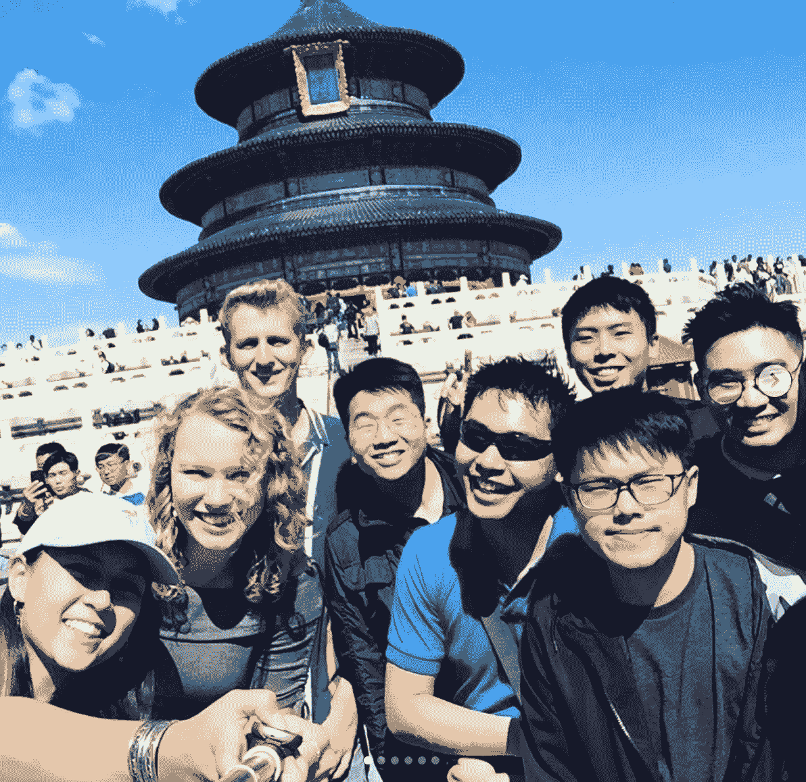
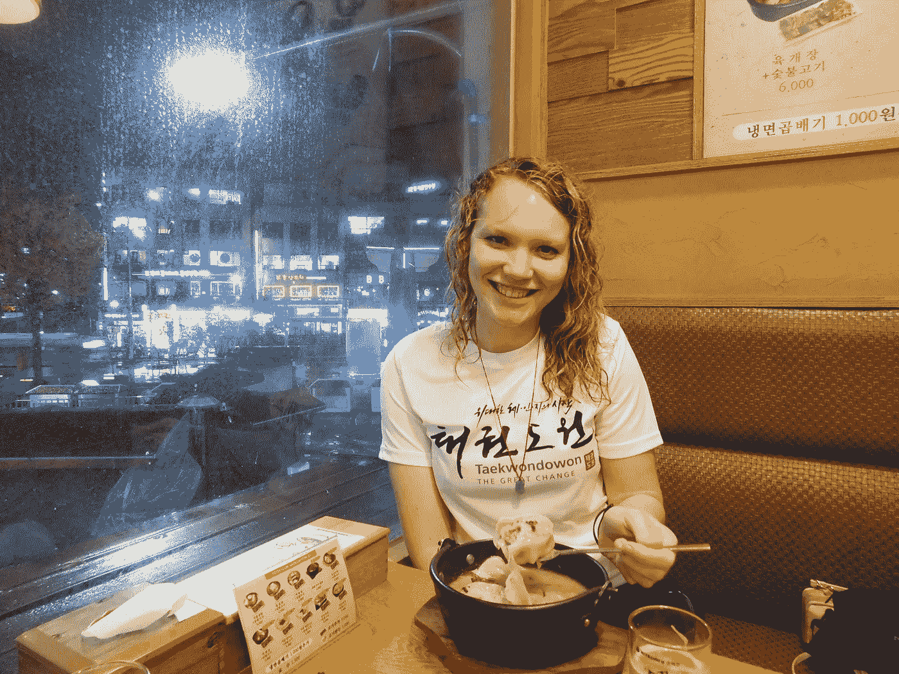

# 研究生论文的艺术

> 原文：<https://towardsdatascience.com/art-of-the-graduate-school-essay-f59b14c79649?source=collection_archive---------24----------------------->

## 让我进入 12 个数据科学硕士项目的 5 个简单技巧

拍摄于中国北京，大约 2018 年(又名 covid 之前)；我是前面的金发女郎！

研究生院 sop:他们会觉得自己像一头野兽。

当我申请数据科学项目的硕士学位时，我并不是一个完美的学生；事实上，[我离它很远](/how-i-got-into-12-data-science-masters-1eeddae21ba7)。我从未接触过 Python，从未运行过机器学习算法，也没有在谷歌或脸书有过什么性感的实习经历。我一直把自己定位为具有国际视野的作家、文科类型的人，我本科的大部分时间都在学习法语和中文，在国外实习和学习，甚至追求跆拳道生涯(完全透明地说，我辅修数学，但那是因为我最喜欢惩罚)。

说句不好听的话:我读硕士之前确实**不是**来自计算机科学或统计学专业，所以进入我申请的所有 12 个项目对这个系统来说是一个完全的冲击。这包括 UChicago、USC、UMich、UVA、Georgetown、Duke 和 Tufts——*和*他们中的许多人还为我提供了高额奖学金！

现在尘埃落定，我真的相信是我的写作技巧拯救了这一天，给我一个平台来构建我的人生故事，并提供为什么我应该得到一个机会的理由。通过谨慎的措辞，我能够克服不足，扩大优势，并提供一个令人信服的叙述，显示出向上的动力和学习的意愿。在我身上赌一把会有回报。自从上了研究生院，我就是我们班的学生会主席，目前我的平均绩点是 3.95，离毕业还有一个学期。

这篇文章既适合那些想要一些可靠的写作技巧的人，也适合那些想要获得数据科学学位但又担心没有相关背景的人。我在这里告诉你，1)我相信你，2)我是你能做到的活生生的证明，3)有了足够好的叙述，你的顶级数据科学项目的小组可能会认为你也能做到！

# 小贴士 1 |“你和其他女孩不一样”

维多利亚[博物馆](https://unsplash.com/@museumsvictoria?utm_source=unsplash&utm_medium=referral&utm_content=creditCopyText)在 [Unsplash](https://unsplash.com/s/photos/writing?utm_source=unsplash&utm_medium=referral&utm_content=creditCopyText) 上拍摄的照片

就像一个二战时期的水手在家里给他的 11 个女朋友写信一样——不要混淆名字，回忆她们每个人的特别之处，并向她们传达这样一种感觉:她们是你唯一关注的人。如果哈佛明天来敲你的门，那也没关系——罗格斯大学或者巴斯特大学，该死的。

当然，谁是她的读者会因你的读者而异。在你的文章中，列出你所写的学校为什么对你来说是独特的*的原因是很重要的。*

对这个问题做研究——对我来说，我至少花了一个小时学习核心课程，教授专业领域，然后平静地在我的论文中阐述我自己的兴趣如何与这些专业相结合。下面我将链接我自己的一篇文章，在第二页的后半部分是“你对我的特别之处”:

 [## 嗯 SOP.pdf

### 编辑描述

drive.google.com](https://drive.google.com/file/d/1vpx1x1hNmyw8f1-bVxpII9b3ObwSXwjG/view) 

此外，如果他们在申请的另一部分问你还申请了哪些学校，只列出那些有类似硕士项目的学校*，他们目前在排名中击败了那些学校。*因此，如果斯坦福大学在数据科学方面的排名高于布朗大学和哥伦比亚大学，你可以像你考虑的其他学校一样，将这两所学校放在你的斯坦福大学申请中，但不要将斯坦福大学放在你的布朗大学或哥伦比亚大学申请中。接受一个最终没有上学的学生会让学校看起来更糟，所以如果他们认为一个非常合格的学生会去别的地方，他们就不会接受他。

**要点**:不要发出千篇一律的短文；让你申请的每所学校相信它们最符合你的目标和兴趣(暗示如果他们接受你，你一定会去！).

# 技巧 2 |按时间顺序排列

按时间顺序排列的故事引人注目，因为这是一种传达结构和动力的简单方式。或者更具体地说，“这就是所发生的事情，这就是我现在正在做的事情，这就是为什么你的学校是我计划中明确的下一步”。你不需要严格按时间顺序排列(你会在我的 SOP 中看到，我只是在故事的某些点上按时间顺序排列)，但当你试图传达任何一种轨迹时，最好保持事情有序。

例如，我用这个工具描述了我最初对数据科学的兴趣是如何达到顶峰的，我是如何投入这种热情的，以及为什么研究生院是我明确的下一步。通过一系列简单的事件，我能够以积极的势头弥补我在背景方面的不足。

**大意:**千百年来，人们一直在讲故事；挖掘古代艺术，以保持读者的兴趣，并防止你的观点变得过于颠倒。

# 技巧 3 |杀死你的爱人

写作既是创造也是破坏，研究生论文里的每一句话对*你的整个故事一定是不可或缺的。这很难，因为我们倾向于写一份有很多绒毛和不连贯的草稿，然后有点依赖那些绒毛中没有发挥作用的部分。斯蒂芬·金称这种琐碎为“宠儿”，我相信学习如何成为一名“好”作家的一半是能够放下自己的小宠儿。*

> "杀了你的宝贝，杀了你的宝贝，即使这会伤了你这个自私的小流氓的心，也要杀了你的宝贝。"—斯蒂芬·金

**要点:**当你意识到它们已经开始偏离要点时，不要小心翼翼地删掉一些单词或者整段文字。

这就是为什么拥有校对者是如此的重要；他们不像你那样执着于文字，可以帮助清除杂草，让你的信息保持在正确的轨道上。如果你没有可以校对的人，在两次草稿之间休息几天，你会发现自己每次都会带着更新鲜、更客观的视角回到你的故事中。

# 技巧 4 |制造一个入口

我说你不一定要按时间顺序，就是这个意思。第一段，确切地说，应该是*激动人心。*没时间慢慢积累了——让读者直接进入故事情节，让他们注意你要说的内容。

这是我在研究生论文中最常用的介绍段落。这并不完美，但我很快就安排好了形势、任务和行动，留下接下来的几段来解释结果。

> 我选择从事数据科学的转折点出现在去年 4 月，当时我的团队参加了芝加哥大学计量经济学比赛。就像年轻计量经济学家的黑客马拉松一样，这场比赛将从剑桥到圣克拉拉的经济学学生聚集在一起。目标是在 14 小时内提出并回答一个重要的经济问题。在数量经济学研究研讨会的 Jane Doe 博士指导下学习了一些研究技术后，我对第一次有机会测试我的应用计量经济学知识感到紧张和兴奋。

作为一名经济学专业的学生，我能够从我完成的计量经济学竞赛中开始解释我对数据分析领域的最初兴趣。

**要点**:我鼓励你想出一些与数据科学密切相关的事件，并以此尽快抓住读者的注意力。类似于行为面试，如果你发现自己陷入困境，你可以使用明星方法来组织你的故事。

# 技巧 5 |诚实。

> "如果你对任何事情感到尴尬，那是你做得不对的迹象."—匿名

在当今世界，很容易摆脱各种通货膨胀——分数通货膨胀(学校)，货币通货膨胀(政府)，简历通货膨胀(几乎每个人)。每个人都想比别人看起来更好，结果每个人都以过度夸张而被遗忘而告终。

GIPHY 的 GIF

诚实很重要。确实如此。评审小组知道完美的候选人并不存在，所以如果你试图让他们相信你就是 T1，他们就会怀疑。提到你在 5 岁时没有完全掌握 Python，而是参加了两门在线课程，这可能不太令人印象深刻，但如果你说你是 Python 专家，没有任何实质性的课程或实习，这可能会引起对你诚实的怀疑(突然之间，你申请中的一切都变得更容易引起争论)。

当然，重要的是强调你的优势，并对你*所知道的*充满信心。为了判断什么时候我可能做得太过了，我喜欢回想几年前我听到的一句话:“如果你对任何事情感到尴尬，那是你做得不对的迹象。”

*(附注:我在网上找不到这段引文——如果有人指出了原始出处，我很乐意给予作者应有的信任！)*

要点:对你所知道的要有信心，对你所不知道的要诚实。

# 离别的思绪

作为一名前文科毕业生，目前正在休寒假的数据科学研究生，只要一有机会，我就喜欢舒展我的写作双腿。我希望我使用的一些技巧对你完成自己的申请有所帮助。

 [## 我是如何进入 12 个数据科学硕士项目的

### SOP，统计数据，所有的东西。

towardsdatascience.com](/how-i-got-into-12-data-science-masters-1eeddae21ba7)  [## 在读数据科学研究生之前，请阅读这篇文章

### 提示 1:找到中间值，而不是平均值

towardsdatascience.com](/read-this-before-going-to-grad-school-for-data-science-890fd05d4127) 

就我个人而言，读研是我做过的最好的决定，我绝对**热爱**我每天所学的东西，并且我很高兴今后能在数据科学领域工作。也就是说，这条道路并不适合所有人，有许多方法可以开始自己的数据科学之旅-如果训练营或自学对你更好，那么尽一切努力去做吧！😊

如果您对我有任何问题，请随时通过我的个人网站、 [LinkedIn](https://www.linkedin.com/in/amanda-west123/) 或 [Twitter](https://twitter.com/amawest_) 联系我，当然您也可以在 Medium 上关注我。再次感谢阅读！

摄于韩国首尔的一个雨天。总有一天，我会再次旅行——但我不会以外交官的身份工作，也不会以运动员的身份参赛，我会以数据科学家的身份利用自己的时间旅行，享受一些美好的时光:)