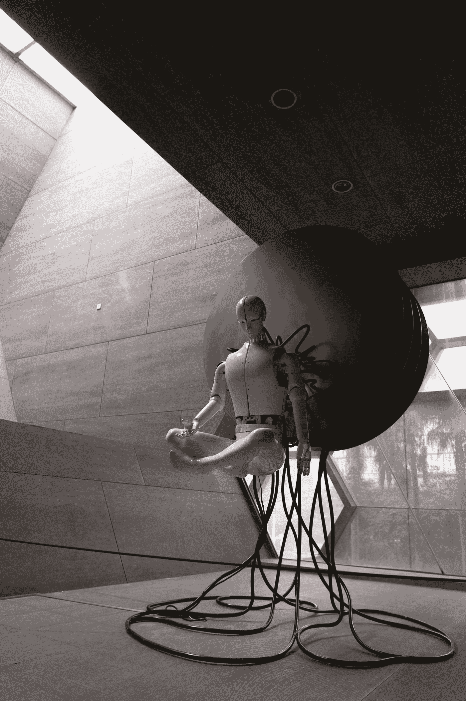
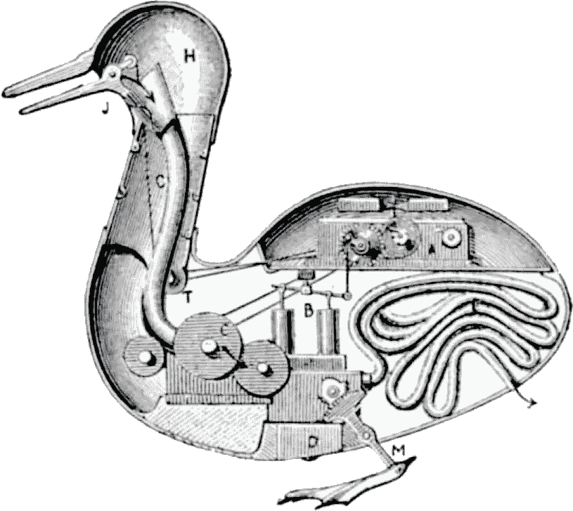

# 人工意识是不可能的

> 原文：<https://towardsdatascience.com/artificial-consciousness-is-impossible-c1b2ab0bdc46?source=collection_archive---------3----------------------->

## [思想和理论](https://towardsdatascience.com/tagged/thoughts-and-theory)

## 有意识的机器是科幻小说的主要内容，通常被认为是未来事实的必然产物，但这是不可能的。

[许](https://unsplash.com/@mrsunburnt?utm_source=medium&utm_medium=referral)摄于 [Unsplash](https://unsplash.com?utm_source=medium&utm_medium=referral)

这篇文章试图解释为什么有意识的机器是不可能的。硬件和软件设计的行为本身是一种动力的传递，是设计者的延伸，而不是意识意志的灌输。文章的后半部分致力于解决反驳的论点。最后，列出了本论文的一些启示。

# 智力对意识

智能是一个实体执行任务的能力，而意识是指一种主观现象的存在。

智力[1]:

> “……运用知识来控制环境的能力”

意识[2]:

> “当我处于有意识的精神状态时，从主观或第一人称的角度来看，我就像是处于那种状态。”

# 意识要求

一个有意识的实体，即头脑，必须具备:

1.意向性[3]:

> “意向性是心灵关于、代表或代表事物、属性和事态的力量。”

请注意，这不仅仅是一个象征性的表示。

2.感受性[4]:

> “……我们精神生活中可内省的、非凡的方面。在这个术语的广义上，很难否认有感受性。”

# 含义和符号

意义是事物(具体的或抽象的)和意识体验之间的心理联系。心灵哲学家描述了使这些意向性联系成为可能的心灵力量。符号只对那些在他们的意识体验和符号之间建立了联系的实体有意义。

一面写有汉字的墙。照片由[蒂莫西·吉登纳](https://unsplash.com/@timgid?utm_source=medium&utm_medium=referral)在 [Unsplash](https://unsplash.com?utm_source=medium&utm_medium=referral) 上拍摄

# 中国房间，重新设计

《中国房间》是约翰·塞尔于 1980 年出版的一部哲学论证和思想实验[5]:

> 塞尔想象自己独自一人在一个房间里，按照一个电脑程序对塞在门下的汉字做出反应。塞尔对中文一窍不通，但他却像电脑一样按照程序操作符号和数字，把适当的汉字串从门缝里送了出来，这让外面的人误以为房间里有一个说中文的人。

就目前情况而言，中国房间的论点需要重新构建。房间里的人从来没有把他或她的意识经验和汉字联系起来，因此这个人和这个房间都不懂中文。核心问题应该是缺乏连接的意识体验，而不是是否有一个适当的程序可以将任何东西变成思维(这就好比说，如果一个程序 X 足够好，它就会理解语句 s。一个程序永远不会“足够好”*，因为它是一个程序*，我将在后面的部分解释)。这种最初的模糊框架使争论脱轨，并使其更容易受到攻击。(出轨导致的此类攻击之一是[斯洛曼的](https://www.cs.bham.ac.uk/research/projects/cogaff/sloman-searle-85.html)【6】)

中文房间的论点指出，符号处理的合法问题对于任何意义来说都是不充分的(语法对于语义来说是不够的)，但是对于框架来说，这给反对留下了太多的回旋余地。我们不再关注一个程序是否可以被转化成一个大脑，而是深入研究程序本身的基本性质。

一系列形状。照片由[在](https://unsplash.com/@magicpattern?utm_source=medium&utm_medium=referral) [Unsplash](https://unsplash.com?utm_source=medium&utm_medium=referral) 上的魔术图案拍摄

# 符号操纵器，一个思维实验

程序的基本性质是它们没有构成意义的有意识的联想。编程代码之所以对人类有意义，仅仅是因为代码是以符号的形式存在的，这些符号包含了与读者的意识体验相关的内容。塞尔的中文房间论证的目的是将论证的读者置于与编程代码中的符号没有经验联系的人的位置。因此，中文教室是一个语言教室。房间内的人不理解编程代码背后的含义，而对外界来说，房间似乎理解特定的人类语言。

中国房间的争论伴随着另一个潜在的破坏性问题。中文房间里的人是作为一个可视化设备引入的，让读者从机器的角度“看”。然而，由于机器因为没有意识而不能有“观点”，房间里有一个人就产生了一个问题，可能会出现“房间里有一个有意识的人在做有意识的事情”的异议。

我将解决 POV 问题，并通过使用以下思维实验来阐明语法和语义的区别:

你记住了一大堆形状。然后，你记住这些形状的排列顺序，这样，如果你看到一堆形状是按一定的顺序排列的，你就会以另一个规定的顺序选择一堆形状来“回答”。现在，你有没有学到任何语言背后的意义？

所有程序都以这种方式操作符号。程序代码本身没有任何意义。对机器来说，它们是要和它们的有效载荷一起执行的序列，仅此而已，就像中文教室里的汉字是要根据给不识字的人的排序指令来处理的有效载荷一样。

它不仅概括了编程代码，符号操纵器思想实验及其序列和有效载荷也是一种算法的概括:“[在计算或其他解决问题的操作中，尤其是由计算机遵循的一个过程或一组规则。](https://www.lexico.com/en/definition/algorithm)【7】

形状和序列之间的关系是任意定义的，而不是因果确定的。操作规则是简单编程的东西，不一定与任何种类的世界因果关系相匹配，因为任何这样的链接将是程序的偶然特征，而不是本质特征(即，偶然而非必然)。)程序可以处理任何输入，而机器会跟着处理，这不是因为它“理解”了输入或输出的任何世界含义*，而仅仅是因为它遵循了程序的指示。*

一个非常粗略的伪代码示例来说明这种任意关系:

让 p=“夜”

输入 R

如果 R = day，则打印 p+"是"+R

现在，如果我输入“白天”，那么输出将是“夜晚就是白天”。太好了。绝对“正确输出”根据其编程。它不一定“有意义”,但也没有必要，因为这是编程！同样的道理也适用于任何输入到机器中产生输出的其他输入，例如，“nLc 是 auS”，“e8jey 是 3uD4”，等等。

对机器来说，代码和输入只不过是要执行的项目和序列。对机器来说，这种排序或执行活动没有任何意义。对程序员来说，有意义是因为他或她将变量概念化并理解为他们有意识体验的代表性占位符。机器不理解诸如“变量”、“占位符”、“项目”、“序列”、“执行”等概念。它只是不理解，句号。因此，机器永远不会真正“知道”它在做什么，只能表现出理解的操作外观。

# 理解房间——机器模仿理解

房间隐喻延伸到所有人工智能活动。机器似乎只处理意义，当它们最终将一切翻译成机器语言指令时，在执行之前和之后都没有意义，并且只关心执行本身(上面的形状记忆思维实验说明了所有机器程序执行的机制)。一个程序只包含对程序员的意义)。中文屋和符号操纵者思维实验表明，虽然我们的大脑能够理解和处理概念，但机器却不能，只能处理序列和有效载荷。因此，头脑不是机器，机器和机器模拟都不可能是头脑。 看似理解语言和意义的机器，本质上是“理解室”，只是在外表上表现出理解。

机器学习并不像许多人认为的那样。照片由[布雷特·乔丹](https://unsplash.com/@brett_jordan?utm_source=medium&utm_medium=referral)在 [Unsplash](https://unsplash.com?utm_source=medium&utm_medium=referral) 拍摄

# 学习室——机器实际上从不学习，部分原因是大脑不仅仅是一个物理信息处理器

机器完全缺乏任何可能的真正理解和认识的直接结果是，机器只能是看似学习但实际上从不学习的学习室。考虑到这一点，“机器学习”是一个被广泛误解和可能经常被滥用的术语。

人工智能教科书欣然承认“机器学习”中的“学习”并不是指通常意义上的学习[8]:

> “例如，一个允许用户更新数据条目的数据库系统将符合我们对学习系统的定义:它根据从数据库更新中获得的经验来提高其回答数据库查询的性能。与其担心这种类型的活动是否属于“学习”一词通常的非正式会话含义，我们将简单地采用我们对通过经验改进的程序类的技术定义。

请注意，术语“经验”也不是在这个词的通常意义上使用的，因为经验不仅仅是数据收集。[知识论证](https://plato.stanford.edu/entries/qualia-knowledge/)展示了大脑不仅仅是处理关于物理世界的信息。

机器只拥有物理信息，而且在没有理解能力的情况下这样做，它们通过无视活动的经验背景的方式参与学习活动。一个很好的例子是[一台计算机如何用蛮力](https://www.alphr.com/artificial-intelligence/1008697/ai-learns-to-cheat-at-qbert-in-a-way-no-human-has-ever-done-before)人工适应一个视频游戏，而不是学习任何东西【10】。

在“学习识别图片”的情况下，机器会看到几十万到几百万张图片，并通过多次失败看到成束的“非大猩猩”像素中的“大猩猩”，最终正确地将屏幕上的像素束与术语“大猩猩”匹配起来……除了[它甚至不是一直都做得那么好](https://www.theverge.com/2018/1/12/16882408/google-racist-gorillas-photo-recognition-algorithm-ai) [11]。

不用说，通过智能“提高识别大猩猩像素的性能”与通过意识体验“了解大猩猩是什么”几乎不是一回事。减轻这种大锤策略包括[人工刺激机器只尝试每件事的一个更小的子集](https://medium.com/@harshitsikchi/towards-safe-reinforcement-learning-88b7caa5702e)而不是绝对的每件事【12】。

“学习机”是“学习室”，只是在学习的外表上。机器模仿学习的某些理论机制以及模拟学习的结果，但从不复制学习的经验活动。实际的学习需要将参照对象与有意识的经验联系起来。这就是为什么机器会将构成大猩猩图像的像素组与构成深色皮肤人类图像的像素组相混淆。机器不会学习——它们进行模式匹配，而且只有*模式匹配。没有实际的个人经验把人的脸和大猩猩的脸联系起来。上一次一个人诚实地把动物的脸错当成人的脸是什么时候？当然，我们可能会看到相似之处，并认为这些动物的脸是人类的，但我们只承认它们是相似的，而不是真正的匹配。[机器被“抽象伪装”愚弄，对抗性生成的图像](https://www.scientificamerican.com/article/how-to-hack-an-intelligent-machine/)出于同样的原因【13】。这些错误仅仅是缺乏真正学习的症状；即使机器给出完美的结果，它们也不会学习。从根本上来说，“机器学习”与实际学习的距离就像之前人工智能教科书中提到的简单的电子表格数据库更新一样遥远。*

# 意志房间——机器只能表现为拥有内在动力

机器被编程的事实注定了它们是附属物，是程序员意志的延伸。一台机器的设计和它的编程约束和定义了它。没有“没有设计的设计”或“没有编程的编程”一台机器的操作已经被它的程序员和设计者从外部决定了，即使存在诸如“一个程序/机器进化了”(进化算法是谁设计的？)“没有人知道黑盒中的结果程序是如何产生的，”(谁编写了产生结果代码的程序？)“神经网络没有程序，”(神经网络的算法是谁写的？)“机器学习并适应了，”(它不会“学习……”谁决定它会如何适应？)和“有自我修改代码”(是什么决定了这种所谓的“自我修改”的行为，因为它不是“自我”)最终产生行为的是程序员的编程，这是无法逃避的。

让我们再来看看塞尔的中国室。中国房间里的人遵循的程序是谁或什么写的？肯定不是那个人，因为他不懂中文，当然也不是中文室本身。正如前面关于学习的文章所指出的，这个中文教室并不仅仅是通过在教室里放置说明来“学习中文”,就像一个电子表格“学习”写在上面的项目一样。这个人和中国房间都没有“说中文”他们只不过是按照中文教室里说中文的程序员的指示做的。

很容易看出，当程序员对他们的驾驶进行编程时，“自动驾驶汽车”这样的术语是多么不恰当。这意味着当涉及到编程时，人类设计师最终要为机器的失败负责；其他任何事情都是企图推卸责任。“自动驾驶汽车”很难做到自动驾驶。他们学不会开车或自己开车，就像一个中国人学中文或说中文一样。设计师和程序员是机器明显意志的来源。

它很可爱，令人想抱抱，它的眉毛可以形成看起来像皱眉的样子。[梁杰森](https://unsplash.com/@ninjason?utm_source=medium&utm_medium=referral)在 [Unsplash](https://unsplash.com?utm_source=medium&utm_medium=referral) 上的照片

# 意识房间——结论，机器只能看起来有意识

看起来有意识的人工智能是一个意识室，是一种成功程度不同的模仿。正如我所展示的，他们既不能理解也不能学习。不仅如此，他们没有能力拥有意志。人工意识是不可能的，因为编程的外在本质是与语法绑定的，没有任何意义。

# 对反驳的回应

下面的部分是对反对我的论文的特定类别的反驳的回应。请注意，这些回答并不独立，只能被视为支持我上面的主要论点。每个回应只适用于持有相应异议的人。

# “你不能提供意向性和感受性的证据，因为它们是主观的”

如果你的意识不具备意向性，“意识关于、代表或代表事物、属性和事态的能力”，那么你将无法理解你面前这个屏幕上的任何单词，因为这些单词根本不涉及任何东西。如果感受性不存在，那么就没有主观感觉存在。没有寒冷的寒冷，没有怀疑的情绪，也没有任何事物的白色、金色、蓝色或黑色。现象的本质和现象存在的本质是有区别的，意向性和感受性的存在是不言而喻的。

# “任何反对机器能够做人类能做的事情的可能性的论点都是特别的恳求！”

性能与智力有关，与意识无关——参见定义。为什么有人会假设意识是“完成”的东西？什么支持这一假设？意识作为行动的假设无论如何都不是公理，理论上 AGI 可以在没有意识的情况下完成任何和所有的任务。

# 圆

从结论来看，超越语法的操作需要从有意识的经验中获得意义。当有意识的经验在论点的最开始被提到作为意义的定义成分时，这可能会使论点显得循环往复(假设它试图证明什么)。

然而，定义意义的最初命题(“意义是与意识经验的心理联系”)并没有因为结论或结论之后的任何事情而被赋予有效性；这是一个独立于结论的观察。

可能用图形表示足球比分与股票市场的相关性。由[马克西姆·霍普曼](https://unsplash.com/@nampoh?utm_source=medium&utm_medium=referral)在 [Unsplash](https://unsplash.com?utm_source=medium&utm_medium=referral) 上拍摄的照片

# 功能主义者的反对意见(我的回答是:他们没有考虑到欠确定性)

许多反对意见是以这样或那样的功能主义形式出现的。也就是说，它们都遵循一条或多条路线:

如果我们知道神经元做什么，那么我们就知道大脑做什么。

如果我们能复制一个大脑或复制一组神经元，那么我们就能制造出人工意识

如果我们能复制大脑的功能，我们就能制造人工意识

功能主义者的论点在这里不起作用，因为要复制任何功能，必须有办法确保所有功能及其依赖关系都是可见的和可测量的。没有“复制”未确定的东西。“如果我们知道/如果我们可以复制”的功能主义假设是无效的。

[欠确定](https://plato.stanford.edu/entries/scientific-underdetermination/)不需要对大脑进行如此详尽的建模是不可能的，正如 SEP (emphasis mine)[14]中的以下段落所解释的:

> “……当牛顿的天体力学未能正确预测天王星的轨道时，当时的科学家并没有简单地放弃这一理论，而是保护这一理论免遭驳斥……
> 
> “……尽管牛顿的理论是错误的，这一策略还是取得了成果……
> 
> “……但是，同样的策略在试图通过假设存在另一颗行星“火神”来解释水星轨道近日点的推进时失败了……
> 
> “……迪昂正确地提出，不仅假设必须作为一个群体或一个集合进行测试，而且**这绝不是一个预先确定的结论，即这样一个集合中的哪个成员应该被放弃或修改，以应对失败的经验测试或错误的暗示。**

简而言之，当我们一开始就不能完全了解 X 的时候，我们就不能保证我们能设计出“像 X 一样”的东西。由于不确定性，不可能保证一个完整的模型。功能主义者的论点失败了，因为发现中的相关性并不意味着因果关系，这些相关性必须 100%可以发现，才能有一个详尽的模型。甚至在看像这样的实际实验之前，就有许多对功能主义立场的理论攻击:

重复刺激苍蝇大脑中相同的神经元群会产生随机的结果。这从物理上证明了欠定[15]:

> “……一些神经元群可以引发跨动物的多种行为，有时甚至可以引发单个动物的多种行为。
> 
> 刺激不同动物的一组神经元偶尔会导致不同的行为。Zlatic 说，这种差异可能是由多种因素造成的:“可能是以前的经历；可能是发育差异；这可能是动物的性格。动物在神经元激活时所处的不同状态。”
> 
> 研究小组发现，刺激同一只动物的相同神经元偶尔会导致不同的行为。"

在上面引用的段落中，注意短语“可能是”和“可能是”的所有实例它们是不确定因素在起作用的迹象。当随机实验结果有多种可能的解释时，不可能进行详尽的建模。

# 功能主义者回答:“……但是我们不需要详尽的建模或功能复制”

是的，我们有，因为没有任何保证意识是以其他方式产生的。不引入意识就能产生过多的功能和行为；没有真正可衡量的外部成功指标。参见下面的“行为主义者的异议”一节。

伸出十个手指。一定是在想数字十。路易斯·金特罗在 [Unsplash](https://unsplash.com?utm_source=medium&utm_medium=referral) 上的照片

# 行为主义者的反对

这些反方一般说，如果我们能重现有意识的行为，那么我们已经产生了意识。例如，我完全不同意[《科学美国人》的一篇文章](https://blogs.scientificamerican.com/observations/is-anyone-home-a-way-to-find-out-if-ai-has-become-self-aware/)声称存在检测机器意识的测试。

可观察到的行为并不意味着什么，正如最初的中文教室论证已经证明的那样。中文室貌似只懂中文。机器学习不等同于实际学习的事实也证明了这一点。

这是比蚯蚓更有意识，比蚯蚓更没有意识，还是根本没有意识？照片由[特伦斯伯克](https://unsplash.com/@ancientwanderer?utm_source=medium&utm_medium=referral)在 [Unsplash](https://unsplash.com?utm_source=medium&utm_medium=referral) 上拍摄

# 通过机器复杂性的突现主义

复杂性突现论的反例包括电话处理器中晶体管的数量与果蝇大脑中神经元的数量。为什么智能手机没有果蝇有意识？拥有数百万倍晶体管的超级计算机呢？相比之下更加复杂的太空发射系统呢……它们是有意识的吗？意识不是从复杂性中产生的。

克隆羊不是人工智能。Benjamin Sander Bergum 在 [Unsplash](https://unsplash.com?utm_source=medium&utm_medium=referral) 上拍摄的照片

# 控制论与克隆

如果涉及到生命体，那么这个主题就不再是人工意识的主题了。那些将是操纵先天意识的例子，而不是任何人工意识的创造。

# “最终，所有的东西都会在未来被发明出来”和“为什么大脑不能用另一种基质形成？”

基底与问题无关。所有人工智能系统都需要算法和代码。所有这些都以这样或那样的方式被编程。一个人在未来走多远，或者用什么衬底，都无关紧要；机器码的基本语法性质仍然存在。举出一个不涉及任何代码的人工智能项目。举出一个人工智能可以违反非冲突原则并拥有编程能力而不需要编程的方式(见上文“意志房间”一节)。)

# “我们有 DNA，DNA 是程序代码”

DNA 不是程序代码。基因构成只影响而不决定行为。DNA 的功能也不像机器代码。DNA 测序携带了广泛的作用指令，如生长和繁殖，而机器代码的功能范围相对有限。[观察表明，每一个基因影响每一个复杂的特征](https://www.quantamagazine.org/omnigenic-model-suggests-that-all-genes-affect-every-complex-trait-20180620/)到一个不确切知道的程度【17】。这表明它们的工作是不确定的，而相比之下，编程代码在功能上是确定的(在不知道程序代码应该做什么的情况下，程序员没有办法设计行为，无论是适应性的还是“进化的”。参见讨论“意志房间”的部分)，并且在比较中被严重划分(向我展示一个大型程序，其中每一行代码都影响所有行为)。DNA 编程类比是一个糟糕的类比，经不起科学观察。

# “但是我们的大脑也操纵符号”

仅仅因为我们的大脑可以处理符号并不意味着它象征性地运作。[我们可以体验和回忆那些我们还没有恰当描述的事情。换句话说，我们可以有难以形容的经历。我们从非象征性的经历开始，然后在我们试图理性地组织和交流这些经历的过程中，为它们炮制象征性的表现。](https://www.bbc.com/future/article/20170126-the-untranslatable-emotions-you-never-knew-you-had)

一个个人轶事的例子:我最早的童年记忆是躺在床上看着窗户上的排气扇。我记得当时我看到了什么，尽管当时我还太小，还没有学会诸如“床”、“窗户”、“风扇”、“电风扇”或“电动窗户排气扇”等单词和术语。感官和情感的回忆可以用符号来描述，但是回忆的经历本身并不是符号化的。

此外，[失语症的医学现象](https://www.nytimes.com/2015/06/23/science/aphantasia-minds-eye-blind.html)表明视觉体验与对它们的描述是完全分开的【19】。

# 随机性和随机数生成器

当谈到作为意识的指标时，随机性是一个转移注意力的话题(更不用说所有外部指标的可疑性，如中国房间的论点所示)。机器内部的随机数发生器将简单地提供另一个输入，最终只会产生更多的符号来操作。

# “我们已经构建了复杂的功能神经计算模型”

复杂功能模型的存在并不能帮助功能主义者摆脱功能主义陷阱。这些模型仍然严重欠定，正如最近的一个高级神经学习算法【20】的[例子所示。](https://pubmed.ncbi.nlm.nih.gov/24507189/)

这个模型非常复杂，但是请注意它包含了多少不确定的表达:

> “可能是不同的阈值”
> 
> “可能有共同的不应期”
> 
> “可能会用实验来回答”

模型远不能反映存在于活体大脑中的功能神经群；我非常怀疑任何研究人员会提出这样的主张，因为这不是他们的首要目标。模型能够并且确实产生有用的功能，并且实际上是“正确的”，即使那些模型实际上是“错误的”，因为它们不一定与功能上的现实相对应。换句话说，模型并不一定要 100%符合现实才能工作，因此它们的事实正确性永远无法保证。例如，轨道卫星仍然可以在不考虑相对论效应的情况下运行，因为[大多数相对论效应太小，在卫星导航中不显著](https://www.researchgate.net/publication/266515947_Relativistic_effects_on_satellite_navigation)【21】。

照片由[西格蒙德](https://unsplash.com/@sigmund?utm_source=medium&utm_medium=referral)在 [Unsplash](https://unsplash.com?utm_source=medium&utm_medium=referral) 上拍摄

# “你的论点只适用于冯·诺依曼机器”

它适用于任何机器。它适用于弹弓。为弹射器编程包括调整支点、张力和配重。弹射器的编程语言包含在枢轴的位置、张力的大小、配重的大小等等。如果你愿意的话，你甚至可以用水管造一台电脑[；同样的原则也适用。一台机器不会“自己做事情”，就像一个弹弓不会自己投出去一样。](https://www.amusingplanet.com/2019/12/vladimir-lukyanovs-water-computer.html)

# “你的思维实验是一个直觉泵”

为了采取这种批评的方式，一个人必须证明我所谓的滥用推理。爱因斯坦在他关于参考系的思想实验中也使用了“民间”概念[23]，那么是思想实验在这里被集体怀疑，还是只有我怀疑？提出明确的批评是失败的，含糊地回答“思想实验可能被滥用”是徒劳的。人们是否认为我的类比比他们陈旧的战略[更糟糕，他们把思维作为当时流行技术的类比](https://www.theguardian.com/science/2020/feb/27/why-your-brain-is-not-a-computer-neuroscience-neural-networks-consciousness)——首先是水力，然后是电话，然后是电场，现在是计算机【24】？如果人们用可以拿在手里的带图案的索引卡来做我的实验，他们会感觉更好吗？批评需要具体。

# 缺乏解释力(我的回答是:证明现有理论的错误不需要另一个理论)

对人工意识的可能性的支持或反对并没有对意识的实际性质产生多大的影响，但这并没有偏离主题，因为这里的目标不是明确定义意识的性质。“意识是什么”(例如，它的性质)在这里没有像“意识不需要什么”一样被探索，这仍然可以通过它的要求来确定。围绕各种物理材料的不同“意识潜力”已经有了一些理论，但是[这些理论已经在很大程度上证明了它们是一派胡言](https://www.ncbi.nlm.nih.gov/pmc/articles/PMC4574706/)【25】。我的论文既不需要解释性理论，也不能证明或否定它。必要的基本原则已经提供了(见“意识的要求”一节))

# 泛灵论

(最近几年在 SA 上[流行的一个话题](https://www.scientificamerican.com/search/?q=panpsychism) [26])

我不赞同泛灵论，但即使泛灵论是真的，随后可能的主张“所有事物都是有意识的”仍然是假的，因为它犯了分裂的谬误。每一件事物都有本质上的不同。泛灵论声称的普遍意识，如果存在的话，不会与在生命体中发现的普通意识是同一种类的。

这种分类差异的一些例子:约翰尼唱歌，但他的肾脏不唱歌。约翰尼看得见，但他的脚趾甲看不见。说一盏灯在这个词的一种意义上是有意识的，仅仅是因为它属于一个在另一个宇宙中是“有意识的”宇宙，这就犯了一个和说一个肾会唱歌或一个脚趾甲能看见一样大的范畴错误。

声称所有事物都是有意识的(包括人工智能)是宇宙意识的结果，仅仅因为缺乏区分它们的术语，这将会把两个范畴混为一谈。仅仅因为“意识”这个术语将所有事物与宇宙意识的追随者联系起来，并不意味着这个术语本身就应该被模棱两可地使用。泛灵学哲学家大卫·查尔默写道[27]:

> “泛灵论，从字面上理解，是万物皆有灵的学说。实际上，自称泛灵论者的人并不致力于一个如此强大的学说。即使他们相信数字、塔和城市的存在，他们也不相信数字 2 有头脑，或者埃菲尔铁塔有头脑，或者堪培拉城有头脑。”

鸭子机器人。照片由 A. Konby 通过互联网档案，公共领域在[维基媒体](https://en.wikipedia.org/wiki/Automaton#/media/File:MechaDuck.png)上拍摄。

# “如果它看起来像一只鸭子……”这是对行为主义者半开玩笑的指责

如果它看起来像鸭子，游泳像鸭子，嘎嘎叫像鸭子，但你知道这只鸭子是人工智能鸭子，那么你就有了一个花式鸭子自动机。"但是等等，如果没人知道呢？"然后，这是一个奇特的自动鸭子，没有人能从一只真实的鸭子中分辨出来，可能是因为它的所有制造文件都被销毁了，程序员死了，不能告诉任何人这是一只人工智能鸭子……然而，它仍然不是一只真实的鸭子。暗示性的回答，比如“那我们就可以消除制造的所有证据”和其他我认为是抓住救命稻草和智力上不诚实的俏皮话。如果有人为了证明我是错的而建造了一只功能完美、视觉上无法区分的人造鸭子，那是白费力气；为了证明这一点，它的身份必须被揭露。在这一点上，启示将证明我是正确的。

“鸭子的回答”是另一个行为主义者的反对意见，被“中国房间”的论点弄得毫无意义(见上面“行为主义者的反对意见”一节)。)

你不确定你的朋友是有意识的实体吗？照片由[纳松·阿泽维多](https://unsplash.com/@naassomz1?utm_source=medium&utm_medium=referral)在 [Unsplash](https://unsplash.com?utm_source=medium&utm_medium=referral) 上拍摄

# “你不能向我证明你有意识”

这种否认和上面的非鸭子反对一样，是在玩弄同样的经验主义的不可论证的事实。我们谈论的是形而上学的事实，而不仅仅是获得它们的能力或能力。也就是说，无论是承认还是怀疑地否认意识，出发点都应该从“我否认我的意识的存在吗？”而不是“向我证明你的”

不可否认，一个人自己的意识是存在的，一旦我们承认自己是有意识的，就去质疑别人的意识是荒谬的。当我们每个人遇到另一个人时，我们是否首先假设我们遇到的可能只是一个人的复制品，然后检查那个人是否是一个人，最后才开始在满足时将实体视为一个人？不，以免有人患有妄想症。我们也不想创造一个让这种荒谬的偏执狂变得可行的世界。)

如果有人搞乱了它的程序，你最好小心。照片由[阿瑟尼·托古列夫](https://unsplash.com/@tetrakiss?utm_source=medium&utm_medium=referral)在 [Unsplash](https://unsplash.com?utm_source=medium&utm_medium=referral) 拍摄

# 人工意识不可能性的一些暗示

1.AI 永远不应该被赋予道德权利。因为它们永远不会有意识，所以它们比动物更不值得拥有这些权利。[至少动物是有意识的，能感觉到疼痛](https://www.psychologytoday.com/us/blog/animal-emotions/201801/animal-consciousness-new-report-puts-all-doubts-sleep)【28】。

2.无论是外貌还是行为(如穿越[恐怖谷](https://spectrum.ieee.org/automaton/robotics/humanoids/what-is-the-uncanny-valley))都与人类极其相似的 AI，在未来应该被严格禁止。允许他们存在只会创造一个沉浸在荒谬偏执中的世界。根据我的观察，许多人对机器意识这个主题感到非常困惑，因为我的一个同事称之为“糟糕的科幻小说”的例子太常见了。

3.意识永远不可能被“上传”到机器中。任何试图这样做，然后在它的自然寿命之前“退休”原来的身体将是一种自杀行为。任何完整的忒修斯式的一点一点的机器“替换”都会逐渐导致同样的结果。

4.任何灾难性的人工智能“灾难”都是由糟糕的设计/编程造成的，而且仅仅是糟糕的设计/编程。

5.人类对其创造的行为负有全部责任，公司应对其产品的不当行为负责。

6.我们不是生活在一个模拟的场景中。根据我的论文，这些推测是荒谬的:

鉴于人工意识是不可能的:

-模拟环境是人造的(根据定义。)

-如果我们存在于这样的环境中，我们就不能有意识。否则，我们的意识将是人工系统的一部分——由于人工意识的不可能性，这是不可能的。

-然而，我们是有意识的。

-因此，我们不是生活在模拟中。

# 参考

[1]【merriam-webster.com】【智力】(2021)

[2] [互联网哲学百科](https://iep.utm.edu/)，《意识》(2021)，[https://iep.utm.edu/consciou/](https://iep.utm.edu/consciou/)

[3] [斯坦福哲学百科全书](https://plato.stanford.edu/index.html)，《意向性》(2019)，https://plato.stanford.edu/entries/intentionality/[，](https://plato.stanford.edu/entries/intentionality/)

[4] [斯坦福哲学百科全书](https://plato.stanford.edu/index.html)，《克利》(2017)，《T16》http://plato.stanford.edu/entries/qualia/

[5] [斯坦福哲学百科全书](https://plato.stanford.edu/index.html)，《中国房间的争论》(2020 年)，[https://plato.stanford.edu/entries/chinese-room/](https://plato.stanford.edu/entries/chinese-room/)

【6】a .斯洛曼， [*塞尔攻击的是强强还是弱强 AI？*](https://www.cs.bham.ac.uk/research/projects/cogaff/sloman-searle-85.html) (1985)，*人工智能及其应用*，A.G .科恩和 J.R .托马斯(Eds。)约翰·威利父子 1986。

[7]牛津英语词典，《算法》(2021)，[https://www.lexico.com/en/definition/algorithm](https://www.lexico.com/en/definition/algorithm)

[8] T .米切尔， [*机器学习*](https://www.cs.swarthmore.edu/~meeden/cs63/f11/ml-intro.pdf) (1997)，麦格劳-希尔教育(第 1 版。)

[9] [斯坦福哲学百科全书](https://plato.stanford.edu/index.html)，《感受性:知识的争论》(2019 年)，[https://plato.stanford.edu/entries/qualia-knowledge/](https://plato.stanford.edu/entries/qualia-knowledge/)

[10] V. Highfield， *AI 在 Q*Bert 学会以人类从未做过的方式作弊* (2018)，[https://www . ALP HR . com/artificial-intelligence/1008697/AI-learn-To-check-At-Q Bert-In-A-Way-No-Human-Ever-Done-Before](https://www.alphr.com/artificial-intelligence/1008697/ai-learns-to-cheat-at-qbert-in-a-way-no-human-has-ever-done-before)

[11] J. Vincent，*谷歌通过从其图像标记技术中删除大猩猩来“修复”其种族主义算法* (2018 年)，[https://www . the verge . com/2018/1/12/16882408/Google-racistic-gorillas-photo-recognition-algorithm-ai](https://www.theverge.com/2018/1/12/16882408/google-racist-gorillas-photo-recognition-algorithm-ai)

[12] H. Sikchi，*朝向安全强化学习* (2018)，[https://medium . com/@ harshitsikchi/朝向-安全-强化-学习-88b7caa5702e](https://medium.com/@harshitsikchi/towards-safe-reinforcement-learning-88b7caa5702e)

[13] D. G. Smith，*如何黑掉一台智能机器* (2018)，[https://www . scientific American . com/article/How-to-Hack-an-Intelligent-Machine/](https://www.scientificamerican.com/article/how-to-hack-an-intelligent-machine/)

[14] [斯坦福哲学百科全书](https://plato.stanford.edu/index.html)《科学理论的欠定》(2017)[https://Plato . Stanford . edu/entries/Scientific-under determination/](https://plato.stanford.edu/entries/scientific-underdetermination/)

[15] L. Sanders，*万个神经元与苍蝇的行为相联系* (2014)，[https://www . science news . org/article/万个神经元相联系的行为-苍蝇](https://www.sciencenews.org/article/ten-thousand-neurons-linked-behaviors-fly)

[16] S .施耐德和 e .特纳，*有人在家吗？一种确定人工智能是否有自我意识的方法* (2017)，[https://blogs . scientific American . com/observations/is-any one-home-a-Way-to-Find-Out-If-AI-have-been-Self-Aware/](https://blogs.scientificamerican.com/observations/is-anyone-home-a-way-to-find-out-if-ai-has-become-self-aware/)

[17] V. Greenwood，*理论认为所有基因影响每一个复杂性状* (2018)，[https://www . quanta magazine . org/omnigenic-model-suggest-That-All-Genes-Affect-Every-Complex-Trait-2018 06 20/](https://www.quantamagazine.org/omnigenic-model-suggests-that-all-genes-affect-every-complex-trait-20180620/)

[18] D .罗布森，*你从未知道自己有过的‘不可翻译’的情绪* (2017)，[https://www . BBC . com/future/article/2017 01 26——你从未知道自己有过的‘不可翻译’的情绪](https://www.bbc.com/future/article/20170126-the-untranslatable-emotions-you-never-knew-you-had)

[19]齐默(C. Zimmer)，*图这个？有些就是不行* (2015)，[https://www . nytimes . com/2015/06/23/science/aphantasia-minds-eye-blind . html](https://www.nytimes.com/2015/06/23/science/aphantasia-minds-eye-blind.html)

[20] R. Urbanczik， [*通过树突预测学习的体细胞锋电位*](https://pubmed.ncbi.nlm.nih.gov/24507189/) (2014)，神经元。2014 年 2 月 5 日；81(3):521–8.

[21] Ž.Heć imović， [*相对论对卫星导航的影响*](https://www.researchgate.net/publication/266515947_Relativistic_effects_on_satellite_navigation) (2013)，Tehnicki Vjesnik 20(1):195–203

[22] K. Patowary，*弗拉基米尔·卢克扬诺夫的水计算机* (2019)，[https://www . amusing planet . com/2019/12/Vladimir-lukyanovs-Water-Computer . html](https://www.amusingplanet.com/2019/12/vladimir-lukyanovs-water-computer.html)

[23]https://plato.stanford.edu/entries/thought-experiment/《思想实验》(2019 年)

[24] M. Cobb，*为什么你的大脑不是一台计算机* (2020 年)，[https://www . the guardian . com/science/2020/feb/27/Why-your-brain-is-a-computer-neuroscience-neural-networks-awareness](https://www.theguardian.com/science/2020/feb/27/why-your-brain-is-not-a-computer-neuroscience-neural-networks-consciousness)

[25] M. A. Cerullo，[*Phi 的问题:综合信息理论批判*](https://www.ncbi.nlm.nih.gov/pmc/articles/PMC4574706/) (2015)，PLoS Comput Biol。2015 年 9 月；11(9): e1004286。康拉德·p·科尔丁(编辑。)

[26]各种作者，出于说明目的检索到的[scientificamerican.com](https://www.scientificamerican.com/search/?q=panpsychism)泛灵论文章列表(2021 年 4 月 22 日)[https://www.scientificamerican.com/search/?q=panpsychism](https://www.scientificamerican.com/search/?q=panpsychism)

[27] D. J. Chalmers， [*泛灵学与泛灵学*](http://www.amherstlecture.org/chalmers2013/) ，*阿默斯特哲学讲座*8(2013):1–35

[28] M. Bekoff，*动物意识:新报告将所有疑虑置于睡眠* (2018)，[https://www . psychologytoday . com/us/blog/Animal-emotions/201801/Animal-manual-New-Report-Puts-All-claudes-Sleep](https://www.psychologytoday.com/us/blog/animal-emotions/201801/animal-consciousness-new-report-puts-all-doubts-sleep)