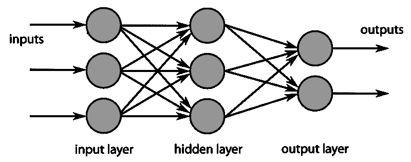
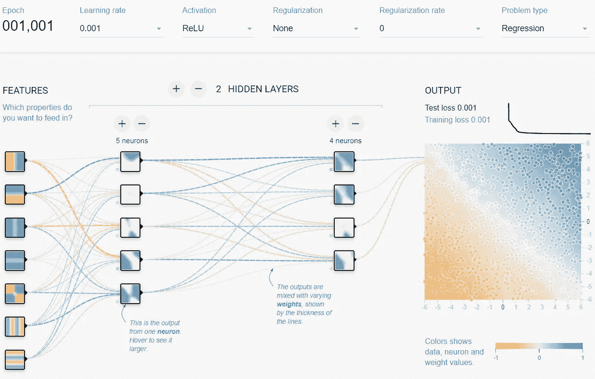
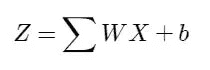
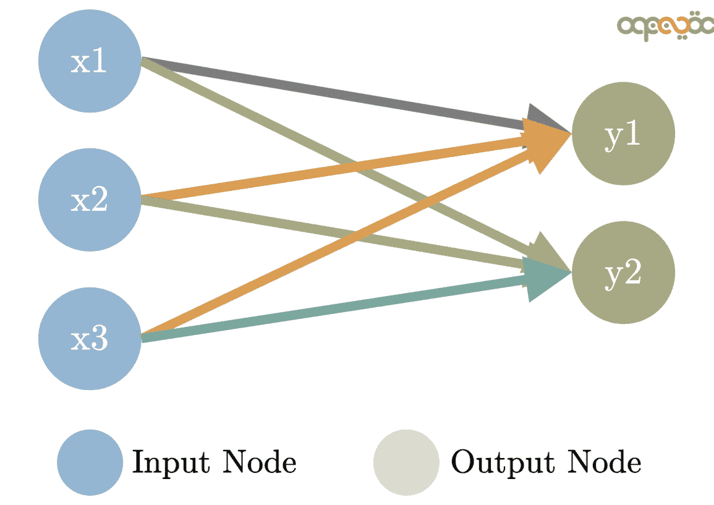
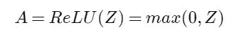
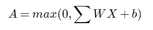
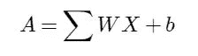
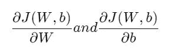
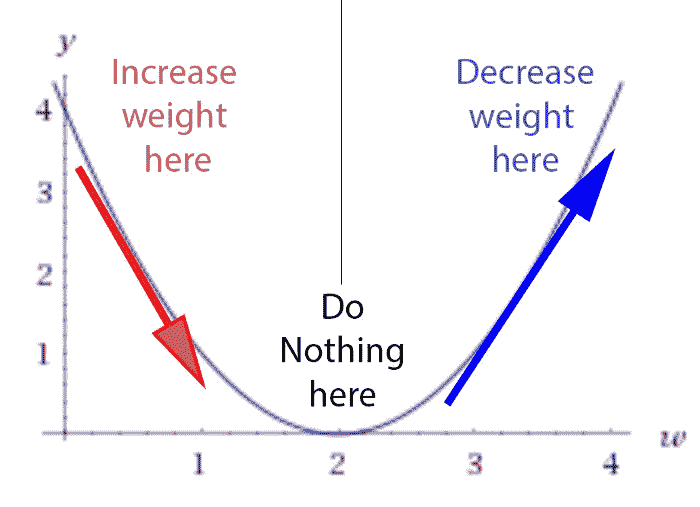
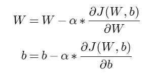

# 人工智能的开端

> 原文：<https://towardsdatascience.com/artificial-intelligence-beginnings-6f8937acdc6a?source=collection_archive---------39----------------------->

## 用 Python 从头开始构建神经网络

# 目标

这篇文章将解释如何使用 Python 语言从头开始创建一个神经网络，以及如何使用它来检查汽车并预测每加仑的里程数。

首先，需要解释一些概念:

# 网络

神经网络是将人工智能应用于现实世界问题的最常用的计算模型之一。它由一组称为神经元的单元组成，这些单元相互连接以传输和处理信号。

[图片由 h3llkn 0 wz](https://es.wikipedia.org/wiki/Archivo:MultiLayerNeuralNetworkBigger_english.png)/[CC BY-SA 3.0](https://creativecommons.org/licenses/by-sa/3.0/deed.es)

每个神经元都通过链接与其他神经元相连。通过他们，他们接收信息，评估信息，并传播评估的结果，这可以是一个信号，突出一个功能或削弱它。

该网络还具有一个或多个最终神经元，其将从先前的神经元获取信号，并将产生可以是实数(对于回归问题)或一组值(对于分类问题)的信号。

# 结构

通常，神经网络以几个神经元层的形式实现。第一个图层称为输入图层或图层 0，表示要评估的不同对象要素。它不同于所有其他层，因为它不执行任何计算，只是表示提供给网络的数据。

在我们的示例中，第一层将保存将要检查的汽车的特征。例如缸数、重量、加速度、年份和制造产地等。

然后，模型将包含两个隐藏层。它们被称为隐藏的，因为它们不直接连接到输入或输出。他们将负责评估来自前一层的不同特征之间的关系，并将结果发布给下一层。

最后，我们将有一个输出层，它将获得最后一个隐藏层的结果，并将计算汽车用一加仑燃料可以行驶的距离。

下图是不同层神经元之间的连接示例:

版权所有 2021 Tensorflow:根据 [Apache 许可证 2.0](https://github.com/tensorflow/playground/blob/master/LICENSE) 授权使用

## 神经元

每一层都由几个神经元组成，除了最后一层，即输出层，在本例中，对于我们的问题，它只有一个神经元。

网络的每个神经元将由以下公式表示:

作者图片

其中 ***X*** 是一个向量(一维矩阵)，信息来自上一层神经元。在第一个隐藏层的情况下，它将从输入层接收汽车的特征。

***W*** 是一个向量，它将为前一层神经元的每个值分配一个权重。它们是将为网络优化以产生真实结果的主要组件之一。

***b*** 是将偏移(偏差)应用于结果的值，也将被优化。

图片来自:[*www.MLinGIFS.aqeel-anwar.com*](http://www.google.com/url?q=http%3A%2F%2Fwww.MLinGIFS.aqeel-anwar.com&sa=D&sntz=1&usg=AFQjCNFcazsCiM9CNyGnCkBq6cjLHCIpFQ)*作者:[阿克尔瓦尔](http://www.google.com/url?q=http%3A%2F%2Fwww.aqeel-anwar.com&sa=D&sntz=1&usg=AFQjCNHLwgfMupBQNoyk__gtpMtrJdmJLw) 用法授权*

## *非线性激活*

*后一个函数是线性函数。如果所有的神经元都是线性函数，神经网络的结果也将是另一个线性函数。这将不允许网络识别特征之间存在的复杂关系。*

*为了解决这个问题，每个神经元都被添加了一个非线性成分，称为激活函数。在我们的例子中，我们将使用一个常用的激活函数 ReLU(来自整流线性单元)，它无非是:*

**

*作者图片*

*因此，除了输出层之外，每个神经元的完整公式为:*

**

*作者图片*

## *最终线性激活*

*由于目标是预测一个值(回归)，而不是检测或分类一个对象(分类)，输出层的神经元必须生成一个实值。因此它不会应用非线性激活。*

*这个神经元的公式就是:*

**

*作者图片*

## *神经网络的优化:又名学习*

*网络学习过程将包括搜索权值 ***W*** 和偏移量 ***b*** 的值，当你向网络提供一辆汽车的数据时，它将产生我们想要估计的结果:那辆汽车每加仑的里程数。*

***逻辑:***

*为了找到 W 和 b 值，首先，我们用下面的等式对它们进行初始化:*

*   ****W:*** 服从正态分布的随机值* 0.01*
*   ****b:*** 正好用 0*

*然后，重复以下步骤几次(我们将这个循环的每次迭代称为一个时期):*

1.  *向网络提供一辆车或几辆车的特征(以防我们的网络能够并行处理几个输入数据)。*
2.  *执行神经网络的计算(称为前向传播)，将权重乘以输入值，添加偏移，并逐层应用激活函数，直到我们获得最终值。*
3.  *计算网络的估计值和汽车实际值之间的误差(或差异)，我们将称之为***【J(W，b)*** ，并在我们的示例中表示均方误差。*
4.  *从后到开始(称为反向传播的过程)，使用所获得的差，我们将使用以下公式来计算权重 ***W*** 和偏移 ***b*** 的导数:*

**

*作者图片*

**

*5.对于导数，我们继续修改权重，使它们更接近差值达到最小值的点。为此，我们将导数乘以一个 ***α*** 值(称为学习率),然后减去相应的权重:*

**

*作者图片*

*6.使用更新后的权重，我们重复前面的所有步骤，直到网络预测值和实际值之间的误差达到可接受的最小值。*

# *代码*

*实际上，神经网络的优化不是一次一个例子地进行。有一些代码库利用现代 CPU、GPU 和 TPU 的能力对许多例子同时执行计算。*

*在我们的例子中，我们将使用 Python 语言和 Numpy 库同时对所有示例执行计算，并获得更好的性能。*

## *模型*

*我们将定义结构(第一和第二隐藏层中的神经元数量)并创建我们的神经网络模型:*

## *正向传播函数*

*它计算网络预测*

## *成本函数*

*它测量网络估计值和实际值之间的差异:*

## *反向传播函数*

*它计算网络函数的导数*

## *更新权重函数*

*它让我们的网络更接近预期的结果*

## *数据*

*定义了模型后，现在我们将使用经典的 [Auto MPG](https://archive.ics.uci.edu/ml/datasets/auto+mpg) 数据集来训练神经网络，以预测 20 世纪 70 年代末和 80 年代初汽车的燃油效率。该数据集提供了该时期许多汽车的描述。该描述包括气缸、排量、马力和重量等属性。*

*本文的目的不是详细介绍如何预处理要在网络中输入的数据。我们只说数据集被归一化并分成两部分，一个训练集用于网络优化，一个测试集用于验证训练好的网络:*

*最后，创建和训练网络并评估其预测的代码:*

*在训练网络完成后，我们用它来预测测试集中的汽车的 MPG，并将它们与它们的实际 MPG 值进行比较。*

*预测并不完美，但接近真实的 MPG 值。*

*预测: **29，26，30，32，25，28，42，34，29，28***

*真实值: **26，22，32，36，27，27，44，32，28，31***

## *自己运行这个例子*

*为了看看这个例子是如何执行的，你可以打开这个[谷歌合作笔记本](https://colab.research.google.com/github/jahnog/artificial-intelligence-python/blob/master/neural_network.ipynb)，直接在你的浏览器中运行它。*

## *结论*

*这是一个简化的回归问题，用 Python 编写的神经网络来解决，该神经网络呈现了所有网络的非常基本但基本的工作概念。*

*这个例子中故意省略了很多概念，因为它们可能会吓到一些人。在现实世界的项目中，它们将需要被考虑。其中一些是:*

*   *数据的可用性、清洁度、类别之间的平衡、分布以及如何处理它。*
*   *不同问题的不同网络模型(如用于回归和分类任务的模型、用于图像检测的卷积网络、用于序列(语言翻译、股票市场预测)的递归网络)等。).*
*   *不同的优化方法(如本模型中的批量梯度下降、小批量 G.D .、Momentum、RMSProp、Adam 等)和超参数优化(层数量和大小、学习速率、动量参数、激活和使用的成本函数)。*
*   *常见问题及解决方法(偏差和方差，爆炸或递减梯度，正则化，辍学等)。*
*   *加速计算的专用硬件(如 CPU SIMD 指令、GPU 和 TPU)。*

*我们希望，已经看到有可能从一个真正简单的实现开始，而不需要专门的库或硬件，这将增加您对人工智能这一激动人心的领域的兴趣。*

*要了解这个领域的更多信息，两个共同的起点是 Michael Nielsen 的[深度学习和神经网络](http://neuralnetworksanddeeplearning.com/index.html)书和 Ian Goodfellow 的[深度学习](https://www.deeplearningbook.org/)书。*

*而且，如果你对视觉艺术感兴趣，这篇关于使用人工智能进行艺术风格转换的文章也值得一读。*